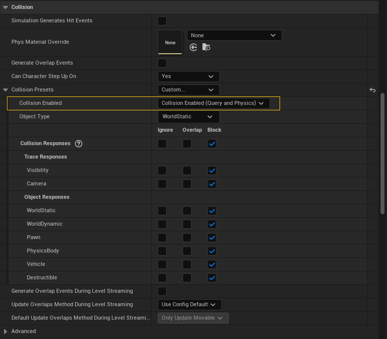
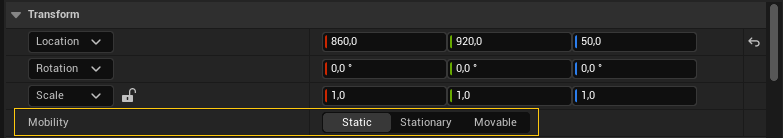
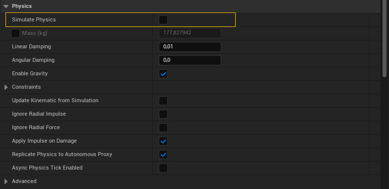
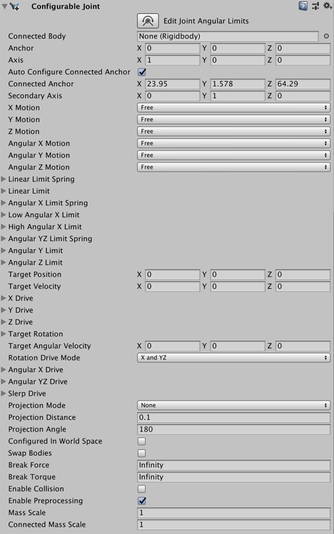



# Introducción

Al hablar de físicas en un videojuego, generalmente nos referimos a todo lo que tienen que ver con el movimiento de las distintas entidades.
Es decir, a una forma de animación programática en la que se ejecuta una simulación siguiendo ciertas reglas y ecuaciones para obtener la siguiente posición de los objetos en el tiempo.

Sin embargo, buena parte de estas simulaciones utilizan ecuaciones de la mecánica cinemática, donde no se consideran ni masas ni fuerzas.
Por ejemplo, para simular el movimiento de un personaje, se suelen usar ecuaciones cinemáticas para calcular la siguiente posición de la cápsula del personaje, en función de la velocidad actual y la aceleración deseada[@TorresD3DGameplay02]. 

En cambio, el motor de físicas es un componente de los motores de videojuegos desarrollado para realizar simulaciones de la dinámica de sistemas físicos con el objeto de modelar de forma más precisa el mundo real.
Es decir, que se encarga de simular el comportamiento físico de los objetos en el juego, considerando la gravedad y otras fuerzas aplicadas, la fricción, las colisiones, la deformación o rotura de los objetos, etc.

Sin embargo, es importante tener en cuenta que por las limitaciones impuestas por el tiempo real, los motores utilizados en videojuegos generalmente solo simulan sistemas relativamente simples y lo hacen de forma aproximada, lo que puede generar todo tipo de problemas inesperados y aleatorios.
Por eso, es común usar la simulación del motor de físicas como una suerte de efecto especial, para dotar al comportamiento de los objetos de la escena de mayor realismo.
Solo se utiliza como pieza clave del *gameplay* en juegos con puzles donde el comportamiento físico sea un factor determinante.

# Tipos de simulaciones

Los motores de físicas actuales suelen soportar diferentes tipos de simulaciones para diferentes tipos de objetos.

## Dinámica de sólido rígido

La simulación de la dinámica de sólido rígido es la responsable de la simulación de la acción de fuerzas y colisiones en cuerpos no deformables.
Es el tipo de simulación más sencilla y rápida de calcular y el primer tipo de simulación que se soportó en los motores de físicas para videojuegos.

Para este tipo de simulación, generalmente se le proporciona al motor una versión simplificada de la malla del objeto, que se usa para detectar colisiones.
Se trata de las **mallas de colisión**, que también se utiliza para la detección de colisiones y superposiciones en la implementación del *gameplay*[Ver *«Colisiones y triggers»* en @TorresD3DGameplay01]. 
Mientras que para simular la dinámica de los cuerpos cuando hay colisiones o se aplican fuerzas mediante código, los motores suelen implementar alguna versión del método Gauss-Siedel[@WikipediaGaussSeidel].

Una optimización común es marcar los objetos que no se pueden mover como *estáticos*, para que no sean considerados en la simulación del movimiento, sino solo en la detección de colisiones.
Otra optimización es que los objetos que permanecen detenidos durante cierto tiempo son sacados temporalmente de la simulación --aunque no de la detección de colisiones-- hasta que son perturbados de nuevo.

## Dinámica de cuerpos blandos

Este tipo de simulación es usada con objetos blandos, tejidos y fluidos.

### Cuerpos blandos y mallas esqueletales

Los objetos blandos se pueden modelar como varios cuerpos rígidos, conectados de tal forma que unos cuerpos están unidos y limitados por otros.
Así como se suele incorporar simulación física a las mallas esqueletales utilizadas, con frecuencia, para implementar personajes.
En ese caso, cada hueso es asociado con un cuerpo rígido y las articulaciones con **uniones** que limitan el movimiento de los cuerpos de la malla esqueletal.

Esto, por ejemplo, es muy utilizado para animar el movimiento de los personajes cuando mueren, en lo que se conoce como ***ragdoll***.
Lo que se hace es animar el personaje de forma normal --usando animaciones basadas en *keyframes*-- pero, al morir, se desactiva la animación y se activa la simulación física, de tal forma que el personaje cae al suelo como si fuera un muñeco de trapo.
Si a esto se le suma la aplicación de algún impulso, se puede simular el efecto de una explosión o del impacto de algún proyectil, por ejemplo.

### Tejidos y fluidos

Por otro lado, los tejidos se pueden modelar en el motor de físicas mediante pequeñas masas conectadas por resortes.
Cada masa representa un punto de la malla y los resortes simulan las propiedades elásticas del tejido.
Las ecuaciones de movimiento para cada masa se derivan de la segunda ley de Newton, teniendo en cuenta la gravedad y otras fuerzas externas aplicadas y las fuerzas de tensión de los resortes.

Sin embargo, la técnica que ofrece más precisión son los sistemas basados en elementos finitos[@WikipediaElementosFinitos].
En ella, la superficie del objeto se descompone en elementos más pequeños con ciertas propiedades físicas --como plasticidad o rigidez-- donde se realizan cálculos locales de la deformación del objeto.
Estos elementos están unidos mediante nodos, que son los puntos donde se muestrea la deformación del objeto para aplicarla a la malla.

Sobre el modelo de elementos finitos se hacen los cálculos considerando el estrés al que las fuerzas involucradas someten a la estructura.
El resultado permite simular con gran realismo deformaciones, destrucciones y otros efectos físicos en todo tipo de materiales.

::: {#vid-dmm-force-unleashed}



Escena final de *«Starkiller vs. AT-ST»* de *«Star Wars The Force Unleashed» (2008)*.
:::

En el @vid-dmm-force-unleashed se puede ver un ejemplo de este efecto de deformación obtenido mediante elementos finitos con el motor *«Digital Molecular Matter»*.

Lamentablemente, las técnicas basadas en elementos finitos en tiempo real son extremadamente costosas, por lo que su uso no está muy extendido.

# Motores de física {#sec-motores-de-física}

El motor de físicas representa una parte importante del código de cualquier motor de videojuegos y programarlo no es sencillo, dado que requiere conocimientos avanzados de matemáticas y física.
Por suerte, en la actualidad hay un buen número de librerías y los motores de videojuegos existentes suelen integrar alguna de ellas.

## ODE

ODE[@ODE] es un motor libre --disponible en licencia dual LGPL/BSD-- que soporta detección de colisiones y dinámica de sólidos rígidos.

## Bullet

Bullet[@BulletPhysics] es un motor libre --disponible bajo licencia Zlib-- utilizado tanto en producciones cinematográficas como en videojuegos.
Es el motor incluido en Godot y en el motor de videojuegos de Blender.
Se ha usado en *«Grand Theft Auto IV» (2008)*, *«Grand Theft Auto V» (2023)*, *«Rocket League» (2015)* y *«Persona 5» (2016)*, entre otros.

Aparte de las características de detección de colisiones y dinámica de sólidos rígidos, soporta también dinámica de cuerpos blandos y **detección continua de colisión** --o ***continuous collision detection** (CCD)*, en inglés--.
Esta técnica es muy útil cuando en la simulación hay objetos muy pequeños que se mueven muy rápido, como veremos más adelante.

## PhysX {#sec-physx}

PhysX[@PhysX] probablemente es el motor de físicas más popular.
Es un motor libre con licencia BSD-3 que ha sido usado en *«The Witcher 3» (2015)*, *«Fallout 4» (2015)*, *«Batman: Arkham Knight» (2015)* y *«Borderlands 2» (2012)*, entre muchos otros.
Además, es el motor integrado en Unreal Engine 4 y Unity, entre otros motores, lo que justifica su gran popularidad.

PhysX fue adquirido en 2008 por NVIDIA con el propósito de ofrecer un motor que pudiera acelerarse usando la GPU de sus tarjetas gráficas Geforce.
Sin embargo, puede ejecutarse además en cualquier CPU y está disponible para Windows, Linux, Mac, PS4, Xbox One, Nintendo Switch, IOS y Android.

Aparte de las características básicas de simulación de la dinámica de sólidos rígidos, PhysX también soporta **detección continua de colisión**.
Además, NVIDIA ofrece una colección de librerías adicionales con las que ampliar los tipos de simulaciones soportadas: destrucciones, ropa, líquidos, fuego y humo.
Y desde PhysX 5.0, se ha incluido el soporte de la simulación de modelos basados en elementos finitos.

## Chaos {#sec-chaos}

Chaos[@ChaosPhysics] es un nuevo motor de físicas desarrollado por Epic Games expresamente para Unreal Engine 5, siendo el motor por defecto en Unreal Engine desde la primera *release* estable 5.0.

Chaos soporta simulación de la dinámica de sólidos rígidos, tejidos y vehículos.
E incluye un potente sistema para simular la destrucción de objetos en tiempo real, llamado Chaos Destruction.

## Havok {#sec-havok}

Havok[@HavokPhysics] es un producto comercial y es el estándar *de facto* de la industria en juegos AAA, proporcionando una solución muy robusta, optimizada --especialmente en mundos muy grandes-- y con el mayor conjunto de características.

::: {#vid-unity-physics-vs-havok}



Conferencia *«Overview of Havok Physics in Unity»* en Unite Copenhagen 2019.
:::

En la @vid-unity-physics-vs-havok se pueden ver las diferencias en cuanto a simulación entre Havok y el motor de físicas de Unity, basado en PhysX.

Havok está disponible en Unity gratuitamente para suscriptores de Unity Pro, Enterprise e Industrial Collection, solo para proyectos que usan DOTS[@UnityHavokPhysics].

Utilizarlo en Unreal Engine es un poco más complejo, ya que es necesario adquirir el SDK que incluye un *plugin* para dicho motor.

## Digital Molecular Matter (DMM)

Digital Molecular Matter (DMM)[@DigitalMolecularMatter] es un motor de físicas único en tanto en cuanto usa elementos finitos para simular la dinámica de cuerpos deformables y rompibles.

Un ejemplo de lo que puede hacer se puede ver en el videojuego *«Star Wars: The Force Unleashed» (2008)*.
En el @vid-dmm-force-unleashed se muestra una escena bastante conocida de dicho juego en la que el protagonista aplasta un AT-ST con La Fuerza.

# Motor deterministas

Debido a que los motores de físicas están diseñados para ofrecer soluciones aproximadas en tiempo real, por lo general no son deterministas.
Esto quiere decir que en las mismas circunstancias, no generan siempre la misma simulación.

Esto no suele ser un problema, excepto en algunos tipos de juegos en red donde se opta por enviar las acciones de cada usuario a los clientes, para que estos actualicen con esa información el estado local del juego.
En estas circunstancias, para que todos los jugadores vean lo mismo, la simulación física en cada uno de los clientes debería ser exactamente igual, apareciendo la necesidad de tener un motor con física determinista.

En los juegos en red, cuando se tiene que utilizar un motor de físicas no determinista, es importante asegurar que los efectos físicos no afecten al *gameplay*.
Es decir, solo deben usarse con fines cosméticos, de forma que no importe que puedan ser diferentes en cada cliente.
Si alguna simulación tiene algún efecto en el *gameplay* se debe valorar implementarla de otra manera, por ejemplo, simulando directamente las ecuaciones cinemáticas, cuyos resultados se puede ir sincronizando periódicamente a través de la red.

Actualmente, Havok ofrece físicas deterministas entre clientes que se ejecutan en la misma arquitectura de CPU.
Mientras que Unity se ha propuesto que su nuevo Unity Physics para DOTS sea determinista incluso entre plataformas diferentes[@UnityForumGoalsUnityPhysics].

# Simulación en procesadores de uso específicos

Años atrás, se trabajó sobre la idea de que las simulaciones físicas se ejecutarían en un procesador especializado --como estaba pasando con los gráficos-- descargando de ese trabajo a la CPU y proporcionando simulaciones realistas, como no se habían visto hasta entonces.

Con esa idea, por ejemplo, NovodeX creó sus procesadores PhysX y el PhysX SDK.
Posteriormente, la empresa fue adquirida por AGEIA, que fabricó tarjetas de expansión con ese chip en formato PCIe.
Finalmente, AGEIA fue adquirida por NVIDIA, que adaptó PhysX para que funcionara sobre sus GPU y durante mucho tiempo promocionó el soporte mejorado de PhysX como una ventaja de sus tarjetas.

En la actualidad, el motor de físicas se ejecuta en la CPU, incluso en los motores de videojuegos que usan PhysX.
A fin de cuentas, es mucho más conveniente reservar la potencia de GPU para los gráficos.

# Colisión y simulación {#sec-colisiones-y-simulacion}

El motor de físicas maneja dos conceptos de forma independiente:

* **Colisión**.
  Es el mecanismo por el cual detecta colisiones entre las entidades conocidas, permitiendo que cuando eso ocurra, unas entidades bloqueen a otras su movimiento.
  Para esto es para lo que se le coloca al objeto una **malla de colisión**.

* **Simulación física**.
  Es el mecanismo por el cual el motor de físicas simula el comportamiento físico de las entidades, teniendo en cuenta colisiones y fuerzas aplicadas.
  Cuando se activa, el motor de físicas toma el control del movimiento de las entidades para actualizarlo con los resultados de la simulación.

  Para activar **simulación física** es para lo que se coloca a un objeto el componente **RigidBody** en Unity[^unity-rigidbody].
  Mientras que en Unreal Engine basta con activar la propiedad **Simulate Physics** del actor o compomnente que se quiere simular.

[^unity-rigidbody]: El efecto interno en PhysX es que se crea un objeto `PxRigidBody` que representará al cuerpo rígido del objeto en motor de físicas durante la simulación.

Los objetos con física tienen que tener ambas cosas.
Es decir, tienen que tener una geometría que sirve al motor de físicas para saber cuándo colisionan y, además, su movimiento está controlado por el motor.

En Unreal Engine, en la opción **Collisions / Collision Presets** de cada componente, se puede indicar si la geometría de colisión se va a utilizar solo en simulación física, solo para *query* --es decir, para *raycasts* y traslaciones en modo *barrido*, tanto para detectar colisiones como superposiciones--, para ambos usos o no se va a utilizar en absoluto.

{#fig-ue-collision-presets}

El motivo para usar esta opción es que se puede obtener cierta mejora de rendimiento excluyendo datos, si no van a ser necesarios en la simulación física o en las *queries*.
Para poder activar la simulación física, el componente o el *asset* debe tener activada la colisiones con ese fin.
En la @fig-ue-collision-presets se puede observar esta opción bajo el nombre de **Collision Enabled**.

::: {.callout-note}
En Unreal Engine los objetos puede tener una colisión compleja[Ver *«Colisiones simples y complejas»* en @TorresD3DGameplay01] similar a utilizar un componente **MeshCollider** en Unity.
En ambos motores, no se puede activar la simulación física en objetos con colisión compleja, ya que el motor de físicas necesita almacenar y actualizar la velocidad y otra información en cada vértice del *collider* y esto es muy costoso para este tipo de geometría por el gran número de vértices que genera.
:::

Los objetos con la simulación física activada no respetan la transformación relativa respecto al objeto padre, puesto que su transformación en el espacio y su movimiento son determinados libremente por el motor de físicas.
Es decir, un objeto puede estar unido a un objeto padre según cierta transformación relativa, pero si el hijo tiene activada la simulación física, es como si no estuviera padre.
Sin embargo, si este, a su vez, tiene hijos, todos los objetos hijos que no tengan activa la simulación física se moverán con él, respetando sus transformaciones relativas.

## Objetos estáticos, dinámicos y cinemáticos

Desde el punto del motor de física, los objetos de una escena pueden ser estáticos, dinámicos o cinemáticos.

* Los **objetos estáticos** nunca se mueven.
  Se usan para definir la geometría de la escena, que siempre es la misma.
  Se puede colisionar con ellos, pero nunca se moverán del sitio.

* Los **objetos dinámicos** se mueven.
  Al contrario que los objetos estáticos, estos no solo pueden colisionar sino que el motor de físicas cambia su movimiento según las colisiones sufridas o según las fuerzas aplicadas mediante código.

* Los **objetos cinemáticos** se mueven, pero no debido a la simulación del motor de física, sino mediante código de *gameplay*.
  Es decir, que el motor de físicas no controla su movimiento, por lo que puede colisionar y alterar a otros objetos físicos, pero no se ve directamente alterado por ellos --aunque siempre podemos programar manualmente algún tipo de efecto--.
 
El motor de físicas realiza ciertas optimizaciones, sabiendo que los objetos estáticos no se mueven ni cambian de tamaño ni van a aparecer o desaparecer.
Por lo tanto, si se altera de alguna forma un objeto estático, se obliga al motor de físicas a rehacer ciertos cálculos internos, afectando al rendimiento del juego.

En Unity son objetos estáticos todos aquellos que tengan un *collider* pero no un **RigidBody**, porque son los objetos con los que el motor de físicas puede detectar colisiones, pero no los puede mover.
Sin embargo, se debe tener cuidado, puesto que los podemos mover de otras maneras, disparando los cálculos internos del motor de físicas.
Por lo que es recomendable activar también la propiedad **Static** del **GameObject**, para que no podamos moverlo por error.

En Unreal Engine son objetos estáticos aquellos cuya propiedad **Mobility** de la sección **Transform** no está marcada como **Movable** (ver la @fig-ue-mobility).
Afortunadamente, Unreal Engine no permite mover de ninguna forma actores que no son **Movable**, de forma parecida al efecto que tiene la propiedad **Static** de Unity.

{#fig-ue-mobility}

Respecto a los **objetos cinemáticos**, las cápsulas de los personajes suelen ser **objetos cinemáticos** (ver *«Controladores cinemáticos»* y *«Controladores dinámicos»* en @TorresD3DGameplay02).

En Unreal Engine se crean **objetos cinemáticos** desactivando la propiedad **Physics / Simulate Physics** del compomente o llamando a  (ver la @fig-set-simulate-physics).
En Unity los **objetos cinemáticos** necesitan un componente **RigidBody** --o de lo contrario son tratados como estáticos-- y la propiedad **Is Kinematic** debe estar activada.

{#fig-set-simulate-physics}

## Objetos con múltiples geometrías de colisión

¿Qué ocurre si un objeto tienen varias cápsulas u otro tipo de geometría de colisión?

En Unity un **GameObject** con varios ***colliders*** --ya sea en el mismo objeto o en objetos hijos-- se comportan como uno solo desde el punto de vista de la detección de colisiones.
Si el **GameObject** tiene un **RigidBody**, este emitirá a sus *scripts* los eventos correspondientes, incluso aunque la colisión involucre a *colliders* en objetos hijos.

En Unreal Engine las cosas son un poco más complejas.
Por ejemplo, cuando se añaden varias geometrías de colisión en un *asset* **StaticMesh**, estas se comportan como un único componente compuesto para el **StaticMeshComponent** donde se asigna el *asset*.
Es decir, trata al **StaticMeshComponent** como un único objeto físico, porque dentro de un actor, cada componente con *colliders* --como **StaticMeshComponent** o **ShapeComponent**-- se comporta como un objeto físico independiente, que se pueden mover, generar eventos y activar la simulación física individualmente.

Sin embargo, en el movimiento de un actor como un todo, nunca se consideran los *colliders* en componentes hijos.
Solo se consideran las colisiones, eventos y simulación física del componente raíz.
El resto de componentes del actor son teletransportados automáticamente a la posición de destino, hayan colisionado o no.

# Eventos

Los motores pueden informar al código tanto de colisiones como de eventos de *trigger*, pero pueden hacerlo de forma diferente si se trata de objetos con la simulación física activada.

En Unreal Engine los eventos de colisión de objetos con simulación física se emiten si está activa la propiedad **Simulation Generates Hit Events** en la sección **Collision**.
Mientras que para los eventos de *trigger* tiene que estar activa la propiedad **Generate Overlap Events**.
Sin embargo, no se recomienda que en un mismo actor se activen ambos tipos de eventos, ya que, por ejemplo, la colisión de un objeto muy rápido contra otro puede generar un evento de *overlap*, aunque estén configurados para bloquearse.
Esto es debido a que por la forma en la que se implementa la detección de colisiones, un objeto que se desplace muy rápido puede penetrar levemente en el otro, aunque estén configurados para bloquearse.
Si **Generate Overlap Events** está activo, este hecho hará que se emita un evento de *overlap*.

En Unity, reciben eventos de colisión los objetos con componente **RigidBody**.
Eso significa que los objetos estáticos no pueden recibir este tipo de eventos por no tener **RigidBody**.
Mientras que reciben evento de *trigger* los objetos con un *collider* en modo *trigger*.

En la documentación de Unity hay una tabla donde se indica cuándo se emiten eventos en función del tipo de objetos que colisionan[@UnityColliders].

# Detección continua de colisiones

Por defecto, en los objetos con la simulación física activada, las colisiones se detectan de forma discreta, que es la forma más rápida y sencilla de hacerlo.
Es decir, que en cada paso en el tiempo de simulación se calcula la posición de los objetos y qué colisiones hay.
Sin embargo, esto abre la puerta a que objetos pequeños que se muevan muy rápido puedan pasar a través de otros, en lo que dura un paso en el tiempo de simulación, sin ser detectados.
A este fenómeno se lo denomina *tunneling*.

Algunas posibles soluciones a este problema son:

* Hacer que el objeto, en cada paso de simulación, lance un *raycast* en la dirección del movimiento para detectar objetos que podría atravesar en el intervalo del tiempo hasta el siguiente paso.
  En caso de detectar alguno, se lanzan las acciones que simula la colisión.

* O añadir geometría de colisión que dote al proyectil una cola invisible, aumentado el tamaño del objeto de forma imperceptible, para que se pueda dectectar la colisión incluso aunque el proyectil se mueva muy rápido.

Sin embargo, algunos motores de físicas soportan algún modo de **detección continua de colisión** --o ***continuous collision detection** (CCD)*[@NVIDIAPhysXCCD], en inglés--.

Concretamente, tanto Unreal Engine como Unity soportan CCD.
En el primero se activa mediante la propiedad **Use CCD** de la sección **Collision** del componente o actor.
En el segundo es el componente **RigidBody** el que ofrece varios modos de funcionamiento a través de la propiedad **Collision Detection**.
Estos modos son:

* **Discrete**.
  Es el modo ya comentado de **detección discreta de la colisión (DCD)**, por lo que algunas colisiones puede que no sean detectadas.

* **Continuous**.
  Usa detección discreta respecto a otros objetos dinámicos y detección continua respecto a objetos estáticos.
  Este algoritmo que usa se llama *Time Of Impact (TOI)*.

* **Continuous Dynamic**.
  Igual que el anterior utiliza TOI contra objetos estáticos, pero también contra objetos dinámicos configurados con el modo **Continuous** o **Continuous Dynamic**.

* **Continuous Speculative**.
  Usa un algoritmo de CCD llamado CCD especulativo, tanto contra otros objetos dinámicos como estáticos.
  Este es el único modo CCD que se puede usar en **objetos cinemáticos** y tiende a ser menos costoso que el algoritmo TOI.

## *Time of impact (TOI)*

El algoritmo *Time Of Impact (TOI)* --también llamado CCD basado en barrido-- calcula en cada paso de simulación si hay un posible impacto en la trayectoria del objeto entre la posición actual y la estimada para el siguiente paso.
Para esta estimación utiliza la magnitud y dirección de la velocidad lineal actual del objeto.
Si detecta una posible colisión, da un subpaso de simulación hasta ese tiempo y repite el algoritmo, buscando una posible colisión[@Souto2015].

Este algoritmo tiene un gran impacto en el rendimiento del motor de físicas.
Como no tiene en cuenta la velocidad angular --sino solo la lineal-- las colisiones debidas a la rotación de los objetos no son detectadas.

## CCD especulativo

Para entender cómo funciona el algoritmo CCD especulativo, hay que comprender primero cómo funciona el proceso de detectar colisiones.

Por lo general, se usan dos fases.
En la primera se buscan posibles colisiones sustituyendo cada objeto por una figura simple que los envuelve completamente --un *bounding box*--.
Si en el instante de simulación actual estas figuras no se superponen, es que no ha ocurrido ninguna colisión.
Mientras que si hay alguna superposición, puede que haya habido alguna colisión entre esos objetos.
En la segunda fase se toman estas posibles colisiones y se analiza si en efecto ha habido una colisión, considerando la forma real de la geometría de colisión del objeto[@Souto2015].

En el CCD especulativo, el *bounding box* del objeto usado en la primera fase se expande considerando el movimiento lineal y angular del objeto.
De esta forma, no solo cubre el objeto original, sino también todas las posiciones en las que podría estar el objeto a lo largo del siguiente intervalo de simulación.
Este nuevo *bounding box* es más grande que el original, por lo que pueda señalar toda una serie de posibles contactos, actuales o futuros.
El motor de físicas toma estos posibles contactos como restricciones del movimiento al calcular la siguiente posición del objeto, evitando que atraviese otros objetos[@UnityCCD].

Esta solución es más eficiente que el algoritmo TOI, pero no es igual de robusta, dado que puede dar lugar a falsas colisiones.

# Materiales físicos {#sec-materiales-físicos}

Cuando los objetos colisionan, es necesario simular las propiedades físicas de los materiales de su superficie para conseguir efectos más realistas.
Por ejemplo, una superficie helada por la que es fácil deslizarse o una de hierba en la que hay más fricción.

Básicamente las propiedades físicas que se pueden simular son dos: **fricción** y el **grado de rebote**.
En cualquier caso, hay que tener en cuenta que se trata de una simulación de la dinámica de sólidos rígidos.
Aunque se configuren las superficies con un gran grado de rebote --por ejemplo, para simular una pelota de goma-- los cuerpos no se van a deformar, como sería de esperar en una simulación realista.

También sirven como forma de identificar el tipo de material con el que se colisiona, para generar efectos de sonido o partículas adecuados.

En Unity se aplican añadiendo el componente **PhysicalMaterial** al mismo *GameObject* que tiene el *collider* que queremos configurar[@UnityPhysicsMaterial].
En Unreal Engine [@UnrealPhysicalMaterials] los **Physical Material** son un tipo de recurso que, una vez creado, se pueden aplicar a materiales, mallas estáticas y **Physics Assets** --que son quiénes determinan las propiedades físicas de las mallas esqueletales--.

# Uniones {#sec-uniones}

Una **unión** conecta un objeto físico con otro o a una ubicación del mundo, aplicando fuerzas a los objetos conectados.

Suelen permitir configurar efectos como su ruptura, cuando se someten a una fuerza que supera cierto umbral, ajustar la resistencia de los objetos al movimiento o limitar el movimiento en ciertos planos o ejes de rotación.
Por ejemplo, al implementar una puerta se usa *uniones* para conectar las hojas con el marco.
Estas *uniones* se configuran como bisagras, es decir, que solo permiten el movimiento de rotación en el eje vertical y este movimiento está restringido a un cierto rango.
Además, se puede hacer que si la puerta recibe un golpe muy fuerte, las bisagras se rompan, desarmando así la puerta.

Como comentamos en la @sec-colisiones-y-simulacion, los objetos con la simulación física activada no ven restringido su movimiento por su padre, sino que se pueden mover libremente.
Las **uniones** permiten construir una jerarquía alternativa en la que restringir el movimiento de los objetos físicos de forma relativa a otros objeto, sean físicos o no.

## Motores

Las **uniones** pueden estar *actuadas*, es decir, que se pueden configurar para aplicar fuerzas para mover los objetos unidos a cierta velocidad o posición.
El motor puede ser lineal, para desplazar los objetos unidos a lo largo de alguno de los ejes, o rotacional, para hacer que giren.

En el caso del motor angular, se suelen soportar los modos **SLERP** y **Twist and Swing**[@ChouSwingTwist].
El primero opera interpolando entre los cuaterniones de la orientación actual y la objetivo, de forma que el objeto gire de forma suave por el camino más corto.
Como se puede ver en la @fig-twist-and-swing, el segundo separa el movimiento de rotación en dos partes que se pueden controlar de forma independiente, una de giro sobre sí mismo --el eje X de la *unión*-- y otra de balanceo en un cono --los ejes Z e Y--.
Según el caso, puede dar mejor resultado usar un modo u otro.

{#fig-twist-and-swing}

## Unreal Engine

En Unreal Engine estas conexiones se denominan *constraints*[@UnrealPhysicsConstraints] y se pueden crear de dos formas:

* Usando **Physics Constraint Actor**, que se utiliza para unir dos actores de la escena.

* O usando **Physics Constraint Component**, que se utiliza para unir dos componentes de un mismo actor.

En ambos casos, uno de los componentes o actores debe tener activada la propiedad **Simulate Physics**.

También se pueden definir *constraints* entre los cuerpos rígidos que definen la física de las **Skeletal Mesh** de los personajes.
A estos cuerpos rígidos se los denomina **Physics Bodies** y las uniones se configuran en el **Physics Asset Editor**[@UnrealPhysicsAssetEditor].

Unreal Engine trae varios tipos de uniones preajustadas que son de uso muy común:

* **Hinge**.
  Una unión tipo bisagra.
  Útil, por ejemplo, para emular puertas.

* **Prismatic**.
  Una unión donde solo puede haber deslizamiento en un eje.
  Útil para emular ascensores, montacargas o plataformas que se deslizan horizontalmente.

* **Ball and Socket**.
  Una unión que permite el movimiento al infinito número de ejes que tienen un centro común --como ocurre con la articulación del hombro-- pero impide cualquier movimiento lineal.

En el fondo las 3 no son más que *constraints* con ciertos valores concretos de configuración.
Podemos diseñar nuestras propias uniones con otros parámetros, si nos hace falta.

Además, Unreal Engine ofrece un componente llamado **Physics Handler** que se utiliza para coger un objeto con simulación física y trasladarlo, teniendo en cuenta en todo momento su comportamiento físico.
El ejemplo típico es usarlo para implementar algún tipo de pistola física --como la *Gravity Gun* de *«Half Life» (1998)*-- o poder telequinético con el que coger cosas, trasladarlas con el personaje y luego lanzarlas o depositarlas.
El objeto no queda unido al actor que lo «coge», sino que este último debe ir actualizando la posición deseada del objeto en cada *tick*, según dónde desee que esté en cada instante.

## Unity

En Unity, uno de los dos objetos debe tener el componente **RigidBody**, pues de otra forma el movimiento del objeto no estaría bajo el control del motor de física.

Los tipos de uniones soportadas son:

* **Character Joint**.
  Se comporta como el **Ball and Socket** de Unreal Engine, de forma similar a la articulación del hombro.
  Se usa especialmente para el efecto ***ragdoll*** en los personajes.

* **Fixed Joint**.
  Limita el movimiento del objeto a seguir el movimiento de otro objeto al que está unido.
  Es una forma sencilla de conectar el movimiento de dos objetos sin emparentarlos.
  También sirve para crear uniones fijas que se pueden romper al forzarlas.

* **Hinge Joint**.
  Se comporta como una bisagra, permitiendo que un objeto rote alrededor de otro.

* **Spring Joint**.
  Permite que un objeto siga a otro a una distancia fija, pero permitiendo que esa distancia se alargue o se acorte si fuera necesario, por las colisiones con otros objetos.
  Es muy útil para que la cámara siga al personaje, permitiendo crear perspectivas en tercera persona.

Existe otra unión, llamada **Configurable Joint**[@UnityConfigurableJoint], que es muy similar a las *constrains* de Unreal Engine, ya que incorpora toda la funcionalidad de cualquier posible tipo de unión.
Como se puede ver en la @fig-configurable-joint-props, solo tenemos que darle los parámetros de configuración adecuados. Obviamente, la lista de parámetros es muy extensa, como ocurre en Unreal Engine.

{#fig-configurable-joint-props}

## Recomendaciones

Las **uniones** se resuelven en el motor de físicas de forma dinámica.
Es decir, no son restricciones reales del movimiento, sino que se implementan mediante mecanismos propios de la teoría del control, aplicando fuerzas variables a los objetos con el fin de contrarrestar ciertos movimientos.
Esto puede dar lugar a resultados inestables, si no se tiene cuidado:

* Es conveniente vigilar la relación entre las masas involucradas, para que en lo posible esta relación sea próxima a 1.
  Muchos problemas de estabilidad aparecen porque las masas no se han balanceado adecuadamente.
  Por ejemplo, usando masas pequeñas unidas a otras 1000 veces mayores.

  También hay que tener cuidado con las masas a 0 o con tener objetos con escalas negativas, ya que pueden romper la geometría de colisión.

* Las **uniones** pueden ser actuadas para simular cierto comportamiento físico.
  Las simulaciones físicas con **uniones** actuadas son más costosas, pero pueden proporcionar un control más estable de la simulación.

Por ejemplo, supongamos que tenemos una catapulta donde el movimiento del brazo respecto al cuerpo está limitado mediante una **unión**, para que solo pueda rotar desde la posición horizontal a la vertical para lanzar el proyectil.
Para el lanzamiento, se pueden intentar ajustar las masas del proyectil y del contrapeso, para que se comporte como una catapulta real, donde el lanzamiento se debe a la diferencia de masa entre ambos.
Pero es mucho sencillo y reproducible actuar la **unión** con un motor que rote la articulación con la velocidad angular que le digamos.

Finalmente, no debemos olvidar que en el mundo real nos gobiernan las leyes de la física, pero en un videojuego podemos obtener mejor resultado sin la simulación de estas leyes.
Por ejemplo, hemos comentado que una unión **Prismatic** puede servir para implementar un ascensor y una **Hinge** para una puerta o una catapulta, pero antes de usarlas, debemos pensar qué nos aporta hacerlo utilizando el motor de físicas.
¿Queremos que las puertas se abran de forma «natural» al chocar con ellas?, ¿queremos que se desmonten de formas diversas si las golpeamos muy fuerte, según como sean golpeadas?.
Si no nos interesa este tipo de comportamientos, no nos conviene usar las físicas.

Lo más frecuente es usar mallas esqueletales y *clips* de animación.
O trasladar o rotar directamente los objetos mediante código; quizás usando curvas para ajustar la velocidad del movimiento de forma más realista.

# *Chaos Fields*

En Unreal Engine, los **Chaos Fields** son actores o componentes que se pueden añadir a la escena para modificar la simulación física de los objetos que se encuentren en su área de influencia[@UnrealChaosFields].
Por ejemplo, se puede usar para aplicar localmente fuerzas o tensiones, para desactivar la simulación en un área o para que una porción de una **Geometry Collection** se mantenga en su posición.
Las **Geometry Collection** son los *assets* que utiliza Unreal Engine para tener objetos fracturables.

# Vehículos

La física de los vehículos es lo bastante compleja como para que el motor de físicas traiga componentes específicos que contemplen aspectos tales como la física de las ruedas, la suspensión y la fricción de los neumáticos[@NVIDIAPhysXVehicle].

A este respecto, Unity proporciona un componente **WheelCollider**[@UnityWheelCollider], para colocar en cada una de las ruedas del vehículo.
En cada uno de estos ***colliders*** se pueden configurar propiedades como la fricción de los neumáticos y la suspensión, al tiempo que permite controlar cada una de las ruedas independientemente indicando su ángulo de dirección y el torque aplicado.
Unity ofrece un tutorial muy completo donde se detalla cómo usarlo e incluye algunos consejos[@UnityWheelColliderTutorial].

En Unreal Engine, se puede trabajar de forma similar mediante el *Chaos Vehicles Plugin*, que ofrece:

* La clase  para las ruedas.
  Se puede hereder de esta clase en Blueprint para configurar sus propiedades.

* El componente , que se encarga del movimiento del vehículo.
  Este componente es el que recibe la entrada del jugador y la aplica a las ruedas, para mover el vehículo.

* El **Pawn** , que incluye lo necesario para configurar un vehículo con ruedas, como una malla esqueletal y un **ChaosWheeledVehicleMovementComponent**.

En la documentación de Uneal Engine también se puede encontrar un tutorial muy completo sobre cómo configurar un vehículo con ruedas[@UnrealChaosVehicle].

En cualquier caso, hay que tener en cuenta que, por lo general, los componentes incluidos con los motores no están pensados para ofrecer una simulación de conducción realista, sino para conducción «tipo arcade».
Para tener una simulación realista y precisa de la dinámica de un vehículo, tendremos que implementar nuestra propia solución.

# *Ragdolls*

Los ***ragdolls*** son una técnica utilizada para animar el movimiento de los personajes cuando mueren.
En realidad lo que se hace es desactivar la animación esqueletal y ceder el control del movimiento del cuerpo al motor de físicas.

Para que el motor de físicas sepa qué hacer con él, previamente se deben haber configurado las distintas partes del cuerpo como cuerpos rígidos y las uniones entre ellos con las restricciones de movimiento adecuadas.
Estas restricciones son importantes para que la simulación física no haga que el cuerpo se comporte de forma inverosímil.

## Animación física

**Animación física** --o ***Ragdolls* activo**-- es el nombre que recibe una técnica de animación programática donde se controla un **ragdoll** mediante código para animarlo.

Una de las cosas que se pueden hacer con esta técnica es crear personajes que reproducen una animación basada en *keyframes*, pero que al mismo tiempo pueden reaccionar a fuerzas y colisiones con el entorno.
Un buen ejemplo del efecto de esta técnica se puede ver en los juegos *«Human: Fall Flat» (2016)* (ver el @vid-human-fall-flat) y en *«Party Animals» (2023)*.

::: {#vid-human-fall-flat}



Human: Fall Flat Gameplay Trailer.
:::

Sin embargo, la **animación física** no es solo útil para crear situaciones cómicas, con en los juegos anteriores, sino también para dotar de mayor realismo a la animación de los personajes, al hacer que reaccionen a impulsos y fuerzas, mientras se mantiene la animación basada en *keyframes*.

Por ejemplo, se puede utilizar para crear un efecto más cinematográfico en la muerte de un personaje, al permitir cambiar de simulación basada en *keyframes* a simulación física de forma progresiva, en el momento de la muerte.
Y es muy interesante en VR, donde el jugador puede interactuar libremente con todo tipo de objetos, por lo que un comportamiento físicamente realista mejora mucho la inmersión.

En los contenidos del GDC se pueden encontrar charlas sobre cómo se implementó esta técnica en los juegos de *«Uncharted 4: A Thief's End» (2016)*[@Mach2017PhysicsAnimation] y *«Star Wars Jedi: Fallen Order» (2020)*[@Waszak2019PhysicsAnimation].
Así como una de EA en GDC 2018[@Sachania2018PhysicsAnimation] más centrada en los juegos de deportes.

## Unreal Engine

En Unreal Engine, estos *Physical Bodies* y las *constraints* de las articulaciones se configuran en el **Physics Asset Editor**[@UnrealPhysicsAssetEditor].

::: {#vid-uncharted-hang-climbing}



Ejemplo de escalada con las manos en la conferencia *«Physics Animation in Uncharted 4: A Thief's End»* en GDC 2017.
:::

A la hora de activar el *ragdoll*, dejando que el personaje caiga como un muñeco de trapo, es necesario:

1. Activar la simulación de la física en los huesos del personaje.
   Para eso se llama a  indicado el hueso de la cadera --o el que corresponda-- como el primero de la jerarquía..

   Al poder controlar a partir de qué hueso de la jerarquía se aplica el efecto, podemos darle otros usos.
   Por ejemplo, que el personaje cuelgue de una cornisa, de forma que la parte superior del cuerpo esté animado, mientras la parte inferior cuelga libremente por su propio peso, como se ilustra en el @vid-uncharted-hang-climbing.

1. Indicar que el peso de la simulación física en la animación es 1.0.
   Para eso se llama a .

   Este parámetro nos permite controlar la mezcla entre la animación esqueletal y la simulación física.
   Eso, por ejemplo, nos permite crear el tipo de muerte que comentamos anteriormente.
   Simplemente es necesario cambiar el peso de la simulación física en la animación a lo largo del tiempo, siguiendo una curva de 0.0 a 1.0.

Además, Unreal Engine ofrece el , que permite llevar a un **ragdoll** a cualquier postura actuando sobre los motores de las **uniones** entre sus partes.
Esto, por ejemplo, permitir trasladar una animación basada en *keyframes* a un **ragdoll**, entre otros efectos, como comentamos anteriormente.

## Unity

Igualmente, en Unity hay que añadir los componentes **RigidBody** y **CharacterJoint** en las distintas partes del cuerpo.
Esto se puede hacer a mano o utilizando el Ragdoll Wizard[@UnityRagdollWizard].

Lo más común, es marcar todos esos **RigidBody** como **cinemáticos**.
Así el personaje será animado con normalidad.
Cuando se quiera activar el *ragdoll*, solo hay que buscar los **RigidBody** y desactivar el modo **cinemático** para que el motor de físicas tome el control

Obviamente, esta técnica no permite controlar la mezcla entre la animación esqueletal y la simulación física, como si se puede hacer en Unreal Engine. Lamentablemente, por el momento, Unity no trae nada de serie para hacerlo.

Si nos interesase, sería necesario utilizar algún recurso del *Asset Store* --como el famoso PuppetMaster[@RootMotionPuppetMaster]-- o implementarlo utilizando una técnica de **animación física**.
Por ejemplo, se puede:

1. Tener en el personaje la malla dos veces.
   Es decir, dos jerarquías de *GameObjects* unidas en una raíz común, para que se desplacen juntas:
   
   * Una es la jerarquía que tiene el esqueleto que responde a la animación.
   
   * La otra tiene los **RigidBody** conectados mediante **Joints**, que se moverán según la simulación física, cuando se active.
     En condiciones normales, mientras el personaje está vivo, estos *GameObjects* se mantiene ocultos y tienen todos los **RigidBody** en modo **cinemático**.

1. En el momento de la muerte, el *script* copia las posiciones de los *GameObjects* de la primera jerarquía en la segunda, oculta la primera, muestra la segunda y desactivar el modo **cinemático** de los **RigidBody** de la segunda jerarquía.

1. En cada frame de tiempo se desplazan los *GameObjects* de la segunda jerarquía --ahora visibles-- a una posición interpolada entre lo predicho por la simulación física y la animación del personaje en la primera jerarquía de objetos --ahora oculta--.

   * El punto interpolado depende del peso de la simulación respecto a la animación, que puede cambiar dinámicamente a lo largo del tiempo usando una curva.
     Por ejemplo, para crear ese efecto más cinematográfico de muerte que comentábamos antes.

   * Para mover los *GameObjects* de la segunda jerarquía, se puede intentar actuar directamente sobre los **RigidBody** o utilizar los motores de las **uniones**.

# Tejidos

El soporte para simular tejidos se basa en lo que puede hacer NVIDIA Cloth, tanto en Unreal Engine 4 como en Unity.
Eso significa que el flujo de trabajo y las limitaciones son muy similares.
En Unreal Engine 5, el motor de físicas Chaos incluye su propia solución para simular tejidos.

La simulación de tejidos solo funciona con mallas esqueletales, como las que se usan con los personajes para poder animarlos.
De hecho, la herramienta está especialmente diseñada para personajes.

Además, hay que tener en cuenta que es la ropa la que se va a desplazar por culpa de esos otros objetos.
No es posible que ocurra al revés.

## Activar el soporte

Tanto en Unity como en Unreal Engine, la forma de activar el soporte para la simulación de tejidos es muy similar.

En Unity, se añade el componente **Cloth** al objeto con el **SkinnedMeshRenderer** con la porción de malla que se quiere simular como tejido --por ejemplo, una capa-- y se configura según las características del tejido a simular.
Diferentes tejidos deberán estar en diferentes *GameObjects* con sus componentes **Cloth** y su **SkinnedMeshRenderer**[@UnityCloth].

En Unreal Engine, tiene que estar activos los *plugins* de **Chaos Cloth** y **Chaos Cloth Editor**.
En el editor de **Skeletal Mesh** se selecciona la parte de la malla que interesa, se elige crear un **Clothing Asset** a partir de la selección y se configuran en el *asset* las características del tejido.
Unreal Engine permite seleccionar diferentes partes de la malla y crear un *asset* de este tipo para cada una[@UnrealCloth].

## Detección de colisión

El tejido debe reaccionar ante las interacciones con otros cuerpos físicos, pero no lo puede hacer con cualquier cuerpo de la escena, porque eso generaría problemas de rendimiento.
Por eso es necesario decirle de que otros cuerpos debe estar atento.

En Unreal Engine, se le indica al **Clothing Asset** el **Physical Asset** del personaje que lleva la prenda.
El **Physical Asset** tiene los cuerpos rígidos que describen la física del personaje.

En Unity, hay que configurar en el componente **Cloth** los ***colliders*** del personaje con los que se quiere simular la colisión.
Por ejemplo, los ***colliders*** de las extremidades.

## Nivel de influencia de la simulación

Finalmente, queda editar el nivel de influencia de la simulación en cada vértice de la malla
Ambos motores permiten usar un pincel con el que se pintan esos «valores» de influencia.

# Destruibles

La simulación de objetos destruibles es una técnica que se utiliza para simular la destrucción de objetos en el juego.
Esto se puede hacer usando *clips* de animación de destrucción, pero la simulación física permite que la destrucción sea más realista y dinámica.

## Usando *clips* de animación

La forma más sencilla de destruir un objeto es mediante un *clips* de animación de la destrucción del objeto, creado en una herramienta de modelado y animación.

El objeto puede ser una malla esqueletal o una malla estática.
Este segundo caso, en el momento de detectar una colisión, se sustituye por una malla esqueletal donde se reproduce el *clip* de destrucción, junto con una simulación de partículas.

## Usando simulación física

Se puede utilizar simulación física mediante un procedimiento similar.
En ese caso, se crea en un modelador 3D una versión fracturada del modelo.
En el juego se usa el modelo no fracturado, pero se sustituye por el fracturado, con **colisiones** y la simulación física activada --por ejemplo, con un **RigidBody** en Unity-- en cada pieza, en el momento del impacto.

Incluso se puede evitar la sustitución del modelo jugando con tener las **mallas de colisión** desactivadas y las piezas en **modo cinemático**.
Es decir:

1. En el objeto raíz se activa la simulación física y se coloca una **mallas de colisión** global que cubre todo el objeto.

1. Cada pieza de la ruptura se coloca en **modo cinemático** y su **colisión** desactivada.
   Por lo general, se usa una **colisión** básica, que se ajuste bien a la pieza, sin consumir demasiados recursos.

1. Se añade y configura un sistema de partículas en el objeto raíz, para simular polvo o pequeños trozos que se desprenden en el impacto.

Los impactos detectados por encima de un umbral configurable, pueden provocar la destrucción completa del objeto:

1. Haciendo cinemático el objeto raíz.

1. Desactivando la **mallas de colisión** raíz.

1. Activando las **mallas de colisión** de cada pieza.

1. Activando la simulación física en cada pieza.

Para dar más realismo, se puede distinguir entre impactos realmente fuertes, que destruyen completamente el objeto, de aquellos que solo lo fracturan en parte.
Por ejemplo, en los impactos por debajo del umbral anterior solo se activarían las **mallas de colisión** y la simulación física de las piezas que van a ser impactadas según la dirección y velocidad del proyectil, en lugar de hacerlo para todas las piezas del objeto.
También se puede aplicar cierta fuerza en dirección radial sobre las piezas en el punto de impacto para simular una explosión.

## Herramientas especificas

Finalmente, se pueden utilizar herramientas específicas para simular la destrucción de objetos, como NVIDIA Blast o Chaos Destruction.

### NVIDIA APEX y Blast

NVIDIA ha venido desarrollando diversas herramientas a lo largo del tiempo para simular destrucciones con PhysX.
Hasta hace un tiempo era una funcionalidad incluida dentro de NVIDIA APEX PhysX --al igual que el antiguo sistema de simulación de tejido-- pero actualmente NVIDIA APEX PhysX está un producto discontinuado y se recomienda migrar a NVIDIA Blast.

Unreal Engine 4 soporta tanto NVIDIA APEX como Blast, ambos a través de *plugins* con el mismo nombre[@UnrealAPEXPlugin;@NVIDIABlastPlugin].
Sin embargo, Unreal Engine 5 tiene su propio sistema de destrucción, llamado Chaos Destruction.

Por el contrario, Unity actualmente no incluye de serie ninguna herramienta para crear destruibles.
En el repositorio de Blast hay un proyecto de ejemplo de cómo se puede integrar con Unity[@NVIDIABlastGithub].
Si bien este ejemplo es para Unity 2018.2, se puede usar como referencia para tratar de integrarlo en versiones más actuales.

### Chaos Destruction

Chaos Destruction es el sistema de destrucción en tiempo real de Unreal Engine 5, diseñado para simular y visualizar de manera realista la destrucción de objetos en el entorno del juego.
Este sistema utiliza el motor de físicas Chaos para simular la destrucción de objetos, permitiendo a los desarrolladores crear actores destructibles y controlar cómo se rompen y se comportan físicamente en el juego.

**Geometry Collection** es el tipo de **asset** usado por Chaos Destruction para simular la destrucción de objetos.
Estos **assets** contienen una colección de geometrías que representan las piezas de un objeto que se rompe, junto con información sobre cómo se rompen y se comportan físicamente.

Los **Geometry Collection** se crean a partir de una o varias mallas estáticas, usando el modo **Fracture** del editor de Unreal Engine.
En este modo también se puede configurar como se rompe el objeto, definiendo las zonas de fractura y el comportamiento físico de las piezas.

Obviamente, todo este proceso está descrito en la documentación de Unreal Engine 5[@UnrealChaosDestructionQuickStart].

La destrucción del objeto se puede disparar instanciando cerca un actor **Field System**, que genere tensión en el actor **Geometry Collection**, para fracturalo, y que aplique fuerza radial para disperzar los fragmentos.
Para fracturar el objeto con un disparo, simplemente hay que detectar el punto de impacto del proyectil o del*raycast* e instanciando allí el actor **Field System** configurado.

---

# Referencias de API {.unnumbered}

::: {#api-refs}
:::

# Referencias {.unnumbered}

::: {#refs}
:::