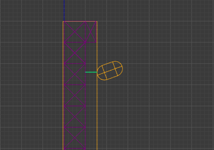
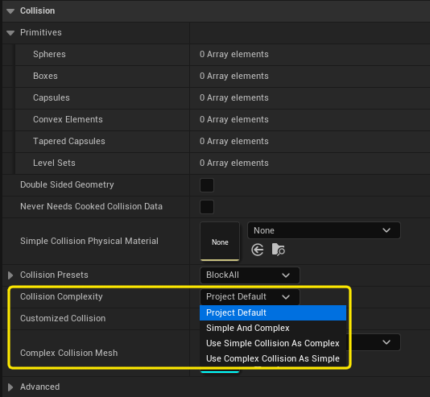

# Colisiones simples y complejas

Hemos comentado que generalmente los objetos tiene una **colisión** contra las que se comprueba el movimiento de los objetos en la escena.
Vamos a llamar a esta colisión **colisión simple**, porque generalmente es lo más sencilla posible por motivos de rendimiento.

En Unreal Engine, la malla de **colisión simple** se importa desde el programa de modelado o se pueden crear o modificar desde el editor de **Static Mesh**.

Para obtener más precisión, por ejemplo, al dar o recibir daño, se pueden usar varios **hitboxes**.
Cuanta más precisión interesa, más colisiones de este tipo se ponen ajustadas a la malla del modelo.

Con los **Static Mesh** de edificaciones, paredes, suelos, etc. puede ocurrir que queramos conocer el punto exacto del impacto, por ejemplo, porque vamos a poner un *decal* para dejar una marca o queramos emitir partículas desde ese punto, para darle más realismo.
En ese caso, en lugar de muchos **hitboxes**, podemos tener una segunda **malla de colisión** que se ajuste perfectamente al modelo, llamada **colisión compleja**.

En Unreal Engine, todo **Static Mesh** tiene una **colisión compleja** ajustada a la malla del modelo.

## Uso con armas

Cuando se implementan armas mediante ***raycast***, la consulta se puede hacer sobre la **colisión compleja**, para conocer el punto de impacto con precisión.

::: {.callout-note}
En Unity se puede implementar un mecanismo similar usando un componente **Mesh Collider** en el objeto.
Se debe configurar como *trigger*, para que no se lo tenga en cuenta en el movimiento de los objetos, y se lo debe poner en una capa diferente que la **colisión** más simple, para poder seleccionarlo al hacer un ***raycast***.
:::

Cuando se trata de proyectiles, se puede indicar a este que use **colisión compleja** para comprobar las colisiones durante su movimiento.
Sin embargo, eso tiene un coste importante, por lo que es más frecuente dejar que el proyectil impacte contra la **colisión simple** o contra algunos **hitboxes**. 
Si eso ocurre, se lanza un ***raycast*** sobre la **colisión compleja**, desde el punto de impacto hacia el interior de la **colisión**, para buscar una posición aproximada de impacto en la malla del modelo.

En la @fig-check-complex-collision se puede observar un ejemplo ilustrativo donde un proyectil colisiona contra la **colisión simple** de una pared, ambas en amarillo.
Entonces, se lanza un ***raycast** --en verde-- sobre la **colisión compleja**, en el sentido inverso de la normal de la superficie de **colisión** en el punto de impacto, para proyectar el impacto sobre la malla del modelo.

{#fig-check-complex-collision}

Además, activando en el proyecto **Project Settings... / Engine - Physics / Support UV From Hit Results** se puede obtener las coordenadas UV del impacto.
Esto es útil para pintar el *decal* del impacto directamente en el material del objeto.
A cambio, aumenta el consumo de memoria porque Unreal Engine necesita mantener en la memoria RAM una copia adicional de las posición de los vértices y las coordenadas UV.

## Desactivar la colisión compleja

En realidad, la **malla de colisión compleja** consume memoria.
Además, por rendimiento, no solo no debemos usarla para comprobar colisiones durante el movimiento, sino que es mejor emplearla solamente con objetos estáticos de la escena.
Pensemos que esta malla tiene muchos más vértices que un cubo o una cápsula y que la información de estos vértices, así como toda la estructura de datos que se usa para saber si hay un objeto en una parte del espacio, debe ser actualizada cada vez que el objeto se desplaza.

Por eso es buena idea indicar al Unreal Engine que use como si fuera **colisión compleja** la **colisión simple**.
De forma esta forma, no se guardará la información de la **colisión compleja** de los **Static Mesh** afectados.

Esto se puede cambiar en cada *asset*, como se puede ver en la @fig-complex-collision.
Sin embargo, es mejor cambiarlo por defecto para todo el proyecto en **Project Settings... / Engine - Physics / Default Shape Complexity**.

{#fig-complex-collision}

Si necesitamos la precisión extra que ofrece la **colisión compleja**, podemos activarla individualmente en cada *asset*.
Lo recomendable sería que solo lo hiciéramos para los **Static Mesh** estáticos que, por ejemplo, sirven para construir la arquitectura del nivel.