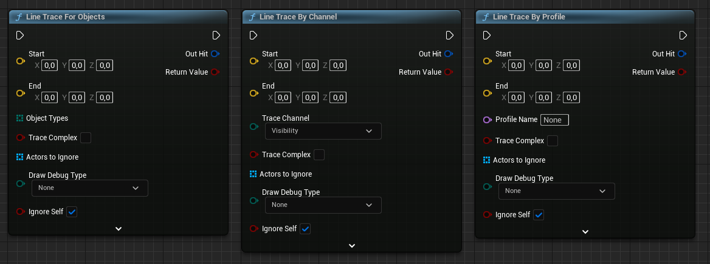

# Consultas / *raycasts*

A veces no queremos esperar a que un objeto entre en un área, sino consultar en este mismo momento si ya lo está.
Por ejemplo, si un personaje puede ver a otro, si el jugador está mirando algún elemento accionable o comprobar, sin mover realmente el objeto, si una traslación en cierta dirección acabaría en colisión.

A las consultas sobre el espacio de las **mallas de colisión** se las suele llamar ***raycasts*** o ***raytraces***.
En Unreal Engine a veces se usa simplemente el término de ***traces*** o *queries*.

## Consulta por canal o por tipo de objeto

Los canales que comentamos en la @sec-object-channels realmente son los **canales de tipo de objetos**.
Se tienen en cuenta cuando los objetos se mueven con el parámetro `Sweep` a `true`.
Además, se pueden buscar objetos de un tipo concreto lanzado un ***raycast*** mediante funciones como , que se puede ver la @fig-line-trace.

{#fig-line-trace}

Otro tipo de canales son los **canales de trazas**, que solo se pueden consultar mediante ***raycast***, usando funciones como , que igualmente se puede ver la @fig-line-trace.

Cómo se comporta cada componente ante trazas en estos canales, se configura también en las propiedades de **Collisions / Collision Presets** en cada componente.

Todos los objetos visibles suelen configurarse para bloquear el **canal de traza Visibilty**, de forma que podemos usarlo para saber lo que un personaje puede ver o, por ejemplo, para trazar el clásico efecto de una mira láser.
Al mismo tiempo, se puede tener otro **canal de traza** para los objetos que pueden bloquear proyectiles --y puede que recibir daño-- de forma que las ventanas, las puertas, las paredes delgadas o la vegetación sean ignoradas en ese canal.
El resultado es que así el *gameplay* puede detectar objetos a través de los objetos mencionados anteriormente, lo que permitiría que el jugador disparara a través de ellos.

También se pueden hacer consultas usando perfiles de colisión.
Estos perfiles son los mismos que se configuran en cada componente en las propiedades de **Collisions / Collision Presets** y que se pueden crear, según las necesidades del proyecto, en **Project Settings...**.

La consulta por perfil se hace empleando funciones como , que también se puede observar en la @fig-line-trace.
En este caso, el ***raycast*** devuelve el primer objeto que lo bloquea, considerando la configuración del perfil sobre los tipos de objetos que deben ser ignorados o con los que puede superponerse o bloquear.

## *Tests*

Las funciones de ***raycast*** devuelven información sobre el impacto de la traza en el objeto, mediante la estructura .
Si no necesitamos esta información, sino que solo interesa saber si hay un objeto bloqueado la traza, podemos usar una versión de estas funciones marcada con la palabra `Test`.
Por ejemplo,  o .

Estas funciones de ***raycast*** solo están disponibles en C++.

## Consultas múltiples

Cuando se hace un ***raycast*** se puede elegir obtener el primer objeto encontrado o se puede devolver todo lo que la traza encuentra en su camino.
Lo primero se hace usando funciones como  o  y lo segundo usando  o .

En el caso de las consultas sobre múltiples objetos, existe una importante diferencia entre hacerlo por un **canal de tipo de objeto** o **de traza**.
Cuando la consulta es por tipo de objeto, las funciones devuelven todos los objetos del tipo indicado en la trayectoria de la traza.
Sin embargo, cuando la consulta es por un **canal de traza**, se devuelven todos los objetos encontrados que tengan configurado el canal como **Overlap**, hasta alcanzar uno que lo tenga configurado como **Block**.

## Trazar rayos o formas

Las funciones comentadas hasta el momento lo que hacen es trazar una línea desde un punto de origen a uno de destino, buscando objetos por el camino.
Pero a veces queremos localizar objetos dentro de cierto volumen entre dos puntos, no solo los interceptados por una línea.

Para ese caso, los motores ofrecen versiones de las funciones de ***raycast*** anteriores, pero que barren usando un volumen, soportando formas como: esfera, cubo o cápsula.
En la @fig-shape-traces se puede ver un ejemplo ilustrativo, extraído de la documentación de Unreal Engine.

![*Raycasts* de formas en Unreal Engine[@UnrealShapeTraces].](figures/shape-traces.png){#fig-shape-traces}

En la @tbl-line-trace-functions se puede consultar la lista de las funciones de ***raycast*** en Unreal Engine para trazado de líneas, tanto para Blueprint como para C++.
Mientras que la @tbl-shape-trace-functions contiene la lista de funciones para el barrido con formas.

|       | **Capa** | **Blueprints**                       | **C++** (en **UWorld**)               |
|-------|----------|--------------------------------------|---------------------------------------|
|Simple | Objeto   |       | `LineTraceSingleByObjectType()`       |
|       | Traza    |        | `LineTraceSingleByChannel()`          |
|       | Perfil   |        | `LineTraceSingleByProfile()`          |
|       |          |                                      |                                       |
| Multi | Objeto   |  | `LineTraceMultiByObjectType()`        |
|       | Traza    |   | `LineTraceMultiByChannel()`           |
|       | Perfil   |   | `LineTraceMultiByProfile()`           |
|       |          |                                      |                                       |
| Test  | Objeto   | N/A                                  |  |
|       | Traza    | N/A                                  |     |
|       | Perfil   | N/A                                  |     |

: Funciones de *raycast* para trazado de líneas en Unreal Engine. {#tbl-line-trace-functions}

|          | **Capa** | ***Blueprints***            | **C++** (en **UWorld**)             |
|----------|----------|-----------------------------|-------------------------------------|
| Simple   | Objeto   | BoxTraceForObjects          |  |
|          |          | SphereTraceForObjects       |                                     |
|          |          | CapsuleTraceForObjects      |                                     |
|          |          |                             |                                     |
|          | Traza    | BoxTraceByChannel           |     |
|          |          | SphereTraceByChannel        |                                     |
|          |          | CapsuleTraceByChannel       |                                     |
|          |          |                             |                                     |
|          | Perfil   | BoxTraceByProfile           |     |
|          |          | SphereTraceByProfile        |                                     |
|          |          | CapsuleTraceByProfile       |                                     |
|          |          |                             |                                     |
| Multiple | Objeto   | MultiBoxTraceForObjects     |   |
|          |          | MultiSphereTraceForObjects  |                                     |
|          |          | MultiCapsuleTraceForObjects |                                     |
|          |          |                             |                                     |
|          | Traza    | MultiBoxTraceByChannel      |      |
|          |          | MultiSphereTraceByChannel   |                                     |
|          |          | MultiCapsuleTraceByChannel  |                                     |
|          |          |                             |                                     |
|          | Perfil   | MultiBoxTraceByProfile      |      |
|          |          | MultiSphereTraceByProfile   |                                     |
|          |          | MultiCapsuleTraceByProfile  |                                     |
|          |          |                             |                                     |
| Test     | Objeto   | N/A                         |    |
|          | Traza    | N/A                         |       |
|          | Perfil   | N/A                         |       |

: Funciones de *raycast* para barrido con formas en Unreal Engine. {#tbl-shape-trace-functions}

También existe un grupo de funciones con los prefijos `ComponentOverlap` y `ComponentSweep` que permiten hacer consultas usando la malla de colisión de un componente indicado.
Por ejemplo, para barrer y detectar colisiones con la malla de **colisión simple** de un **StaticMesh**.

## Consultas de superposición (*overlap*)

En Unreal Engine, no solo se pueden lanzar trazas o formas, desde un punto a otro, para buscar objetos.
También podemos localizarlos dentro de un área concreta, con una forma y tamaño especificado.

En la @tbl-overlap-functions se muestran algunas de estas funciones.

|       | **Capa** | ***Blueprints***               | **C++** (en **UWorld**)                  |
|-------|----------|--------------------------------|------------------------------------------|
| Multi | Objeto   | BoxOverlapActors               |      |
|       |          | SphereOverlapActors            |                                          |
|       |          | SphereOverlapActors           |                                          |
|       |          |                                |                                          |
|       |          | BoxOverlapComponents           |                                          |
|       |          | SphereOverlapComponents        |                                          |
|       |          | CapsuleOverlapComponents       |                                          |
|       |          |                                |                                          |
|       | Traza    | N/A                            |         |
|       | Perfil   |                                |         |
|       |          |                                |                                          |
| Test  | Objeto   | N/A                            |    |
|       |          |                                |                                          |
|       | Traza    | N/A                            |       |
|       |          |                                |  |
|       |          |                                |                                          |
|       | Perfil   | N/A                            |       |
|       |          |                                |  |

: Funciones de consulta de superposición de objetos en un área. {#tbl-overlap-functions}

Las funciones con el prefijo `OverlapAny`, devuelven objetos en el área indicada con los que la consulta haga **Overlap** o **Blocking**.
Mientras que las funciones con el prefijo `OverlapBlocking`, solo devuelven los objetos con los que la consulta haga **Blocking**.

## Consultas asíncronas

<!--- Sobre el tema:
https://medium.com/@bryan.corell/using-async-collision-traces-in-unreal-engine-4-2cc312c825f5
-->

Como los procesadores modernos son multinúcleo, los motores de videojuegos modernos son multihilo para aprovechar el paralelismo de las CPU.
Por ejemplo, un hilo puedo dedicarse al render, otro al código de *gameplay* y otro al código de red.

Por defecto, las funciones de *tick* de nuestros componentes se llaman desde el hilo de *gameplay*, de forma que estamos seguros de que dos funciones de *tick* nunca se están ejecutando en paralelo.
Por tanto, si el código de *gameplay* realiza varios ***raycasts***, el tiempo que lleve resolverlos reduce el tiempo disponible para otras partes del código de *gameplay*.

Como estas consultas pueden tener cierto coste, a veces interesa ejecutarlas en un hilo diferente, liberando al hilo de *gameplay* de esa tarea y permitiendo que, potencialmente, los ***raycasts*** se puedan resolver en paralelo en otro núcleo del procesador.
De esta forma, el código de *gamplay* solicitaría el ***raycasts***, pero luego seguiría ejecutando otras acciones.
Tiempo después, llegaría el resultado al el código de *gamplay* y este lo usaría como corresponda.

Este tipo de consultas se denominan **consultas asíncronas**, porque no se resuelven en el momento.
Mientras que las que hemos visto hasta ahora se denominan **consultas síncronas**, porque se hacen y resuelven en el momento en el que se piden.

Por su coste, los equipos de desarrollo suelen establecer reglas muy estrictas para restringir al mínimo indispensable las **consultas síncronas**.
Este tipo de consultas pueden ser indispensables para el control del personaje, de forma que se pueda mover en el mismo frame en el que se recibe la entrada del jugador.
Sin embargo, para otras características, como la IA, las armas o la interacción con los objetos de la escena, es preferible usar las **consultas asíncronas**, desde el punto de vista del rendimiento del juego.

Unreal Engine incluye varias funciones para realizar **consultas asíncronas**, aunque solo están disponibles en C++.
En la @tbl-async-raycast se puede ver un listado de todas ellas.

|               | **Capa** | **C++** (en **UWorld**)                |
|---------------|----------|----------------------------------------|
| Sencillo      | Objeto   |  |
|               | Traza    |     |
|               | Perfil   |     |
|               |          |                                        |
| Superposición | Objeto   |    |
|               | Traza    |       |
|               | Perfil   |       |
|               |          |                                        |
| Forma         | Objeto   |      |
|               | Traza    |         |
|               | Perfil   |        |

: Funciones de *raycasts* asíncronas de Unreal Engine. {#tbl-async-raycast}

La premisa básica es que si hacemos una **consulta asíncrona** en un frame, el resultado estará disponible en el frame siguiente, antes de que se llame a cualquier función de *tick*.
El resultado lo podemos obtener consultado directamente el **FTraceHandle** que devuelven estas funciones, o dejando que Unreal Engine llame de vuelta a una función especifica de nuestro código de *gameplay*.
Para esto último, tendremos que indicar dicha función a través de un parámetro de las funciones de ***raycast*** que espera un *delegado*.