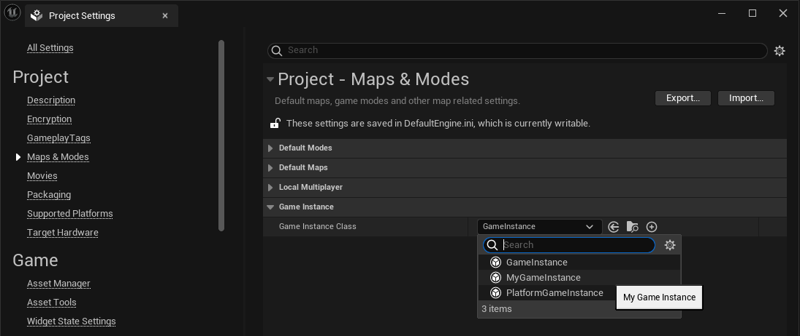

# Antes del Gameplay Framework

Antes de hablar del *gameplay framework* de Unreal Engine, vamos a discutir los componentes básicos del motor, sobre los que se implementa el *framework*.

## *UObject*

Un **UObject** es la clase base de todos los objetos de Unreal Engine y dota a los objetos de características similares a las que tienen los objetos en muchos lenguajes gestionados --como C# o Java--.
Por ejemplo, gestión automática de memoria, mediante el uso de un recolector de basura, serialización o reflexión.

## *UWorld*

Un  es la clase del objeto de Unreal Engine que representa el mundo del juego y contiene todos los objetos que existen en él.
Por tanto, por lo general, solo existe una instancia de **UWorld** al mismo tiempo, excepto cuando tiene lugar una transición fluida entre niveles, en cuyo caso existen dos instancias de **UWorld** simultáneamente: la del nivel que se está descargando y la del que se está cargando.

La clase **UWorld**, por ejemplo, contiene los métodos para instanciar objetos en el nivel y para consultar la geometría del nivel mediante *raycasts* y barridos de formas[Ver @TorresD3DGameplay01].

## *Actor* y *ActorComponent*

Un  es un objeto que existe en el mundo del juego y, por tanto, que puede ser instanciado en un **UWorld**.
Las características y funcionalidades de un **Actor** se implementan mediante composición, añadiéndole uno o varios .

Unreal Engine proporciona múltiples **ActorComponent**, para implementar diferentes funcionalidades comunes en los juegos.
Algunos **ActorComponent** tienen representación en el nivel --como mallas, colisiones o partículas-- mientras que otros implementan conceptos abstractos --como el movimiento del actor, el control de cámara o la entrada del usuario--.

:::{.callout-note}
Aunque la norma sea que son los objetos **Actor** los que se colocan en el mundo, realmente es posible instanciar **ActorComponent** directamente en el nivel.
Se puede usar  para instanciar cualquier tipo de **UObject**, sin indicar que pertenece a un **Actor** en el argumento `Outer` de la función.
Estos componentes no son guardados ni replicados y no reciben eventos como `BeginPlay()` o `TickComponent()`.
Algunos **ActorComponent** a veces se usan de esta manera, como **AudioComponent** cuando se crea con `SpawnSoundAtLocation()`.
:::

## *GameInstance* {#sec-gameinstance}

Un  es el principal objeto *manager* de un juego en Unreal Engine. 
Se instancia al inicio del juego y se destruye al finalizar, por lo que suele usarse para alojar código y datos globales que deban persistir entre la carga de niveles, como los inventarios y las habilidades de los personales o la configuración general del juego.

Para personalizarlo se hereda de la clase **GameInstance**, se le añaden las propiedades y el código necesario y, finalmente, se indica la nueva clase heredada en **Project Settings... / Project - Maps & Modes / Game Instance Class**, como se ilustra en la @fig-gameinstance.

{#fig-gameinstance}

En proyectos grandes, para respetar el *principio de responsabilidad única*[@WikipediaSRP] y evitar que la clase **GameInstance** se convierta en un *objeto todopoderoso*[@WikipediaGodObject], se suele dividir la funcionalidad en diferentes clases heredadas de **UObject**, que se instancian y referencian en propiedades del **GameInstance**.
De esta forma, son fácilmente localizables para el resto de componentes del juego a través del objeto **GameInstance**, que se puede obtener mediante la función .

Sin embargo, desde Unreal Engine 4.22, se recomienda usar *subsistemas* para implementar funcionalidades globales del juego, que antes se implementaban en **GameInstance**[Más sobre *subsistemas* en @TorresD3DUnrealCpp].

## *UEngine*

Es la clase del objeto del motor, encargado de gestionar los componentes principales del sistema.
Entre otras cosas, se encarga de gestionar el **UWorld** y de crear y destruir los **GameInstance**, así como notificarles los *tick*.

En C++ se obtiene acceso global a este objeto mediante la variable estática `GEngine`.

## *GameViewportClient* y *LocalPlayer*

La clase **GameViewportClient** es la interfaz del motor a la ventana de juego y a los sistemas de gráficos, audio y entrada de la plataforma donde se ejecuta el motor.

Por lo general, el motor solo crea una instancia de **GameViewportClient**.

La instancia de **GameViewportClient** también mantiene una lista de **LocalPlayer**, que son los objetos que representan jugadores de la máquina local y guarda información especifica de estos.

Por lo general, solo hay un **LocalPlayer** por jugador, pero puede haber varios en el caso de juegos multijugador de pantalla dividida.
En este caso, el **GameViewportClient** gestiona cómo se dibujan y se organizan las vistas de los distintos **LocalPlayer** en la pantalla.

Cuando **GameViewportClient** procesa eventos de la entrada del jugador, estos son entregados a las clases del *gameplay framework* para su interpretación.
La información de los **LocalPlayer** permite al **GameViewportClient** determinar qué actor se hará cargo de procesar los eventos.

## Cómo arranca un juego

Al lanzar el ejecutable de un juego desarrollado con Unreal Engine desde la interfaz del sistema operativo:

1. Se ejecuta el código de inicialización del motor, que crea el objeto **UEngine** y llama al método `UEngine::Init()`.

1. `UEngine::Init()` inicializa el **GameInstance** y llama al método `Init()` de **GameInstance**.

1. Se llama a `UEngine::Start()` que llama a `UGameInstance::StatGameInstance()`, que crea el **UWorld** inicial.

1. *Inicializaciones relacionadas con el gameplay framework que veremos más adelante*.

1. **UEngine** hace *tick* al **GameInstance** y al **UWorld** para animar el juego.