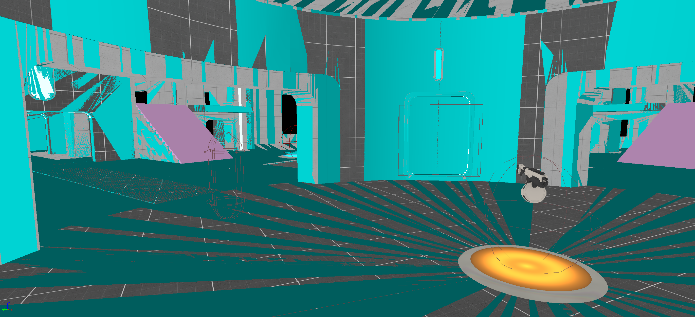
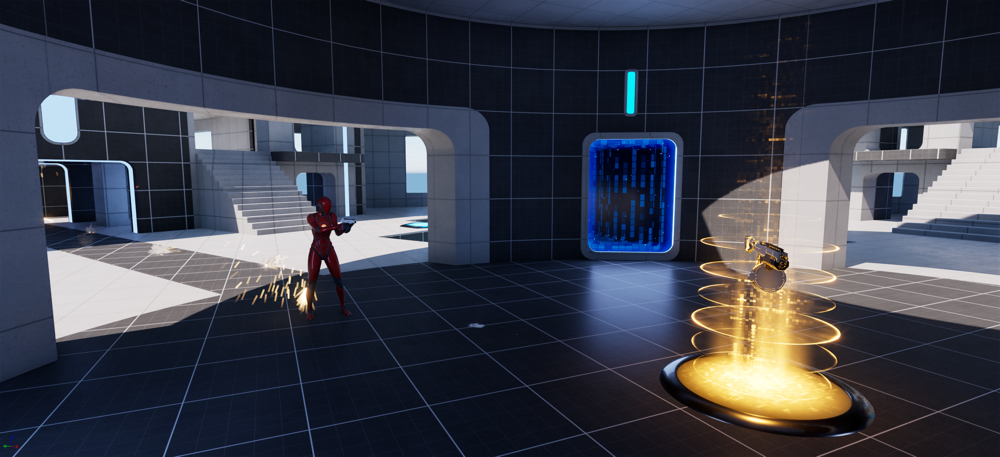
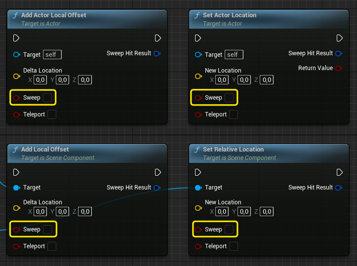
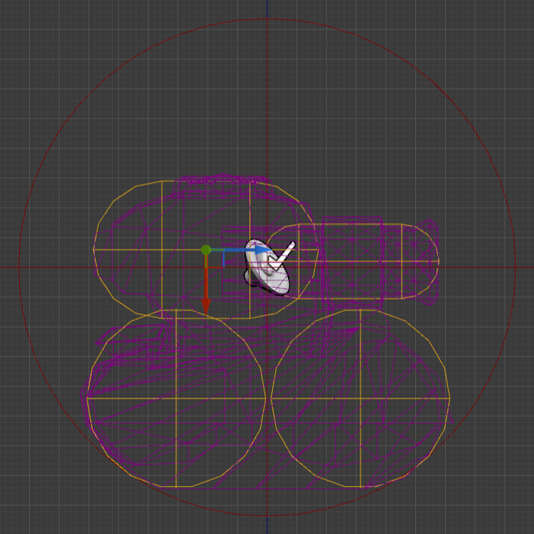
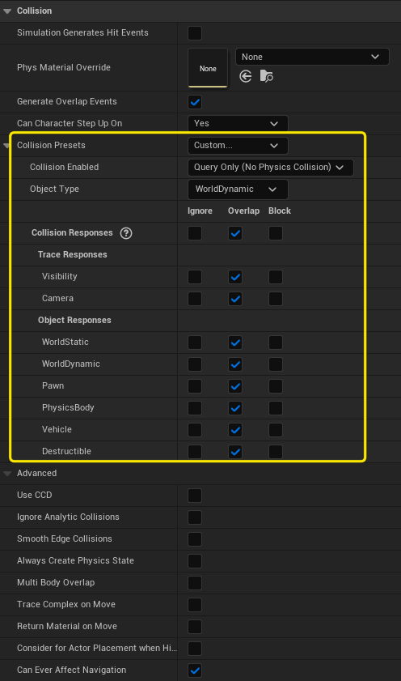
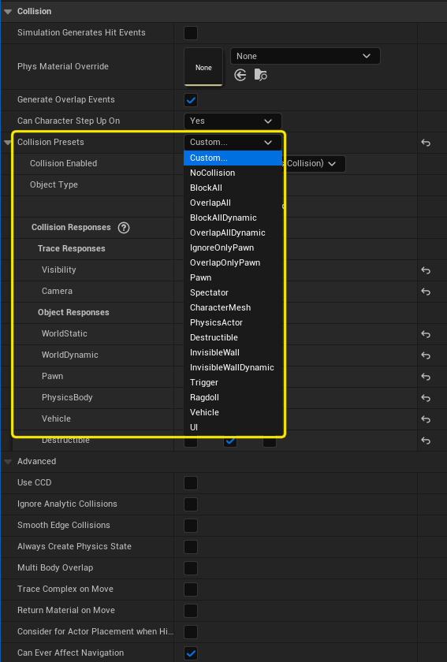
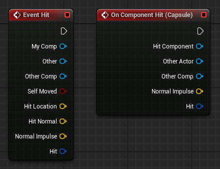
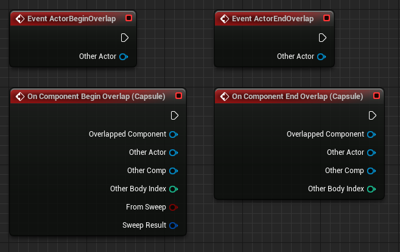
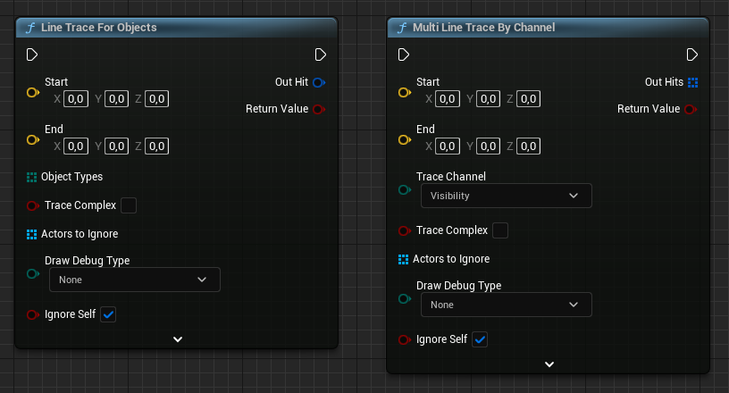



# Desarrollo de *gameplay*

El *gameplay* en un videojuego se refiere a la forma en la que el jugador interactúa con el juego, incluyendo los controles, las mecánicas de juego, objetivos y desafíos.
Es la experiencia del jugador mientras está jugando y cómo se siente al hacerlo.

El *gameplay* se puede dividir en varias categorías, como la exploración, la resolución de puzzles, el combate, la estrategia o la simulación.
Cada uno de estos tipos de *gameplay* ofrece diferentes desafíos y experiencias al jugador, y muchos juegos combinan varios tipos de *gameplay* para crear una experiencia única y diversa.

Por el momento, nosotros vamos a centrarnos en aquellos aspectos del *gameplay* relacionados o condicionados por el desarrollo de un juego en un mundo 3D.
Pero, obviamente, debemos tener presente que en un juego en 3D puede haber mucha lógica de *gameplay* que nada tenga que ver con las características del entorno de juego ni con el motor de videojuegos.

Por ejemplo, el sistema que gestiona el inventario del jugador, el sistema de habilidades ---típico en muchos juegos con algún componente de RPG--- o el combate en los juegos de estrategia se pueden desarrollar y probar independientemente del juego y del motor de videojuegos.

Lo mismo ocurre con los simuladores de granjas, fábricas o de ciudades, pues en realidad lo que se muestra al jugador no es sino una interfaz elegante y vistosa de la simulación, que puede ---y debe--- desarrollarse de forma completamente independiente de esta.

::: {.callout-note}
Para quienes están familiarizados con el patrón de arquitectura de software Modelo-Vista-Controlador y sus variantes, podemos decir que en estos juegos de simulación, asi como en los típicos juegos de puzzles para móviles; la simulación o la lógica de los puzzles se prestan a ser considerarlos el modelo, mientras la interfaz del juego sería la vista.
Seguir este enfoque puede ayudar mucho en el desarrollo del juego.
:::

Incluso en simuladores de carreras o de vuelo, la simulación de la dinámica de los vehículos ---cuando se busca una experiencia más realista que tipo arcade--- puede desarrollarse independientemente de otros aspectos del juego.
Obviamente, luego es necesario encajar dicha simulación en el mundo 3D del juego, teniendo en cuenta sus limitaciones.

En general, para un juego 3D nos interesa saber cómo mover y hacer interactuar personaje con el entorno y cómo usar la entrada del jugador para controlar el personaje.

# Colisiones y *triggers*

Aunque como jugadores tengamos la percepción de que los juegos se desarrollan en un bonito mundo 3D lleno de detalles y colores, realmente el juego tiene lugar en una versión mucho más primitiva compuesta por **mallas de colisión**.

Por ejemplo, en la @fig-lyra-collisions podemos comparar la vista renderizada de «LyraStarterGame»[@EpicLyraStarterGame] con la vista de la geometría con la que puede colisionar el personaje del jugador, que es la que realmente define la forma de los objetos y el espacio de juego.

::: {#fig-lyra-collisions layout-nrow=2}

{#fig-lyra-player-collisions}

{#fig-lyra-render}

Comparación entre el render normal y el modo **Player Collision**.
:::

Si nos fijamos en la @fig-lyra-player-collisions podemos observar algunos detalles:

* Todo lo que se ve en verde son las colisiones de los **Static Mesh**, en rosa las áreas bloqueadas por **volúmenes** ---que en la vista renderizada son invisibles--- y las formas en *wireframe* son aquellas con las que el personaje no colisiona.

* El personaje rojo es el jugador y esta rodeado por una cápsula en *wireframe*.
No importa la forma de la malla del personaje.
Lo que se tiene en cuenta como forma del personaje para saber si colisiona con algo al moverse, es esa la cápsula.

* En el centro hay un arma que el jugador puede recoger.
Alrededor hay una esfera en *wireframe*, por lo que el jugador puede atravesarla, pero sirve para saber si un personaje está lo bastante cerca para recoger el arma.

* Sobre las escaleras ---en verde--- se ha colocado un **BlockingVolume** ---en rosado---.
El resultado es que cuando el jugador sube las escaleras, lo que sube es la cápsula del personaje por la rampa correspondiente.

::: {.callout-tip}
La vista de la @fig-lyra-player-collisions se llamada **Player Collision** y es útil para depurar la configuración de colisión.
Puede verse activando **View Mode / Player Collision** en el editor de Unreal Engine.
:::

# Mallas de colisión

Las **mallas de colisión** o **colisiones** son formas geométricas que rodean a los elementos del juego y se utilizan para determinar cuándo estos se tocan o intersecan.
Desde el punto de vista de la lógica del *gameplay*, no importa qué ocurre con las mallas renderizadas, sino las interacciones entre las **mallas de colisión**.

Si lo llevamos extremo, el desarrollo del *gameplay* de videojuegos actuales no es tan diferente de como sería el de juegos clásicos como Pong[@WikipediaPong] y similares.
La lógica de *gameplay* sigue consistiendo ---en gran medida--- en detectar colisiones entre cubos, esferas y otras figuras geométricas; solo que al representar los elementos del juego, hoy en día podemos usar formas que nos dan más juego para obtener la experiencia deseada.

Las **mallas de colisión** sirven para definir el espacio de juego.
Se utilizan para construir suelos y plataformas por los que se moverá el personaje y para crear los muros que limitaran las zonas accesibles.

Si, por ejemplo, estamos desarrollando un juego de puzzles donde no queremos que el jugador tenga que preocuparse por caerse por el borde de las plataformas, podemos usar **mallas de colisión** para crear muros invisibles que lo impidan ---como el **BlockingVolume** que vimos antes---.
Si durante las pruebas de *gameplay* de un nivel vemos que hay sitios del nivel donde el jugador puede quedar atrapado y no puede salir o no le resulta fácil hacerlo ---quizás porque no se están respetando las distancias mínimas establecidas en las reglas de diseño--- seguramente debamos ajustar las **mallas de colisión** para que el jugador no pueda encontrarse en esa situación.

Las **mallas de colisión** también sirven para definir el contorno de los personajes, proyectiles, vehículos y muchos otros elementos del juego.

## Crear colisiones

En Unreal Engine se usa el término *collision* y se pueden añadir a cualquier actor añadiendo componentes como **BoxComponent**, **SphereComponent** y **CapsuleComponent** que tienen la forma que su propio nombre indica.

Mientras que en Unity se llaman *colliders* y tienen exactamente las mismas formas que los de Unreal Engine: **BoxCollider**, **SphereCollider** y **CapsuleCollider**.

En Unreal Engine los **Static Mesh** pueden guardar información de colisión, sin tener que añadir alguno de los componentes mencionados anteriormente.
Esta información se puede añadir y modificar desde el editor de **Static Mesh**, aunque es más común que se cree en el programa de modelado, junto al modelo, y que se importe al mismo tiempo que este[@UnrealFBXStaticMeshPipelineCollision].

## Mover objetos con comprobación de colisiones {#sec-sweep}

Mover objetos comprobando las colisiones no es barato, puesto que no basta con trasladar el objeto al punto de destino, sino que es necesario comprobar cualquier posible obstáculo a lo largo de la trayectoria.

Por eso, debemos indicar al motor de videojuegos el tipo de movimiento que queremos.
Si queremos que se *teletransporte* instantáneamente al destino o si necesitamos que se traslade del origen al destino comprobando cualquier colisión que detenga el movimiento.

Unreal Engine ofrece múltiples funciones para trasladar actores o componentes.
Algunas de ellas son:

* Para trasladar actores:

    * `AddActorLocalOffset`, `AddActorLocalTransform`, `AddActorWorldOffset` y\
    `AddActorWorldTransform`.

    * `SetActorLocation`, `SetActorLocationAndRotation`, `SetActorTransform`,\
    `SetActorRelativeLocation` y `SetActorRelativeTransform`.

* Para trasladar componentes:

    * `AddLocalOffset`, `AddLocalTransform` y `AddWorldOffset`.

    * `SetWorldLocation`, `SetWorldLocationAndRotation`, `SetWorldTransform`,\
    `SetRelativeLocation` y `SetRelativeLocationAndRotation`.

Como se puede observar en la @fig-translation-functions, todas aceptan un parámetro `Sweep`, mediante el que podemos indicar si queremos detectar colisiones al moverlos, y devuelven una estructura `HitResult`, con información sobre si ha ocurrido una colisión y todos los detalles sobre esta: punto de impacto, normal al impacto, componente impactado, etc.

{#fig-translation-functions}

Al mover un componente debemos de tener presente que solo se comprueban las colisiones de ese componente, no de sus componentes hijos.
Igualmente, al mover un actor, solo se comprueba la colisión de su componente raíz.
Por ese motivo, si el actor tiene un componente *collision* para delimitar su contorno, con el objetivo de detectar las colisiones durante su movimiento, este componente debe colocarse en la raíz del actor.

::: {.callout-note}
En Unity el motor de físicas se encarga de todo lo relacionado con las colisiones.
Por eso, para detectar colisiones, un **GameObject** debe tener un componente **RigidBody** y el movimiento debe hacerse mediante el método `MovePosition()` de dicho componente.
Para detectar cualquier posible colisión ---sin mover el **GameObject**--- y obtener toda la información sobre ella, se debe usar `SweepTest()`.
:::

## Canales y configuración de colisiones {#sec-object-channels}

Generalmente, no es interesante que todos los objetos puedan colisionar con el resto de objetos de la escena de forma indiscriminada
Por eso los motores permiten colocar las **colisiones** en distintos canales o capas, para así poder filtrar con qué otras **colisiones** pueden chocar.

Por ejemplo, en la @fig-tank-collisions vemos el personaje del jugador en un arcade de tanques.
El tanque está rodeado por una *esfera de colisión* que, como hemos comentado, se utiliza para el movimiento del personaje.
Sirve para detectar la colisión con el suelo y con otros obstáculos, de forma que el tanque puede moverse por el nivel sin atravesarlos.

{#fig-tank-collisions}

Ahora bien, si también se usase para detectar los ataques enemigos, como el impacto de proyectiles, en algunos puntos la detección del impacto se haría muy lejos de la malla del tanque.
Al jugador le podría parecer que el impacto ocurre antes de tiempo o, incluso, que ocurre un impacto cuando es evidente que el proyectil no iba a tocar la malla.

Por eso, lo que se hace es colocar otras **colisiones** de manera mucho más ajustada a la malla del tanque y se configuran los proyectiles para que ignoren la esfera exterior, de forma que solo impacten en las **colisiones** del interior.
Como veremos más adelante, a estas **colisiones** se las denomina ***hitboxes*** ---.

::: {.callout-note}
En Unity el concepto se implementa mediante capas.
Cada **GameObject** puede pertenecer a una de ellas y en las propiedades de cada capa se indica que otros capas pueden colisionar con sus **GameObject**.
:::

Unreal Engine resuelve este problema través del concepto de canales. 
Unreal Engine define por defecto varios canales: **WorldStatic**, **WorldDynamic**, **Pawn**, **PhysicsBody**, **Vehicle** o **Destructible**; pero ofrece la opción de crear otros 18 personalizados en cada proyecto.
Como se puede ver en la @fig-collision-responses, en las propiedades bajo la sección **Collisions / Collision Presets** de los componentes, se pueden configurar las respuestas del componente ante una colisión con otro componente de cada uno de los canales definidos.
Por medio de la propiedad **Object Type** se indica el canal al que pertenece un componente.

{#fig-collision-responses}

Volviendo al ejemplo del tanque, una posible solución sería:

* Configurar la malla de colisión de los proyectiles ---seguramente una cápsula--- como del tipo **WorldDynamic** e indicar qué colisiones con otros **WorldDynamic** y **WorldStatic**, pero que ignore los componentes en el canal **Pawn**.

* Configurar la *esfera de colisión* del tanque como del tipo **Pawn**, para que los proyectiles puedan atravesarla.

* Configurar los ***hitboxes*** del tanque como del tipo **WorldDynamic**, para que los proyectiles impacten en ellos.
Utilizando eventos se puede ejecutar código para quitar vida al jugador cuando se detecta un impacto.

* Configurar los **Static Mesh** del nivel en el canal **WorldStatic**.
Los proyectiles y la *esfera de colisión* del tanque debe configurarse para colisionar con componentes en el canal **WorldStatic**.

Como la configuración de las colisiones es relativamente compleja, pero suelen repetirse las mismas opciones una y otra vez en distintos componentes, Unreal Engine ofrece perfiles de configuración.
Para usarlos solo tenemos que activar el perfil que nos interese en la sección **Collisions / Collision Presets** de las propiedades del componente.

En la @fig-collision-presets podemos ver algunos de los perfiles predefinidos.
Podemos crear más las opciones del proyecto.

{#fig-collision-presets}

## Eventos

Para implementar que el jugador pierda vida cuando su tanque recibe un impacto de un proyectil, no basta con que las colisiones hagan que el movimiento se detenga.
Tampoco es suficiente si queremos emitir partículas de polvo en el lugar del impacto, dejar marcas usando *decals*[^1], aplicar un impuso físico o cualquier otro efecto.

[^1]: Un *decal* es una textura que se pone sobre otra para, por ejemplo, marcar zonas de impacto, crear manchas o pisadas y otros efectos similares.

Para todos esos casos hace falta que el motor notifique al código del juego que ha ocurrido una colisión y toda la información sobre él.

En Unreal Engine las funciones que mueven actores y componentes pueden indicarnos si el movimiento se ha detenido por una colisión.
Sin embargo, para seguir de forma más sencilla el principio de diseño de *separación de intereses*[^2] es conveniente que otras partes del código puedan ser informadas del suceso.

[^2]: La *separación de intereses* o *separation of concerns* es un principio de diseño de software para separar un programa informática en secciones, de tal forma que cada sección se enfoca en un problema o interés delimitado.

Unreal Engine, Unity y otros motores soportan notificar las colisiones mediante eventos.
En la respuesta de estos eventos podemos colocar el código interesado en ellos.

En la @fig-event-hit se puede ver algunos de los nodos de eventos en *blueprints*.
El nodo **EventHit** sirve para manejar el evento **OnActorHit** en el *blueprint* del actor.
Mientras que el nodo **OnComponentHit** es para manejar el evento de colisión de un componente --en la figura, el componente **Capsule**--- del actor.

{#fig-event-hit}

En la @fig-event-hit-sequence se esquematiza un posible ejemplo.
El juego de los tanques los proyectiles tendrá código encargado del movimiento por el nivel ---el **MovementController**---.
Este código sabe cuándo el proyectil ha colisionado y puede hacer diferentes cosas con esa información.
Sin embargo, causar daño en el jugador no es su responsabilidad, puesto que solo se encarga del movimiento.

Para causar daño, destruir el proyectil y mostrar los efectos adecuados por el impacto, la responsabilidad es de otra sección del código --el **DamageManager**--.
Esta sección escucharía en el evento **OnActorHit** para ejecutarse en caso de colisión.

```{mermaid}
%%| label: fig-event-hit-sequence
%%| fig-cap: "Ejemplo de uso de eventos de colisión."
%%| file: figures/event-hit-sequence.mm
%%| fig-width: 15cm
```

## Tipo de superficie para añadir efectos

Cuando dos objetos colisionan puede que sea interesante determinar el material del que se suponen que están hechos para generar efectos de sonido o de partículas adecuados.

En los casos más sencillos, lo podemos inferir por la clase del actor o el componente colisionado.
Por ejemplo, suponer que las instancias del actor `FloorConcrete` y `FloorWood` son de de cemento y de madera, respectivamente.

Una solución un poco más sofisticada es añadir a nuestros actores o componentes una propiedad donde indicar el tipo de superficie, de manera que la consultemos en el código que atiende al evento de la colisión.
De hecho, Unreal Engine tiene un tipo `EPhysicalSurface` donde se puede asignar cualquiera de los tipos de superficies que se pueden configurar globalmente para el proyecto en **Project Settings... / Physics / Physical Surface Category**.

Para los proyectos más complejos podemos usar los **materiales físicos**.
En general, estos materiales se asignan a las **colisiones** y sirven para ajustar ciertas propiedades físicas de las superficies, que solo entran en juego si los objetos tienen activada la **simulación física**[@TorresD3DFisicas].
Pero en este caso no hablamos de usarlos para eso, sino utilizar el **materiales físico** asignado a la **colisión** como identificador del tipo de superficie, para así poder generar los efectos adecuados.

Esto, por ejemplo, permite tener varios actores de la clase `Floor` en la escena pero con **materiales físicos** diferentes, como: `PM_Concrete`, `PM_Wood` o `PM_Grass`.

En Unreal Engine los **Physical Material**[@UnrealPhysicalMaterials] son un tipo de *asset* se pueden aplicar a materiales, **Material Instance**, mallas estáticas y **Physics Assets** ---que son quienes determinan las colisiones de las mallas esqueletales---.

La ventaja de asignar el **material físico** directamente en los materiales y **Material Instance** es que así el **Physical Material** tiene efecto en todos los modelos que usan el mismo material de render.
Luego el **Physical Material** se puede sobrescribir individualmente en cada instancia en la escena.

En Unreal Engine los **Physical Material** traen de serie una propiedad **Surface Type** de tipo `EPhysicalSurface` donde se puede indicar el tipo de superficie de entre la lista configurada globalmente en el proyecto.

Por eficiencia, el **material físico** no se devuelve en `HitResult` cuando se usan las funciones de traslación de actores y componentes, comentadas en la @sec-sweep, con `Sweep` a `true`.
Para que lo devuelva, la propiedad **Collision / Advanced / Return Material on Move** debe estar activada en el componente de **colisión** donde queremos conocer esa información.
Por ejemplo, en la cápsula de un proyectil para que devuelva el material del componente contra el que ha colisionado.

::: {.callout-note}
Unreal Engine también soporta el uso de **máscaras de material** para asignar múltiples **materiales físicos** a un mismo material de render[@UnrealForumPhysicalMaterialMasks].
Consiste en hacer una textura donde se marca con colores distintos hasta 8 regiones con un **material físico** diferente.
En el editor, al crear la **Physical Material Mask**, se indica la textura y el **material físico** para cada una de esas 8 posibilidades.

Por el momento no funciona con **Material Instance** y es una funcionalidad que parece estar en un estado un tanto experimental desde hace tiempo.
:::

# *Triggers*

Otra necesidad muy común al desarrollar el *gameplay* de un videojuegos es saber cuándo un objeto entra en una región para ejecutar alguna acción.

Los ***triggers*** sirven para sincronizar la acción en el nivel.
Permiten saber cuando el jugador llega a los puntos donde tiene que pasar cosas, como que aparezca un grupo de enemigos, se active una cinemática que continúa con la historia o se cargue otro nivel.

Se pueden poner ***triggers*** para que en ciertas zonas cambie como se desplaza el personaje.
Por ejemplo, que al entrar en donde se supone que hay agua, el modo de desplazamiento cambie a modo nado.
O que se desplace más lento cuando entra en un ***trigger*** que marca una zona con barro o deslice más rápido si se trata de hielo.

También sirven para activar todo tipo de automatismos, como puertas y ascensores automáticos.
O para cambiar como se interpreta la entrada del jugador.
Por ejemplo, delante de una puerta o alrededor de un recolectable puede ponerse un ***trigger*** que haga que el botón para «Usar» abra la puerta o recoja el objeto si el jugador lo acciona estando dentro del ***trigger***.
Es típico que mientras el personaje esté en el ***trigger***, se le indique que tiene esa posibilidad a través de la interfaz de usuario.

Obviamente los ***trigger*** se usan en todo tipo de armas.
Pueden usarse con espadas o proyectiles, para saber cuándo impactan con algo.
En algunos juegos se usan varios ***trigger*** en una misma arma y en diferentes partes del cuerpo de los personajes, así se pueden aplicar diferentes niveles de daño, según la zona del arma y el área golpeada.

Se pueden poner ***triggers*** sobre el fuego o un área con el aire envenenado, para dañar al jugador y hacer vibrar la cámara si se acerca demasiado.
O se puede poner en un arbusto o en una zona de hierba alta, de forma que si el personaje está agachado, la lógica de *gameplay* tiene que hacer que parezca invisible.

Además los ***triggers*** tienen múltiples usos ajenos al *gameplay*.
Por ejemplo, no es raro que se usen para activar efectos de posproceso por zonas ---como ajustar la coloración de la imagen o los parámetros de autoexposición de la cámara--- cambiar parámetros de la iluminación o activar y desactivar grupos de actores ---incluso porciones completas del nivel--- en función de dónde este el jugador, con el objeto de optimizar el rendimiento.

Cualquier juego está lleno de ***triggers***, porque buena parte de la lógica de muchos juego está dirigida por eventos, que muchas veces disparan los ***triggers*** o las colisiones.

## Crear *triggers* {#sec-make-triggers}

Los ***triggers*** son **mallas de colisión** configuradas para no bloquear las colisiones pero si para notificar cuando se intersecan con otra.

En Unity, para convertir un *collider* en un ***trigger*** solo tenemos que activar su propiedad **Is Trigger**.
Sin embargo, en Unreal Engine se utilizan los canales de colisión.
En cada componente se configura cómo debe interactuar con componentes en cada uno de los canales posibles.
Los valores para describir esta interacción son: **Ignore**, **Overlap** ---el modo *trigger*--- y **Block** ---el modo colisión---.

Lo que ocurra realmente en caso de colisión o intersección va a depender de la configuración de ambos componentes involucrados, como se resume en la @tbl-collision-responses.

|             | **Ignore** | **Overlap** | **Block** |
|-------------|------------|-------------|-----------|
| **Ignore**  | Ignore     | Ignore      | Ignore    |
| **Overlap** | Ignore     | Overlap     | Overlap   |
| **Block**   | Ignore     | Overlap     | Block     |

: Respuesta a la colisión según la configuración en ambos componentes. {#tbl-collision-responses}

Unreal Engine trae varios actores ***trigger*** para poder añadirlos a la escena rápidamente.
Estos actores solo tienen un componente configurado como un ***trigger***:

<!--- Sobre el rendimiento y las diferencias:
https://community.gamedev.tv/t/what-are-the-differences-between-a-box-trigger-and-trigger-volume/122097/6 
--->

* **TriggerBox**, **TriggerSphere** y **TriggerCapsule** tienen como componente raíz un **BoxComponent**, **SphereComponent**, **CapsuleComponent**, respectivamente.

* **TriggerVolume** como componente raíz un **BrushComponent**, que es el componente de las **Geometry Brushes**.

Esto significa que podemos cambiar la forma por defecto de los **TriggerVolume** ---un cubo--- a cualquiera de las formas básicas de las **Geometry Brushes**.
Además, podemos editar la forma con las herramientas del modo **Brush Editing**.

## Eventos

La principal forma de ejecutar una acción cuando un ***trigger*** se dispara es usando eventos.
Prácticamente, todos los ejemplos comentados anteriormente se implementan poniendo código que se ejecuta en respuesta a los eventos emitidos cuando un objeto entra o sale de un ***trigger***.

Unreal Engine, Unity y otros motores disponen de eventos para notificar la intersección con ***triggers***.

En la @fig-event-overlap se pueden ver algunos de estos nodos de eventos en *blueprints*.
Los nodos **EventActorBeginOverlap** y **EventActorEndOverlap** sirven para manejar los eventos **OnActorBeginOverlap** y **OnActorEndOverlap** en el *blueprint* del actor, que se disparan cuando otro objeto comienza y termina de intersecar al componente raíz del actor, respectivamente.
Mientras que los nodos **OnComponentBeginOverlap** y **OnComponentEndOverlap** son para manejar el evento de ***trigger*** de un componente --en la figura, el componente **Capsule**--- del actor.

{#fig-event-overlap}

Estos eventos se pueden atender dentro de cada componente ***trigger*** o del actor que tiene al componente.
Esto es lo que haríamos con los ***hitboxes*** del ejemplo del tanque de la @fig-tank-collisions

En el caso de los actores ***trigger***, comentados en la @sec-make-triggers, se puede heredar de ellos para crear una clase a la que añadirle el comportamiento deseado cuando se dispara el ***trigger***

Otra opción es usar el **Level Blueprint** del nivel.
El **Level Blueprint** es un tipo de *blueprint* que hace de *manager* global del nivel[@TorresD3DGameplayFramework].
Sirve para tener código que conecta los distintos actores del nivel mediante funciones y eventos para que actúen de forma sincronizada.

Por ejemplo, si cuando el personaje entra en un ***trigger*** queremos que se creen varios enemigos en otro punto del nivel y se dirijan hacia el jugador, el **Level Blueprint** nos permite conectar el evento del actor ***trigger*** con la función que lanza la creación de enemigos, programada en otro actor destinado a tener esa responsabilidad.

# Consultas / *raycasts*

A veces no queremos esperar a que un objeto entre en un área, sino consultar en este mismo momento si ya lo está.
Por ejemplo, si un personaje puede ver a otro, si el jugador esta mirando algún elemento accionable o comprobar, sin mover realmente el objeto, si una traslación en cierta dirección acabaría en colisión, .

A las consultas sobre el espacio de las **mallas de colisión** se las suele llamar ***raycasts*** o ***raytraces***.
En Unreal Engine a veces se usa simplemente el término de ***traces*** o *queries*.

## Consulta por canal o por tipo de objeto

Los canales que comentamos en la @sec-object-channels realmente son los **canales de tipo de objetos**.
Se tienen en cuenta cuando los objetos se mueven con el parámetro `Sweep` a `true`.
Además, se pueden buscar objetos de un tipo concreto lanzado un ***raycast*** mediante funciones como **LineTraceForObject** (`UWorld::LineTraceSingleForObject()` en C++), que se puede ver la @fig-line-trace.

{#fig-line-trace}

Otro tipo de canales son los **canales de trazas**, que solo se pueden consultar mediante ***raycast***, usando funciones como **LineTraceByChannel** (`UWorld:: LineTraceSingleByChannel()` en C++), que igualmente se puede ver la @fig-line-trace.

Cómo se comporta cada componente ante trazas en estos canales, se configura también en las propiedades de **Collisions / Collision Presets** en cada componente.

Todos los objetos visibles suelen configurarse para bloquear el **canal de traza Visibilty**, de forma que podemos usarlo para saber lo que un personaje puede ver o, por ejemplo, para trazar el clásico efecto de una mira láser.
Al mismo tiempo, se puede tener otro **canal de traza** para los objetos que pueden bloquear proyectiles ---y puede que recibir daño--- de forma que las ventanas, las puertas, las paredes delgadas o la vegetación sean ignoradas en ese canal.
El resultado es que así el *gameplay* puede detectar objetos a través de los objetos mencionados anteriormente, lo que permitiría que el jugador disparara a través de ellos.

## Consultas múltiples

Cuando se hace un ***raycast** se puede elegir obtener el primer objeto encontrado o se puede devolver todo lo que la traza encuentra en su camino.
Lo primero se hace usando funciones como **LineTraceForObject** o **LineTraceByChannel** y lo segundo usando **MultiTraceForObject** (`UWorld::LineTraceMultiForObject()` en C++) o **MultiTraceByChannel** (`UWorld::LineTraceMultiByChannel()` en C++)

En el caso de las consultas sobre múltiples objetos, existe una importante diferencia entre hacerlo por un **canal de tipo de objeto** o **de traza**.
Cuando la consulta es por tipo de objeto, las funciones de vuelven todos los objetos del tipo indicado en la trayectoria de la traza.
Sin embargo, cuando la consulta es por un **canal de traza**, se devuelven todos los objetos encontrados que tengan configurado el canal como **Overlap**, hasta alcanzar uno que lo tenga configurado como **Block**.

## Trazar rayos o formas

Las funciones comentadas hasta el momento lo que hacen es trazar una línea desde un punto de origen a uno de destino, buscando objetos por el camino.
Pero a veces queremos localizar objetos dentro de cierto volumen entre dos puntos, no solo los interceptados por una línea.

Para ese caso, los motores ofrecen versiones de las funciones de ***raycast*** anteriores pero que barren usando un volumen, soportando formas como: esfera, cubo o cápsula.
En la @fig-shape-traces se puede ver un ejemplo ilustrativo, extraído de la documentación de Unreal Engine.

![*Raycasts* de formas en Unreal Engine[@UnrealShapeTraces].](figures/shape-traces.png){#fig-shape-traces}

En la @tbl-line-trace-functions se puede consultar la lista de las funciones de ***raycast*** en Unreal Engine para trazado de líneas, tanto para *blueprint* como para C++.
Mientras que la @tbl-shape-trace-functions contiene la lista de funciones para el barrido con formas.

+----------+----------+-------------------------+------------------------------+
|          | **Capa** | **Blueprints**          | **C++** (`UWorld::*`)        |
+==========+==========+=========================+==============================+
| Sencillo | Objeto   | LineTraceForObject      | `LineTraceSingleForObject()` |
|          +----------+-------------------------+------------------------------+
|          | Traza    | LineTraceByChannel      | `LineTraceSingleByChannel()` |
+----------+----------+-------------------------+------------------------------+
|                                                                              |
+----------+----------+-------------------------+------------------------------+
| Multiple | Objeto   | MultiTraceForObject     | `LineTraceMultiForObject()`  |
|          +----------+-------------------------+------------------------------+
|          | Traza    | LineTraceByChannel      | `LineTraceMultiByChannel()`  |
+----------+----------+-------------------------+------------------------------+

: Funciones de ***raycast*** para trazado de líneas en Unreal Engine. {#tbl-line-trace-functions}

+----------+----------+-----------------------------+------------------------------+
|          | **Capa** | ***Blueprints***            | **C++** (`UWorld::*`)        |
+==========+==========+=============================+==============================+
| Sencillo | Objeto   | BoxTraceForObject\          | `SweepSingleForObject()`     |
|          |          | SphereTraceForObject\       |                              |
|          |          | CapsuleTraceForObject       |                              |
|          +----------+-----------------------------+------------------------------+
|          |                                                                       |
|          +----------+-----------------------------+------------------------------+
|          | Traza    | BoxTraceByChannel\          | `SweepSingleByChannel()`     |
|          |          | SphereTraceByChannel\       |                              |
|          |          | CapsuleTraceByChannel       |                              |
+----------+----------+-----------------------------+------------------------------+
|                                                                                  |
+----------+----------+-----------------------------+------------------------------+
| Multiple | Objeto   | MultiBoxTraceForObject\     |  `SweepMultiForObject()`     |
|          |          | MultiSphereTraceForObject\  |                              |
|          |          | MultiCapsuleTraceForObject  |                              |
|          +----------+-----------------------------+------------------------------+
|          |                                                                       |
|          +----------+-----------------------------+------------------------------+
|          | Traza    | MultiBoxTraceByChannel\     | `SweepMultiByChannel()`      |
|          |          | MultiSphereTraceByChannel\  |                              |
|          |          | MultiCapsuleTraceByChannel  |                              |
+----------+----------+-----------------------------+------------------------------+

: Funciones de ***raycast*** para barrido con formas en Unreal Engine. {#tbl-shape-trace-functions}

# Colisiones simples y complejas

Hemos comentado que generalmente los objetos tiene una **colisión** contra las que se comprueba el movimiento de los objetos en la escena.
Vamos a llamar a esta colisión **colisión simple**, porque generalmente es lo más sencilla posible por motivos de rendimiento.

Para obtener más precisión, por ejemplo, al dar o recibir daño, se pueden usar varios **hitboxes**.
Cuanta más precisión interesa, más colisiones de este tipo se ponen ajustadas a la malla del modelo.

Con los **Static Mesh** de edificaciones, paredes, suelos, etc. puede ocurrir que queramos conocer el punto exacto del impacto, por ejemplo, porque vamos a poner un *decal* para dejar una marca o queramos emitir partículas desde ese punto, para darle más realismo.
En ese caso, en lugar de muchos **hitboxes**, podemos tener una segunda **malla de colisión** que se ajuste perfectamente al modelo, llamada en Unreal Engine **colisión compleja**.

Cuando se implementan armas mediante ***raycast***, la consulta se puede hacer sobre la **colisión compleja**, para conocer el punto de impacto con precisión.

Cuando se trata de proyectiles, se puede indicar en este que use **colisión compleja** para comprobar las colisiones durante su movimiento.
Sin embargo, eso tiene un coste importante, por lo que es más frecuente dejar que el proyectil impacte contra la **colisión simple** o contra algunos **hitboxes**. 
Si eso ocurre, se lanza un ***raycast*** sobre la **colisión compleja**, desde el punto de impacto hacia el interior de la **colisión**, para buscar una posición aproximada de impacto en la malla del modelo.

En la @fig-check-complex-collision se puede observar un ejemplo ilustrativo donde un proyectil colisiona contra la **colisión simple** de una pared, ambas en amarillo.
Entonces, se lanza un ***raycast** --en verde-- sobre la **colisión compleja**, en el sentido inverso de la normal de la superficie de **colisión** en el punto de impacto, para proyectar el impacto sobre la malla del modelo.

{#fig-check-complex-collision}

Además, activando en el proyecto **Project Settings... / Engine - Physics / Support UV From Hit Results** se puede obtener las coordenadas UV del impacto.
Esto es útil para pintar el *decal* del impacto directamente en el material del objeto.
A cambio, aumentara el consumo de memoria porque Unreal Engine necesita mantener en la memoria RAM una copia adicional de las posición de los vértices y las coordenadas UV.

En Unreal Engine, todo **Static Mesh** tiene una **colisión compleja** ajustada a la malla del modelo.
Las **mallas de colisión** que se importan desde el programa de modelado o que se pueden crear o modificar desde el editor de **Static Mesh**, es la **colisión simple**.

::: {.callout-note}
En Unity se puede implementar un mecanismo similar usando un componente **Mesh Collider** en el objeto.
Se debe configurar como *trigger*, para que no se lo tenga en cuenta en el movimiento de los objetos, y se lo debe poner en una capa diferente que la **colisión** más simple, para poder seleccionarlo al hacer un ***raycast***.
:::

En realidad, la **malla de colisión compleja** consume memoria.
Además, por rendimiento, no solo no debemos usarla para comprobar colisiones durante el movimiento, sino que es mejor emplearla solamente con objetos estáticos de la escena.
Pensemos que esta malla tiene muchos más vértices que un cubo o una cápsula y que la información de estos vértices, así como toda la estructura de datos que se usa para saber si hay un objeto en una parte del espacio, debe ser actualizada cada vez que el objeto se desplaza.

Por eso es buena idea indicar al Unreal Engine que use como si fuera **colisión compleja** la **colisión simple**.
De forma esta forma, no se guardará la información de la **colisión compleja** de los **Static Mesh** afectados.

Esto se puede cambiar en cada *asset*, como se puede ver en la @fig-complex-collision.
Sin embargo, es mejor cambiarlo por defecto para todo el proyecto en **Project Settings... / Engine - Physics / Default Shape Complexity**.

{#fig-complex-collision}

Si necesitamos la precisión extra que ofrece la **colisión compleja**, podemos activarla individualmente en cada *asset*.
Lo recomendable sería que solo lo hiciéramos para los **Static Mesh** estáticos que, por ejemplo, sirven para construir la arquitectura del nivel.

# Colisiones o *raycasts*

Los componentes para hacer **colisiones** o ***triggers*** tienen unos casos de uso diferentes a los ***raycasts***, pero a veces podemos resolver ciertos problemas con cualquier de los dos, por lo que podríamos tener la duda sobre cual usar.

## Considerando el rendimiento

En realidad no es una cuestión que tenga una respuesta sencilla, que se pueda responder sin medida en cada caso.

Cuantos más **colisiones** en movimiento en una escena, más coste de memoria ---por la información de las **mallas de colisión**--- y de procesamiento.
Obviamente, el coste será mayor cuanto más complejas sean las formas de esas **mallas**.

Los ***raycasts*** no tienen coste de memoria pero, en cuanto a procesamiento, tampoco es buena idea lanzar miles de ***raycasts*** en cada frame.
Y, obviamente, lanzar rayos es más barato que hacerlo con formas.

En general, debemos utilizar estos recursos de forma inteligente:

 * Solo usar **colisiones** con formas no básicas con objetos estáticos.

 * Limitar la cantidad de **colisiones** usadas a lo necesario.

 * Usar los ***raycasts** de forma inteligente.
 Muchas veces podremos hacer comprobaciones previas que nos dirán si es necesario hacerlo o no.

## Considerando el proyecto

A veces, el tipo de proyecto es el que nos condiciona.

En la mayoría de los juegos no hay problema en colocar **triggers** en todas las paredes escalables o en todas las escaleras de mano, para que el control del personaje sepa lo que el jugador puede hacer con ellas.
Tampoco es problema poner **triggers** en cada arbusto, para que el *gameplay* sepa que si el jugador está agachado allí, no puede ser visto.
Por eso comenzamos diciendo que los **triggers** se usan de forma extensa en cualquier videojuego.

Sin embargo, hay juegos que usan mundos tan grandes que el trabajo de poner **triggers** por todos lados es excesivo.
Un ejemplo muy claro de esto es «Read Dead Redemption 2» (2018).

En estos juegos, el controlador de personaje utiliza extensamente los **raycast** para reconocer el mundo que le rodea.
La idea es que, en lo posible, no sea un **trigger** el que le diga si puede hacer algo, sino las pruebas que hace el controlador del personaje por medio de **raycasts**.

Por ejemplo, imaginemos un juego donde el personaje se puede desplazar haciendo algún tipo de «parkour» y en un momento dado el jugador decide correr y saltar hacia adelante.
El controlador del personaje puede usar **raycasts** para comprobar si hay un obstáculo y determinar *grosso modo* su altura.
Si es muy pequeño, para ignorarlo y saltar por encima, si es de altura media, obligando al  personaje a superarlo deslizándose por encima, si es alto pero no demasiado, por lo que el personaje podrá colgarse del borde superior, o si es tan alto que el personaje no podrá superarlo.

Igualmente, al caer sobre un obstáculo, se pueden usar **raycasts** para conocer el ancho de esta *grosso modo* y determinar si hay suficiente superficie como para que el personaje caiga de pié.
O si debe adoptar una postura más adecuada para alguien que tiene que mantener el equilibrio, como en la @fig-assassins-creed.

{#fig-assassins-creed}

En resumen, las comprobaciones mediante **raycasts** sirven al controlador para determinar el modo en el que debe moverse el personaje y las animaciones que deben encadenarse.

<!---

# Armas

# *Hitboxes*

**hutboxes**

# Damage API

---->

# Referencias {.unnumbered}

::: {#refs}
:::

