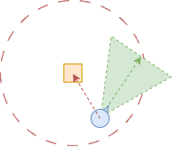



# Introducción

Vamos a ver como se gestionar la entrada del jugador en Unreal Engine y algunos consejos sobre cómo implementar cierto tipo de interacciones con el mundo.

## *Legacy* vs. *Enhanced Input*

En Unreal Engine 4 se usaba un sistema donde la entrada de los dispositivos del jugador se mapeaba en acciones configurando las opciones de **Project Settings / Input**.
El código de *gameplay* de nuestro juego podía leer estas acciones, principalmente, a través de las clases: **PlayerInput** e **InputComponent**.

En Unreal Engine 5 este sistema pasó a considerase *legacy*, para ser sustituido por un nuevo sistema llamado **Enhanced Input**.

El **Enhanced Input** ofrece un montón de características nuevas.
Entre otras diferencias, las acciones de entrada se definen mediante *assets* **Input Action**, lo que facilita migrar acciones de un proyecto a otro.

Además, las **Input Action** soporta diferentes condiciones para notificar la acción de entrada al código de *gameplay*.
Por ejemplo, se puede condicionar a que se mantenga accionado un control cierto tiempo o a que el jugador accione cierta combinación de controles en un periodo de tiempo determinado ---lo que se llama, un *combo*---.
Esta funcionalidad permite ahorrar tiempo, ya que nos evita tener que implementar nosotros mismos este tipo de entradas.

En cualquier caso, el código de *gameplay* puede leer estas acciones de entrada a través de las clases: **EnhancedPlayerInput** y **EnhancedInputComponent**.

El antiguo sistema sigue siendo el usado por defecto en los proyectos nuevos de Unreal Engine 5.0 aunque, en cualquier momento, se puede activar el nuevo en **Project Settings / Input**.
Pero desde Unreal Engine 5.1 la situación es a la inversa.
El **Enhanced Input** viene activado por defecto, aunque podemos volver al antiguo en la configuración del proyecto, si realmente es necesario.

Para los temas de entrada e interacción que vamos a ver a continuación, en general, no importa que sistema estemos usando.
Ambos permite definir acciones que se disparan cuando el jugador las acciona.
Lo único que tiene que hacer nuestro código de *gameplay* es «atender» a dichos eventos.

A continuación vamos a referirnos a **PlayerInput** y a **InputComponent** por economía del lenguaje, pero debemos recordar que, si estamos usando el **Enhanced Input**, realmente estaríamos hablando de las clases **EnhancedPlayerInput** y **EnhancedInputComponent**.

# Unreal Engine *Input System*

Sobre las características básicas del motor ---como render, físicas, iluminación, gestión de objetos, actores y componentes, etc.--- Unreal Engine ofrece un *framework* con componentes de uso frecuente en el desarrollo del *gameplay* cierto tipo de juegos, en parte prescribiendo la forma de crear nuevos sistemas y la arquitectura del juego[@TorresD3DGameplayFramework].

A continuación veremos los componentes de ese *Gameplay Framework* dedicados a gestionar la entrada del jugador.

## *PlayerInput*

En el sistema de Unreal Engine, la clase **PlayerInput** es la encargada dar acceso a la entrada de los usuarios.
Con ella, en teoría, podríamos leer directamente de los dispositivos de entrada.

Podemos pensar en **PlayerInput** como el equivalente del antiguo módulo **Input** de Unity, en el que usábamos métodos como `GetKey()` o `GetAxis()` para leer la entrada del jugador.
Sin embargo, en Unreal Engine nunca se usa **PlayerInput** de esta manera.

**PlayerInput** es un objeto instanciado en **PlayerController** que, junto a **InputComponent**, nos ofrece una interfaz basada en «acciones» mucho más adecuada.

## *InputComponent*

El **InputComponent** es el componente que generalmente usaremos en los actores para acceder a la entrada del jugador.
Es decir, lo podemos usar en el actor de personaje, pero controlarlo, pero también en el actor de un cofre, para saber cuándo el jugador quiere abrirlo.

Con **InputComponent** podemos conectar el código de *gameplay* del actor a las acciones de entrada definidas en el juego.
Esto se puede hacer usando eventos, para que el **InputComponent** ejecute nuestro código cuando llegue cierta entrada del jugador, como se puede observar en la @fig-ue-input-action-event.

::: {#fig-ue-input-action layout-nrow=2}

{#fig-ue-input-action-event}

{#fig-ue-input-action-polling}

Acceso a la entrada del jugador mediante.
:::

Sin embargo, si vamos a hacer algún tipo de cálculo combinando los valores de varias acciones de entrada, puede resultar más cómodo leer dichos valores cuando nos haga falta, como se observa en la @fig-ue-input-action-polling.

Aunque no veamos a **InputComponent** en el editor, todos los actores tienen una instancia de ese componente, porque cualquier actor en la escena puede acceder a la entrada del jugador.

Quien conecta el **PlayerInput** ---que es quién tiene acceso a la entrada--- con los **InputComponent** de los actores es el **PlayerController**.

## *PlayerController*

En la arquitectura de muchos juegos, es buena idea tener un objeto que represente al jugador y que controle y gestione todo aquello que le concierne a éł y a su personaje.
En Unreal Engine, este objeto es el **PlayerController**.

El **GameMode** crea un **PlayerController** para cada jugador ---generalmente a través del método `Login()`--- y se destruye al cargar un nuevo nivel.

Por defecto, los **PlayerController** tienen varias responsabilidades:

* Gestionar la entrada y teledirigir al personaje de su jugador.
El **PlayerController** tiene el objeto **PlayerInput** para leer la entrada y puede poseer a cualquier actor derivado de la clase `Pawn` para controlarlo.

* Crear el HUD ---la interfaz de usuario--- del jugador.
Actualmente, la forma adecuada de hacerlo es creando *widgets* con UMG (Unreal Motion Graphics) y mostrarlos usando `AddToViewport()` en el método `BeginPlay()` del **PlayerController**. 

* Crear el actor que controla la cámara del jugador, llamado **PlayerCameraManager**.
Se puede personalizar el **PlayerCameraManager** derivando de dicha clase y cambiando en las propiedades del **PlayerController** la clase que debe usar para crear el actor **PlayerCameraManager**.

    Vincular el control de cámara y el HUD con el **PlayerController** es muy útil en los juegos multijugador, donde hay varías cámaras y varias interfaces de usuario.
    Así el resto de la lógica del juego puede localizar fácilmente el control de cámara y la interfaz de un jugador concreto con solo preguntarle al **PlayerController** correspondiente.

* Gestionar la *rotación de control*.
Unreal Engine separa, por defecto, la dirección en la que mira el personaje en la escena ---que es una propiedad del actor del personaje--- de la dirección en la que mira el jugador.
A esta última se la denomina  *rotación de control*.

    En muchos juegos la *rotación de control* puede usarse para rotar el personaje, de tal forma que ambas direcciones sean la misma.
    Mientras que en otros, puede interesar mantenerlas por separado, para que el jugador pueda mirar o apuntar en una dirección mientras el personaje está orientado en otra para desplazarse.

* Gestionar información específica del jugador.
El **PlayerController** puede usar para gestionar otra información del jugador, a parte de su *rotación de control*, especialmente si debe sobrevivir a la destrucción del actor personaje.
Por ejemplo, el nombre del jugador, las habilidades adquiridas o su inventario.

Respecto a esto último, debemos tener en cuenta que el **PlayerController** se destruye y se vuelve a crear al cargar un nuevo nivel.
La información que debe mantenerse durante toda la ejecución del juego puede alojarse en la instancia de `GameInstance`, que se crea al iniciarse el juego y no se destruye hasta que este termina.
En ese caso, es conveniente mantener una referencia a esta información en el **PlayerController**, para facilitar el acceder a ella, por ejemplo, desde el actor del personaje o desde la interfaz de usuario.

## Gestión de la entrada de jugador.

Para gestionar la entrada del jugador, el **PlayerController** tiene un objeto **PlayerInput** y una pila de **InputComponent** de los actores interesados en leer la entrada del jugador.
El **PlayerInput** lee los eventos de entrada y los entrega a los **InputComponent** en el orden determinado por la pila.
Como se intenta esquematizar en @fig-input-component-stack, según va pasando por los **InputComponent**, cada uno de ellos puede «consumir» el evento de entrada, haciendo que no alcance a componentes posteriores en la pila.

{#fig-input-component-stack}

El **PlayerController** es un actor, por lo que tiene un **InputComponent**.
Este **InputComponent** es, generalmente, el primero de la pila.
Después está el del personaje que el **PlayerController** está controlando ---o, más bien, poseyendo, si usamos la terminología de Unreal Engine---.

Como se muestra en la @fig-input-component-stack, otros actores lo que hacen es «registrarse» en el **PlayerController** del jugador del que quieren leer la entrada, para colocarse los primeros en la pila de **InputComponent**.
Cuando ya no necesitan leer la entrada, solo tienen que «desregistrarse».

Para realizar estas operaciones se usan las funciones `EnableInput` y `DisableInput` de la clase actor.
Ambas reciben el **PlayerController** del jugador del que quieren leer o dejar de leer la entrada.

# Interacción con objetos

Veamos como usar la arquitectura descrita para implementar la interacción con objetos.

Un caso de uso típico en cualquier videojuego es hacer que cuando el jugador esté cerca de un objeto pueda cogerlo o accionarlo.
Es algo múy típico con armas, botiquines, puertas, interruptores, objetos que podemos agarrare para empujar, etc.

Como hemos comentado anteriormente, todo empieza porque el objeto tenga un ***trigger** que permita saber cuándo estamos cerca de él.
Sin embargo, tanto el personaje como el objeto pueden ser informados del momento en el que eso ocurre, por lo que podríamos implementar el código de esta funcionalidad tanto en el actor del objeto como en el del personaje.

Si solo el personaje tuviera acceso a la entrada del jugador, probablemente la segunda sería le mejor o, quizás, la única opción.
Pero con el sistema de entrada descrito, los objetos también pueden leer la entrada del jugado, si llaman a `EnableInput` con el **PlayerController** del jugador, lo que abre la posibilidad de implementar la lógica en el actor del objeto.

La ventaja de hacerlo así es que evitamos añadir esta responsabilidad en el código del personaje que, por lo general, ya tiene muchas cosas de las que encargarse.
De esta forma, es más fácil añadir nuevos tipos de de objetos con los que puede interactuar el jugador.

## Implementación básica

En la @fig-object-interaction-sequence se puede ver un esquema de como podría ser la secuencia para implementar esta funcionalidad:

```{mermaid}
%%| label: fig-object-interaction-sequence
%%| fig-cap: "Ejemplo de interacción con otros actores."
%%| file: figures/object-interaction-sequence.mm
%%| fig-width: 15cm
```

1. El objeto debe tener una ***trigger*** para detectar cuando el jugador está lo bastante cerca.

1. Cuando el personaje del jugador entra en el ***trigger***, el actor llama a `EnableInput` pasando el **PlayerController** asociado al personaje.
Si el personaje sale del ***trigger***, el actor llama a `DisableInput`.

1. El actor usa eventos de entrada para saber si el jugador usa la acción adecuada para interactuar con él.

1. Sí el jugador interactúa con el objeto, el actor reacciona haciendo lo que corresponda según el caso.

Respecto a este último punto:

* La reacción puede ser cualquier acción: abrir una puerta, accionar unas luces o añadirse al inventario del jugador.
Además, es posible que tengan que reproducirse efectos visuales o sonoros para darle más realismo.

* Es buena idea usar eventos para que el objeto notifique al resto del código que ha sido accionado.
Esto evita que el objeto tenga dependencias con otras partes del código, lo que ofrece mayor flexibilidad.

    Por ejemplo, si se trata de un pulsador que abre una puerta, el pulsador puede tener una propiedad para referenciar a la puerta que debe abrir al ser accionado.
    O, el pulsado puede tener un evento para notificar cuándo es pulsado y la puerta suscribirse a él al ser creada.

* El objeto puede tener que comunicar al personaje que ha sido accionado para que este se comporte de la forma correspondiente para mejorar la inmersión.
Por ejemplo, para que el personaje ejecute una animación coherente con la acción, como si estuviera recogiendo el objeto o pulsando el botón.

* Si el objeto ya no es necesario ---por ejemplo, porque es algo que se recoge--- tendrá que autodestruirse.

## Consider a dónde mirar el jugador

En juegos en primera y tercera persona, es común que solo queramos que el jugador pueda accionar el objeto si lo está mirando.
En ese caso, como *feedback* al jugador, se suele mostrar en la interfaz de usuario el control que debe usar para hacerlo.

Para hacerlo, cuando el jugador entra o sale del ***trigger*** se comprueba periódicamente, en cada *tick*, el ángulo entre la dirección en la que mira el jugador y la dirección para mirar el objeto.
Este ángulo se puede obtener fácilmente usando `FindLookAtRotation`.

Como el objeto tiene al personaje ---porque es quién han entrado en el ***trigger***--- resulta sencillo obtener su **PlayerController** y, a partir de él, el **PlayerCameraManager** que puede informar de la posición y dirección de la cámara, para calcular el ángulo.
Además, funciones como `GetPlayerCameraManager` nos permiten obtener el **PlayerCameraManager** con solo indicar el índice del jugador ---el 0, cuando solo hay un jugador---.

Si el ángulo entra dentro de cierto límite ---para simular el campo de visión del jugador, como se puede observar en la [@fig-angulo-de-vision]--- se llama a `EnableInput` y se actualiza la interfaz.
Si el ángulo supera dicho límite, se llama a `DisableInput` y se vuelve a actualizar la interfaz de usuario.

{#fig-angulo-de-vision}

::: {.callout-note}
Aunque se pueden ***raycasts*** para obtener un resultado similar, en este caso podría ser un poco excesivo, ya que se puede resolver de forma más eficiente con unos cálculos sencillos.
:::

# Control del personaje

En la arquitectura de entrada descrita, puede surgir la duda de si colocar el código que procesa los eventos de entrada del usuario para manejar el personaje en el **PlayerController** o en el propio actor del personaje del jugador.

La ventaja de utilizar el **PlayerController**, es que facilita separar la responsabilidad de procesar la entrada del jugador de la de implementar las acciones y habilidades de cada personaje.
Es decir, el **PlayerController** lee las acciones del jugador y se las comunica al actor del personaje controlado, como se puede observar en la @fig-character-control-sequence.
Para eso, esté último debe exponer una interfaz de métodos con las acciones posibles, que permitan al **PlayerController** teledirigirlo.

```{mermaid}
%%| label: fig-character-control-sequence
%%| fig-cap: "Ejemplo de control de personaje."
%%| file: figures/character-control-sequence.mm
%%| fig-width: 15cm
```

Esta arquitectura de entrada permite que un jugador pueda manejar diferentes personajes, reutilizando el código que procesa la entrada en el **PlayerController**.
Simplemente, en cada caso, el **PlayerController** posee a un actor **Pawn** diferente.
En cualquier caso, si un personaje tiene algún tipo de comportamiento especial, siempre es posible procesar esa acción directamente en su **Pawn**.

También existe un controlador, llamado **AIController**, que se usa como cerebro de los NPC.
La arquitectura descrita permite que uno de estos controladores puede controlar a cualquier **Pawn** en un momento dado.

Sin embargo, cuando en un juego el jugador siempre maneja al mismo personaje, a veces todo esto puede resultar un tanto excesivo.

Sin duda, el **PlayerController** es un buen sitio para gestionar acciones como pausar el juego, abrir el menú o saltarse la cinemática.
También es buen lugar para gestionar la entrada relacionada con el movimiento del personaje y de la cámara, en parte porque guarda la *rotación de control*, en parte porque estas clases traen todo lo necesario para que el controlador teledirija el movimiento del personaje.
Pero, es posible, que en un juego con un único personaje, otras acciones como disparar, realizar ataques cuerpo a cuerpo o coger objetos, resulte algo más sencillo sí gestionamos la entrada en el propio personaje ---aunque puede que en componentes diferentes, para separar responsabilidades---.

## Movimiento del personaje

El movimiento final de un personaje, puede no estar relacionado solo con el control
En un mismo frame puede llegar que el jugador quiere que correr hacia adelante y, un poco después, que quiere que salte.
¿Cómo se combinan ambas ordenes en el movimiento final del personaje?

Un poco más tarde, el personaje estará en el aire, con el impuso del salto, pero también hay que sumar el efecto de la gravedad.
Además, el jugador puede seguir indicando, mediante su control, que el personaje debe moverse en cierta dirección.
Nuevamente, tenemos que ver cómo combinamos todas estas órdenes.

Por otro lado, no solo el controlador puede afectar al movimiento de un personaje.
Si el personaje está sobre una plataforma o un ascensor, es necesario sumar a la entrada del jugador el movimiento de la superficie sobre la que se encuentra.

Para que no se pisen los distintos factores, con origen diverso, que intentan condicionar la posición del personaje, lo usual es que:

* El personaje ofrezca una interfaz para acumular vectores de movimiento durante el frame actual.
Esta interfaz es la que deben usar los distintos componentes que quieren actuar sobre el movimiento del personaje

* En cada *tick* se coge el vector acumulado de movimiento y el personaje es trasladado de una sola vez comprobando las colisiones.

Por ejemplo, la clase **Pawn** de Unreal Engine ---que es la clase base de los actores que un **PlayerController** puede poseer---- tiene una variable interna de tipo vector, llamada `ControlInputVector`, y un método `AddMovementInput` con que el podemos sumar vectores de movimiento a `ControlInputVector`.

La clase **Pawn** no hace nada con este vector, pero la idea es que en cada *tick* se lea el valor acumulado, usando el método `ConsumeMovementInputVector`, y este valor se use para mover el personaje, como se muestra en la @fig-character-movement-sequence.
Al usar `ConsumeMovementInputVector`, el valor de `ControlInputVector` se pone a $(0, 0, 0)$, preparado para el siguiente frame.

```{mermaid}
%%| label: fig-pawn-movement-sequence
%%| fig-cap: "Ejemplo de control de movimiento básico de un **Pawn**."
%%| file: figures/pawn-movement-sequence.mm
%%| fig-width: 15cm
```

La clase **Character** hereda de **Pawn** y añade funcionalidad de forma similar.
Por ejemplo, tiene un método `Jump` que realmente guarda en la variable interna `bPressedJump` que el jugador ha pulsado la acción de saltar.
Es en cada *tick* dónde se lee esta variable, así como `ControlInputVector`, para determinar el vector de movimiento realmente del actor del personaje.

::: {.callout-tip}
Esta forma de resolver el problema puede parecer un tanto extraña, pero es muy común.
En cualquier juego es frecuente que algunos componentes quieran alterar al mismo tiempo las mismas entidades.
Esto ocurre en cada *tick*, generalmente, pero es complicado predecir el orden exacto de estas operaciones por lo que, para evitar problemas, se suele optar porque el objeto recoja estas peticiones externas, guardándolas en variables internas, y luego las aplique de forma sincronizada en su *tick*.
:::

### *MovementComponent*

Obviamente, podemos llamar a `ConsumeMovementInputVector` en el *tick* del propio actor o de cualquier componente que le incorporemos al **Pawn**.
Sin embargo, lo ideal es añadir un componente derivado de **MovementComponent** y hacerlo en su *tick*, puesto que en Unreal Engine estos componentes están pensados para ser los responsables del movimiento de los actores.

Por ejemplo, todo actor **Character**, que es una clase derivada de **Pawn**, tiene por defecto un **CharacterMovementComponent** que se hace cargo del movimiento del personaje.
Este componente deriva de **PawnMovementComponent** que, a su vez, deriva de **MovementComponent**.

Realmente, si un **Pawn** detecta que se le ha añadido un **PawnMovementComponent**, su método `AddMovementInput` entrega el vector de movimiento a acumular al **PawnMovementComponent**.
Por defecto, este componente lo devuelve o no al **Pawn**, para que lo acumule en `ControlInputVector`, pero podemos sobrescribir la función `AddInputVector` en el **PawnMovementComponent** para cambiar este comportamiento.

En la @fig-character-movement-sequence se puede ver un diagrama de secuencia para los actores de la clase **Character**.

```{mermaid}
%%| label: fig-character-movement-sequence
%%| fig-cap: "Ejemplo de control de movimiento de un **Character**."
%%| file: figures/character-movement-sequence.mm
%%| fig-width: 15cm
```

### Entrada al control de movimiento

Como se interpreten los valores indicados a `AddMovementInput` y sumados en `ControlInputVector` va a depender del tipo de control de movimiento que queramos.

Se puede indicar directamente el desplazamiento deseado ---control de primer orden--- pero también puede ser la velocidad ---control de segundo orden--- o la aceleración ---control de tercer orden--- del personaje.
Cuando se quiere realismo se suele optar, por lo general, por usar la aceleración, puesto que modificar bruscamente la velocidad o la posición del personaje, puede dar lugar a comportamientos extraños.

En Unreal Engine el **CharacterMovementComponent** espera que la entrada sea un vector con la dirección y sentido en la que acelerar al personaje
La magnitud del vector se recorta a 1.0 y luego se multiplica por la aceleración máxima configurada en las propiedades del componente:

```
Acceleration = MaxAcceleration * Clamp(ControlInputVector, 1.0f);
```

Si tenemos que desarrollar nuestro propio **MovementComponent**, tenemos que decidir cómo interpretar `ControlInputVector` y cómo tratar, si fuera necesario, las diferencias entre los valores que pueden llegar según el dispositivo de control utilizado por el jugador.
Por ejemplo, tanto con teclado como con *gamepad*, los vectores devueltos por la **Input Action** correspondiente contiene valores entre 1 y -1, pero nada impide que se use como entrada un ratón u otro dispositivo que devuelva valores mayores.

## Control de cámara

El control de cámara por medio de la *rotación de control* que gestiona el **PlayerController** funciona de forma similar al control de movimiento.

El **PlayerController** ofrece funciones como `SetControlRotation` y `GetControlRotation` para leer y establecer la *rotación de control*.
También permite acumular ángulo de rotación, en cualquier de los 3 ángulos de Euler ---vér la [@fig-ue-euler-angles]--- mediante las funciones `AddPitchInput`, `AddYawInput` y `AddRollInput`.
Los valores indicados a estas funciones son multiplicados por las propiedades `InputPitchScale`, `InputYawScale` y `InputRollScale` del **PlayerController**, antes de ser acumulados.

Las funciones `AddPitchInput`, `AddYawInput` y `AddRollInput` son ideales para usarlas con los eventos de entrada.
Por ejemplo, que cuanto más acciona el *stick* a la derecha, más ángulo de *yaw* se acumule en la *rotación de control* .

{#fig-ue-euler-angles}

La clase **Pawn** también tiene tres funciones de conveniencia: `AddControllerYawInput`, `AddControllerPitchInput` y `AddControllerRollInput`, que realmente llaman a las anteriores en el **PlayerController**

Como en el caso del movimiento del personaje, en cada *tick* se puede leer la *rotación de control* y usarla para ajustar la dirección en la que mira la cámara.


<!---

### Tipo de control

// TODO: Control según tipo de control: stick, mouse o teclado.

Esto encaja muy bien con los valores leídos de los controles del jugador, puesto que tanto si se usa el teclado como si es el *stick* de un *gamepad*, los vectores devueltos por la **Input Action** correspondiente contienen valores entre 1 y -1.
Escalando el vector por la aceleración máxima, el jugador tiene capacidad para controlar la aceleración que imprime entre 0 y la máxima.

# Puertas y ascensores


# Controlador del personaje (estático)


# Diseño dirigido por datos

# Programación dirigida por eventos


# Timers

# Damage API
--->

# Referencias {.unnumbered}

::: {#refs}
:::

