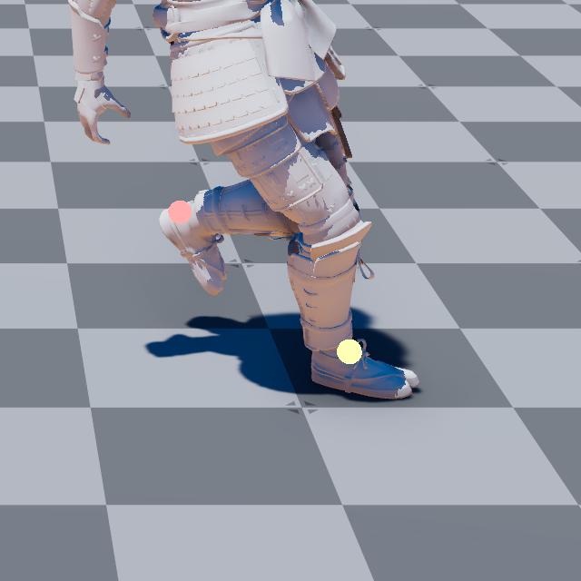
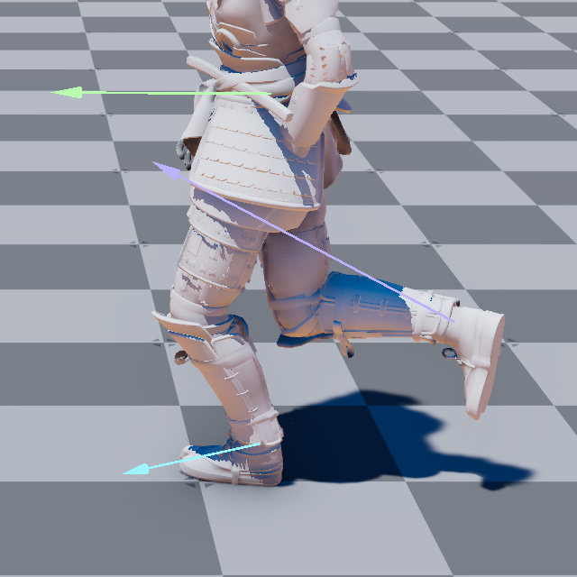
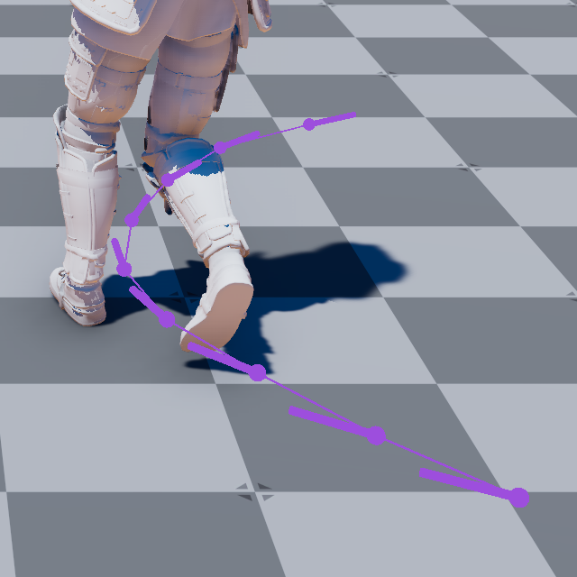



# Introducción

Una de las técnicas más comunes para animar en tiempo real personajes en videojuegos, es el uso de varios *clips* de animación por *keyframes* y una máquina de estados que se encarga de seleccionar el *clip* de animación que se debe reproducir en cada momento.

Los animadores crean varias animaciones con una serie de *keyframes*, que definen el estado de las articulaciones del personaje en cada instante en el tiempo.
Estas animaciones se pueden crear de forma enteramente manual o usando técnicas para capturar el movimiento de un actor real.
Pero incluso en este último caso, los animadores suelen tener que editar las animaciones para eliminar errores y hacer que el movimiento tengan la dinámica deseada.

Cada *clip* de animación corresponde a una acción concreta del personaje, como caminar, correr, saltar, golpea, caer, aturdir, etc.
Mediante la máquina de estados de animación, se selecciona el *clip* que se debe reproducir en cada momento, en función del estado del personaje.
El motor de videojuegos se encarga de interpolar entre estos *keyframes*, incluso al transicionar entre *clips*, para crear una animación fluida, evitando saltos bruscos.

Esta técnica es muy flexible y permite crear animaciones complejas, pero cuanto más realista se quiere que sea la animación del personaje, más complejo y difícil de mantener se vuelve la máquina de estados de animación.

Una de las alternativas a esta técnica más tradicional es el uso de ***motion matching***, que ha ido ganado popularidad desde que juegos como *«For Honor»* (2016)[@Cooper2016MotionMatching], *«EA Sports UFC 3»* (2019), *«The Last Of Us Part II»* (2020), *«Half-Life: Alyx»* (2020)[@VandenHeuvel2021MMHalfLifeAlyx; @VandenHeuvel2020MMHalfLifeAlyx], *«eFootball PES»* (2021) y *«FIFA 22»* (2022) la adoptaron.

El ***motion matching***[@Büttner2016MotionMatching; @Clavet2016MotionMatching] se basa en la idea de que, en lugar de seleccionar un *clip* de animación, se selecciona un *keyframe* de un *clip* de animación, en función del estado del personaje, y se reproduce el *clip* desde ese *keyframe* en adelante.
Esta selección se hace varias veces por segundo y el motor de videojuegos se encarga y el motor de videojuegos se encargar de saltar y mezclar los *clips*, sintetizando la animación del personaje.

Esta técnica evita crear una máquina de estados de animación compleja.
En su lugar, se trata de una técnica de animación dirigida por datos, donde la mejor secuencia se escoge de forma automática, en función del estado del personaje y de su entorno, de una enorme base de *clips* de animación pregrabados.

# *Motion matching*

En los próximos apartados veremos los principales componentes y carcterísticas de esta técnica.

## Base de datos de movimiento

Para animar un personaje usando ***motion matching***, se necesita una librería de *clips* de animación, donde el personaje realiza distintas acciones, como caminar despacio, correr, hacer giros bruscos y suaves, acelerar y desacelerar en diferentes direcciones, saltar, caer, etc.
Es decir, se necesita una gran cantidad de *clips* de animación para que haya uno para cada posible situación del personaje.

En la charla «Animation Bootcamp: Motion Matching» de la GDC 2016[@Zadziuk2016MotionMatching] se muestra como se lleva a acabo el proceso, empezado por la creación de un conjunto de *dance cards*.
Estas *dance cards* describen los caminos que los actores deben seguir en un estudio de captura de movimiento para capturar el rango completo de movimientos posibles para obtener los mejores resultados con esta técnica.

Esta colección de *clips* de animación es la **base de datos de movimiento**.

En el vídeo «'Dance Card' Breakdown»[@Zadziuk2016DanceCardBreakdown] se muestra cómo se usan las *dance cards* y cómo se captura el movimiento de los actores.
Mientras que en «Stumble & Impact Tests»[@Zadziuk2016ImpactTest] se puede observar cómo hicieron capturas adicionales para animar impactos y caídas.

En general, lo más importante, es que los movimientos que se capturen encajen con el modelo de movimiento deseado.
Por ejemplo, si el personaje se va a mover a lo largo de curvas, las *dance cards* deben incluir movimientos que sigan curvas.
Mientras que si el personaje va a hacer movimientos bruscos en ángulos agudos, se deben capturar movimientos de ese tipo.

Algunas de las *dance cards* que se observan en los vídeos anteriores son grandes.
Incluyen trayectorias largas, con diferentes tipos de movimiento, para capturar en un único *clip* de animación.
Sin embargo, esto no es un requisito de la técnica.
Se pueden hacer capturas más cortas de movimientos, de movimientos individuales, para incluirlas en la **base de datos de movimiento**.

## Propiedades del movimiento

Para poder seleccionar el *keyframe* de animación más adecuado para cada situación, se necesita una forma de comparar los *keyframes*, de los diferentes *clips* de animación, de la base de datos con el estado actual del personaje y la intención del jugador, de forma que el resultado sea una animación fluida y realista, sin saltos bruscos.
La forma de hacer esta búsqueda es mediante la comparación de propiedades extraídas en cada *keyframe* de los datos de los *clips* de animación.

Como hemos comentado, los *clips* de animación contienen una serie de *keyframes* que guardan el estado de las articulaciones del personaje en cada instante en el tiempo.
Por lo general, el estado de cada articulación se define mediante una serie de parámetros --como la posición y la orientación-- relativos a la articulación padre en el esqueleto del personaje.
De esta información se extraen las propiedades que se usarán en la búsqueda, codificándose y almacenándose asociadas al *keyframe* para el que se extrajeron.

Por ejemplo, una característica utilizada comúnmente es la posición de los pies, como se puede ver en la @fig-feature-position
Esta, generalmente, se extrae en el espacio del modelo, es decir, como la posición relativa de los pies respecto al hueso raíz del esqueleto del personaje.
De esta forma, la búsqueda es invariante a la localización y orientación real del personaje en el mundo, tanto durante el juego como en la captura de movimiento.

<!-- TODO: Hacer imágenes propias en unreal -->

:::{#fig-motion-matching-properties layout="[10, -1, 10, -1, 10]"}

{#fig-feature-position}

{#fig-join-velocity}

{#fig-feature-trajectory}

Ejemplos de propiedades de movimiento en Open 3D Engine[@Jillich2022MotionMatching].
:::

Como se puede ver en la @fig-motion-matching-properties, se pueden extraer otras propiedades, como la velocidad lineal o angular de algunas articulaciones; por ejemplo, las de las rodillas.
Estas se pueden calcular a partir de la posición de la articulación en el *keyframe* actual y en el *keyframe* anterior o posterior, generalmente calculadas de forma relativa a la propia articulación en el *keyframe* actual.
O se puede codificar la trayectoria del hueso raíz --es decir, la trayectoria general del personaje-- a lo largo de varios instantes anteriores y futuros; siempre de forma relativa a la posición del modelo en el *keyframe* actual, para mantener la invarianza.

Aunque al hablar de ***motion matching*** se suele usar como ejemplo la locomoción de personajes --es decir, las animaciones que corresponden a caminar, correr, saltar, etc.-- esta técnica también se puede usar con otro tipo de movimientos, como ataques cuerpo a cuerpo.
También se pueden incluir entre las propiedades del entorno, como la posición y altura de obstáculos, armas o de otros objetos con los que el personaje pueda interactuar.
La clave es disponer de *clips* en situaciones similares a las que se pueden dar en el juego y escoger las propiedades adecuadas para que el sistema pueda encontrar el *keyframes* de esos *clips*.

Las propiedades no solo se calcula y almacenan para cada *keyframe* de la base de datos de movimiento, sino que también se extraen para el estado actual y movimiento a partir de la entrada del jugador, con el objeto de usarlas para preparar la consulta a la base de datos.
En cada frame, la consulta se compara con las propiedades de los *keyframes* de la base de datos de movimiento, de forma que se selecciona el *keyframe* más adecuado para la situación actual del personaje.

Por ejemplo, si solamente se usa como propiedad la posición de los pies, se puede calcular la distancia al cuadrado entre la posición de los pies en la postura actual del personaje en el juego con la posición de los pies en los *keyframe* de la base de datos de movimiento, de forma que la distancia mínima indica el *keyframe* más adecuado en la base de datos.
Obviamente, se puede asignar diferentes pesos a cada propiedad, de forma que se puede dar más importancia a unas propiedades que a otras en la selección del mejor *keyframe*, en función de los requisitos del proyecto.

Por lo general, uno de los aspectos que consumen más tiempo de desarrollo es la selección de las propiedades más adecuadas para la búsqueda, dado que estas dependen de las características y objetivos del proyecto, por lo que es necesario experimentar con diferentes opciones.
Cuantas mas propiedades se usen, mayores son las probabilidades de que el *keyframe* seleccionado sea el más adecuado, pero también se incrementa el tiempo de búsqueda y el consumo de memoria.

## Algoritmo de *motion matching*

En resumen, el algoritmo de ***motion matching*** se puede dividir en varias etapas:

* Previamente, se construye la **base de datos de movimiento** con *clips* de animación que cubran todas las situaciones posibles del personaje y se extraen y almacenan las propiedades seleccionadas para cada *keyframe* de la base de datos, junto a una referencia al *keyframe* correspondiente.

* Durante la ejecución, el algoritmo puede ejecutarse periódicamente, cada varios frames.
Mientras tanto se reproduce el *clip* de animación seleccionado en la última ejecución del algoritmo:

  1. Se extraen las propiedades del estado actual del personaje y se prepara la consulta a la base de datos de movimiento.

  1. Se realiza la consulta a la base de datos de movimiento, comparando las propiedades extraídas en el paso anterior con las propiedades de los *keyframes* de la base de datos de movimiento, de forma que se selecciona el *keyframe* más adecuado para la situación actual del personaje.

  1. Si el *keyframe* seleccionado pertenece al mismo *clip* y está cerca en tiempo al *keyframe* que se está reproduciendo, no hace falta hacer el cambio.
  
  1. En caso contrario, se reproduce el *clip* de animación a partir del *keyframe* seleccionado.

## Control del personaje

Para que el algoritmo descrito anteriormente no solo seleccione el mejor *keyframe* para la situación actual, sino que también considere la trayectoria que va a seguir el personaje y, por tanto, la intención del jugador o de la IA; es interesante introducir en las propiedades la trayectoria del personaje, tanto pasada como futura.

Una de las formas de codificar la trayectoria es extrayendo un número de muestras $N$ de la posición del personaje relativa a su posición actual durante el periodo $\Delta{t_a}$ anterior y $\Delta{t_b}$ posterior al instante actual.
La distancia entre estas muestras contiene información sobre la velocidad y sobre si el personaje está acelerando.

También se puede incluir la orientación del personaje en cada muestra respecto a la orientación en el instante actual, dado que esto permite identificar movimientos donde el personaje se desplaza en direcciones diferentes a aquellas en las que se orienta, como cuando esquiva.

<!-- TODO: Imagen de la trayectoria -->

Obviamente, extraer la trayectoria para cada *keyframe* de la **base de datos de movimiento**, no resulta complejo.
Tampoco, calcular la trayectoria previa del personaje durante la ejecución del juego, pues solo hace falta mantener un historial de las últimas posiciones del personaje.

Sin embargo, calcular la trayectoria futura del personaje en el juego, para completar la consulta, es más complejo.
En el caso de un NPC se pueden generar puntos de la trayectoria a partir de la planificación del sistema de navegación.
Mientras que para el personaje del jugador, es necesario predecir la intención del usuario.

En Open 3D Engine, por ejemplo, se predice la trayectoria creando una curva exponencial.
Esta parte de la posición y orientación actual del personaje, pero se curva hacia la posición final considerando la dirección de la entrada actual del jugador[@Jillich2022MotionMatching].

Si la trayectoria es compleja de predecir, se puede intentar mejorar la predicción interpolando entre la trayectoria estimada a partir de la entrada del jugador y la trayectoria de la secuencia de *keyframes* actualmente seleccionada, que ha sido capturada de personas reales.
Por lo general, esta interpolación se ajusta para que los puntos más próximos en tiempo se acerquen más a la trayectoria de la secuencia actual, mientras que en los más alejados solo se use la estimación a partir de la entrada del jugador.

# Consumo de memoria

La principal limitación de esta técnica está en su elevado consumo de memoria, seguida, en mucha menor medida, por el tiempo de búsqueda.

Por ejemplo, en un trabajo de Ubisoft[@Holden2020LearnedMotionMatching] se muestra que su implementación necesita 52.1 MB de memoria para un base de datos con 894480 *keyframes* de animación y 27 características.
Mientras que en otro artículo sobre el ***motion matching*** en Open 3D Engine[@Jillich2022MotionMatching] se estima que 108000 *keyframes* con 59 características necesitan 24.3 MB de memoria. 

# *Learn motion matching*

En el artículo «Learned Motion Matching»[@Holden2020LearnedMotionMatching], investigadores de Ubisoft y de la Universidad de Canadá proponen una técnica para reducir el consumo de memoria del ***motion matching*** mediante el uso de redes neuronales.

Para lograrlo se utilizan 3 redes neuronales, una para cada una de las etapas del algoritmo de ***motion matching***:

* **Proyector:** es una red neuronal a la que se le indican las propiedades de la postura actual del personaje para que devuelva las propiedades del *keyframe* más adecuado.
  Es decir, se encarga de la búsqueda del *keyframe* más adecuado en la base de datos de movimiento, solo que las lista de propiedades de los *keyframes* de la base de datos se codifican en la forma de pesos de la red neuronal, reduciendo la cantidad de memoria requerida.

* **Descompresor:** se encarga de recuperar la posición de las articulaciones del personaje a partir de las propiedades de ***motion matching*** indicadas.
  Es decir, el **descompresor** comprime los *clips* de animación de la base de datos de movimiento, reduciendo la memoria utilizada.

* **Stepper:** se encarga de calcular las propiedades del siguiente *keyframe* a partir de las propiedades del *keyframe* actual.

  En el ***motion matching*** convencional, una vez se escoge un *keyframe*, la animación continúa avanzado por la secuencia del *clip* de animación.
  Pero como en el ***learned motion matching*** se usan redes neuronales para codificar las propiedades de los *keyframes* de la base de datos de movimiento, no se puede avanzar por la secuencia del *clip* de animación, ya que no se tiene acceso a los *keyframes* siguientes.
  Por eso, se usa una red neuronal para calcular las propiedades del siguiente *keyframe* a partir de las propiedades del *keyframe* actual.

En la @fig-learned-motion-matching se ilustra la técnica descrita en un diagrama de bloques.

{#fig-learned-motion-matching}

# Soporte en motores de videojuegos

El ***motion matching*** es una técnica relativamente nueva.
Por tanto, no es una característica incluida de serie en todos ellos, aunque hace tiempo que se puede usar mediante desarrollos propios o *plugins* de terceros.

Por ejemplo, en el motor de videojuegos Open 3D Engine, que es de código abierto, se incluyó soporte para ***motion matching*** de forma experimental en la versión 22.05[@O3DEMotionMatching].
En Unreal Engine, por otro lado, se incluyó, también de forma experimental, desde la versión 5.1[@UnrealMotionMatching].
Mientras que en Unity, se puede usar ***motion matching*** mediante *plugins* de terceros, como «Motion Matching for Unity»[@AnimationUprisingMotionMatchingForUnity], que se puede adquirir en la *Asset Store* de Unity.

# Referencias {.unnumbered}

::: {#refs}
:::