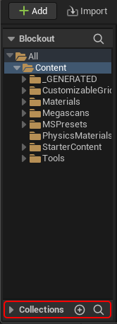



En los siguientes apartados veremos algunas recomendaciones para organizar el proyecto y facilitar la colaboración entre los diferentes equipos involucrados.

A fin de cuentas, poner algo de orden en un proyecto es importante para asegurar su sostenibilidad.
Facilita que cada miembro del equipo sepa dónde buscar o añadir aquello que necesite para hacer su trabajo.
Por eso vamos a ver algunas buenas prácticas comunes.

# Organización de los recursos {#sec-organización-de-los-recursos}

Cada motor de videojuegos define una estructura para el directorio de proyecto, de tal forma que más o menos sabemos dónde poner cada tipo de archivo.
Por ejemplo:

* En **Unity** tenemos una carpeta `Assets` dónde deben almacenarse todos los recursos del proyecto.
Eso incluye tanto el arte como el código de nuestros *scripts* en C#, extensiones del editor de Unity y librerías externas que vayamos a utilizar.

* En **Unreal Engine** el código fuente de módulos y *plugins* se almacena en `Source` y `Plugins`, respectivamente.
El resto de recursos del juego ---incluidos los *blueprints*--- se guardan en la carpeta `Content`.

* En **Open 3D Engine** los proyectos se ubican en el directorio `dev` dentro del árbol de directorios del motor.
El código fuente del proyecto se guarda dentro de `dev/code/<NombreDelProjecto>`.
Mientras que los recursos ---incluidos los *scripts* en Lua--- se almacenan en `dev/<NombreDelProjecto>`.

Como se puede observar, no se indica nada sobre cómo debemos organizar los recursos en directorios como `Content` o `Assets`.
Podemos hacerlo como queramos, pero ¿cuál es la mejor forma de hacerlo?

Las opciones más comunes son:

* Por **tipo de recurso**.

* Por **característica o funcionalidad** en el juego y equipo de trabajo.

::: {.callout-tip}
Nunca debemos olvidar que realmente la opción adecuada es la que sea que se haya acordado en el proyecto en el que comenzamos a trabajar.
No puede ser que diferentes miembros del equipo utilicen diferentes criterios para organizar sus *assets*.
:::

## Organización por tipo {#sec-organización-por-tipo}

En tutoriales, cursos y proyectos pequeños es muy común que en el primer nivel de carpetas se organicen los recursos por tipo de recursos.
Por ejemplo: `Scripts`, `Art`, `Audio`, `Blueprints` o `BP`, `Animations`, `Prefabs`, `Scenes`, `Levels`, `Sprites`, `Data`, etc., como se puede observar en la @fig-unity-assets-tree-by-type-a

```{mermaid}
%%| label: fig-unity-assets-tree-by-type-a
%%| fig-cap: "Organización de los recursos por tipo en Unity (I)."
%%| file: figures/unity-assets-tree-by-type-a.mm
%%| fig-width: 15cm
```

::: {.callout-tip}
En Unity es conveniente que el código de los *plugins* del editor tengan su propia carpeta `Editor`, en lugar de mezclarlos con el resto del código en `Scripts`, incluso si estamos organizando por tipo.
Esto, por defecto, tiene el efecto positivo de que esos *scripts* no sean incluidos en el proyecto compilado.
:::

Muchas veces, algunas de estas carpetas de primer nivel suelen tener un segundo nivel también organizado por tipo.
Por ejemplo, en la @fig-unity-assets-tree-by-type-b la carpeta `Art` contiene: `Meshes`, `Textures`, `Materials`, etc.

```{mermaid}
%%| label: fig-unity-assets-tree-by-type-b
%%| fig-cap: "Organización de los recursos por tipo en Unity (II)."
%%| file: figures/unity-assets-tree-by-type-b.mm
%%| fig-width: 15cm
```

Al crecer el proyecto suele acabar creándose carpetas por característica o funcionalidad del juego en los niveles más profundos de la jerarquía.
Por ejemplo, dentro de `Meshes` o de `Scripts` los recursos del jugador se separan de los de los NPC usando carpetas diferentes.
Y dentro de los NPC, los recursos de personajes especiales, como el *Final Boss* se separan del resto en carpetas propias, como se observa en la @fig-unity-assets-tree-by-type-c.

```{mermaid}
%%| label: fig-unity-assets-tree-by-type-c
%%| fig-cap: "Organización de los recursos, primero por tipo y después por característica."
%%| file: figures/unity-assets-tree-by-type-c.mm
%%| fig-width: 15cm
```

Para tutoriales o proyectos pequeños, esta organización resulta bastante intuitiva.
Pero a poco que crezca el proyecto, nos daremos cuenta de que alguien que esté trabajando en el *Final Boss* tiene que buscar y trabajar con recursos en ramas distintas del árbol de recursos, lo que resulta un tanto incómodo.

## Organización por característica y equipo de trabajo {#sec-organización-por-característica-y-equipo-de-trabajo}

En proyectos más grandes, muchas veces se invierten las preferencias.
Es decir, el primer nivel se organiza por característica, mientras que en niveles más profundos se organiza por tipos, como se muestra en la @fig-unity-assets-tree-by-feature.

::: {#fig-unity-assets-tree-by-feature}
```{mermaid}
%%| file: figures/unity-assets-tree-by-feature.mm
%%| fig-width: 15cm
```

```{mermaid}
%%| file: figures/unity-assets-tree-by-feature_part1.mm
%%| fig-width: 15cm
```

Organización de los recursos por característica en Unity.
:::

En este caso, es más probable que alguien que esté trabajando en una característica concreta tenga todo lo que necesita en una única rama de la jerarquía de recursos.
Para eso es importante considerar la organización de los equipos involucrados en el proyecto.

Por ejemplo, en proyectos grandes hay equipos de artistas ambientales que trabajan en `Environment`, mientras otros se dedican a los modelos y animaciones en `Characters` o `Weapons`, donde tienen todo lo necesario para completar sus tareas.
También hay equipos de programadores de *gameplay*, para los que es más cómodo tener todo el código en `Blueprints` o `Scripts`, en lugar de moverse por la estructura de directorios para encontrar los *scripts* que tienen que modificar; lo que ocurriría si estos se guardan junto a las mallas de los objetos y personajes correspondientes.
De igual forma, para músicos y diseñadores de sonido es preferible tener un directorio `Sounds` o `Audio` donde organizar su trabajo.
Y otras carpetas similares pueden ser `Effects`, donde los especialistas de VFX colocan los sistemas de partículas, o `Cutscenes`, para las cinemáticas entre niveles.

::: {.callout-note}
Como se puede observar en la @fig-unity-assets-tree-by-feature, acaban usándose algunos directorios para organizar los recursos por tipo, pero fundamentalmente porque en esos casos se está facilitando el trabajo de ciertos equipos de trabajo, que lo tienen todo más a mano y es más sencilla la importación de todo su trabajo en el proyecto de una sola vez.
:::

Para que los diseñadores compongan los niveles es común que exista alguna forma de agrupar componentes y guardarlos organizados en una carpeta, donde los diseñadores los puedan encontrar rápidamente.
En Unity ese papel lo hacen los *prefabs*, que se suelen almacenar en la carpeta `Prefabs`.
Mientras que en Unreal Engine lo más parecido son los *blueprints*, que muchas veces se guardan en `Blueprints`.
Ambos motores prescriben una carpeta donde guardar las escenas del proyecto.
En Unity es `Scenes` y en Unreal Engine suele llamarse `Maps`.

## Unity {#sec-recursos-unity}

Debido a las particularidades de Unity, debemos considerar algunos consejos adicionales para ese motor.

### No importar más de lo necesario

Durante mucho tiempo, una de las principales características de Unity fue su *Asset Store*.
Sin duda, hace muy sencillo encontrar y utilizar recursos, tanto para prototipar como para el desarrollo del producto final.
Además, también hace que sea muy sencillo cargar nuestro proyecto con recursos, ejemplos y documentación que no necesitamos.

Aunque Unity solo incluirá en el proyecto final las dependencias necesarias, es importante seleccionar durante el proceso de importación solo lo que realmente nos interese, para mantener el proyecto bien organizado.

Es buena idea tener un proyecto vacío donde importar los paquetes que vayamos a usar, desde la *Asset Store*.
En él podemos modificar los paquetes, por ejemplo, para eliminar componentes que no nos interesen.
Y luego exportar solo los *prefabs* que vayamos a usar, con sus dependencias, para importarlos en nuestro proyecto.

### Subdirectorio de *assets* del proyecto {#sec-gameassets-folder}

Algunos desarrolladores prefieren colocar la jerarquía de recursos propios del proyecto dentro su propia carpeta.
Por ejemplo, en la @fig-unity-gameassets se puede observar cómo la jerarquía de la @fig-unity-assets-tree-by-type-b ahora está dentro de una carpeta llamada `GameAssets` en el primer nivel de `Assets`.
Otro nombre común es `Project` o simplemente el nombre del proyecto.

```{mermaid}
%%| label: fig-unity-gameassets
%%| fig-cap: "Organización de los recursos usando la carpeta `GameAssets`."
%%| file: figures/unity-gameassets.mm
%%| fig-width: 15cm
```

El motivo es que en Unity los *plugins* y *assets* importados desde el *Asset Store* se copian directamente en `Assets`, mezclándose con las carpetas con contenidos propios.
Eso complica mantener una estructura organizada donde se separe qué es nuestro y qué es un plugin o recurso importado.

::: {.callout-note}
Los paquetes gestionados con el **** tienen la ventaja de que no se instalan en `Assets`, por lo que no meten contenidos en el proyecto.
Sin enmbargo, los paquetes adquiridos en la web de *Asset Store* se descargan e instalan mediante el **Unity Package Manager** ---a partir de Unity 2020.x--- pero se siguen importando en `Assets`, por lo que deberíamos seguir teniendo.
:::

Una práctica interesante es colocar un `_' en el primer caracter del nombre de la carpeta.
Por ejemplo, llamándola `_GameAssets` o `_Project`.
Así siempre aparecerá la primera del proyecto y, por tanto, es más fácil de localizar.

Por el mismo motivo, otra práctica que suele ser interesante ---al menos para los programadores--- es llamar `_Scripts` a la carpeta que contiene el código en C#.
En la misma @fig-unity-gameassets se puede ver un ejemplo.

### Usar *Assembly Definitions*

Por defecto, Unity compila todo el código C# en `Assembly-CSharp.dll`.
Esto significa que cada vez que se modifica alguna parte del código se tiene que compilar todo, lo que puede consumir bastante tiempo si el proyecto es grande.

Los **Assembly Definitions**[@UnityAssemblyDefinitions] permiten que una carpeta y sus subcarpetas se compilen en una DLL diferente.
Esto reduce los tiempos de compilación, porque si se modifica un archivo de código solo se compilan los archivos incluidos en la misma DLL.

El uso de **Assembly Definitions** tiene además importantes ventajas:

* **Son necesarios para hacer tests del código del proyecto sin que el código de los test acabe en el producto definitivo**.

* **Fuerza una buena práctica de programación que es que entre los componentes de software solo haya dependencias en un solo sentido**.
Esto es debido a que un *assembly A* ---una DLL--- no puede depender de un *assembly B* que a su vez dependa de *A*.
Además, gracias a los modificadores de accesibilidad `internal` y `public` se puede controlar la interfaz pública que un *assembly* expone al resto del proyecto.

* **Facilita controlar qué código se incluye o deja de incluir según la plataforma del proyecto**, ya que eso se puede indicar en la definición de cada *assembly*.
También permite controlar qué código es para el editor y cuál es para el *gameplay* sin tener que ponerlo en un directorio con un nombre concreto.

### No abusar de `Resources`

En Unity las escenas tienes `GameObject` cuyos componentes tienen propiedades que hacen referencia a recursos del proyecto.
Durante la compilación, estas dependencias se usan para determinar qué recursos son incluidos en el proyecto.

Si se tiene *assets* a los que no se hace referencia en ninguna propiedad, pero se los quiere incluir en el proyecto durante la compilación ---por ejemplo, porque van a ser utilizados durante la ejecución--- se puede usar la carpeta `Resources`.
Sin embargo, hay que tener en cuenta que Unity incluirá en el proyecto todos los recursos en dicha carpeta, por lo que es importante asegurarse de que todo lo que hay en `Resources` es realmente necesario.

Algo similar ocurre con la carpeta especial `StreamingAssets`, cuyo contenido se copia íntegramente durante la compilación del proyecto.
Esta carpeta se usa para archivos que queremos que estén disponibles directamente en el sistema de archivos del dispositivo donde se instala el juego, sin las conversiones que hace Unity, accesibles mediante un ruta de archivo convencional.

### Adoptar *AssetBundles* en lugar de `Resources`

En realidad, el uso de la carpeta `Resources` puede presentar algunos problemas por lo que se recomienda no usarla[@UnityResourcesFolder].
Excepto, tal vez, para un conjunto mínimo de componentes que necesite el arranque del juego.

En lugar `Resources`, es preferible utilizar **AssetBundles**[@UnityAssetBundles], que son una forma de empaquetar recursos para cagarlos y descargarlos durante la ejecución, de forma selectiva.
Gracias al **Addressables Assets System**[@UnityAddressables] se puede asignar a la cada **AssetBundle** una dirección única que durante la ejecución sirve para localizarlos y cargarlos en la aplicación, independientemente de dónde estén ubicados

El **Addressables Assets System** permite localizar **AssetBundles** tanto del almacenamiento local como de algún servicio de almacenamiento online, lo que permite implementar fácilmente actualizaciones o la instalación de ampliaciones del juego.

### Usar paquetes de Unity propios

En Unity, tradicionalmente, todos los recursos y componentes de un proyecto deben estar en la carpeta `Assets`, aunque eso nunca ha sido lo ideal.
Obliga a que formen parte del proyecto *plugins* y herramientas externas, complicando su actualización, que debe hacerse manualmente, y no facilita construir nuestro proyecto a base de módulos reusables.

En Unity 2019.1 apareció **Unity Package Manager**[@UnityPackageManager], que ofrece características similares a los gestores de paquetes de otros lenguajes.
Ahora los proyectos tienen un archivo de manifiesto donde se indican las dependencias del proyecto; de tal forma que al abrirlo se instalan automáticamente en las versiones adecuadas.
Es decir, los componentes gestionados de esta manera ya no tienen que formar parte del proyecto, sino que se gestionan como dependencias.

Unity distribuye a través de este sistema diversos componentes adicionales.
Sin embargo, lo que interesa destacar es la posibilidad de crear nuestros propios paquetes[@UnityCreateCustomPackage] y usarlos como dependencia de nuestros proyectos.

Es buena idea estructurar nuestros proyectos en torno a un conjunto de componentes reusables ---por ejemplo, entrada de usuario, controlador del personaje, sistema de inventario, interfaz de usuario, sistema de conducción, IA, carga de niveles, etc.--- y desarrollar e incorporar cada uno a nuestros proyectos en paquetes separados.
Esto puede facilitar enormemente el mantenimiento y reutilización del código porque:

* **Permite tener una carpeta `Assets` con menos contenidos** y, por tanto, que sea más fácil de organizar.

* **Facilita el control de versiones**, ya que **Unity Package Manager** permite elegir las versiones que queremos usar de nuestros propios paquetes en el proyecto y maneja por nosotros las dependencias que estos tengan.

* **Facilita reutilizar sistemas y componentes** entre diferentes proyectos.

::: {.callout-tip}
El uso de paquetes puede resultar tremendamente útil para desarrollar y mantener dos versiones del mismo juego con distintos *renders* ---como, por ejemplo, URP para la versión móvil y HDRP para la versión de PC y consolas---.
En este caso, cada versión tiene su propio proyecto Unity con la configuración del *render*, componentes específicos y dependencias a los paquetes comunes.
Así buena parte del código del juego se comparte entre versiones a través del uso de paquetes propios de Unity.
:::

Los paquetes de Unity propios se pueden distribuir al resto del equipo mediante archivos `.zip`, directamente desde un repositorio de Git ---usando una URL--- o mediante un registro NPM privado.

## Unreal Engine {#sec-recursos-unreal-engine}

En Unreal Engine también podemos elegir para organizar nuestros proyectos cualquiera de las dos alternativas vistas: por tipo o características, aunque esta última es la recomendada.

### Convención de nombres de *assets*

En Unreal Engine se suele seguir la convención de nombrar los *assets* con un prefijo según su tipo.
Por ejemplo, `BP_` para los *blueprints*, `SM_` para las **Static Mesh**, `SK_` para las **Skeletal Mesh**, `M_` para los materiales, etc.
A veces también se usan sufijos para indicar variantes como, por ejemplo, `_Cue` para indicar que un recursos de sonido ---seguramente con prefijo `A_`---  es un **Sound Cue**.

En «Gamemakin UE4 Style Guide()»[@AllarAssetNamingConventions] se recopila una lista de prefijos y sufijos recomendados.

Uno de los efectos de esta convención es que realmente no hace falta tener subdirectorios por tipo de *asset* ---del estilo de `Materials`, `Meshes` o `Textures`--- puesto que resulta redundante.
Este tipo de carpetas solo hacen falta cuando la cantidad de *asset* es tan grande que es conveniente separarlos y construir una jerarquía de directorios para su organización.

### Ejemplo de organización en Unreal Engine

```{mermaid}
%%| label: fig-ue-assets-tree-by-feature
%%| fig-cap: "Organización de los recursos por característica en Unreal Engine."
%%| file: figures/ue-assets-tree-by-feature.mm
%%| fig-width: 15cm
```

En la @fig-ue-assets-tree-by-feature se puede observar un ejemplo de organización de un proyecto, que vamos a comentar brevemente a continuación:

* **La carpeta `Content/Blueprints` es para todos los *blueprints* principales del proyecto, los sistemas y las clases bases**.
Es donde se guardan los `GameMode`, `GameState`, controladores, el código del sistema de salvado, etc.
También es donde se almacenan las clases que definen el comportamiento base de los `Character`, `Weapons`, `Pickups` y otros elementos de *gameplay*.
Por eso esta carpeta es donde principalmente trabajan los programadores.

* **En carpetas como `Content/Characters`, `Content/Weapons` o `Content/Pickups` se suelen organizar subdirectorios para los distintos personajes, armas o recolectables, respectivamente**.
En cada subdirectorio se guardan las mallas, materiales, texturas y animaciones de cada uno.
También los *blueprints* que finalmente serán instanciados en la escena.
Para ello los diseñadores heredan de las clases base en la carpeta `Content/Blueprints` y las configuran y ajustan sus propiedades para crear cada elemento definitivo.
Los diseñadores pueden modificar los comportamientos individualmente en las clases en estas carpetas, pero nunca deberían manipular el código base en `Content/Blueprints`.

* En ocasiones **puede interesar tener carpetas por tipo de *asset* cuando se van a compartir por todo el proyecto**.
Por ejemplo `Content/MaterialLibrary` contiene materiales globales que no son específicos de ninguna característica, sino que se van a reutilizar por todo el proyecto.
Si se crean materiales maestros que van a ser ajustados, según el caso, mediante *material instances*, estas últimas pueden ir junto a su malla y textura en la carpeta correspondiente de la característica del juego, pero el material maestro compartido puede estar en `Content/MaterialLibrary`.

* **Otro motivo para tener carpetas por tipo de *asset* es porque así resulte más sencillo para algún departamento**.
Por ejemplo, los técnicos de sonido suelen trabajar con sus propias herramientas ---a veces no pertenecen al estudio, porque son trabajadores externos--- y periódicamente importan todo su trabajo en el motor.
En ese caso es más sencillo importa el trabajo en una carpeta como `Content/Sounds`, sobrescribiendo el contenido anterior, que ir buscando cada *asset* de sonido uno a uno para sustituirlo.

La estructura mostrada en la @fig-ue-assets-tree-by-feature toma algunas ideas de «Gamemakin UE4 Style Guide()»[@AllarDirectoryStructure], que es un documento que conviene tener a mano porque recoge recomendaciones sobre cómo nombrar y organizar los recursos.
Estas recomendaciones se basan en la guía que originalmente estaba disponible en el Wiki de Unreal Engine[@AssetsNamingConventionOldUE4Wiki].

### Subdirectorio de *assets* del proyecto

Una recomendación que hace «Gamemakin UE4 Style Guide()» es crear una carpeta con el nombre del proyecto en `Content` y meter allí todos los recursos, de manera similar a lo comentado en la @sec-gameassets-folder para Unity.

Extensiones, DLC o parches, también deben tener carpetas propias para controlar los *assets* incluidos.
Si durante el desarrollo, algún *asset* de una característica que se va a mantener hace referencia a un recurso fuera de la carpeta del proyecto ---o de la extensión, parche o DLC--- la situación debe ser corregida.

Uno de los motivos es que limita posibles los problemas al migrar contenidos de un proyecto a otro.
Los contenidos migrados desde otro proyecto mantienen su ruta relativa respecto a `Content`, por lo que si en el proyecto de destino existe otro recurso en la misma ruta, será sobrescrito y su contenido se perderá.

Sin embargo, si ambos proyectos guardan su contenido en una carpeta dentro de `Content` con el nombre del proyecto, nunca habrá conflicto al migrar ---porque es de suponer que ambos proyectos se llaman de forma diferente---
Después se puede usar la herramienta **Replace References** para reemplazar de forma segura unos **assets** con los otros.

### Código fuente C++

Respecto al código fuente en C++, la diferencia con Unity es que el código no se ubica en la misma carpeta donde se alojan los *assets* ---la carpeta `Content` en Unreal Engine--- sino en el subdirectorio `Source` del directorio raíz del proyecto.
`Source` contiene el código fuente en C++ de los módulos del juego, estando cada módulo en un subdirectorio diferente.

En todo proyecto de Unreal Engine con código en C++ hay al menos un módulo para dicho código ---denominado el **módulo primario**--- que puede tener como dependencia otros módulos que, a su vez, pueden tener dependencia en más módulos.
Además, se pueden crear **módulos de editor** para extender las funcionalidades del editor.

Por norma general los sistemas de un juego se desarrollan en C++.
La interfaz pública y la configuración de esos sistemas se hace accesible a los diseñadores, para que los usen como crean, utilizando clases de *blueprint* que hereden de las clases de los sistemas en C++.

### Módulos de C++

Para facilitar la sostenibilidad y la reutilización del código es recomendable implementar sistemas diferentes en módulos separados.
Por ejemplo, si creamos un sistema de conducción de vehículos para nuestro juego, podríamos crear dos módulos, uno para el código del sistema de conducción y otro para tener una extensión del editor con la que gestionar el sistema de forma sencilla.
El primero sería el **módulo de gameplay** de ese sistema en particular.
Mientras que el segundo sería el **módulo de editor** que, seguramente, tenga al primero como dependencia.

El análisis de las dependencias entre los módulos permite al sistema de construcción excluir automáticamente los módulos que realmente no son utilizados en el proyecto.
Por ejemplo, los **módulos de editor** son excluidos en la compilación final del proyecto.
Si alguno de esos módulos tenía una dependencia que no es también dependencia de los **módulo de gameplay**, la dependencia tampoco es compilada e incluida en el proyecto final.

Organizar un proyecto en módulos tiene otras importantes ventajas, muy similares al uso de **Assembly Definitions** en Unity:

* **Los módulos obligan a separar bien el código**, ofreciendo una forma de encapsular funcionalidades.
Estas funcionales son ofrecidas mediante una interfaz pública al resto del proyecto, al tiempo que ocultan los detalles internos.

* **Cada módulo genera una DLL, lo que significa que al compilar el proyecto solo los módulos modificados tienen que ser compilados**.
Esto puede mejorar significativamente el tiempo de compilación en proyectos muy grandes.

* **Descomponer el proyecto en módulos fuerza una buena práctica de programación, que es que entre los componentes de software solo haya dependencias en un solo sentido**.
Esto es debido a que un *módulo A* no puede depender de un *módulo B* que a su vez dependa del *módulo A*.

* **Se puede intentar optimizar el rendimiento aprovechando la posibilidad de cargar o descargar dinámicamente los módulos en tiempo de ejecución**, para solo tenerlos cargados cuando realmente son necesarios.

* **Se pueden establecer condiciones para incluir o excluir ciertos módulos en la compilación** como, por ejemplo, en función de la plataforma para la que se está compilando o si se trata de una versión con editor o sin él.

### Plugins

En el caso de que los módulos sean lo bastante generales como para poder ser reutilizados en otros proyectos, podríamos incluirlos en *plugins*.

Los *plugins* específicos del proyecto se almacenan en subdirectorios de la carpeta `Plugins` del proyecto.
Un *plugin* de Unreal Engine puede contener varios módulos de código, tanto de *gameplay* como de editor ---en su carpeta `Source`--- así como *assets* ---en su carpeta `Content`---.
Estos *assets* son visibles en la carpeta `Plugins/<NombreDelPLugin> Content` en el **Content Browser**.

Siguiendo con el ejemplo anterior, si el sistema de conducción es lo bastante general como para poder ser reutilizado en otros juegos, podríamos incluir ambos módulos en un *plugin* y reutilizarlo en todos los proyectos donde sea útil.

### Plugins y características modulares

Epic Games recomienda aprovechar las ventajas del sistema de *plugins* para dividir el proyecto y compartimentar el desarrollo.
Por ejemplo, en el proyecto «Lyra Starter Game»[@EpicLyraStarterGame] la carpeta `Content` solo contiene *assets* genéricos y lo necesario para implementar el vestíbulo principal, donde el jugador escoge la experiencia que quiere probar.

Las experiencias de juego se implementan en varios *plugins*.
Uno de ellos contiene los materiales compartidos por todo el proyecto, otros implementan el *gameplay* principal de las diferentes experiencias de juego ---por ejemplo, la lógica del modo de juego *shooter* se implementa en su propio *plugin*--- y otros contienen los niveles donde se van a jugar las experiencias y lógica específica de cada nivel.
Cuando el jugador escoge una experiencia, el juego cargar los plugins necesarios y la inicia.

Esta arquitectura de forma intensiva dos *plugins* que vienen con Unreal Engine 5: **Game Features** y **Modular Gameplay**.
Con ayuda de ambos se pueden distribuir características de juego en forma de *plugins*, de tal manera que se puedan activar o desactivar a demanda durante la ejecución[@UnrealModularGameplay;@UnrealModularGameFeatures].

Permiten, por ejemplo, modificar el *gameplay* o añadir un nuevo modo de juego o nuevo contenido.
Por tanto, pueden ser útiles para desarrollar *plugins* con parches, DLC o nuevo contenido para juegos que siguen el modelo de «juego como servicio», como es el caso de Fornite.
Obviamente, también se pueden aprovechar para compartimentar el desarrollo de cualquier proyecto, como se hace en «Lyra Starter Game», empaquetando diferentes características del juego en distintos *plugins* .

Algunas de las acciones que pueden realizar estos *plugins* de características son:

* **Añadir *cheat codes***.
Los *cheat codes* son códigos que ofrecen atajos en el juego, usados generalmente para facilitar la depuración y verificación del juego.
Se introducen en la consola que se abre al pulsar `'~'` en las compilaciones de desarrollo del proyecto.

* **Añadir componentes a actores de una lista de subclases indicadas**.
Esta es la forma más común de añadir nuevas características al juego.

* **Añadir nuevos registros y fuentes de datos**.
En el *diseño dirigido por datos* la lógica del *gameplay* se parametriza para ofrecer la posibilidad de que sea ajustable mediante tablas de parámetros.
Esto facilita el trabajo de ajustar y balancear el juego a partir de las indicaciones de testers y jugadores.
En este sentido, que los *plugins* puedan modificar los registros de datos es una forma de que pueda hacer ajustes en el *gamplay*.

* **Añadir controles de interfaz de usuario, habilidades o modificar la configuración de la entrada del usuario**.

# Jerarquía de la escena

Es conveniente fijar ciertas reglas sobre la organización de la jerarquía de objetos en la escena.

En general es buena idea agrupar los elementos de la escena atendiendo a su papel en el juego o a su tipo, como se puede observar en la @fig-scene-hierarchy.

```{mermaid}
%%| label: fig-scene-hierarchy
%%| fig-cap: "Ejemplo de organización de una escena em Unity."
%%| file: figures/scene-hierarchy.mm
%%| fig-width: 15cm
```

Para eso Unreal ofrece carpetas en su **World Outliner** mientras que Unity obliga a introducir *GameObjects* vacíos.

La diferencia entre la solución de Unreal Engine y la de Unity es importante, porque las carpetas del primero solo son una ayuda del editor.
No existen para el motor.
Pero los *GameObjects* de Unity, incluso cuando están vacíos, si pueden afectar al rendimiento si no se usan adecuadamente.

Básicamente Unity hace lo siguiente:

* Cada *GameObject* en el primer nivel de la escena conforma un árbol de objetos.

* Si cualquier *GameObject* de un árbol se mueve, Unity examinará los componentes `Transform` de todos los objetos del mismo árbol para notificar los cambios a los componentes del motor que lo pidan.

* Unity utiliza un *pool* de hilos internos para examinar los árboles de forma paralela en hilos separados.

Así que la regla general es que es mejor tener muchos árboles en la raíz de la escena con pocos objetos, que un único gran árbol con todos los objetos.

A efectos prácticos esto se traduce en que:

* **Como los objetos estáticos de la escena ---mallas, luces, terreno, etc--- no se mueven, se pueden poner todos juntos en un único árbol**, lo que resulta muy cómodo para organizar esos objetos en la escena.

* Pero **los *GameObject* de *gameplay* ---el jugador, los enemigos, etc.--- deberían estar en la raíz**.
Y los *GameObject* creados dinámicamente ---como un proyectil--- nunca debe ser hijos de quién los creó, a menos que tengan que trasladarse con ese objeto.

Por eso en la @fig-scene-hierarchy los vehículos, enemigos y el *player* están en la raíz de la escena, mientras que los elementos del entorno cuelgan de `Environment`.

::: {.callout-tip}
Si para facilitar el trabajo en proyectos grandes, se prefiere agrupar estos objetos de *gameplay* como hijos de algún *GameObject*, se puede crear un *plugin* del editor que los mueva automáticamente a la raíz antes de compilar o de entrar en el modo de ejecutar el juego.
:::

Una recomendación que simplifica la colaboración entre desarrolladores y que ayuda a mantener la jerarquía de objetos organizada, aunque haya que tener muchos en la raíz de la escena, es componer el nivel con la unión de varias escenas aditivas.

```{mermaid}
%%| label: fig-unity-additive-scenes
%%| fig-cap: "Ejemplo de uso de escenas aditivas en Unity."
%%| file: figures/unity-additive-scenes.mm
%%| fig-width: 15cm
```

En la @fig-unity-additive-scenes se puede observar un ejemplo dónde lo elementos generales del nivel ---`Level01`--- los elementos específicos de la misión actual ---`Quest01`--- y la interfaz de usuario ---`UI`--- están en escenas diferentes.
Esto facilita cargar y descargar todos los elementos específicos de una misión, en función de la misión activa en cada momento.

# Control de versiones

Durante el desarrollo es fundamental seguir la pista a todos los cambios, asegurando que disponemos un histórico de ellos.
Esto permite probar diferentes alternativas, con la seguridad de que podemos volver a cualquier versión anterior, si decidimos que los cambios que estamos probando no funcionan.
Para eso es fundamental contar con herramientas de control de versiones ---en inglés, *Version Control System* o VCS--- como Git,  o .

En desarrollo de videojuegos, herramientas como Plastic SCM y Perforce ---que es considerado el estándar *de facto* de la industria--- tienen una ventaja importante respecto a Git en que tienen la capacidad de almacenar y versionar los recursos del juego, contenidos de arte y documentos de diseño, además del código fuente[^1].

[^1]: En Git se pueden conseguir características similares utilizando .

En los estudios más grandes se suele utilizar un gestor de recursos digitales ---en inglés, *Digital Asset Manager* o DAM--- para gestionar específicamente los recursos artísticos.
El ejemplo más común es , pero Perforce también tiene el suyo, llamado .
Gracias a las facilidades que ofrece un DAM, el director creativo y los *lead artiss* puede ofrecer feedback en el estilo que se busca y pedir cambios y mejoras, al tiempo que se mantiene un registro de todas las pruebas que se hacen a nivel artístico.

En los estudios más pequeños no suele compensar el coste extra de un DAM.
Por eso se suele optar por utilizar el software de control de versiones o incluso soluciones de almacenamiento más convencionales, como Dropbox o un servidor de archivos.

## Directorios en el control de versiones

A la hora de utilizar correctamente un VCS es importante saber qué rutas del proyecto deben incluirse en el VCS ---para no perder información relevante--- y cuáles no debe incluirse nunca.
Obviamente, esto depende del motor de videojuegos con el que estemos trabajando, por lo que debemos consultar su documentación.

Del directorio de un proyecto en Unity, solo los siguientes subdirectorios deben ser incluidos en el control de versiones:

* `Assets`, porque tiene los recursos del proyecto.

* `Packages`, porque contiene los paquetes que hemos instalado en el proyecto desde el editor.

* `ProjectSettings`, porque contiene la configuración del proyecto.

Mientras que en un proyecto de Unreal Engine se deben incluir:

* `Content`, porque contiene los recursos del proyecto.

* `Config`, porque tiene la configuración del proyecto.

* `Source`, porque contiene el código fuente del proyecto en C++.

* `Plugins`, porque contiene los *plugins* propios instalados en el proyecto, con un subdirectorio para cada *plugins*.
Pueden estar incluidos en el repositorio del proyecto o importarse desde sus propios repositorios, para compartimentar el desarrollo.

* El archivo `.uproject`, que es el archivo del proyecto.

La estructura de directorios dentro de cada directorio de *plugins* en `Plugins` es similar a la del proyecto, con un directorio `Content` para los *assets*, `Config` para la configuración, `Source` para el código fuente en C++, `Binary` para los archivos compilados ---que se suele excluir del control de versiones--- y un archivo `.uplugin`.

En ambos motores se puede incluir el directorio donde se compila el proyecto, si queremos que los binarios estén disponibles para todo el equipo en el control de versiones ---por ejemplo, para que el departamento de control de calidad pueda acceder a ellos rápidamente, sin tener que compilar---.

Además, en Unreal Engine se debe valorar si incluir o excluir el directorio `Content/Developers`, si por la forma en la que se colabora resulta útil que los contenidos privados que algunos desarrolladores copian en ella puedan ser vistos por todos (véase la @sec-carpeta-developers).

El resto de archivos son temporales y se generan al abrir el proyecto o compilarlo, por lo que no se deben incluir en el VCS.

## Colaborar con el VCS

Es evidente que, a menos que un proyecto sea muy pequeño, nos interesará que varios desarrolladores y diseñadores puedan trabajar en un mismo proyecto al mismo tiempo.
Pero mientras que los VCS trabajan muy bien con archivos de código, no ocurre lo mismo con los archivos binarios.

::: {.callout-note}
No vamos a entrar en cómo usar los distintos VCS ni en cómo se integran con los editores de los motores de videojuegos, porque ya debemos conocerlo.
Aun así, en «Desarrollo de Videojuegos 3D»[@TorresD3DPerforce] desarrollamos las características y ventajas de Perforce frente a otros VCS.
:::

Los VCS no entienden los formatos binarios, así que no son capaces de calcular las diferencias en las modificaciones de varios usuarios ni de integrarlas.
Por eso, lo más común es que el VCS se configure para bloquear los archivos binarios, de tal forma que mientras un usuario está modificando uno de estos archivos, otro no pueda editarlo.

El problema es que si, por ejemplo, el archivo de un nivel se bloquea, otros usuarios no pueden trabajar en él al mismo tiempo.
Y lo mismo ocurre con otros contenidos, como: sonidos, texturas, secuencias y más.
Así que ¿cómo podríamos hacer para facilitar la colaboración?.

### Unity

Lo primero que hay que mencionar es que Unity guarda escenas y *prefabs* en formato binario, pero también admite activar un formato de texto basado en YAML[@UnityYaml].
Por lo que hemos mencionado, este formato es interesante cuando trabajamos con un VCS, aunque no es buena idea confiar en las capacidades de este para integrar archivos de texto.
En su lugar, Unity recomienda configurar el VCS para usar una herramienta llamada .
Así que, en teoría, varios desarrolladores pueden trabajar en escenas y *prefabs* al mismo tiempo ---sin bloqueo--- y  se encargaría de integrar todos los cambios.

Sin embargo, no siempre podemos estar seguros de que no vayan a surgir conflictos y de que vayamos a quedar satisfechos con el resultado.
Por eso es común usar los formatos binarios para las escenas y *prefabs* ---los `.unity` y `.prefab`, respectivamente--- y bloquearlos antes de su edición.
Pero claro, con esa configuración es más complicada la colaboración.

Una solución muy común para colaborar desarrollando en Unity, tanto con Git como con Perforce o cualquier otro VCS, está en seguir las siguientes indicaciones:

1. **Olvidar la idea de que cada nivel corresponde a una y solo una escena**.
En general, un nivel del juego debería estar compuesto por varias escenas cargadas de forma aditiva.
Obviamente, para que eso sea posible necesitaremos desarrollar un gestor de niveles que haga la transición entre niveles, cargando y descargando las escenas que lo componen.

1. **Crear escenas para agrupar objetos relacionados de un mismo nivel**.
Por ejemplo, para la interfaz de usuario, el entorno y las edificaciones de cada nivel, NPC y objetos de la misión, sonidos, etc.
Exactamente como pudimos observar en la @fig-unity-additive-scenes.

1. **Cada escena debe ser básicamente una colección de *prefabs***.
Es decir, las escenas se construyen añadiendo y posicionando *prefabs* en ellas.

De esta forma varios desarrolladores pueden modificar diferentes aspectos de un mismo nivel siempre que estén editando *prefabs* o escenas diferentes.

### Unreal Engine

En Unreal Engine la estrategia para colaborar es diferente si se utiliza **World Partition** o no.
En este útlimo caso, la manera de colaborar es muy similar a la empleada con Unity, utilizando subniveles.

Además el editor ofrece algunas funcionales adicionales, que también comentaremos.

#### Subniveles

Al editar un nivel su archivo se bloquea, por lo que en un nivel solo puede haber una persona trabajando al mismo tiempo.
Pero cuando no se utiliza **World Partition**, Unreal Engine permite descomponer cada nivel en varios subniveles y que estos se carguen a demanda.
Como cada subnivel se almacena en su propio archivo, diferentes desarrolladores pueden trabajar en distintos subniveles.

El soporte de subniveles es parte de una característica denominada **Level Streaming**[@UnrealLevelStreaming] que se utiliza para optimizar recursos, al permitirnos dividir el mundo en varias partes ---los subniveles--- y recorrerlo teniendo cargadas solamente las partes que necesitamos en cada momento.

En el **Level Streaming**, al cargar un nivel, lo que se carga es el **Persistent Level**, que contiene información sobre los subniveles y los actores que deben permanecer cargados en todo momento.
Luego podemos decidir cuando cargar los subniveles que que nos interesen según, por ejemplo, de la posición del jugador en el mapa.
Sin embargo, si algún subnivel se marca como **Always Streaming**, ya no se carga a demanda, sino junto al **Persistent Level**.

El uso de subniveles en modo **Always Streaming** es la primera pieza del método para poder usarlos de forma colaborativa[@UnrealCollaborateWithSublevels].
La segunda es que, como ocurre en Unity con las escenas aditivas, no estamos obligados a usar los subniveles solamente para dividir el espacio del mapa.
La descomposición puede ser de otro tipo, en función de cómo se haya planificado repartir el desarrollo.

Así, por ejemplo, un subnivel puede tener las mallas estáticas que dan forma al entorno, otro la iluminación y otro los NPC y los elementos de *gameplay*; permitiendo a diferentes desarrolladores trabajar en un subnivel al mismo tiempo que el resto.

#### Word Partition

El **World Partition**[@UnrealWorldPartition] es una característica de Unreal Engine 5 especialmente diseñada para crear mapas realmente grandes.

Desde el punto de vista de la colaboración, **World Partition** tiene diferencias fundamentales respecto al uso de subniveles con el **Level Streaming**:

* Cada actor del nivel se guarda en su propio archivo ---también conocidos por actores externos--- por lo que al editar no se tiene que bloquear el archivo del nivel sino los de los actores que se están manipulado.

    Esta característica se puede activar en cualquier nivel ---se esté usado **World Partition** o no--- pero en niveles con **World Partition** se activa por defecto.

* Los actores se pueden agrupar en **Data Layers** para controlar de forma conjunta su carga y descarga.
Como ocurre con los subniveles, las **Data Layers** permiten separan las mallas estáticas del entorno, de la iluminación y de los actores de *gameplay*.
De esta forma, los artistas y desarrolladores pueden activar y desactivar las distintas **Data Layers** a conveniencia, lo que les facilita el trabajo en mapas complejos.

#### Prefabs

En Unreal Engine no existe el concepto de *prefabs*[^2], pero los actores *blueprint* se pueden utilizar, hasta cierto punto, para tener algo similar.

[^2]: Los *prefabs* son como plantillas a partir de la cual se pueden crear instancias de objetos en la escena. Unreal Engine no soporta *prefabs* pero en el *marketplace* existen diferentes soluciones que sí intentan ofrecer una implementación.

Basta con crear un actor *blueprint* y ---sin tener que añadirle código--- incorporar como componentes mallas, luces, sistemas de partículas y el resto de elementos que nos interesen.
Posteriormente, las instancias del actor *blueprint* se ponen en los lugares del nivel que queramos.

Se puede editar el *blueprint* desde el explorador de contenidos, si se quiere hacer un cambio global en todas las instancias.
O modificar cada instancia ubicada en el nivel, si se quieren hacer cambios individuales.

#### Child Actors Component

La solución anterior no funciona exactamente igual que los *prefabs* de Unity porque estos permiten agrupar *GameObjects*, mientras que un actor *blueprint* solo puede agrupar componentes.

A veces hay características que solo están disponibles como un actor y no como un componente que puedas poner dentro de un actor.
Eso significa que esas características no se pueden agrupar dentro del actor *blueprint* que queremos usar a modo de *prefab*.

En ese caso se puede añadir al actor *blueprint* un componente llamado **Child Actor Component**.
Este recibe como argumento el actor que queremos instanciar o destruir cuando el actor principal sea instanciado o destruido, respectivamente.
De esta forma, ese actor que no podemos incluir como componente en el *prefab* sería el actor hijo que el *Child Actor Component* del *prefab* gestionará.

En general no se recomienda usar actores hijos.
En lo posible, es mejor utilizar componentes.

#### Carpeta *Developers* {#sec-carpeta-developers}

Dentro del directorio `Content` del proyecto puede existir una carpeta llamada `Developers`.
Esta carpeta puede verse en el **Content Browser** activando la opción **Show Developers Content** y suele contener un directorio con nuestro nombre de usuario, para poner en ella *assets* personales que resultan útiles para nuestro trabajo y aspectos del juego en los que estemos trabajando, pero que aún no queremos compartir con el resto de desarrolladores.

Si por algún motivo queremos compartir estas carpetas personales de los desarrolladores entre todos ellos, solo tenemos que incluir `Developers` en el control de versiones.
Si además, al buscar en el **Content Browser** queremos que en los resultados aparezcan contenidos de las carpetas de otros desarrolladores, tenemos que activar **Show Other Developers** en **Filters / Other Filters / Other Developers**.

#### Colecciones

Las colecciones son una forma de organizar grupos de *assets* y también se pueden compartir entre desarrolladores.
Por ejemplo, se puede crear una colección con mallas con estilo de edificación abandonada para usar en interiores o una colección para localizar rápidamente los tipos de enemigos del juego.

Realmente, las colecciones no guardan los *assets*, si que son una colección de referencias a dichos *assets* en el proyecto.

Como se indica en la @fig-collections-toggle, para ver y gestionar las colecciones solo tenemos que usar el desplegable en la parte baja del **Content Browser**.

{#fig-collections-toggle}

Existen 3 tipos de colecciones:

* **Locales**, que se guardan en el directorio `Saved\Collections`.
Este directorio no se incluye en el control de versiones, por lo que estas colecciones solo están disponibles cuando se trabaja en el mismo equipo usando el mismo directorio de proyecto.

* **Privadas**, que se guardan en el directorio `Developers` del usuario.
Permite que cada desarrollador tenga colecciones propias y que pueda acceder a ellas desde diferentes equipos, gracias a incluir la carpeta `Developers` en el control de versiones.
Solo se pueden crear este tipo de colecciones si tenemos activado el control de versiones.

* **Compartidas**, que se guardan en el directorio `Content\Collections`.
Son las colecciones compartidas entre los desarrolladores del proyecto.
Solo se pueden crear este tipo de colecciones si tenemos activado el control de versiones.

# Referencias

::: {#refs}
::: 
