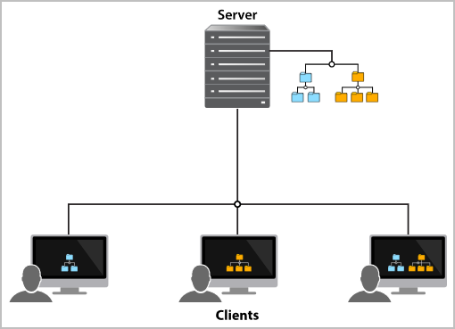
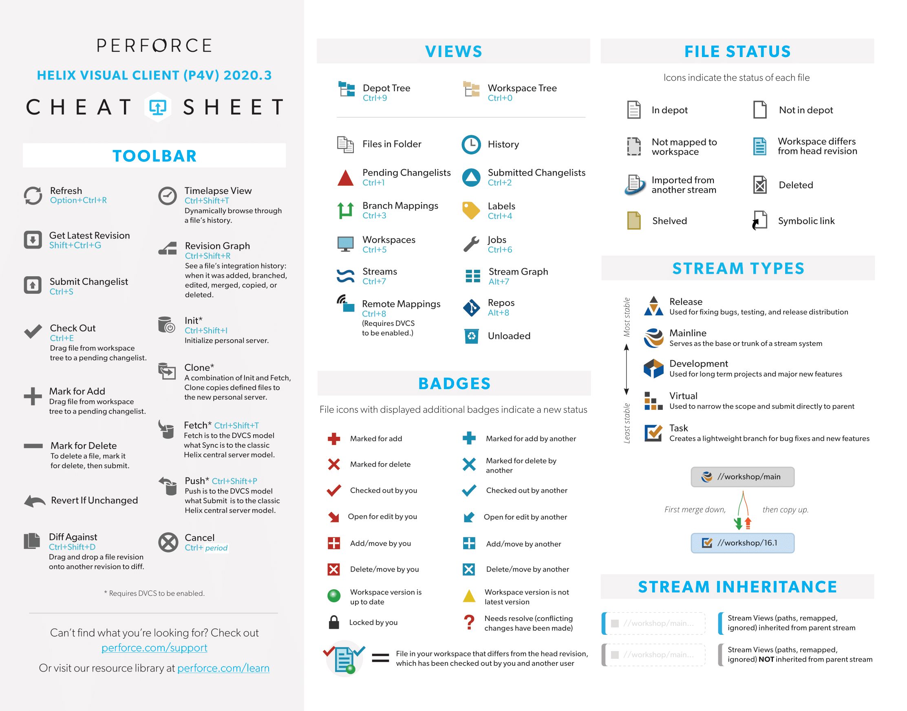
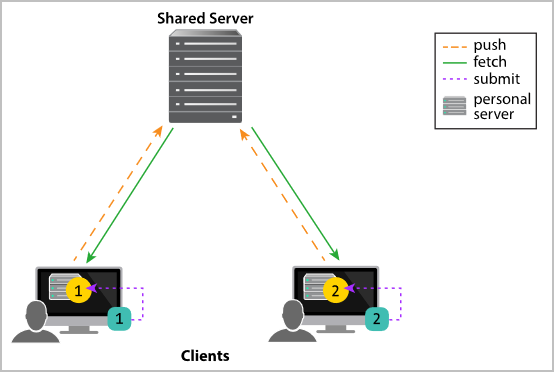



 es la compañía que desarrolla , un sistema de control de versiones ---en inglés, *Version Control System* o VCS--- que escala muy bien para manejar proyectos y equipos realmente grandes (véase la @fig-helix-code-scalability).

 --- Robert Cowham.](figures/helix_core_scalability.jpg){#fig-helix-code-scalability}

Como el nombre original de Helix Core era Perforce Helix, en muchos foros, manuales y aplicaciones se sigue denominando a este VCS simplemente como Perforce.

A diferencia de lo que ocurre con Git, Perforce puede gestionar adecuadamente tanto archivos de código fuente como binarios ---no porque sepa resolver conflictos e integrar diferencias, sino porque facilita su bloqueo mientras trabajamos en ellos---.
Por eso en su [lista de clientes](https://www.perforce.com/customers) vemos compañías de industrias muy diversas, que generalmente utilizan este software para guardar en un solo sitio todos los documentos de sus proyectos: código fuente, ejecutables, configuraciones, imágenes, vídeos, texturas, modelos, planos, manuales, diseños, conjuntos de datos, etc.

En lo que respecta a la industria del videojuego, Perforce ha llegado a afirmar que 18 de las 20 principales empresas editoras de videojuegos utilizaban su software[@Perforce18Publishers], incluyendo Ubisoft y EA.
Perforce tiene algunas guías y vídeos[@PerforceGameDevProcess] sobre cómo utilizan sus productos los estudios más conocidos y cómo se integran con los motores de videojuegos y herramientas de diseño más comunes.

# Git en proyectos grandes

Git es actualmente el VCS por excelencia y, obviamente, se puede utilizar sin problemas en proyectos bastante grandes.
Por ejemplo, veamos el tamaño y los tiempos ---obtenidos sin ningún rigor, desde mi propia casa--- para algunos proyectos conocidos:

| **Proyecto**          | **Tamaño del proyecto** | **Tamaño del repositorio** | **Tiempo de clonado** |
|-----------------------|-------------------------|----------------------------|-----------------------|
| **Kernel Linux**      | 1.1 GiB                 | 4.0 GiB                    | 5:45 min              |
| **Unreal Engine 4**   | 1.7 GiB                 | 4.4 GiB                    | 10:13 min             |

: Tiempos y tamaños de los repositorios Git de algunos proyectos conocidos.

La diferencia entre el tamaño del proyecto y el tamaño real del repositorio se debe a que Git es un VCS descentralizado.
Cada vez que se clona un repositorio se crea una copia completa, con todo el historial de cambios desde el principio.
Por eso, por ejemplo, el proyecto de Unreal Engine 4 necesita 1.7 GiB, pero el repositorio completo clonado ocupa 4.4 GiB.

::: {.callout-note}
Aunque Unreal Engine está disponible en GitHub, los desarrolladores de Epic Games no trabajan directamente en ese repositorio.
Epic Games usa internamente Perforce para desarrollar Unreal Engine y traslada a GitHub las versiones definitivas de su motor.
Aquellos estudios que licencian Unreal Engine pueden obtener acceso a parches y a las últimas versiones del código fuente del motor a través del servidor Perforce de Epic Games.
:::

Como se puede observar, los tiempos de clonado son relativamente largos.
A mas historial tenga el proyecto, más ocupará cada copia del repositorio y más tiempo tarda en clonarse.
Si esto se volviera un problema, Git permite limitar la antigüedad del historial que se clona.
Sin embargo, como Git solo almacena las diferencias entre una revisión y la siguiente, hacen falta muchos años de desarrollo y muchas revisiones para tener que llegar a eso.

Todo eso cambia cuando una revisión no se puede guardar como una diferencia, sino que es necesario guardar el archivo completo.
Cosa que ocurre cuando se quiere utilizar el VCS para controlar las versiones de archivos en formatos binarios.
En ese caso, almacenar cada revisión necesita más espacio y la diferencia entre el tamaño del repositorio y el proyecto real crece muy rápidamente.

Podríamos pensar que esto no es común en proyectos de software.
Pero si vemos la lista de clientes de Perforce nos saltarán nombres como Honda, Nvidia, Boeing o Verizon.
Estas compañías muchas veces no solo quieren controlar las versiones de código fuente, sino también incluir documentos de diseño, manuales, planos, etc.
Incluso los binarios compilados más recientes, para facilitar la realización de pruebas sobre el producto.

En Git esto se resuelve utilizando una extensión llamada .
Con ella los binarios no se clonan con el repositorio, sino que se almacenan en un servidor central del que se copia solo la versión más reciente.
Así se evita que cada desarrollador tenga que guardar una copia de todas las revisiones para cada archivo de este tipo.
Además, esto resuelve otro problema, que es el de la colaboración al modificar al mismo tiempo archivos binarios.

Cuando varios desarrolladores modifican un archivo binario, no es posible integrar los cambios de cada uno y que todos queden contentos.
En su lugar, una de las versiones va a reemplazar a la versión actual y el resto de los cambios se perderán.
Como Git LFS usa un servidor central, es posible bloquear el acceso a estos archivos mientras se está trabajando en ellos, informado a otros desarrolladores de lo que ocurre y evitando que puedan hacer cambios en los archivos al mismo tiempo.

Sin Git LFS, trabajar en Git con proyectos grandes que contengan binarios, como es el caso de los videojuegos, es realmente complicado.

# VCS centralizado frente a distribuido

Podemos clasificar los VCS de la siguiente manera:

- **Centralizados**: donde existe un repositorio central con todo el proyecto y los clientes se conectan a él para descargar versiones concretas, subir revisiones, etc.
Los VCS anteriores a Git, como CVS o Subversion eran de este tipo.
Y, como hemos comentado, esta es la forma de trabajar de Git LFS.

- **Distribuidos**: donde cada usuario tiene su propia copia del repositorio y pueden intercambiar revisiones entre ellos.
Lo normal es que en algún sitio haya un servidor remoto que haga de punto de sincronización de los repositorios de cada uno de los usuarios.
Es el caso de Git y de Mercurial.

## Ventajas de los VCS distribuidos

Los VCS distribuidos como Git se han impuesto a los centralizados porque entre otras cosas:

- No hace falta estar conectado a la red para trabajar con el VCS.
Ni tampoco ocurre nada si el servidor remoto cae.

- Como cada repositorio es una copia del proyecto, por lo que existen múltiples réplicas, lo que reduce las posibilidades de perder datos.

- Ofrece a los desarrolladores la libertad de trabajar de forma independiente y experimental, para luego solo subir los cambios relevantes para el resto del equipo.

- El servidor remoto necesita menos recursos, ya que la mayor parte del trabajo se hace en los repositorios locales.

Sin embargo, por lo que hemos comentado al hablar de los problemas de Git, no son los mas adecuados en proyectos grandes, donde sea necesario controlar también revisiones de archivos en formato binario.
Por eso, hasta hace bastante poco era común encontrar estudios que seguían usando Subversion, un VCS centralizado.

## Ventajas de Perforce

Perforce es un VCS centralizado, por lo que escala mucho mejor que Git en proyectos grandes.
En el servidor central se almacenan los distintos repositorios mientras que los clientes tienen espacios de trabajo donde se descargan únicamente los archivos del repositorio en la revisión que nos interese de histórico para trabajar.

::: {.callout-note}
Como Git es tan popular entre los desarrolladores, existe un producto llamado  que se adquiere aparte.
Permite a los desarrolladores utilizar Git sobre un servidor Perforce, de tal forma que se obtiene una solución que escala mucho mejor que los servidores Git usados frecuentemente, sin que los desarrolladores tengan que aprender a usar una herramienta diferente.
:::

Perforce permite configurar servidores en clúster, ya sea para repartir la carga de trabajo entre servidores o para ofrecer alta disponibilidad en modo primario / réplica.
También permite tener servidores repartidos en distintas sedes, para que los equipos en ellas trabajen de forma independiente, y sincronizar los cambios periódicamente.

# VCS basado en *snapshots* frente a *changesets*

Otra forma de clasificar los VCS es según el modelo en el que se basan:

- **Snapshots**: donde el VCS maneja los archivos completos ---probablemente con optimizaciones para reducir el espacio ocupado---.
Este es el modelo de Git, que calcula las diferencias a demanda y las almacena como forma de optimizar, pero cuyo modelo se basa en trabajar con archivos completos.

- **Changesets**: donde el VCS solo maneja diferencias entre revisiones.
Darcs, Perforce, Mercurial y muchos otros son de este tipo.

Esta diferencia, si se aprovecha, es importante desde el punto de vista de lo bien que se integran las ramas en un *merge* y cómo se resuelven los conflictos.
En este sentido, los VCS basados en *changesets* suelen hacerlo mejor que los basados en *snapshots*.

# Conceptos básicos

El VCS de Perforce utiliza una arquitectura cliente-servidor.
Esto quiere decir que Perforce necesita un servidor que aloja los repositorios con los archivos de los proyectos.
Y que cada usuario tiene que tener un cliente en su ordenador que se conecta a ese servidor para descargar los archivos y subir revisiones, tras haberlos modificado.



## Servidor Perforce

En un mismo servidor puede haber varios repositorios, llamados *depots*.
El administrador del servidor tiene control total sobre los permisos de cada usuario en cada *depot*.
Incluso puede establecer permisos según la ruta de archivos y directorios, usando  con comodines.

| **Expresión**          | **Descripción**                                                                      |
|------------------------|--------------------------------------------------------------------------------------|
| `//project/…​`          | Todos los archivos en el *depot* `project`.                                          |
| `//project/…​/help`     | Todos los archivos llamados `help` en cualquier subdirectorio del *depot* `project`. |
| `//…​`                  | Todos los archivos en cualquier *depot*.                                             |
| `//…​/J*`               | Todos los archivos que empiezan por `J` en cualquier *depot*.                        |

: Ejemplos de especificadores de ruta en Perforce.

Actualmente hay servidor de Perforce para Linux, Windows y macOS.
Los clientes y servidores de distintas plataformas pueden comunicarse sin problemas, pero hay que tener en cuenta las diferencias entre plataformas en cuanto a codificación de caracteres sensibilidad a mayúsculas y minúsculas.
Por eso, al instalar el servidor es importante configurarlo adecuadamente, tomando en consideración los sistemas que utilizarán los clientes.

## Clientes de Perforce

Perforce tiene una lista bastante extensa de clientes:

| **Nombre**                                                  | **Descripción**                                                     |
|-------------------------------------------------------------|---------------------------------------------------------------------|
| Helix Admin Tool (P4Admin)                                  | Herramienta de escritorio para la administración del servidor.      |
| Helix Command-Line Client (P4)                              | Cliente de línea de comandos. Se utiliza ejecutando `p4 <comando>`. |
| Helix Visual Client (P4V)                                   | Cliente de escritorio.                                              |
| Helix Plugin for Visual Studio (P4VS)                       | Plugin para Visual Studio.                                          |
| Helix Plugin for File Explorer (P4EXP)                      | Plugin para el explorador de Windows.                               |
| Helix Plugin for Eclipse (P4Eclipse)                        | Plugin para Eclipse.                                                |
| Helix Plugin for Graphical Tools (P4GT)                     | Plugins para Photoshop, 3ds Max y Maya.                             |

: Lista de clientes de Perforce

Algunas herramientas vienen con soporte integrado de Perforce, aunque por lo general es necesario tener instalado P4 o P4V para poder usarlo.
Por ejemplo: , ,  o .

## Espacios de trabajo (*Workspaces*)

Los clientes necesitan un espacio de trabajo o *workspace*.
Un *workspace* es una especificación que indica qué archivos de un *depot* en el servidor nos interesan y dónde se almacena las copias de esos archivos en el sistema del cliente.
Respecto a los *workspace* debemos tener en cuenta que:

- Con la ayuda de  podemos seleccionar directorios y archivos concretos para el *workspace*.
No es necesario descargar el *depot* completo, como ocurre con otros VCS.

- Solo el contenido de los archivos en la revisión que nos interese ---por lo general, la última---.
Se puede pedir al servidor cualquier revisión, pero no se descarga todo el historial, como ocurre en Git y otros VCS distribuidos.

- Los archivos descargados se marcan, generalmente, como de solo lectura.
Para modificar un archivo debemos indicar al cliente nuestra intención mediante la acción  de P4V o el comando `p4 edit`.
Esto permite al cliente comprobar con el servidor si el archivo está bloqueado y, si es necesario, bloquearlo antes de permitir su edición.

::: {.callout-note}
Por lo general, cada acción pedida al cliente debe trasladarse al servidor, por lo que puede parecer que el cliente no responde, si hay problemas de red.
:::

## Listas de cambios (*changelists*)

Las modificaciones realizadas en los distintos archivos en el *workspace* se agrupan en listas de cambios o *changelists*.
Se pueden tener varias *changeLists* abiertas al mismo tiempo, de tal forma que se pueden ir agrupando cambios relacionados en distintas *changelists*.
Al terminar, cada *changelists* se consolidan en una revisión diferente mediante la acción .

## Operaciones comunes {#_operaciones_comunes}

En el vídeo-tutorial *«Uso básico de Perforce»* se explica cómo conectar a un servidor de Perforce y se repasan brevemente las acciones más básicas[@Torres2021Perforce].
Para conocer más del VCS de Perforce, lo recomendable es consultar el manual de P4V[@PerforceP4VUserGuide].

{#fig-perforce-helix-cheatsheet}

En la [@fig-perforce-helix-cheatsheet] se puede ver un resumen de las acciones más comunes en el cliente de escritorio P4V.
Se trata de una hoja de referencia rápida, extraída de la que ofrece Perforce en su web[@PerforceCheatSheet].
El documento completo también incluye una referencia de los comandos del cliente de línea de comandos P4.
Además, Perforce también ofrece algunas guías para quiénes están familiarizados con Git[@PerforceGitCommandMappings y @PerforceTopGitCommands].

# Gestión de tipos de archivo

Una de las características clave de Perforce es la gestión tan flexible que tiene de los tipos de archivo.

Los VCS que deben trabajar con archivos binarios ---que se guardan completos y no se pueden combinar cambios--- y archivos de texto ---de los que solo se guardan las diferencias--- debe saber distinguir un tipo del otro.
Para esto cada VCS usa sus propias heurísticas pero, como pueden equivocarse, es buena idea disponer de algún mecanismo para indicar cómo debe ser tratado cada archivo según su extensión o la ruta dónde está ubicado.

Esto en Git se hace con un archivo `.gitattributes` que debe incorporarse al repositorio.
Mientras que en Perforce se configura en el servidor ejecutando el comando `p4 typemap`.

La configuración de tipos de archivo en Perforce es mucho más potente que en Git.
Para mostrarlo vamos a ver un ejemplo de posible configuración para alojar proyectos de Unreal Engine:

```
# Perforce File Type Mapping Specifications.
#
#  TypeMap:     a list of filetype mappings; one per line. 
#               Each line has two elements:
#
#               Filetype: The filetype to use on 'p4 add'.
#
#               Path:     File pattern which will use this filetype.
#
# See 'p4 help typemap' for more information.

TypeMap:
        binary+S2w //depot/....exe 
        binary+S2w //depot/....dll
        binary+S2w //depot/....lib
        binary+S2w //depot/....app
        binary+S2w //depot/....dylib
        binary+S2w //depot/....stub
        binary+S2w //depot/....ipa
        binary //depot/....bmp
        binary //depot/....png 
        binary //depot/....tga
        binary //depot/....raw
        binary //depot/....r16
        binary //depot/....mb
        binary //depot/....fbx
        text //depot/....ini
        text //depot/....config
        text //depot/....cpp 
        text //depot/....h
        text //depot/....c
        text //depot/....cs
        text //depot/....m
        text //depot/....mm
        text //depot/....py
        binary+l //depot/....uasset 
        binary+l //depot/....umap
        binary+l //depot/....upk
        binary+l //depot/....udk
```

- Los comentarios comienzan con el caracter `'#'`.
Perforce los añade para documentar el formato que espera para esta configuración.

- En cada línea se indica el tipo de archivo seguido por el patrón de la ruta para identificar a los archivos de este tipo.
En este caso se indica que son binarios todos los archivos con extensión `.png` en cualquier subdirectorio del *depot* de nombre `depot`.
Estos archivos se guardarán completos.

  Por la extensión se ve que estos archivos son texturas y modelos en el formato original, antes de importarlos en el proyecto.
Se guardan en el proyecto para preservarlos, por si en el futuro hay que modificarlos y volver a importar.

- Los archivos con extensión `.cpp` son archivos de texto.
De estos archivos sólo se guardarán las diferencias entre cada revisión.

- Los archivos con extensión `.uasset` ---archivo de recursos en el editor--- y `.umap` ---archivo de escena--- también son binarios, pero en el momento que un cliente los abra para editar, automáticamente quedará bloqueada la edición para el resto de clientes ---por eso el `+l`---.

  A diferencia de los binarios mencionados anteriormente, estos corresponden a recursos ya importados en el proyecto.
Sin el bloqueo, podrían ser editados al mismo tiempo desde varios editores de Unreal Engine al mismo tiempo, lo que crearía un conflicto que sería muy difícil de resolver.

- Los archivos con extensión `.exe` también son binarios, pero solo se almacenan en el VCS las dos últimas revisiones ---el `+S2`--- y el archivo siempre puede ser modificado por el cliente ---el `w`---.

El ejemplo de cómo tratar los ejecutables `.exe` es un caso interesante por varios motivos:

- Por defecto Perforce crea los archivos en el *workspace* donde estamos trabajando en modo solo lectura.
Así nos obliga a usar  ---o el comando `p4 edit`--- antes de intentar modificar cualquier de ellos.
El comando  notifica al servidor nuestra intención de modificar el archivo, bloqueándolo automáticamente en caso de que esté configurado así en el *typemap*, y cambia los atributos del archivo para permitir su modificación.

  Con los ejecutables se quiere que cualquier desarrollador pueda compilar el proyecto y sobrescribir su copia local del ejecutable, sin restricciones y sin bloquear el archivo a otros desarrolladores.
Por eso no se pone `l` para forzar el bloqueo y sí se indica `w`, para que estos archivo en el *workspace* tengan permisos de escritura por defecto.

- Los binarios se incluyen en el control de versiones porque así el departamento de garantía de calidad y otros miembros del equipo pueden probar el desarrollo rápidamente.
Pero teniendo las fuentes del proyecto en el VCS, no parece necesario guardar todas las revisiones del ejecutable.
Por eso hemos optado por guardar solo las dos últimas revisiones.

En el caso de Unity, los archivos de recursos en su formato original si se deben bloquear, porque el editor de Unity los necesita para regenerar el contenido del directorio `Library` ---que nunca debe incluirse en el repositorio--- donde se guardan convertidos en un formato interno adecuado para el motor[^1].

[^1]: Véase [Unity - Behind The Scenes](https://docs.unity3d.com/2019.1/Documentation/Manual/BehindtheScenes.html) para conocer más detalles sobre el proceso de importación de recursos.

Es decir, Unreal Engine no necesita los archivos originales.
Una vez los hemos importado, el editor trabaja sobre las versiones importadas.
Mientras que en Unity los archivos originales forman parte del proyecto y se reimportan automáticamente cada vez que los modificamos o abrimos el proyecto por primera vez.

En el repositorio  ull-master-videojuegos/perforce-typemaps[@Torres2021PerforceTypemaps] se puede encontrar este mismo ejemplo de archivo de configuración de tipos tanto para Unreal Engine como para Unity.

# Perforce Streams

Merece la pena mencionar una característica avanzada de Perforce llamada *streams*.

Obviamente Perforce soporta ramas, como muchos otros VCS, pero le han dado una vuelta de tuerca al concepto al desarrollar los *streams*.
Los *streams* son ramas que incluyen reglas que definen cómo se pueden manipular los archivos, incluyendo cómo se mueven los cambios en los archivos entre *streams*.

En el video-tutorial *«Streams Overview»* se explica en detalle su funcionamiento[@PerforceStreams], pero vamos a resumir brevemente sus principales características:

- Los *streams* se organizan en árbol.

- En la raíz del *depot* está el *stream mainline*, que hace la función de la rama *master* en Git.

- De *mainline* cuelgan los *streams release*, cuyo contenido es más estable que el de su padre.
Se crean cuando llega el momento de publicar una versión del producto.
Se hacen cambios directos en ellas para resolver errores en versiones ya publicadas que generalmente, después se integran en el padre con **merge**.

- De *mainline* cuelgan también los *streams development* cuyo contenido es menos estable que su padre.
Son los *streams* donde ocurre el desarrollo de nuevas funcionalidades.
Se espera que se integren cambios con **merge** desde el padre, pero que a su vez se copien cambios desde los *streams* hijos de desarrollo hacia arriba.

Una característica interesante es que se pueden crear *streams virtuales* para filtrar los archivos que ven los clientes de Perforce y los que pueden modificar.
Por ejemplo, se puede crear un *stream* para el departamento de arte que les permita modificar los recursos del proyecto, pero no tocar los archivos de código fuente.
O crear una rama donde solo se puede trabajar en el código del motor para actualizar la versión, sin tocar el resto del proyecto.

::: {.tip}
Merece la pena ver el webinar *«Best Practices for Game Development Using Streams»* para entender mejor cómo se pueden aprovechar las características de los *streams*[@PerforceStreamsBestPractices].
En el webinar, el estudio Sumo Digital explica cómo los usan ellos en sus proyectos con Unreal Engine.
:::

# Trabajando offline

Puesto que Perforce es un VCS centralizado, se da por supuesto que trabajamos conectados permanentemente al servidor para mantener sincronizado el estado de los archivos.
Esto no es un problema si trabajamos desde una oficia con el resto del equipo, pero presenta algunos inconvenientes para trabajar remotamente o con nuestro portátil desde cualquier ubicación.
Por eso Perforce soporta tanto mecanismos para trabajar *offline* como para usarlo de forma distribuida.

Si por cualquier razón queremos trabajar sin conexión con el servidor Perforce, podemos darnos permisos de escritura en los archivos y editarlos libremente.
Cuando queramos incorporar los cambios al servidor, solo tenemos que abrir el cliente P4V y en el *workspace* hacer clic con el botón derecho del ratón en la carpeta que contiene los archivos y elegir la opción **Reconcile Offline Work**.
P4V comparará el *workspace* con el *depot* y nos mostrará los archivos nuevos y modificados, para que indiquemos qué queremos incorporar[@PerforceReconcile].

La otra alternativa es trabajar de forma distribuida, de manera similar a como se trabaja con Git.
La instalación del cliente de Perforce incluye un servidor personal que se puede utilizar tanto para trabajar de forma aislada en proyectos personales, como para trabajar en proyectos colaborativos de forma distribuida.
Todos los detalles de esta forma de trabajar se explican con detalle en *«Using Helix Core Server for Distributed Versioning»*[@PerforceDVCS].



En este caso:

1. Se clonan con **Clone** la ruta que nos interesa del servidor compartido en el servidor personal, para trabajar en los archivos de manera aislada.

  Esto crea un *remote mapping* en el servidor personal.
  Los *remote mappings* definen cómo se mapean las rutas en dicho servidor con las del servidor compartido.
  Se pueden crear reglas complejas para solo mapear un subconjunto de los archivos, en lugar de descargar todos ---como ocurre en Git---.

1. En el servidor personal se trabaja con normalidad, usando  antes de modificar los archivos y  para guardar una nueva revisión con los cambios.

1. Una vez se ha terminado de trabajar en los archivos, se envían los cambios al servidor compartido usando .

1. Se debe usar  periódicamente para traer al servidor personal las actualizaciones realizadas por otros colaboradores en el servidor compartido.

Uno de los inconvenientes de trabajar de forma distribuida es que ni Unity ni Unreal Engine soportan trabajar con el servidor personal.
Esto es debido a que este servidor no «escucha» en la red, sino que cada comando del cliente lanza un programa que manipula directamente el sistema de archivos local.

Para utilizar el modo DVCS con estos motores, o instalamos y usamos localmente un servidor de Perforce P4S completo o hacemos accesible nuestro servidor personal, a través de `localhost`, ejecutando el siguiente comando:

```powershell
> p4d -r "X:\Ruta hasta\.p4root\en el servidor personal" -p 1666
```

# Perforce en un estudio *indie*

Aunque Perforce es una herramienta ideal para proyectos grandes, hay que reconocer que algunas de sus características pueden ser interesantes para cualquier estudio *indie*.

Perforce es gratuito para hasta 5 usuarios.
Los estudios *indie* pueden pedir también acceso gratuito para hasta 5 usuarios al software de gestión de proyectos Handsoft y precio especial para más de 5 usuarios a través del Perforce Indie Studio Pack[@PerforceIndieStudioPack].

# Referencias

::: {#refs}
:::