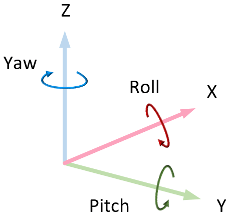
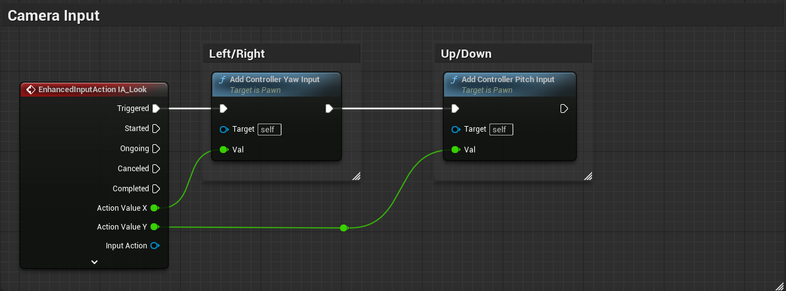
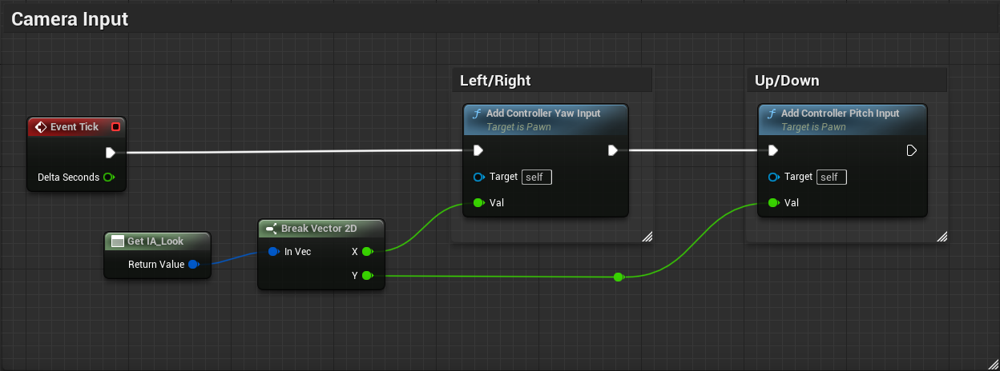



Los motores de videojuegos ofrecen componentes y servicios comunes que puede necesitar cualquier aplicación multimedia interactiva: *render*, iluminación, lectura de la entrada y creación de interfaces de usuario, simulación física, efectos visuales, sistemas de animación, gestión de recursos, carga y almacenamiento de datos, etc.
Sin embargo, desde el punto del vista del desarrollo, esto no es suficiente para hacer un videojuego.

Sobre los componentes y sistemas proporcionados por el motor se suele desarrollar una arquitectura software adecuada para el tipo de juego que se quiere desarrollar, denominada *gameplay framework*.
El objetivo de estos componentes es facilitar la implementación de las mecánicas del juego, de forma que el código sea fácil de mantener y extender. 
Además, se suelen desarrollar a lo largo de diferentes proyectos de un mismo estudio, de forma que se van mejorando y adaptando a las necesidades de cada uno, y ayuda a reducir el tiempo de desarrollo.

Por lo general, los motores de videojuegos generalistas no ofrecen un *gameplay framework* predefinido, sino que cada estudio desarrolla el suyo propio, adaptado a sus necesidades y al tipo de juegos que desarrolla.
Sin embargo, el motor Unreal Engine sí ofrece un *gameplay framework*[@UnrealGameplayFramework], muy orientado al tipo de juegos que hace Epic Games ---es decir, videojuegos de acción competitivos en primera o tercera persona---.

A continuación veremos qué nos ofrece este *gameplay framework*, puesto que se trata de un buen ejemplo de cómo organizar el código de un videojuego y nos puede ofrecer ideas que podemos trasladar a otros motores ---como Unity o Godot--- o a otro tipo de juegos.

# Antes del Gameplay Framework

Antes de hablar del *gameplay framework* de Unreal Engine, vamos a discutir los componentes básicos del motor, sobre los que se implementa el *framework*.

## *UObject*

Un **UObject** es la clase base de todos los objetos de Unreal Engine y dota a los objetos de características similares a las que tienen los objetos en muchos lenguajes gestionados ---como C# o Java---.
Por ejemplo, gestión automática de memoria, mediante el uso de un recolector de basura, serialización o reflexión.

## *World* (`UWorld`)

Un **World** es el objeto de Unreal Engine que representa el mundo del juego y contiene todos los objetos que existen en él.
Por tanto, por lo general, solo hay existe una instancia de **World** al mismo tiempo, excepto cuando tiene lugar una transición fluida entre nivel, en cuyo caso existen dos instancias de **World** simultáneamente: la del nivel que se está descargando y la del que se está cargando.

La clase **World**, por ejemplo, contiene los métodos para instanciar objetos en el nivel y para consultar la geometría del nivel mediante *raycasts* y barrido de formas.

## *Actor* y *ActorComponent* (`AActor` y `UActorComponent`)

Un **Actor** es un objeto que existe en el mundo del juego y, por tanto, que puede ser instanciado en un **World**.
Las características y funcionalidades de un **Actor** se implementan mediante composición, añadiéndole uno o varios **ActorComponent**.

Unreal Engine proporciona múltiples **ActorComponent**, para implementar diferentes funcionalidades comunes en los juegos.
Algunos **ActorComponent** tienen representación en el nivel ---como mallas, colisiones o partículas--- mientras que otros implementan conceptos abstractos ---como el movimiento del actor, el control de cámara o la entrada del usuario---.

:::{.callout-note}
Aunque la norma sea que son los objetos **Actor** los que se colocan en el mundo, realmente es posible instanciar **ActorComponent** directamente en el nivel.
Usar `NewObject<MyActorComponent>()` con `nullptr` como **Actor** padre, hace que se cree un **ActorComponent** independiente, que no está asociado a ningún **Actor**.
Estos componentes no son guardados ni replicados y no reciben eventos como `BeginPlay()` o `TickComponent()`.
Algunos **ActorComponent** a veces se usan de esta manera, como **AudioComponent** cuando se crea desde `UGameplayStatics::SpawnSoundAtLocation()`.
:::

## *GameInstance* (`UGameInstance`)

Un **GameInstance** es el principal objeto *manager* de un juego en Unreal Engine. 
Se instancia al inicio del juego y se destruye al finalizar, por lo que suele usarse para alojar código y datos globales, que deban persistir entre la carga de niveles, como: los inventarios y las habilidades de los personales o la configuración del juego.

Para personalizarlo se hereda de la clase **GameInstance**, se le añaden las propiedades y el código necesario y, finalmente, se indica la nueva clase heredada en **Project Settings... / Project - Maps & Modes / Game Instance Class**.


En proyectos grandes, para respertar el *principio de responsabilidad única*[@WikipediaSRP] y evitar que la clase **GameInstance** se convierta en un *objeto todopoderoso*[@WikipediaGodObject], se suele dividir la funcionalidad en diferentes clases heredadas de **UObject**, que se instancian y referencian en propiedades del **GameInstance**.
De esta forma, son fácilmente localizables para el resto de componentes del juego a través del objeto **GameInstance**, que se puede obtener mediante la función `Get Game Instance` en Blueprint o el método `UWorld::GetGameInstance()` en C++.

Sin embargo, desde Unreal Engine 4.22, se recomienda usar *subsistemas* para implementar funcionalidades globales del juego, que antes se implementaban en **GameInstance** (ver la @sec-subsystems).

## *UEngine*

El objeto del motor, encargado de gestionar los componentes principales del sistema.
Entre otras cosas, se encarga de gestionar el **World** y de crear y destruir los **GameInstance**, así como notificarles los *tick*.

En C++ se obtiene acceso global a este objeto mediante la variable estática `GEngine`.

## *GameViewportClient* y *LocalPlayer* (`UGameViewportClient` y `ULocalPlayer`)

La clase **GameViewportClient** es la interfaz del motor a la ventana de juego y a los sistemas de gráficos, audio y entrada de la plataforma dónde se ejecuta el motor.

Por lo general, el motor solo crea una instancia de **GameViewportClient**.

La instancia de **GameViewportClient** también mantiene una lista de **LocalPlayer**, que son los objetos que representan jugadores de la máquina local y guarda información especifica de estos.

Por lo general, solo hay un **LocalPlayer** por jugador, pero puede haber varios en el caso de juegos multijugador de pantalla dividida.
En este caso, el **GameViewportClient** gestiona cómo se dibujan y se organizan las vistas de los distintos **LocalPlayer** en la pantalla.

Cuando **GameViewportClient** procesa eventos de la entrada del jugador, estos son entregados a las clases del *gameplay framework* para su interpretación.
La información de los **LocalPlayer** permite al **GameViewportClient** determinar que actor se hará cargo de procesar los eventos.

## Como arranca un juego

Al lanzar el ejecutable de un juego desarrollado con Unreal Engine desde la interfaz del sistema operaitvo:

1. Se ejecuta el código de inicialización del motor, que crea el objeto **UEngine** y llama al método `UEngine::Init()`.

2. `UEngine::Init()` inicializa el **GameInstance** y llama al método `UGameInstance::Init()`

3. Se llama a `UEngine::Start()` que llama a `UGameInstance::StatGameInstance()`, que crea el **World** inicial.

4. *Inicializaciones relacionadas con el gameplay framework que veremos más adelante*.

5. **UEngine** hace *tick* al **GameInstance** y al **World** para animar el juego.

# Gameplay Framework

Con los componentes básicos comentados hasta el momento se puede implementar un juego, pero no es lo más sencillo.
Por eso Unreal Engine incluye *gameplay framework*, prescribiendo ciertas decisiones sobre la arquitectura software y facilitando la implementación de los juegos.

## *GameMode* y *GameState* (`AGameMode`)

**GameInstance** es un buen lugar para guardar datos globales del juego, pero no es el lugar adecuado para implementar lógica específica del nivel.
Para ello, Unreal Engine ofrece las clases **GameMode** y **GameState**, que son instanciados por el objeto **Word** al cargar un nivel y se destruyen al cargar otro.

### *GameMode* (`AGameMode`)

**GameMode** es un actor pensando para contener el código con las reglas específicas del nivel, como por ejemplo: el número de jugadores, las condiciones para ganar, las reglas para hacer aparecer o reaparecer a los jugadores, cuándo se puede pausar la partida y qué ocurre cuando se pide, la transición a otros niveles, etc.

:::{.callout-note}
Es el primer actor que recibe la llamda `BeginPlay()` tras cargar el nivel.
:::

La clase **GameMode** por defecto se indica en las propiedades del proyecto, en **Project Settings... / Project - Maps & Modes / Game Mode Override**, pero se puede cambiar en cada nivel, en la propiedad **World Settings / Game Mode Override**.

// TODO: Se indican en la conf del nivel. Imagen

Por tanto, es posible y recomendable tener diferentes clases **GameMode** para cada nivel si hay diferentes modos de juego, en lugar de una única clase para todo el juego.
Probablemente, heredando de una clase base común para todos los niveles, que implemente la funcionalidad común a todos ellos.

Por ejemplo, si el juego tiene un modo historia y un modo multijugador, se puede tener una clase **GameMode** para cada uno de ellos, que herede de una clase base que implemente la funcionalidad común a ambos.
Igualmente, es común tener un nivel solo para el menú principal del juego, con su propia clase **GameMode**.

:::{.callout-tip}
La clase `AGameMode` que se incluye en Unreal Engine implementa el comportamiento esperable de un juego multijugador competitivo.
Si se trabaja en otro tipo de juego, es mejor comenzar heredando de `GameModeBase`, que también es la clase base de `GameMode`.
:::

// TODO Ejemplo de GameModeBase y de herencia para varios casos.

Igual que en el caso del **GameInstance**, para evitar que la clase **GameMode** se convierta en un *objeto todopoderoso*[@WikipediaGodObject], se suele dividir la funcionalidad en diferentes clases.
Como **GameMode** es un actor, se pueden añadir **ActorComponent** para implementar diferentes aspectos del juego.
Si no estamos interesados en los eventos de ciclo de vida de los actores y componentes ---como `BeginPlay()` o `TickComponent()`--- también se pueden usar clases **UObject**, referenciadas desde propiedades del **GameMode**.

Además, desde Unreal Engine 4.24, también se puende implementar *subsistemas* que comparten su tiempo de vida con un objeto **World**, por lo que también son interesantes para implementar funcionalidades especificas de un nivel.

### *GameState* (`AGameState`)

Es un actor pensado para almacenar los datos que describen el estado de la partida, como: puntuaciones, lista de jugadores, objetivos cumplidos, etc.

Sea cual sea el motor de videojuegos, separar el códido del juego del estado de la partida facilita la implementación de diferentes funcionalidades:

* Sincronización de los datos del juego en juegos multijugador online.
En un juego multijugador online, la lógica con las reglas de la partida debe ejecutarse únicamente en el servidor para evitar las trampas.
Los datos del juego también deben almacenarse en el servidor, pero al mismo tiempo es necesario mantener una copia sincronizada en cada cliente.

* Mecanismo de salvado de la partida.
En general, separar la lógica de los datos facilita poder almacenar estos últimos para salvar y recuperar el estado del juego (véase la @sec-savegame).

Lo primero es exactamente para lo que Unreal Engine usa **GameState**.
El actor **GameMode** solo existe y se ejecuta en el servidor, mientras que **GameState** y **PlayerState** ---del que hablaremos más adelante--- contienen datos que se replican automáticamente en los clientes.

:::{.callout-note}
Tanto **GameState** como **PlayerState** son actores porque, básicamente, es un requisito para que estos objetos sean replicados en los diferentes clientes en juegos multijugador online.
:::

No se recomienda guardar directamente en **GameState** datos específicos de cada jugador ---como el nombre, el nivel de salud o la puntuación específica de cada jugador--- sino solo datos generales del estado del juego.
Como veremos más adelante, **GameState** gestiona una instancia de **PlayerState** para cada jugador, que es donde se deben almacenar los datos específicos de cada uno.
El **PlayerState** de cada jugador también es accesible a través de su controlador del personaje.

### Separación de responsabilidades entre *GameInstance* y *GameMode*

La separación entre **GameMode** y **GameInstance** permite tener diferentes clases **GameMode** con distintas reglas para cada nivel.
Incluso si en todos los niveles se usa la misma clase **GameMode**, es común emplear un nivel solo para el menú principal del juego, de forma que la lógica del menú puede estar en su propio **GameMode**, separado de la lógica de los niveles jugables.

En este sentido, los **GameMode** hacen de *game / level manager*[^gamemanager].
Mientras que **GameInstance** sirve para preservar información entre partidas, como el número de victorias de cada equipo ---por ejemplo, para enfrentamientos del tipo «el mejor de X partidas»--- los inventarios, las habilidades o la configuración del juego y de los personajes.

En juegos multijugador online hay un **GameInstance** independiente en el servidor y en cada cliente.
Como no se sincroniza la información entre ellos ---puesto que el **GameInstance** no es un actor sino un **UObject**--- puede ser necesario copiar en el servidor parte de la información de **GameInstance** a **GameState** o **PlayerState** ---según corresponda--- al cargar un nuevo nivel para que esté disponible en los clientes.

[^gamemanager]: El *game manager* es un tipo especial de *manager* dedicado a llevar el flujo del juego: carga de escenas y transiciones, activación de modos de menús y pausa, etc.
Puede usarse para guardar referencias a otros componentes a los que se necesita acceder globalmente, evitando tener que buscar entre todas las entidades del juego cada vez que los necesitamos.
En juegos relativamente grandes, el *game manager* se usa para implementar aspectos globales del juego, mientras que para la lógica específica de un nivel, cada nivel suele tener su *level manager*.

### *GameMode* como configurador de la partida

**GameMode** incluye de serie propiedades a través de las que podemos configurar diferentes características del nivel, como por ejemplo: el nombre por defecto de los jugadores o si el nivel es pausable (ver @sec-pause).

Entre la propiedades que trae **GameMode** por defecto, están otras clases de actores del *gameplay framework* que se van a instanciar para implementar diferentes aspectos del juego:

* **Game State Class**, clase del actor que almacena el estado de la partida.
Es instanciada por el **GameMode** al cargarse el nivel.

* **Default Pawn Class**, clase por defecto del actor del personaje del jugador.

* **Spectator Class**, clase por defecto del actor del personaje de un espectador.
Los jugadores permanecen como espectadores al iniciarse la partida si la propiedad **Start Players As Spectators** de **Game Mode** está activada.

* **Player Controller Class**, clase actor del controlador del personaje del jugador.
Es instanciada por el **GameMode** en el método `Login()`, al unirse un jugador a la partida.

* **Player State Class**, clase del actor que guardará los datos específicos de cada jugador.
Es instanciada por el **PlayerController** durante su inicialización.

* **HUD Class**, para configurar la clase de la interfaz del juego.
Esta propiedad no suele usarse actualmente, dado que las interfaces de usuario suele implementarse mediante *widgets* UMG (*Unreal Motion Graphics*).

// TODO: Captura de las propiedades del GameMode.

Obviamente, nada impide que añadamos otras propiedades específicas de cada nivel.

## Controladores

En Unreal Engine Gameplay Framework, se llama **Controller** al actor responsable de controlar al actor del personaje.
Es decir, el personaje y su controlador son actores diferentes, mientras que en Unity es común que el controlador sea un componente del *GameObject* del personaje.

El *gameplay framework* incluye dos clases que heredan de **Controller**:

* **PlayerController** (`APlayerController`).
Actor que controla el personaje según las órdenes del jugador.
Es decir, que es el responsable del leer la entrada del jugador y cambia el estado del personaje en base a ella.

* **AIController** (`AAIController`).
Actor que implementa el control de un personaje cuando proviene de una IA.
Es decir, este controlado resulta útil para implementar *personajes no jugadores* (PNJ).

En la terminología de Unreal Engine, se dice que cuando un **Controller** comienza a controlar a otro actor, es que lo «posee».
Sin embargo, esto no significa que el **Controller** sea el propietario del actor, sino que es el responsable de dirigirlo temporalmente, de forma que durante el juego, un mismo controlador puede cambiar el personaje que controla.

:::{.callout-note}
Por ejemplo, en algunos RPG el jugador pueda controlar a varios personajes durante la partida, pudiendo cambiar entre ellos en cualquier momento.
Mientras que en otros juego el jugador suele controlar a un personaje humano, pero en determinados momentos puede subir el persona a un vehículo y controlarlo para desplazarse con él.
:::

### Posesión de actores

Para que un actor que pueda ser poseído por un **Controller** debe heredar de la clase de actor **Pawn** (`APawn`), que ofrece una interfaz mínima común para ser controlado.

Para poseerlo se usa el método `Possess()` del **Controller**, indicando el **Pawn** que se quiere controlar.
Mientras que para desposeerlo se usa el método `UnPossess()`.

// TODO: Imágenes de los nodos.

Si un **Controller** posee a un **Pawn** que ya estaba siendo controlado por otro **Controller**, este último deja de controlarlo y pasa a ser controlado por el nuevo **Controller**.
Igualmente, si un **Controller** ya posee a un **Pawn** y se le indica que posea a otro, deja de controlar al primero y pasa a controlar al segundo.

En todos los casos tanto el **Controller** como el **Pawn** son notificados.
El **Controller** recibe los eventos `OnPossess()` o `UnPossess()` y el **Pawn** recibe los eventos `Possessed()` / `PossessedBy()` o `UnPossessed()`.

// TODO: Imágenes de los nodos.

Estos eventos son últiles.
Por ejemplo, si un personaje está poseido por un **AIController** y el jugador lo posee, el **AIController** dejará de controlar al personaje.
Si más tarde el jugador posee aun personaje diferente, el **AIController** no volverá a controlar al primer personaje, automáticamente.
Por tanto, se puede usar los eventos indicados para hacer que el **AIController** vuelva a controlar al primer personaje cuando el jugador deje de controlarlo.

Además de usar los métodos `Possess()` y `UnPossess()`, los **Pawn** se puede configurar para que sean poseídos automáticamente por un **Controller** cuando son instanciados y comienza su ejecución en el nivel:

* Si un **Pawn** se configura con la propiedad **Auto Possess Player**, es poseido automática por el **PlayerController** del jugador indicado, al ser instanciado.

* Si un **Pawn** se configura con la propiedad **Auto Possess AI**, es poseido automática por el **AIController** indicado.

### Control de actores

Una vez el **Controller** posee un **Pawn** puede controlarlo a través de sus métodos, pero debemos tener en cuenta que por defecto las opciones se limitan a mover y rotar el actor.

Para que el **Controller** pueda indicar acciones adicionales al **Pawn** ---como atacar, salta, escalar o defenderse--- es necesario implemnentar una interfaz que exponga dichas acciones en el **Pawn** y que el **Controller** pueda llamar. 

// TODO: Esquema ilustrativo de la interfaz.
// Con métodos propios y de Unreal

#### Movimiento del actor

Un **Controller** puede mover un **Pawn** directamente llamando a métodos como `SetActorLocation()` o `AddActorWorldOffset()`, que tienen todos los actores.

Sin embargo, lo más habitual es que el **Controller** indique al **Pawn** que se mueva en una dirección, para lo que puede usar al método `AddMovementInput()` de **Pawn**.

La clase **Pawn** acumula las direcciones indicadas a través `AddMovementInput()` en una variable interna de tipo vector, llamada `ControlInputVector`.

Por defecto, la clase **Pawn** no hace nada con este vector, pero la idea es que en cada *tick* se lea el valor acumulado en `ControlInputVector`, usando el método `ConsumeMovementInputVector`, y este valor se use para mover el personaje.
Al usar `ConsumeMovementInputVector`, el valor de `ControlInputVector` se pone a $(0, 0, 0)$, preparado para el siguiente frame.

// TODO: Diagrama de la gestión correcta del movimiento

Lo ideal no es implementar la lógica de movimiento directamente en el método `Tick()` del **Pawn**, sino en un componente **MovementComponent** que luego se añade al actor **Pawn**.
Es en el método `TickComponent()` de este componente de movimiento del actor, donde se llama a `ConsumeMovementInputVector()` y se usa el valor devuelto para mover el **Pawn**, de la forma que corresponda.

Por ejemplo, todo actor **Character** (`ACharacter`) ---que es una clase derivada de **Pawn**--- tiene por defecto un **CharacterMovementComponent** que se hace cargo del movimiento del personaje.
Este componente deriva de **PawnMovementComponent** que, a su vez, deriva de **MovementComponent**.

Realmente, si un actor **Pawn** detecta que se le ha añadido un **PawnMovementComponent**, su método `AddMovementInput` ---que es llamado por el **Controller**--- no acumula el vector de movimiento en `ControlInputVector` directamente, sino que se lo entrega al **PawnMovementComponent**, através del método `AddInputVector()`.

Entonces, el componente puede decidir qué hacer con el vector de movimiento.
Por defecto, se lo devuelve al **Pawn** sin cambios, para que lo acumule en `ControlInputVector`, pero siempre podemos sobrescribir la función `AddInputVector` para cambiar este comportamiento.

Luego, en cada *tick*, el **MovementComponent** consume el valor acumulado en `ControlInputVector` mediante `ConsumeMovementInputVector()` y desplaza al actor como corresponda.

// TODO Diagrama de la gestión correcta del movimiento con un MovementComponent
<!-- En la @fig-controller-character-movement-sequence se puede ver un diagrama de secuencia para los actores de la clase **Character**.

```{mermaid}
%%| label: fig-controller-character-movement-sequence
%%| fig-cap: "Ejemplo de control de movimiento de un **Character**."
%%| file: figures/character-movement-sequence.mm
%%| fig-width: 15cm
```
-->

Unreal Engine proporciona diferentes **MovementComponent** para implementar diferentes tipos de movimiento, como por ejemplo: **FloatingPawnMovement**, **ProjectileMovementComponent**, **RotatingMovementComponent**, **InterpToMovementComponent** o **CharacterMovementComponent** (ver @sec-movement-components).

De estos, solo **FloatingPawnMovement** y **CharacterMovementComponent** heredan de **PawnMovementComponent**, por lo que interactuan con el actor **Pawn** de la forma comentada.
El resto sirve para mover cualquier actor de otras maneras.

Obviamente, siempre podemos crear nuestros propios **MovementComponent** para implementar tipo de movimiento que necesitemos, tanto para **Pawn** ---preferentemente heredando de **PawnMovementComponent**--- como para cualquier otro tipo de actor.

#### Rotación de control

En `ControlInputVector` el **Pawn** se almacena la dirección en la que el **Controller** quiere que se mueva el personaje, pero a veces puede interesar tener otra dirección con la que indicar hacia donde debe mirar el personaje o la cámara del juegador.

Por ejemplo, en algunos juegos un personaje se puede mover en una dirección diferente a aquella en la que mira la cámara del jugador o en la que apunta.
Esto es especialmente interesante con los NPC, ya que a veces la IA necesita poder controlar hacía dónde tiene que mirar un personaje, sin moverlo del sitio.

Para ello, el **Controller** tiene una variable interna de tipo **Rotator**, llamada `ControlRotation`, que se puede leer y establecer mediante los métodos `GetControlRotation()` y `SetControlRotation()`.

La clase **PlayerController** derivada de **Controller** añade los métodos `AddPitchInput()`, `AddYawInput()` y `AddRollInput()` para acumular fácilmente ángulos de rotación en `ControlRotation`, en cualquiera de los 3 ángulos de Euler ---vér la @fig-ue-euler-angles---.
Los valores indicados al invocar estas funciones son multiplicados por las propiedades `InputPitchScale`, `InputYawScale` y `InputRollScale` del **PlayerController**, antes de ser acumulados.

{#fig-ue-euler-angles}

Las funciones `AddPitchInput()`, `AddYawInput()` y `AddRollInput()` son ideales para usarlas con los eventos de la entrada del jugador.
Por ejemplo, que cuanto más acciona el jugador el *stick* a la derecha, más ángulo de *yaw* se acumule en la *rotación de control* .

Además, la clase **Pawn** también incluye tres funciones por conveniencia: `AddControllerYawInput()`, `AddControllerPitchInput()` y `AddControllerRollInput()`, que realmente llaman a las anteriores en el **PlayerController**.
En la @fig-camera-input se puede observar un ejemplo de cómo se usan estas funciones.

Igualmente, la clase **Pawn** tiene la función `GetViewRotation()`, que sirve para leer directamente la *rotación de control* del **Controller** desde el **Pawn**.

La ventaja de que el **Controller** almacene la *rotación de control* en una variable interna, es que su valor se mantiene incluso cuando el **Controller** cambia de **Pawn**.
Además, gracias a que **Controller** y **Pawn** tiene una interfaz bien definida para gestionar la *rotación de control*, tanto la clase **Pawm** como muchos componentes pensandos para ser utilizados en un **Pawn** ---como **CameraComponent** o **SpringArmComponent**--- vienen preparados para leer el *rotación de control* y usarlo.

// TODO: Ejemplo de como de las propiedades del Pawn para sincronizar en cada frame su rotación con la del la rotación de control y lo mismo para el componente de la cámara.

## Gestión de la entrada del jugador (*PlayerController*)

Como hemos comentado, el **PlayerController** (`APlayerController`) es el **Controller** responsable del leer la entrada del jugador y cambia el estado del personaje en base a ella.

En este apartado veremos los componentes del *gameplay framework* que se encargan de gestionar la entrada del jugador y cómo se relacionan con el **PlayerController**.

### Sistema de entrada *legacy* vs. *enhanced*

En Unreal Engine 4 se usaba un sistema donde la entrada de los controles de los dispositivos del jugador se mapeaba en acciones configurando las opciones en **Project Settings / Input**.
El código de *gameplay* de nuestro juego podía leer estas acciones, principalmente, a través de la clase **InputComponent**.

// TODO: Dibujo ilustrativo del sistema de entrada legacy.

En Unreal Engine 5 este sistema pasó a considerase *legacy*, para ser sustituido por un nuevo sistema llamado **Enhanced Input**.

El **Enhanced Input** ofrece un montón de características nuevas.
Entre otras diferencias, en el nuevo sistema las acciones de entrada y el mapeo a de los controles a estas, se definen mediante *assets* de tipo **Input Action**, lo que facilita migrar acciones de un proyecto a otro.

Además, las **Input Action** soporta diferentes condiciones para notificar la acción de entrada al código de *gameplay*.
Por ejemplo, se puede condicionar la activación de la acción a que el control se mantenga accionado cierto tiempo o a que el jugador accione cierta combinación de controles en un periodo de tiempo determinado ---lo que se llama, un *combo*---.
Esta funcionalidad permite ahorrar tiempo, ya que nos evita tener que implementar nosotros mismos el procesado de este tipo de entradas.

En cualquier caso, el código de *gameplay* puede recibir estas acciones de entrada a través de la clase **EnhancedInputComponent**.

El antiguo sistema sigue siendo el usado por defecto en los proyectos nuevos de Unreal Engine 5.0 aunque, en cualquier momento, se puede activar el nuevo en **Project Settings / Input**.
Pero desde Unreal Engine 5.1 la situación es a la inversa.
El **Enhanced Input** viene activado por defecto, pudiendo volver al antiguo en la configuración del proyecto, si es realmente necesario.

Para los temas de entrada e interacción que veremos a continuación, en general, no importa que sistema estemos usando.
Ambos permite definir acciones que se disparan cuando el jugador las acciona los controles configurados para ellas.
Lo único que tiene que hacer el código de *gameplay* es «atender» a dichos eventos.

A continuación vamos a referirnos a **PlayerInput** y a **InputComponent** por economía del lenguaje, pero debemos recordar que, si estamos usando el **Enhanced Input**, realmente estaríamos hablando de las clases **EnhancedPlayerInput** y **EnhancedInputComponent**.

### *PlayerInput*

// TODO: Como se decide a qué LocalPlayer se le entrega la entrada en un Coop

La instancia de **GameViewportClient** captura los eventos del entrada del jugador, localiza el controlador del jugador **PlayerController** que debe recibirlos ---a través del objeto **LocalPlayer** correspondiente--- y se los entrega.

El **PlayerController** entrega los eventos a su objeto **PlayerInput**, que tiene la responsabilidad de mapear los controles de los dispositivos del jugador en acciones de entrada.

Es posible suscribirse a los eventos de **PlayerInput** para recibir notificaciones cuando se acciona una acción de entrada, pero lo más habitual es hacerlo a través del **InputComponent**.

### *InputComponent*

El **InputComponent** es el componente que generalmente usan los actores para acceder a la entrada del jugador.
Es decir, lo podemos usar en el actor del **PlayerController** para controlar el personaje, pero también en el actor de una puerta o de un objeto recogible, para recibir la acción del jugador cuando quiera abrir la puerta o recoger el objeto en cuestión.

Con **InputComponent** podemos conectar el código de *gameplay* del actor a las acciones de entrada definidas en el juego.
Esto se puede hacer usando eventos, para que el **InputComponent** ejecute nuestro código cuando llegue cierta entrada del jugador, como se puede observar en la @fig-ue-input-action-event.

::: {#fig-ue-input-action layout-nrow=2}

{#fig-ue-input-action-event}

{#fig-ue-input-action-polling}

Acceso a la entrada del jugador mediante.
:::

Sin embargo, si vamos a hacer algún tipo de cálculo combinando los valores de varias acciones de entrada, puede resultar más cómodo leer dichos valores cuando nos haga falta, como se observa en la @fig-ue-input-action-polling.

// TODO: Referencia a los apuntes de C++ sobre como hacer lo mismo en C++ o en anexos.

Aunque no veamos a **InputComponent** en el editor, todos los actores tienen una instancia de ese componente, porque cualquier actor en la escena puede acceder a la entrada del jugador.

Quien conecta el **PlayerInput** ---que es quién tiene acceso a las acciones de la entrada--- con los **InputComponent** de los actores es el **PlayerController**.

### *PlayerController*

En la arquitectura de muchos juegos, es buena idea tener un objeto que represente al jugador y que controle y gestione todo aquello que le concierne a éł y a su personaje.
Como hemos comentado anteriormente, en Unreal Engine, este objeto es el **PlayerController** (`APlayerController`).

El **GameMode** crea un actor **PlayerController** para cada jugador ---generalmente a través del método `Login()`--- y se destruye al cargar un nuevo nivel.

En juegos multijugador online, el **PlayerController** existe en el servidor y se replica en el cliente del jugador correspondiente, donde tiene acceso a la entrada de dicho jugador.

Por defecto, el **PlayerController** tienen varias responsabilidades:

* Gestionar la entrada y teledirigir al personaje de su jugador.
El **PlayerController** tiene el objeto **PlayerInput** para leer la entrada y puede poseer a cualquier actor derivado de la clase `Pawn` para controlarlo.

* Gestionar la *rotación de control*, que se puede usar para controla la dirección en la que mira el personaje o la cámara del jugador.

* Crear el HUD ---la interfaz de usuario--- del jugador.
Actualmente, la forma adecuada de hacerlo es creando *widgets* con UMG (*Unreal Motion Graphics*) y mostrarlos usando `AddToViewport()` en el evento `BeginPlay()` del **PlayerController**. 

* Crear el actor que controla la cámara del jugador, llamado **PlayerCameraManager**.
Se puede personalizar el actor **PlayerCameraManager** derivando de dicha clase y cambiando en las propiedades del **PlayerController** la clase que debe usar para crear el actor **PlayerCameraManager**.

    Vincular el control de cámara y el HUD con el **PlayerController** es muy útil en los juegos multijugador, donde hay varías cámaras y varias interfaces de usuario.
    Así el resto de la lógica del juego puede localizar fácilmente el control de cámara y la interfaz de un jugador concreto con solo preguntarle al **PlayerController** correspondiente.

// TODO: Imagen de las propiedades del PlayerController.

* Gestionar información específica del jugador.
El **PlayerController** puede usar para gestionar otra información del jugador ---a parte de su *rotación de control*--- especialmente si debe sobrevivir a la destrucción del actor personaje.
Por ejemplo, la puntuación, las habilidades adquiridas o su inventario.

Respecto a esto último, debemos tener en cuenta que el **PlayerController** se destruye y se vuelve a crear al cargar un nuevo nivel.
La información que debe mantenerse durante toda la ejecución del juego puede alojarse en la instancia de **GameInstance** o en un subsistema.
En ese caso, es conveniente mantener una referencia a esta información en el **PlayerController**, para facilitar el acceder a ella, por ejemplo, desde el actor del personaje o desde la interfaz de usuario.

### La pila de *InputComponent* del *PlayerController*

Para gestionar la entrada del jugador, el **PlayerController** tiene un objeto **PlayerInput**, que mapea los controles y dispositivos de entrada en acciones, y una pila de **InputComponent** de los actores interesados en leer la entrada del jugador.
El **PlayerInput** emite los eventos de entrada y los entrega a los **InputComponent** en el orden determinado por la pila.
Como se intenta esquematizar en @fig-input-component-stack, según va pasando por los **InputComponent**, cada uno de ellos puede elegir «consumir» el evento de entrada, haciendo que no alcance a componentes posteriores en la pila.

{#fig-input-component-stack}

El **PlayerController** es un actor, por lo que tiene un **InputComponent**.
Este **InputComponent** es, generalmente, el primero de la pila.
Después está el del personaje que el **PlayerController** posee.

Esto significa que la gestión de la entrada del jugador se puede implementar tanto en el **PlayerController** como en el actor del personaje.

Obviamente, es posible gestionar toda la entrada del jugador en el **Pawn** del personaje, aunque esto solo es aconsejable en los casos más simples.
Cuando varios jugadores juegan en un mismo equipo, los jugadores pueden cambiar de personaje controlado durante la partida o la gestión de la entrada es compleja, es mejor hacerlo en el **PlayerController**.

### Interacción con objetos

Veamos como usar la arquitectura descrita para implementar la interacción con objetos.

Un caso de uso típico en cualquier videojuego es hacer que cuando el jugador esté cerca de un objeto pueda cogerlo o accionarlo.
Es algo múy típico con armas, botiquines, puertas, interruptores, objetos que podemos agarrare para empujar, etc.

Todo empieza porque el objeto tenga un ***trigger** que permita saber cuándo estamos cerca de él.
Sin embargo, tanto el personaje como el objeto pueden ser informados del momento en el que eso ocurre, por lo que podríamos implementar el código de esta funcionalidad tanto en el actor del objeto como en el del personaje.

Si solo el personaje tuviera acceso a la entrada del jugador, probablemente la segunda sería la mejor o, quizás, la única opción.
Pero en la arquitectura descrita, los objetos pueden leer la entrada del jugador si se colocan los primeros en la pila de **InputComponent** del **PlayerController**, como se ilustra en la @fig-input-component-stack.

Después, cuando el jugador se aleja del objeto, lo único que hay que hacer es quitar el **InputComponent** del actor de la pila del **PlayerController**.

Para realizar estas operaciones se usan los métodos `EnableInput()` y `DisableInput()` de la clase **Actor**.
Ambos necesitan como argumento el **PlayerController** del jugador del que quieren leer o dejar de leer la entrada.

Esto permite implementar la lógica que gestiona la acción del jugador en el actor del objeto.

La ventaja de hacerlo así es que evitamos añadir esta responsabilidad en el código del personaje que, por lo general, ya tiene muchas otras cosas de las que encargarse.
De esta forma, es más fácil añadir nuevos tipos de de objetos con los que puede interactuar el jugador.

## Datos del jugador y *PlayerState* (`APlayerState`)

El **PlayerController** tiene una propiedad que referencia a un actor **PlayerState**, que contiene la información específica de cada jugador que deba ser accesible al resto de jugadores en juegos multijugador online, como la saluda o la puntuación.

El **Pawn** poseído por el **PlayerController** de un jugador devuelve la instancia del **PlayerState** a través del método `GetPlayerState()`.

Para almacenar datos que el resto de jugadores no necesitan conocer ---como el inventario o la cantidad de munición--- se pueden usar objetos y estructuras de datos referenciadas desde el propio **Pawn** del personaje o el **PlayerController**.
Aunque referenciar esta información desde el **Pawn** del personaje parece lo más intuitivo ---ya que son características del personaje--- en juegos multijugador online es común usar el **PlayerController**, ya que este actor solo existe en el cliente del jugador.

Teniendo en cuenta lo comentado, veamos algunos supuestos prácticos:

* ¿Dónde propieda guardar una propiedad como la salud del personaje?
  
    * **Si el juego es multijugador online**, la propiedad debe estar en **PlayerState**, para que el servidor pueda gestionar esta información al tiempo que está disponible para los clientes.

    * **Mientras que un juego de un solo jugador**, serían igual de válidos **PlayerState**, **PlayerController** y el propio **Pawn** del personaje.
    
        La ventaja de usar **Pawn** es que realmente es un tipo de dato que interesa que se reinicie cada vez que reaparece el personaje, lo que ocurre automáticamente si se guarda en el actor del personaje.
    
        Sin embargo, se puede optar por el **PlayerController** para centralizar toda la información del jugador en un mismo lugar, que además es fácilmente accesible tanto por el sistema de salvado como por el código de la interfaz de usuario.
        A cambio, hay que reiniciar la propiedad manualmente cada vez que revive el personaje.

* ¿Y un inventario? Por lo general el inventario es una entidad que no suele ser visible para el resto de jugadores, por lo que se puede guardar en el **PlayerController**.
En cualquier caso, si el inventario debe persistir entre niveles, debería guardarse en el **GameInstance** ---o en un subsistema--- y, probablemente, referenciarlo desde el **PlayerController** para facilitar el acceso al resto de componentes que lo necesiten.

    En juegos multijugador online, hay que tener en cuenta que el **GameInstance** no se replica entre clientes y servidor.
    Por tanto, el inventario debe ser gestionado en el **GameInstance** del servidor ---para evitar cualquier tipo de trampa--- pero al cargar un nivel debe copiarse la información necesaria al **PlayerController** de cada jugador, para que así sea replicada automáticamente en el **PlayerController** del cliente correspondiente.
    De esta forma, cada jugador en su cliente tiene acceso a la información de su inventario, al mismo tiempo que el servidor se hace cargo de gestionar el inventario de todos los jugadores.

## AIController

// TODO: AI Tasks


## Pawn y Character

**Pawn** es la clase base de todos los actores que pueden interactuar con el mundo y ser controlados por el jugador o por la IA, mediante un **Controller**. Se puede usar para implementar personajes muy básicos, no necesariamente humanoides.

El *gameplay framework* incluye los siguientes **Pawn**:

* El **DefaultPawn** extiende **Pawn** añadiendo un *collider* esférico y un **StaticMesh**. Se puede mover libremente en 3D, sin ser afectado por la gravedad.

* El **SpectatorPawn** extiende **DefaultPawn** para ofrecer la funcionalidad de espectador de la partida.

**Character** también extiende **Pawn**, pero para añadirle todo lo que necesita un personaje tradicional: una cápsula de colisión, un **SkeletalMeshComponent** ---es decir, una malla que puede ser animada mediante el sistema de animación de Unreal Engine--- y un **CharacterMovementComponent**, que implementa modos de movimiento típicos como: caminar, correr, saltar, volar y nadar.

::: {.tip}
El código del **CharacterMovementComponent** puede ser muy ilustrativo sobre cómo hacer nuestro propio controlador de movimiento ---que podemos llamar `LocomotionController` o `MovementController`--- de un personaje en cualquier otro motor. En Unity el **CharacterController** es bastante simple, por lo que muchas veces acaba teniendo que ser sustituido por una implementación propia o comprada en la *Asset Store*.
:::

Las clases **Pawn** y **Character** exponen la interfaz necesaria para que un **Controller** los controle para, por ejemplo, desplazarlos por la escena. Los **Controller** que «poseen» un **Pawn** o **Character** reciben muchos de los eventos que llegan a dicho **Pawn**, lo que les permite redefinir el comportamiento del actor mientras está poseído.

**Pawn** también ofrece la API **Damage**, que se usa para causar distintos tipos de daño ---puntual, radial u otro que definamos--- en el personaje, registrando quién es el causante. Además, Unreal Engine ofrece el componente **ProjectileMovementComponent**, diseñado para dotar a cualquier actor del tipo de movimiento característico de un proyectil, y el componente **RotatingMovementComponent**, para implementar rotaciones contínuas a velocidad constante.

NOTE:

En la arquitectura descrita puede surgir la duda de si colocar el código que procesa los eventos de entrada del usuario para manejar el personaje en el **PlayerController** o en el **Pawn** del personaje del jugador. La ventaja del utilizar el **PlayerController** es que facilita desacoplar la entrada de las acciones y habilidades de cada personaje. Los **Pawn** pueden exponer una interfaz común con acciones posibles, que en cada uno se pueden implementar de forma diferente y que pueden ser controladas indistintamente por el jugador, mediante un **PlayerController**, o por la IA, mediante un **AIController**. El **PlayerController** ---que en juegos en red solo existe en el cliente del jugador--- solo tiene la responsabilidad de procesar los eventos de entrada para llamar a la acción adecuada del personaje poseído. En cualquier caso, si un personaje necesita algún tipo de comportamiento especial, siempre es posible procesarla directamente en el **Pawn** de dicho personaje.

## PlayerState y otros datos del jugador 

# Level Blueprint

Aunque no está relacionado con el *gameplay framework*, merece la pena señalar que cada nivel en Unreal Engine tiene un **Level Blueprint** donde escribir código global del nivel. Generalmente, se utiliza para el código de *gameplay* que facilita la coordinación de los actores en el nivel.

En otros motores esto se asemeja a tener un *level manager*. Por ejemplo, en Unity es bastante común tener en cada escena un *GameObject* con un componente **LevelManager** con el código y propiedades globales del nivel.

// TODO explicar mejor lo anterior

// TODO: C++

## MovementComponent

// TODO: IMplementar un SplineMovementCOmponent

## PlayerCameraManager

## Gameplay Framework

En la [figure\_title](#fig-ue-gameplay-framework) se puede observar un esquema del *gameplay framework* de Unreal Engine que hemos comentado en apartados anteriores.

<!--

-->


Esta arquitectura se puede trasladar fácilmente a otros motores, con las modificaciones que mejor se adapten a nuestras necesidades, si tenemos la necesidad de crear nuestro propio *framework*. Por ejemplo, para juegos de un solo jugador seguramente nos resulte más sencillo gestionar el controlador de la interfaz de usuario y el *manager* de la cámara desde el *game manager* que desde **PlayerController**.

<!--

que incluye algunos de los componentes que hemos comentado hasta el momento

Salvado de la partida

Damage API

GAS
-->

# Subsistemas {#sec-subsystems}

# Pausa y menús

# Referencias {.unnumbered}

::: {#refs}
:::