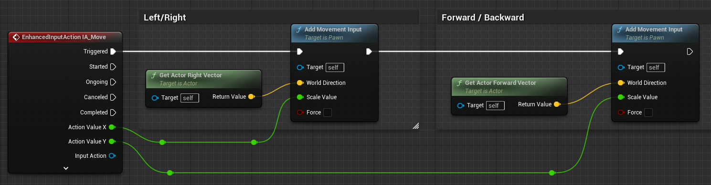
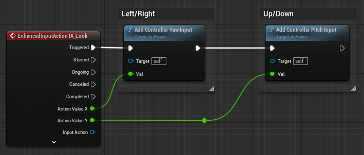
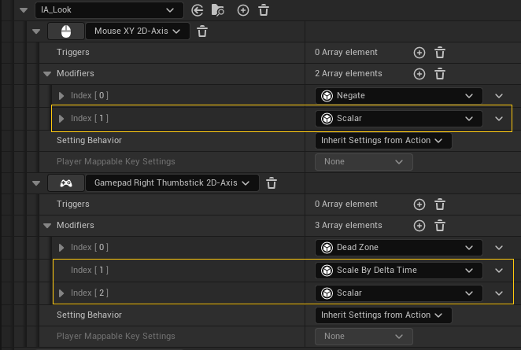
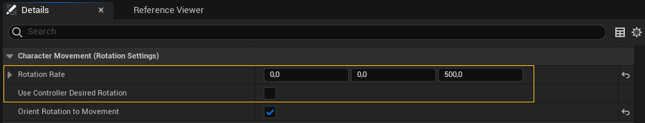
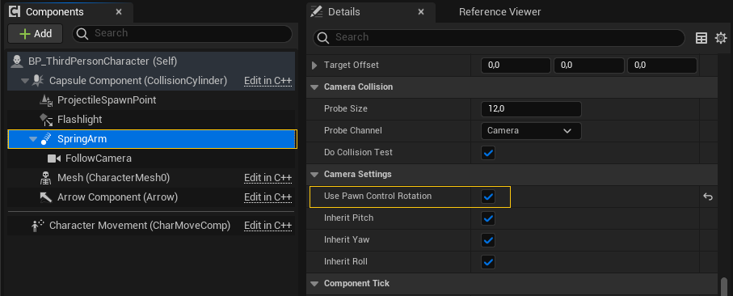
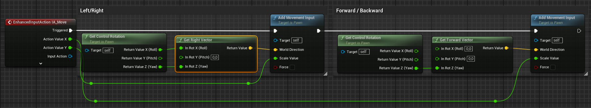

# Entrada del jugador

Como hemos comentado, el control de personaje recibe la entrada del jugador para determinar el movimiento y las acciones que realiza el personaje.
El detalle de como se lee la entrada del jugador depende de cada motor.

En Unreal Engine, el sistema de entrada permite configurar acciones de entrada a través de unos *assets* llamados **Input Action**.
Cualquier actor puede leer o suscribirse a estas acciones, para ser notificado en el momento en el que se dispare alguna.

Las **Input Actions** se mapean en controles a través de otro tipo de *assets* denominados **Input Mapping Context**.

En la configuración de cada acción o en el mapeo se pueden aplicar algunos modificadores para, por ejemplo: escalar valores, cambiar el criterio de activación, configurar *combos* o hacer cualquier otro tipo de preprocesamiento.

Los actores reciben las acciones a través de un componente denominado **InputComponent**.

En la @fig-input-component-stack se puede ver como los **InputComponent** de los actores interesados en la entrada del jugador se insertan en una pila, que gestiona el actor **PlayerController**.
Cuando llega una acción, esta es procesada por los **InputComponent** según el orden en la pila, de forma que los primeros pueden consumir las acciones, evitando que lleguen a los componentes posteriores.

{#fig-input-component-stack}

En la @fig-input-component-stack también se observa que, por defecto, el primer actor en la pila de **InputComponent** es el **PlayerController**, mientras que el siguiente es el **Pawn** del personaje del jugador.

La idea es que el **PlayerController** representa al jugador, que puede «poseer» a cualquier **Pawn** para controlarlo.
Por tanto, idealmente la entrada se lee en el **PlayerController**, para procesarla y usarla para teledirigir al personaje del jugador.
Pero también se puede leer la entrada en el propio **Pawn**, con el objeto de utilizarla allí mismo.

Para conocer con más detalle cómo se gestiona la entrada en Unreal Engine se pueden consultar las secciones *«Controllers»** y *«Gestión de la entrada del jugador (PlayerController)»* de @TorresD3DGameplayFramework.

## Entrada al control de movimiento

En Unreal Engine, la entrada de control de movimiento se entrega al **Pawn** mediante el método  que lo acumula en una variable interna para luego utilizar la entrada en el siguiente *tick*.
El tipo de magnitud que acumula depende de como vaya a interpretarlo el control de movimiento. 

Por ejemplo, el **CharacterMovementComponent** espera que sea un vector normalizado con la dirección y sentido en la que acelerar al personaje
Por si el vector no esta normalizado, **CharacterMovementComponent** recorta la magnitud del vector a 1.0 y luego la multiplica por la aceleración máxima configurada en las propiedades del componente:

```cs
Acceleration = MaxAcceleration * ClampToMaxSize(ControlInputVector, MaxSize=1.0f)
```

Sin embargo, si queremos desarrollar nuestro propio **PawnMovementComponent**, podemos interpretarlo de otra manera.

Las **Input Action** de teclado y de los *stick* del gamepad devuelven valores entre 1.0 y -1.0.
Por tanto, se pueden usar directamente como vectores de velocidad o aceleración normalizados, como se ven en la @fig-pawn-movement-input

{#fig-pawn-movement-input}

Sin embargo, dispositivos como el ratón o algunos controles de realidad virtual puede devolver valores en otros rangos porque informan de desplazamientos o posiciones absolutas del dispositivo.

## Entrada de rotación y control de cámara

La *rotación de control* se puede usar para establecer la orientación del personaje o de la cámara del jugador y se puede leer y modificar mediante los métodos  y .

Al igual que con la entrada de movimiento, lo usual es acumular la entrada de rotación del jugador durante un *tick* para usarlo en el siguiente.
Para ello se puede acumular en el **PlayerController** mediante las funciones ,  y , como se puede ver en la @fig-control-rotation-input

{#fig-control-rotation-input}

La *rotación de control* almacena grados de rotación, por lo que se debe considerar cómo adaptar los valores de las **Input Action** para poder acumularlos.  

Por ejemplo, el ratón devuelve valores que indican cuanto lo ha desplazado el jugador desde la última lectura.
Por tanto, el valor resultado es indpendiente de los FPS a los que se ejecute el juego, pues a tasas más bajas se reciben menos actualizaciones pero el valor acumulado final de desplazamiento no cambio.
Esto significa que la lectura del raton se puede acumular directamente en la *rotación de control*, generalmente escalada por alguna magnitud para ajustar el grado de sensibilidad del control.

Por ejemplo, en la @fig-camera-input-stick-imc-config se puede observar un ejemplo de esta configuración dónde se mapea el ratón a la acción **IA_Locok**, simplemente añádiendo un modificar para escalar el valor de la entrada con el objeto de poder ajustar la sensbilidad.

Sin embargo teclados y *sticks* devuelve valores entre 1.0 y -1.0.
Si se acumulan directamente sus valores en la *rotación de control*, la velocidad de rotación depende de los FPS a los que se ejecute el juego.
Por ejemplo, cuando la activación es máxima, en cada actualización se aplicaría sistemáticamente un 1.0 grado.
A más FPS, más grados por segundo se aplican.

Por eso es preferible interpretar la entrada de este tipo de controles como una velocidad normalizada, de forma que se debe multiplicar por la velocidad máxima y el `DeltaTime` para obtener el valor que finalmente se acumula en la *rotación de control*:

```cs
DeltaYaw = MaxYawSpeed * MouseXAxisInput * DeltaTime
DeltaPitch = MaxPitchSpeed * MouseYAxisInput * DeltaTime
```

Asi el control se hace independiente de los FPS a los que se ejecute el juego.

En el antiguo sistema de entrada de Unreal Engine, esta diferencia a la hora de tratar la entrada leída de teclado y *gamepad* respecto al ratón, hacían que hubiera que ponerlas en acciones diferentes, para poder operar con ellas de forma diferente, antes de acumularlas en la *rotación de control*.
Con el nuevo sistema de entrada, se pueden configurar en un mismo **Input Mapping Context** modificadores específicos para hacer estos ajustes en las entradas de teclado y *gamepad*.
De esta forma, ratón, teclado y el *gamepad* pueden usar la misma **Input Action**, ofreciendo valores que podemos acumular directamente en la *rotación de control*, independientemente de su origen.

En la @fig-camera-input-stick-imc-config se puede observar un ejemplo de esta configuración para el *stick* derecho de un *gamepad*.
En ese caso, el valor del *stick* se toma como una vector velocidad angular normalizado, por lo que se añaden dos modificadores.
Uno para multiplicar por el `DeltaTime` y otro para escalar por la velicidad máxima de rotación.

{#fig-camera-input-stick-imc-config}

En la @fig-control-rotation-input se ve como los valores de la acción **IA_Locok** se acumulan en la *rotación de control* directamente, sin importar el dispositivo de entrada.

### Personaje en tercera persona con cámara orbital

Cuando el jugador maneja algún tipo de personaje humanoide se suele utilizar el actor  que incluye el componente de movimiento .
Este componente tiene la opción **Orient Rotation to Movement** para activar la orientación del personaje en la dirección del movimiento, con una velocidad configurable en la propiedad **Rotation Rate**, como se observa en la @fig-orient-rotation-to-movement.

{#fig-orient-rotation-to-movement}

En este caso, la *rotación de control* se suele usar para controlar la cámara, que suele ser orbital, es decir, que orbita alrededor del personaje.

La ventaja de que el **PlayerController** tenga una interfaz bien definida para gestionar la *rotación de control*, es que muchos componentes vienen preparados para leerla y usarla directamente.

Un ejemplo son los componentes **Camera** y **SpringArm** --que se usa para hacer que la cámara siga al jugador en los juegos en tercera persona--.
Ambos tienen la propiedad **Use Pawn Control Rotation**, que al activarla permite que en cada *tick* se oriente el componente en la dirección de la *rotación de control*.

En los juegos en tercera persona, **Use Pawn Control Rotation** se activa en el componente **SprintArm**, como se ilustra en la @fig-spring-arm-pawn-control-rotation.

{#fig-spring-arm-pawn-control-rotation}

Como se explica en la sección *«Personalizar el comportamiento de la cámara»* en @TorresD3DGameplayFramework, se pueden usa un modificador de cámara o las propiedades del **PlayerCameraManager** para limitar los ángulos de rotación de la cámara.
Por ejemplo, para que la cámara no pueda colocarse completamente arriba mirando hacia abajo o abajo mirando hacia arriba.

Otro detalle importante es que, a diferencia de lo que se ve en la @fig-pawn-movement-input en la gestión de la entrada de movimiento, en este caso también se utiliza la *rotación de control* en el cálculo del vector de movimiento, porque el comando del jugador es relativo a la orientación de la cámara.

En la @fig-tpp-pawn-movement-input se puede observar como el vector de movimiento se calcula a partir de la *rotación de control* y el vector de entrada del jugador, que se obtiene de la **Input Action** **IA_Move**.

{#fig-tpp-pawn-movement-input}

### Personaje en primera persona

En los juegos en primer persona la cámara suele estar fija en la cabeza del personaje.
En este caso, se puede puede activar **Use Pawn Control Rotation** en la **Camera** para que esta se oriente en la dirección de la *rotación de control*

Además, en un juego en primera persona se espera que el personaje pueda rotar sobre sí mismo en el eje Z, para mirar en cualquier dirección en el plano del horizonte.

Una forma de conseguirlo es activar la propiedad **Use Controller Rotation Yaw** para que el personaje rote usando el ángulo *yaw* de la rotación de control.
La otra es activar la propiedad **Use Controller Desire Rotation** del **CharacterMovementComponent**.
Este este último caso la rotación no tiene que ser instantánea, si no que se puede configurar una velocidad de rotación en la propiedad **Rotation Rate** (ver la @fig-orient-rotation-to-movement).

### Otro tipo de peones

Obviamente, lo comentado sobre todo es válido para personajes humanoides, pero no para otros tipos de peones.

Por ejemplo, cuando el jugador maneja algún tipo de vehículo, no se suele usar la *rotación de control* para controlar la dirección del vehículo.

Los vehículos suelen tener algunas reglas respecto al funcionamiento de la dirección, de forma que no suelen poder cambiar de dirección libremente, sino que orientación y movimiento sobre la superfice están relacionadas.
Por tanto, lo ideal suele ser que el control de movimiento utilizado implemente estas reglas, calculando y aplicando tanto el desplazamiento como el cambio de dirección, en función de la dirección de movimiento indicada por el jugador.

## Otras entradas

Como comentamos al principio, el controlador del personaje no solo se encagar del movimiento y la rotación, sino también de otras acciones que puede realizar el personaje.

Algunas de estas acciones pueden estar relacionadas con el movimiento, como saltar, agacharse o esquivar, por lo que se pueden implementar en el control de movimiento.
Por ejemplo, El **Character** tiene métodos para saltar -- y -- o agacharse -- y  que se implementan en cooperación con el **CharacterMovementComponent**.

Para otras acciones, como disparar, recargar, cambiar de arma, atacar, bloquear o usar, se pueden hacer implementaciones propias en componentes del personaje o del controlador del personaje.

Es una práctica recomendada definir una intefaz --o varias, si es compleja y se pueden dividir responsabilidades cláramente-- con las acciones que el personaje debe soportar, de forma que el actor del personaje la implemente --probablemente delegando en otros componentes-- y el **PlayerController** y otros objetos puedan usarla para indicar acciones al personaje o para consultar su estado.

## Interacción con objetos

Un caso de uso típico en cualquier videojuego es hacer que cuando el jugador esté cerca de un objeto pueda cogerlo o accionarlo.
Esto es algo muy común con armas, botiquines, puertas, interruptores, objetos que podemos agarrar para empujar, etc.

Todo empieza porque el objeto tenga un ***trigger** que permita saber cuándo estamos cerca de él.
Sin embargo, tanto el personaje como el objeto pueden ser informados del momento en el que eso ocurre, por lo que podríamos implementar el código de esta funcionalidad tanto en el actor del objeto como en el del personaje.

Si solo el personaje tuviera acceso a la entrada del jugador, probablemente la segunda sería la mejor o, quizás, la única opción.
Pero en la arquitectura de Unreal Engine ilustrada en @fig-input-component-stack, los objetos pueden leer la entrada del jugador si se colocan los primeros en la pila de **InputComponent** del **PlayerController**.

Después, cuando el jugador se aleja del objeto, lo único que hay que hacer es quitar el **InputComponent** del actor de la pila del **PlayerController**.

Para realizar estas operaciones se usan los métodos  y  de la clase **Actor**.
Ambos necesitan como argumento el **PlayerController** del jugador del que quieren leer o dejar de leer la entrada.

Esto permite implementar la lógica que gestiona la acción del jugador en el actor del objeto.

La ventaja de hacerlo así es que evitamos añadir esta responsabilidad en el código del personaje que, por lo general, ya tiene muchas otras cosas de las que encargarse.
De esta forma, es más fácil añadir nuevos tipos de objetos con los que puede interactuar el jugador.

### Implementación básica

En la @fig-object-interaction-sequence se puede ver un esquema de como podría ser la secuencia para implementar esta funcionalidad:

```{mermaid}
%%| label: fig-object-interaction-sequence
%%| fig-cap: "Ejemplo de interacción con otros actores."
%%| file: figures/object-interaction-sequence.mm
%%| fig-width: 15cm
```

1. El objeto debe tener una *trigger* para detectar cuando el jugador está lo bastante cerca.

1. Cuando el personaje del jugador entra en el *trigger*, el actor llama a `EnableInput` pasando el **PlayerController** asociado al personaje.
   Si el personaje sale del ***trigger***, el actor llama a `DisableInput`.

1. El actor usa eventos de entrada para saber si el jugador usa la acción adecuada para interactuar con él.

1. Sí el jugador interactúa con el objeto, el actor reacciona haciendo lo que corresponda según el caso.

  La reacción puede ser cualquier acción: abrir una puerta, accionar unas luces o añadirse al inventario del jugador.
  Además, es posible que tengan que reproducirse efectos visuales o sonoros para darle más realismo.

1. Si el objeto ya no es necesario --por ejemplo, porque es algo que se recoge-- tendrá que autodestruirse.

Es buena idea usar eventos para que el objeto accionable pueda notificar al resto del código que ha sido accionado, pues esto evita que el objeto tenga dependencias con otras partes del código, lo que ofrece mayor flexibilidad.

Por ejemplo, si se trata de un pulsador que abre una puerta, lo más directo suele ser que el pulsador tenga una propiedad para referenciar al actor de la puerta y llamar al método que corresponda cuando sea accionado.
Pero esto introduc'ia una dependencia entre ambas clases, que debe limitarse usando una interfaz común para las puertas y otros objetos activables por los pulsadores.
De esta forma, la referencia del pulsador sería a la interfaz no a clase de la puerta, lo que permite que el pulsador pueda activar cualquier objeto que implemente dicha interfaz.

Una alternativa mucho más interesante es utilizar eventos, de forma que el pulsador tenga un evento que notifique cuando es pulsado y la puerta se suscriba a él al ser creada.
De esta forma, es más sencillo reutilizar el pulsador, pues puede utilizarlo cualquier actor que se suscriba al evento.
Para que la puerta no tenga una dependencia con el pulsador para suscribirse, la conexión entre ambos se puede hacer en el nivel, en el **Level Blueprint**[Ver *«Level Bluperint»* en @TorresD3DGameplayFramework].

Finalmente, el objeto puede tener que comunicar al personaje que ha sido accionado para que este se comporte de la forma que corresponda para mejorar la inmersión.
  Por ejemplo, para que el personaje ejecute una animación coherente con la acción, como que está recogiendo el objeto o pulsando el botón.

### Considerar a dónde mirar el jugador

En juegos en primera y tercera persona es común que solo queramos que el jugador pueda accionar el objeto si lo está mirando, puesto que no tiene sentido que lo pueda hacer si está cerca pero de espaldas a él.
En ese caso, como *feedback* al jugador, se suele mostrar en la interfaz de usuario el control que debe usar para hacerlo.

Para hacerlo, cuando el jugador entra o sale del *trigger* se comprueba periódicamente --por ejemplo, en cada *tick*-- el ángulo entre la dirección en la que mira el jugador y la dirección para mirar el objeto.
Este último ángulo se puede obtener fácilmente usando `FindLookAtRotation()`.

Como el objeto tiene al personaje --porque es quién han entrado en el *trigger*-- resulta sencillo obtener su **PlayerController** y, a partir de él, el **PlayerCameraManager**, que es quien puede informar de la posición y dirección de la cámara para calcular el ángulo.
Otra opción es llamar directamente a , que devuelve el **PlayerCameraManager** con solo indicar el índice del jugador --que es 0, cuando solo hay un jugador--.

Una vez se tiene el **PlayerCameraManager**, se puede obtener la posición de la cámara con  y la rotación con .
Las posiciones del cámara y del objeto se pasan como argumentos a  para obtener la rotación absoluta para mirar desde la cámara al objeto.
Luego, esta se resta con la rotación absoluta de la cámara para obtener la rotación relativa para mirar desde la cámara al objeto.
Y de esta se pueden extraer los ángulos de rotación en los ejes horizontal --el *yaw*-- y vertical --el *pitch*--.

```cpp
FVector CameraLocation = PlayerCameraManager->GetCameraLocation();
FVector CameraRotation = PlayerCameraManager->GetCameraRotation();

FRotator LookAtRotation = UKismetMathLibrary::FindLookAtRotation(
    CameraLocation, ObjectLocation);
FRotator DeltaRotation = LookAtRotation - CameraRotation;
DeltaRotation.Normalize();                                          // <1>

if (FMath::Abs(DeltaRotation.Yaw) <= FOVAngle
    && FMath::Abs(DeltaRotation.Pitch) <= FOVAngle)                 // <2>
{
    // ...
    EnableInput(...);
    // ...
}
else
{
    // ...
    DisableInput(...);
    // ...
}
```
1. Es importante normalizar la diferencia para asegurar que los ángulos de rotación están en el rango [-180, 180].
2. `FOVAngle` sería el ángulo de visión, dentro del que se puede interactuar con el objeto.

Cuando el ángulo entra dentro de cierto límite --que simula el campo de visión del jugador, como se puede observar en la @fig-angulo-de-vision-- se llama a `EnableInput` y se emite un evento para indicar a la interfaz que se actualice para mostrar la acción.
Este evento puede estar en el **PlayerController**, para que sea fácilmente accesible tanto desde la interfaz como desde el actor del objeto.

{#fig-angulo-de-vision}

Si el ángulo sale de dicho límite, se llama a `DisableInput` y se vuelve a actualizar la interfaz de usuario para ocultar la acción.

::: {.callout-note}
Obviamente, obtener un resultado similar usando *raycasts*, pero en este caso podría ser un poco excesivo, ya que se puede resolver el problema de forma más eficiente con cálculos trigonométricos sencillos.
:::
