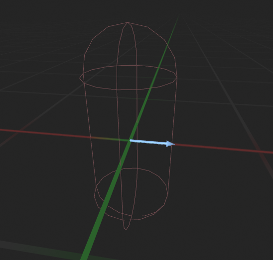
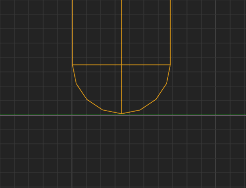
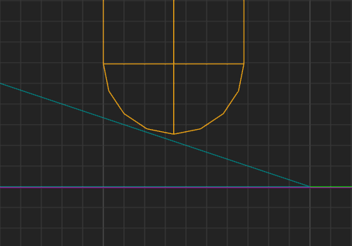
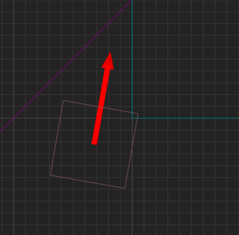
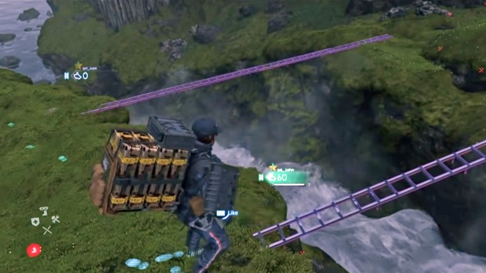
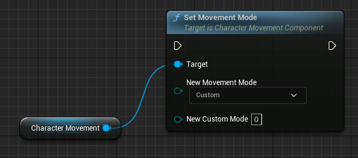
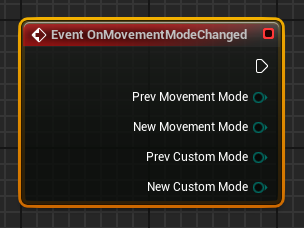
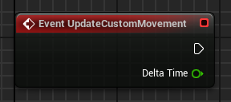



# Introducción

Una vez hemos visto elementos básicos de *gameplay* y como se usan --como las colisiones o  la detección de la ubicación de objetos en el espacio-- vamos a ver como se utilizan para el control de los personajes.

# Control de personajes

El controlador de personaje es el componente que se encarga del control del movimiento y de las acciones de los personajes.
Por tanto, en cada juego suele tener características, en función del tipo de juego, tipo de personaje que representa al jugador y de las mecánicas de movimiento y de interacción con el entorno que se quieran implementar.

En los juegos de acción, el controlador de personaje suele ser una de las partes más complejas del juego, porque tiene que implementar un gran número de mecánicas de movimiento y de interacción con el entorno.
Por eso, es frecuente que se implemente a traves de varios componentes, cada uno especializado en un aspecto del control del personaje.

Motores de videojuegos como Unreal Engine o Unity ofrecen componentes para ayudar implementar el controlador de personajes, pero debe tenerse en cuenta que fundamentalmente se encargan del movimiento de personaje que, por otro lado, es uno de los aspectos más complejos.
Generalmente, estos compomnentes deben extendidos para implementar los modos de movimiento que necesite el proyecto y, además, es frecuente que se necesiten otros componentes para implementar el resto de mecánicas de interacción con el entorno. 

# Control de movimiento {#sec-control-de-movimiento}

La entrada del control de movimiento son las acciones de movimiento indicadas por el jugador o por la IA --por ejemplo, «accelera hacia la derecha», «salta» o «camina agachado»-- y la salida es la nueva posición del personaje, ajustada a las restricciones físicas del mundo.
Es responsabilidad del controlador implementar la física del personaje --aunque, como veremos más adelante, eso no significa necesariamente que usen motor y simulación física[Ver *«Colisiones, *triggers* y cinemáticos»* en @TorresD3DFisicas]-- haciendo que se mueva sin atravesar muros o suelos, que salte y caiga, que pueda subir y bajar pendientes y escaleras o escalar muros.

## Cápsula del personaje

Como hemos comentado, el volumen del personaje se modela con una forma tridimensional sencilla que se usa para detectar sus colisiones con el entorno.
Frecuentemente, este volumen es una cápsula, pero también puede ser una esfera o una caja, según se ajuste mejor a la figura del personaje y al movimiento.



Por lo general, es preferible usar cápsulas o esferas a las cajas, por varios motivos:

* Las capsulas y esferas presentan un único punto de colisión contra el plano del suelo o de una pendiente, como se puede ver en la @fig-capsule-contact.
Asi es más sencillo implementar un controlador que ubique al personaje adecuadamente.

::: {#fig-capsule-contact layout-nrows="2"}





Contacto de una cápsula con el suelo.
:::

* La rotación de cápsulas y esferas en el eje Z no cambia la forma de estas al proyectarlas en el plano XY.
Esto significa que se puede rotar el personaje para que mire en una determinada dirección, sin que el controlador tenga que preocuparse por posibles colisiones.

  De hecho, en muchos motores no se hace detección de la colisión al rotar un objeto.
  En ese caso, si se usa un cubo como colisión del personaje, el personaje podría penetrar en otros objetos si que la condición pueda ser detectada por el controlador.
  Entonces el personaje quedaría atrapado y ya no puede moverse por la escena, como se puede ver en la @fig-cube-rotation.

{#fig-cube-rotation}

Los compomentes responsables del movimiento del personaje lo que hacen es mover esta cápsula, mientras comprueba las colisiones, de forma que el resto de elementos del personaje se mueven con ella.

## Tipos de entrada {#sec-tipo-de-entrada}

Obviamente, para que el control de movimiento pueda hacer su trabajo, necesita saber en qué dirección y en qué cantidad debe mover la capsula de colisión.
Por tanto, una de las entradas del control suele ser un vector con dicha información.

En muchas ocasiones, el control espera que el vector esté normalizado, de forma que la dirección del movimiento la obtiene directamente del vector y la cantidad de movimiento se obtiene multiplicando la magnitud del vector por un máximo configurado en el propio control.

En función del significado de la magnitud del vector, el control de movimiento puede ser de tres tipos:

* **Control de primer orden**.
  La entrada es directamente el desplazamiento deseado para el personaje, en la dirección indicada.

* **Control de segundo orden**.
  La entrada es la velocidad deseada para el personaje, en la dirección indicada.

* **Control de tercer orden**.
  La entrada es la aceleración deseada para el personaje, en la dirección indicada.

### Control de primer orden
  
En el **control de primer orden** la entrada es directamente el desplazamiento deseado para el personaje.

Este tipo de control es el más directo de implementar, pero el menos preciso, porque ni el jugador ni la IA tienen control sobre la velocidad o la aceleración del personaje.

Además, con este tipo de control el movimiento del personaje depende de la frecuencia de los *tick* de actualización del controlador,
pues en cada actualizacion el personaje se mueve una distancia fija, por lo que a mayor frecuencia de actualización, mayor velocidad de movimiento.
Es decir, la velocidad de movimiento puede variar de un equipo a otro.

Este tipo de control puede ser adecuado para juegos donde los personajes solo se mueven entre posiciones fijas, como ocurre en muchos juegos de tablero.

### Control de segundo orden

En el **control de segundo orden** la entrada es la velocidad deseada para el personaje.
Por ejemplo, «acelera hacia la derecha a 10 m/s».

En este caso el jugador o la IA pueden controlar directamente la velocidad del personaje.
Además, no existe dependencia con la frecuencia de actualización del controlador, porque para obtener el desplazamiento se tiene en cuenta el tiempo transcurrido desde la última actualización `DeltaTime`:

```cs
Vector Velocity = InputVelocity * MaxSpeed;   // <1>
Vector Offset = Velocity * DeltaTime;
SweepTo(CurrentLocation + Offset);            // <2>      
```
1. `InputVelocity` es la velocidad de entrada al control de movimiento.
   Suponiendo que esta normalizada --siendo 1.0 la velocidad máxima-- es necesario multiplicarla por la velocidad máxima del personaje `MaxSpeed` para obtener la velocidad en unidades del mundo.
2. Suponemos que `SweepTo()` es el método que mueve el personaje hasta la posición final, detectando posibles colisiones en la trayectoria.

Con este tipo de control el personaje se mueve instantánemanete, en cada momento, a la velocidad indicada en la entrada, por lo que no se obtiene el efecto de que el personaje tarde un tiempo en acelerar o desacelerar hasta la velocidad deseada.
Esto está relacionado con la inercia del movimiento y es una característica común en los juegos de acción.

Para implementar la inercia del movimiento, el controlador puede tomar `InputVelocity` como una velocidad objetivo, en lugar de como la velocidad instantánea del personaje.
Entonces, en cada *tick* calcularía la aceleración necesaria hacia la velocidad deseada, limitaría la aceleración adecuadamente para suavizar el movimiento y utilizaría esta aceleración para obtener la velocidad instantánea del personaje:

```cs
// Cálcular la aceleración para alcanzar la velocidad objetivo.
Vector Acceleration = (InputVelocity - PrevVelocity) / DeltaTime;     // <1>
Vector ClampedAccel = ClampToMaxSize(Acceleration, MaxAcceleration);  // <2>

// Cálcular la velocidad del personaje
Vector Velocity = PrevVelocity + ClampedAccel * DeltaTime;
Vector ClampedVelocity = ClampToMaxSize(Velocity, MaxSpeed);          // <3>
PrevVelocity = ClampedVelocity;                                       // <4>

Vector Offset = ClampedVelocity * DeltaTime;
SweepTo(CurrentLocation + Offset);
```
1. Calcular la aceleración necesaria para mover el personaje en la velocidad objetivo `InputVelocity`.
2. Limitar la aceleración a la máxima del personaje `MaxAcceleration` para suavizar el cambio de velocidad.
3. Calcular la velocidad del personaje en el *tick* actual, limitándola a la velocidad máxima del personaje.
4. `PrevVelocity` es la velocidad del personaje en el *tick* anterior, que se usa para calcular la aceleración y velocidad en el *tick* actual.

Si el personaje está cayendo, sumar la velocidad de caída en dirección al suelo a `ClampedVelocity` puede ser una forma de implementar la gravedad, pero significa que la velocidad de caida es constante, lo que no resulta realista.
Una mejor aproximación es usar la velocidad calculada a partir de la aceleración de la gravedad.

En este caso, se puede ignorar el valor de `InputVelocity` si el personaje esta en el aire y se supone que no tiene ningún control sobre su movimiento.
En los juegos donde el personaje puede maniobrar en el aire, se usa `InputVelocity` para calcular el movimiento de personaje, pero se limita la velocidad y aceleación máximas, de forma que el control del personaje está más limitado:

```cpp
// Cálcular la velocidad de caida.
Vector FallingVelocity = PrevFallingVelocity + Gravity * DeltaTime;     // <1>

// Cálcular la aceleración y velocidad debida al control de personaje.
Vector ControlAccel = (InputVelocity - PrevControlVelocity) / DeltaTime;
Vector ClampedControlAccel = 
    ClampedToMaxSize(ControlAccel, MaxFallingControlAccel);

Vector ControlVelocity = PrevControlVelocity
    + ClampedControlAccel * DeltaTime;
Vector ClampedControlVelocity =
    ClampedToMaxSize(Velocity, MaxFallingControlSpeed);                 // <2>  
PrevFallingVelocity = ClampedControlVelocity;

Vector Offset =
    (FallingVelocity + ClampedControlVelocity) * DeltaTime;             // <3>
SweepTo(CurrentLocation + Offset);
```
1. Calcular la velocidad debida el efecto de la gravedad.
2. Calcular la velocidad debida al control del jugador.
3. Sumar ambas velocidades para obtener la velocidad final del personaje y calcular el desplazamiento.

### Control de tercer orden

En el **control de tercer orden** el jugador o la IA pueden controlar directamente la aceleración del personaje.
Por tanto, no tiene control directo sobre la velocidad del personaje, pero pueden hacer que gane o pierda velocidad en la dirección indicada, a través de la aceleración, lo que resulta más realista.

```cs
Vector Acceleration = InputAcceleration * MaxAcceleration;    // <1>
Vector Velocity = PrevVelocity + Acceleration * DeltaTime;
Vector ClampedVelocity = ClampToMaxSize(Velocity, MaxSpeed);  // <2>
PrevVelocity = Velocity;

Vector Offset = ClampedVelocity * DeltaTime;
SweepTo(CurrentLocation + Offset); 
```
1. `InputAcceleration` es la aceleración de entrada al control de movimiento.
    Se supone normalizada, por eso se multiplica por la aceleración máxima del personaje.
2. `ClampToMaxSize()` es una función que limita la magnitud de `Velocity` a `MaxSpeed`, pues que por lo general no queremos que el personaje pueda acelerar indefinidamente.

En este tipo de control el efecto de la inercia del movimiento se obtiene de forma natural, porque la velocidad del personaje depende de la aceleración y esta puede cambiar en cada *tick*.
Sin embargo, en ausencia de entrada del jugador o de la IA, el personaje no se detiene, sino que se sigue moviendo indefinidamente con la última velocidad calculada.

Para evitarlo, se puede implementar un factor de fricción para que la velocidad decaiga en cada *tick*:

```cs
Vector Acceleration = InputAcceleration * MaxAcceleration;
PrevVelocity -= FrictionFactor * PrevVelocity;                // <1>
Vector Velocity = PrevVelocity + Acceleration * DeltaTime;
Vector ClampedVelocity = ClampToMaxSize(Velocity, MaxSpeed);
PrevVelocity = Velocity;

Vector Offset = ClampedVelocity * DeltaTime;
SweepTo(CurrentLocation + Offset); 
```
1. Antes de usar la velocidad en el *tick* anterior, se reduce su magnitud en un factor `FrictionFactor` para simular la fricción.

Otra opción es aplicar una aceleración en dirección contraria a la velocidad previa del personaje:

```cs
Vector Acceleration = InputAcceleration * MaxAcceleration;
Acceleration -= BrakingDeceleration * PrevVelocity.Normal();  // <1>
Vector Velocity = PrevVelocity + Acceleration * DeltaTime;
Vector ClampedVelocity = ClampToMaxSize(Velocity, MaxSpeed);
PrevVelocity = Velocity;

Vector Offset = ClampedVelocity * DeltaTime;
SweepTo(CurrentLocation + Offset); 
```
1. `BrakingDeceleration` es un factor que determina la aceleración de frenado.
  Se multiplica por la dirección de la velocidad del personaje en el *tick* anterior para obtener el vector de desaceleración con el que se actualiza la aceleración del personaje. 

## Actualización en subpasos {#sec-substeps}

Idealmente, un personaje controlado con un control de segundo o tercer orden debería moverse a lo largo de una curva.
Sin embargo, en la práctica, en cada *tick* se calcula la ubicación en la trayectoria en base al tiempo trascurrido desde la actualización anterior, para luego desplazar al personaje hasta allí en línea recta.
Esto quiere decir, que el personaje realmente se mueven en una aproximación de la curva realizada con segmentos de recta.

Como se puede ver en la @fig-movement-substeps Si el personaje se mueve a una velocidad muy alta o el tiempo entre actualizaciones es muy grande, el personaje podría moverse en una trayectoria muy diferente a la esperada.
Esto puede dar lugar, por ejemplo, a que se detecten colisiones con objetos que no deberían estar en la trayectoria del personaje.

{#fig-movement-substeps}

Para evitarlo, en cada *tick*, se puede dividir el `DeltaTime` en varias porciones, calculando y moviendo la ubicación del personaje en cada una, hasta completar el tiempo `DeltaTime`:

```cs
float SubstepTime = Max(DeltaTime / MaxSubsteps, MinTickTime); // <1>

while (RemainingTime > EPSILON) {
    RemainingTime -= SubstepTime;

    // Control sencillo de segundo orden 
    Vector Velocity = InputVelocity * MaxSpeed;
    Vector Offset = Velocity * SubstepTime;
    SweepTo(CurrentLocation + Offset); 
}
```
1. Se divide `DeltaTime` en `MaxSubsteps` pasos, pero el tiempo de cada uno nunca puede ser inferior a `MinTickTime` para evitar problemas cuando el tiempo es muy pequeño o prácticamente 0.0

## Controladores cinemáticos

Los controladores de movimiento de personajes pueden ser **cinemáticos** o **dinámicos**.

Los **controladores de personaje cinemáticos** son los más comunes.
Ofrecen un control directo sobre el movimiento del personaje, aparte de ser muy flexibles y estables.
Además, la disponibilidad general de motores de físicas, que es un requisito de los controladores dinámicos, es algo relativamente reciente.

En cada frame, los **controladores cinemáticos**: 

1. Calculan la posición final del personaje a partir de la entrada del controlador.
   La entrada del controlador puede ser directamente el desplazamiento deseado, pero generalmente suele ser la velocidad o la aceleración deseada para el personaje --es decir, un control de segundo o tercer orden, respectivamente--.
   En estos casos, se suelen usar las ecuaciones de la mecánica cinemática para calcular la posición final estimada para el personaje, tal y como vimos en la @sec-tipo-de-entrada.

1. Intentan mover al personaje hasta dicha ubicación, comprobando si la ubicación es válida.
   Por ejemplo, detectando colisiones en el camino.

1. En caso de colisión, se busca la posición viable --sin superposición con colisiones-- más cercana a la posición deseada y, finalmente, el personaje es movido hasta ese punto.

Al algoritmo descrito se lo denomina ***collide and slide***, porque es frecuente que se implemente haciendo que si el personaje colisiona con otro objeto al actualizar su posición, el resto del desplazamiento lo haga deslizando el personaje paralelamente a la superficie del objeto.

Por ejemplo, en la @fig-collide-and-slide se ilustra como el personaje se desliza por la superficie de una pared en lugar de atravesarla.
La distancia que se desliza es la proyección sobre la superficie del vector de desplazamiento restante tras la colisión.
Esto se puede calcular fácilmente utilizando el producto escalar y genera el efecto de que haya menos deslizamiento cuanto más perpendicular es el vector del impacto a la superficie.

{#fig-collide-and-slide}

El controlador suele soportar distintos modos para mover el personaje hasta una ubicación viable, según las mecánicas de movimiento del juego: volar, caminar o correr, subir o bajar escalones o rampas, saltar y maniobrar en el aire, moverse sobre plataformas --como ascensores o cintas transportadoras-- empujar objetos, nadar o escalar.

Estos modos se utilizan según el estado en el que está personaje o según las colisiones detectadas.
Por ejemplo, si el jugador ha pedido que salte, el personaje entra en el modo «salto», en el que no puede caminar o correr, pero en el que recibe un impuso vertical inicial, puede maniobrar en el aire, y donde se ve afectado por la gravedad, para caer.
Cuando el personaje aterriza, el controlador detecta la colisión con el suelo y cambia al modo «caminar», en el que puede caminar y correr y, generalmente, superar pequeños obstáculos.
Igualmente, el personaje puede entrar en el modo «nadar» porque se detecta la superposición con un volumen marcado como de agua.
En este modo el personaje tienen un movimiento diferente al del modo «caminar», ya que la cápsula no tiene que mantenerse en vertical y el personaje puede sumergirse y salir a la superficie.

Para ilustrar el algoritmo de ***collide and slide***, vamos a ver como se suele gestionar el modo «caminar» en algunos casos muy comunes en cualquier personaje.

### Deslizamiento

Caminar por un suelo plano implica, simplemente, deslizar el personaje en el plano XY, manteniendo la distancia con el suelo.
Para hacerlo, el controlador toma la entrada de movimiento para calcular la posición final del personaje, manteniendo la altura Z, e intenta moverlo hasta dicha ubicación, mientras detecta colisiones.

Por lo general, el personaje se mueve ligeramente por encima del suelo --de forma imperceptible-- para evitar que al moverse se detecte una colisión con el propio suelo.
Por eso, uno de los primeros pasos del algoritmo, antes de desplazar la cápsula del personaje, es hacer un *raycast* hacia abajo para detectar la distancia al suelo y ajustar la posición en altura del personaje en consecuencia, asegurando que la distancia al suelo esté siempre por debajo de un máximo y por encima de un mínimo preestablecido.

Si se detecta una colisión durante el deslizamiento, el personaje se coloca en la posición viable más cercana a la deseada.
Luego se proyecta el vector del desplazamiento, que no se pudo realizar, sobre el plano de la superficie de contacto, para obtener el vector de desplazamiento final paralelo a esta, como se ilustra en la @fig-collide-and-slide.

Comprobar si la posición final es viable puede implicar verificar otras condiciones, aparte de las colisiones.
Por ejemplo, en muchos juegos el personaje puede caer, pero no siempre es así.
Hay juegos donde no interesa que el jugador tenga que preocuparse de esa posibilidad, por lo que una alternativa a llenar el nivel con colisiones invisibles en cada borde, es que el controlador se haga cargo de evitar la caída.
Para eso, el controlador verifica si hay suelo en la posición final y, en caso contrario, mueve el personaje solo hasta el borde más cercano.

En otros casos, solo en determinadas situaciones se espera que el personaje no pueda caer o, al menos, que sea más complicado que ocurra, como cuando cruza sobre una estructura estrecha donde hace equilibrio, como se ilustra en la @fig-thin-bridge.
En ese caso, un *trigger* en la estructura puede activar un modo de deslizamiento especial, que evita que el personaje caiga o donde se aplica cierto grado de resistencia contra los movimientos en la dirección en la que puede caer el personaje.

{#fig-thin-bridge}

### Bajar rampas y escalones

El *raycast* hacia el suelo comentado anteriormente, facilita implementar el descenso de escalones y rampas.
Básicamente, el controlador debe tener configurada una *altura máxima de escalón*, de forma que si el suelo se detecta más cerca que dicha altura, el personaje es bajado hasta que la distancia al suelo esté dentro del rango permitido.

En la @fig-collide-and-slide-stepdown y @fig-collide-and-slide-rampdown se ilustra como el resultado es que así el personaje puede descender por rampas y escalones.

::: {layout="[10, -1, 10]"}
{#fig-collide-and-slide-stepdown}

{#fig-collide-and-slide-rampdown}
:::

En este caso, cada vez que el personaje avanza queda en el aire, por lo que el controlado baja automáticamente el personaje hasta el suelo para ajustar la distancia con respecto a este, haciendo que descienda.

### Caída y aterrizaje

Si durante la comprobación de la distancia al suelo esta es mayor que la *altura máxima de escalón*, entonces es que el personaje está en el aire.
En ese caso, el controlador cambia al modo «salto» o «caída», en el que incluye en los cálculos el efecto de la aceleración de la gravedad, de manera que el personaje se mueva en Z para ir cayendo frame a frame hasta el suelo.

Cómo se usa la entrada del jugador depende de la mecánica del juego.
Por ejemplo, si se espera que el personaje pueda maniobrar en el aire, la entrada del jugador se puede usar para calcular el desplazamiento en XY, generalmente limitando la velocidad y aceleración, para restringir la movilidad del personaje en el aire.
Si el personaje no puede maniobrar en el aire, la entrada del jugador no se utiliza, sino el vector de velocidad en el plano XY en el momento de entrar en el nuevo modo de movimiento.
Es decir, en ese caso el desplazamiento horizontal solo viene determinado por la inercia del movimiento.

Cuando el controlador detecta el suelo a una distancia menor que la *altura máxima de escalón*, vuelva al modo «caminar» porque el personaje ha aterrizado.

#### Subir rampas y escalones

Un controlador básico también sabe como hacer que el personaje suba rampas y escalones.
De hecho, incluso cuando no es necesaria esta funcionalidad, es interesante implementarla porque facilita que el personaje pueda superar pequeñas irregularidades del suelo.

Un escalón o una rampa se detectan con una colisión al mover el personaje hacia su posición definitiva, solo que se hacen varias comprobaciones antes de decidir que el personaje no puede superar el obstáculo:

::: {layout="[10, -1, 10]"}
{#fig-collide-and-slide-rampup}

{#fig-collide-and-slide-stepup}
:::

1. Si la superficie de la colisión tiene una pendiente menor que la máxima permitida en la dirección del movimiento, es porque se trata de una rampa.
   En ese caso, el personaje se desplaza lo que le queda paralelamente a la superficie, como se ilustra en la @fig-collide-and-slide-rampup.

   Al llegar arriba, el controlador detecta que el personaje está por encima del suelo, por lo que lo baja y, nuevamente, lo hace moverse de forma paralela a este.

1. En caso contrario, comprueba si el personaje puede continuar su movimiento si antes lo sube hasta la *altura máxima de escalón*.
   En tal caso, es que personaje está ante un escalón, por lo que hace el movimiento indicado y continúa desplazándolo de forma paralela al suelo, como se ilustra en la @fig-collide-and-slide-stepup.

1. Finalmente, si no es ni una rampa ni un escalón, es que el personaje está ante una pared, por lo que lo desplaza de forma paralela a la superficie, como se ilustra en la @fig-collide-and-slide.

## Controladores dinámicos

Los **controladores de personaje dinámicos** aprovechan las funcionalidades del motor de físicas, por lo que en teoría son muy sencillos de implementar.

La idea es activar la simulación física sobre el personaje --por ejemplo, añadiendo un componente **RigidBody** en Unity-- de forma que su movimiento y posición no se controla directamente, sino que está bajo el control de la simulación fisica del motor de físicas.
Este estima el movimiento considerando las colisiones y las fuerzas aplicadas sobre el objeto del personaje.

Desde el punto de vista de la entrada del jugador, esta se puede interpretar como la velocidad deseada --control de segundo orden-- pero lo más frecuente es interpretarla como la aceleración --control de tercer orden-- puesto que modificar directamente la velocidad de los objetos bajo simulación física, puede dar lugar a comportamientos no realistas.

En cada *tick* el controlador de personaje aplica una fuerza calculada a partir de la aceleración indicada como entrada del jugador.
Entonces el motor de físicas hace todo el trabajo, calculando la posición futura del personaje automáticamente y desplazándo hasta esa ubicación.
Sin embargo, el movimiento no suele ser tan suave y controlable como con un controlador **cinemático**.

Algunos problemas típicos de los controladores **dinámicos** son:

* **Carecen de control directo del desplazamiento**.
  Los objetos con simulación física generalmente se controlan mediante impulsos y fuerzas.
  No se los mueve directamente a la posición final deseada, sino que se tienen que calcular las fuerzas a aplicar --a partir del desplazamiento deseado para el personaje-- y aplicarlas, con la esperanza de que la simulación física lleve al objeto hasta dicha posición deseada.
  Obviamente, no resulta sencillo y no siempre funciona como se espera.

* **Problemas con la fricción**.
  Un personaje no debe deslizarse hacia abajo cuando está de pie sobre una rampa, lo que físicamente implica que la fricción debe ser muy alta.
  Pero cuando sube por ella, esperamos que la fricción sea 0, de forma que no se mueva más despacio que por otras superficies del juego.
  Tampoco esperamos que el personaje se mueva más despacio cuando se desliza contra un muro.

  Lamentablemente, este tipo de comportamientos poco realistas son muy complicado de controlar ajustando los parámetros del motor de físicas, dado que es un compomente diseñado para simular la física de forma realista.

* **Problemas con las restituciones**.
  Cuando dos objetos chocan, uno puede superponerse temporalmente al otro.
  Se denomina restitución al proceso por el cuál se resuelve la colisión para deshacer esa superposición.

  Esto puede crear cierto efecto rebote, porque el motor de físicas resuelve el cumplimiento de estas restricciones al movimiento, aplicando fuerzas lo suficientemente intensas como para separar lo más rápido posible los objetos superpuestos.
  Si las fuerzas son excesivas, los objetos pueden separarse demasiado, como si hubieran rebotado.

  El problema es que cuando un personaje se mueve muy rápido y colisiona contra una superficie --quizás porque está corriendo o porque está cayendo desde cierta altura-- no queremos que rebote, si que los jugadores esperan que quede pegado a la supercicie.

* **Saltos no deseados**.
  Si un personaje corre por una rampa a gran velocidad, el motor de físicas generalmente lo hace saltar cuando llega al final de la rampa, debido a la inercia del movimiento, que le hace mantener la dirección temporalmente.
  Sin embargo, no se suele desear ese efecto --a menos que estemos desarrollando un simulador de conducción realista-- sino que esperamos que el personaje permanezca pegado al suelo en todo momento.

* **Rotaciones no desadas**.
  Los personajes suelen permanecer de pie, por lo que no solemos querer que la cápsula que los rodea rote.
  Es decir, debe estar siempre en vertical, apoyada sobre uno de sus extremos en el suelo.
  Lamentablemente, los motores de físicas suelen carecer de las características necesarias para restringir este tipo de rotaciones.

Algunas de estos problemas se pueden resolver usando *uniones*[Ver *«Uniones»* en @TorresD3DFisicas], que a veces no funcionan del todo bien porque son dinámicas.
Es decir, se basan en aplicar fuerzas para intentar restringir ciertos movimientos, lo que puede causar rebotes, como hemos comentado.

Otras opciones son que el controlador aplique por sí mismo ciertas fuerzas en momentos concretos o ajustar de forma cuidadosa y dinámica algunos parámetros del motor de físicas.

Todo para emular con un motor de físicas un comportamiento mucho más simple de aquel para el que el motor fue diseñado.
Por eso, suele ser mucho más sencillo y estable implementar directamente el comportamiento deseado en un controlador cinemático, usando el motor de físicas para otros aspectos del juego.

## Uso de máquinas de estados

Cuando el control del movimiento es complejo, con múltiples modos diferentes, las máquinas de estados son un buen patrón que suele emplear en su implementación, como se ilustra en la @fig-movement-controller.

```{mermaid}
%%| label: fig-movement-controller
%%| fig-cap: "Ejemplo de máquina de estados del control de movimiento."
%%| file: figures/movement-controller.mm
%%| fig-width: 15cm
```

De hecho, es frecuente que en el controlador de los personajes se usen al menos dos máquinas de estados que, por motivos obvios, van a presentar importantes similitudes.
Una para los modos de movimiento y otra para el control de la animación, según el estado del personaje, como se ilustra en la @fig-movement-controller-animation.

```{mermaid}
%%| label: fig-movement-controller-animation
%%| fig-cap: "Ejemplo de máquinas de estados de control de movimiento y .animación"
%%| file: figures/movement-controller-animation.mm
%%| fig-width: 15cm
```

En algunos casos, puede ser necesario utilizar otras máquinas de estados en otros componentes del controlador de personaje.
Por ejemplo, si en el juego tiene mucho peso el combate cuerpo a cuerpo, este tipo de combate suele seguir unas reglas que también pueden implementarse en su propia máquina de estados.

También es común usar máquinas de estado para implementar el cerebro de los NPC, estableciendo las reglas de comportamiento a alto nivel, que luego se traducen en acciones de movimiento, combate y animación.

## Control de rotación

El movimiento del personaje no solo consiste en moverlo, sino también en rotarlo para que se oriente en la dirección adecuada.

En algunos juegos, el personaje del jugador puede mirar en una dirección, mientras se desplaza en otra.
Esto significa que, aparte de la entrada de movimiento, que va al control de movimiento para mover el personaje, necesitamos por separado una entrada de rotación con la que establecer la dirección en la que mira o apunta el personaje.

Por ejemplo, en muchos *first-person shooters* (FPS), donde el personaje del jugador se suele poder mover de forma totalmente libre usando un control --el teclado o un *stick* del *gamepad*-- mientras con otro --el ratón o el otro *stick* del *gamepad*-- se puede apuntar dónde se quiera.
Esto permite un tipo de juego muy rápido, al poder apuntar / mirar y correr / esquivar sin parar, de forma totalmente independiente.  

En otros juegos, la dirección de movimiento y la orientación del personaje del jugador están acopladas, porque el personaje es orientado por el controlador en la dirección en la que se mueve.
En ese caso, el control usado para la entrada de rotación queda disponible para otros usos, como el control de la cámara --como cuando se usa para el control de una cámara que orbita alrededor del personaje--.
Si la cámara está es fija o se mueve sobre railes, este control se puede utilizar para que el jugador apunte de forma independiente al movimiento o para otras mecánicas del juego.

Lo descrito en el párrafo anterior es común en muchos juegos de acción en tercera persona, donde:

{#fig-tpp-movement-and-rotation}

* El controlador mueve al personaje en la dirección indicada por el jugador en el frame, independientemente de como esté orientado el personaje, como se ilustra en la @fig-tpp-movement-and-rotation.

  El motivo para hacerlo así, en lugar de que el personaje solo se pueda mover en la dirección en la que se orienta --como se ilustra en la @fig-steering-behaviours-seek-- es que el jugador perciba una respuesta más directa del personaje a sus órdenes, a cambio de menos realismo.
  Limitado la velocidad y la aceleración y ajustando la aceleración de frenado, se puede determinar como de pesado o ligero puede percibir el jugador el control del personaje. 

* Como el personaje se puede mover en cualquier momento en cualquier dirección, se utilizan animaciones para todos los casos posibles.
  Al menos son necesarias las cuatro direcciones principales: hacia adelante, hacia atrás, de lado hacia la derecha y hacia la izquierda; pero se pueden utilizar 8 o más para conseguir mayor fidelidad.
  Estas animaciones se mezclan ponderadas en función de la dirección del movimiento, usando **Blend Trees**[@UnityBlendTrees] en Unity o **Blend Spaces**[@UnrealLocomotionBasedBlending] en Unreal Engine.

  En cada proyecto se debe ponderar la importacia que se le da a la fidelidad de la animación frente a tener un control más ligero.
  Un control más ligero favorece una forma de jugar más dinámica, mientras que con un control más pesado --es decir, cuando el personaje responde más lento-- la animación puede encajar mejor con el movimiento, evitando, por ejemplo, que los pies de personaje se deslicen sobre el suelo de manera incoherente con el movimiento del personaje.

  En algunos juegos se opta por un control más lijero, pero se minimizan los problemas con la animación limitando el ángulo y la posición de la cámara para que prácticamente nunca se puedan ver los pies del personaje sobre el suelo.

* El control de movimiento actualiza la orientación del personaje hacia la dirección del movimiento del personaje.
  Como se puede ver en la @fig-tpp-movement-and-rotation, esta rotación se interpola a lo largo de varios frames, evitando que el personaje cambie de orientación instantaneamente.
  Como en el caso del movimiento, una rotación más lenta se percibe más pesada, pero ofrece mayor fidelidad en la animación.

## Comportamientos de dirección (*steering behaviours*){#sec-steering-behaviours}

El comportamiento anterior, donde el personaje se puede mover en cualquier dirección, independientemente de su orientación, ofrece mejor respuesta al jugador, pero no es realista.

En la vida real, un personaje no suele moverse en cualquier dirección, sino que su movimiento está limitado por su orientación actual.
Por lo que si bien, puede ser aceptable que el personaje del jugador se mueva de esa manera, no suele serlo que lo hagan los NPC, porque se percibe como poco realista.
Tampoco lo suelen poder hacer la mayor parte de los vehículos ni los proyectiles.

Los **comportamientos de dirección**[@Shiffman2024AutonomousAgents;@Bevilacqua2012SteeringBehaviors] --o ***steering behaviours***-- son algoritmos utilizados 
para modelar movimientos realistas y para que los NPC parezcan inteligentes.
Estos comportamientos permiten a los controladores calcular la dirección en la que deben mover a su agente para lograr objetivos específicos, como seguir a un jugador, huir de un enemigo, o navegar por un entorno lleno de obstáculos.

Algunos ejemplos de **comportamientos de dirección** son:

<!-- TODO: Añadir ejemplos de comportamientos de dirección mediante vídeos o animaciones -->

{#fig-steering-behaviours-seek}

* **Seguir (*Seek*)**:
  El agente se mueve hacia un objetivo, como el jugador, de la forma más directa posible.
  Esto se hace calculando una aceleración que lo impulse en la dirección del objetivo y ajustado su orientación hacia él.
  
  En la @fig-steering-behaviours-seek se ilustra un ejemplo de este comportamiento que se puede comparar con el de la @fig-tpp-movement-and-rotation

  Este comportamiento es útil para enemigos que persiguen al jugador, para cohetes guiados o para aliados que siguen al líder del grupo.

* **Huir (*Flee*)**:
  Al contrario que en **seguir**, el agente se mueve alejándose de un objetivo de la forma más directa posible.
  Para ello, se calcula una aceleración que lo impulse en la dirección opuesta al objetivo.

  Este comportamiento es útil para enemigos que huyen del jugador o para aliados que huyen de un peligro.

* **Perseguir (*Pursuit*)**:
  De manera similar al comportamiento de **seguir**, el agente se mueve hacia un objetivo, pero anticipando su posición futura para interceptarlo.
  Por tanto, también es útil para enemigos o proyectiles que deben seguir al jugador.

  Obviamente, lo más complejo de este comportamiento es predecir la posición futura del objetivo, cuando está en movimiento.

* **Evasión (*Evasion*)**:
  Al contrario que en **perseguir**, en la **evasión** el agente busca alejarse de su perseguidor, prediciendo también su movimiento para evitar ser alcanzado.

* **Llegada (*Arrival*)**:
  De manera similar al comportamiento de **seguir**, el agente se mueve hacia un objetivo, pero reduce su velocidad a medida que se acerca para llegar suavemente y evitar sobrepasarlo.
  Para ello, se calcula el tiempo que queda para llegar al objetivo y se ajusta la velocidad en consecuencia.

* **Deambular (*Wander*)**:
  Se trata de un comportamiento semi-aleatorio donde el agente se mueve de forma errática pero convincente, útil para crear patrones de movimiento para personajes que exploran o patrullan áreas sin un objetivo específico.

* **Evitar de obstáculos (*Obstacle avoidance*)**:
  El agente detecta y maniobra alrededor de obstáculos en su camino, manteniendo su dirección y velocidad tanto como sea posible.

Otros comportamientos pero más útiles con multitudes, enjambres o grupos de agentes son **alineación (*alignment*)**, **cohesión (*cohesion*)** y **separación (*separation*)**.

Todos estos comportamientos pueden combinarse para crear otros más complejos y adaptativos, como un enjambre de drones que evita obstáculos mientras mantienen una formación y sigue un lider.

## Implementaciones en motores de videojuegos

Algunos motores de videojuegos, como Unreal Engine o Unity, ofrecen componentes para ayudar implementar el control de movimiento de los personajes.

### Unity

En Unity, el **CharacterController** incluido es un controlador muy simple[@UnityCharacterController].
Se trata de un controlador cinemático que permite mover el personaje sobre una superficie, con pendientes y escalones, indicando directamente un vector desplazamiento o velocidad.
Otras acciones, como pueden ser: salto, caer, maniobrar en el aire o agacharse; deben implementarse aparte, aunque no resulta complicado con la información proporcionada por el controlador.

Unity proprcional en sus paquetes *«Starter Assets»*[@UnityStarterAssetsFP;@UnityStarterAssetsTP] un controlador de personaje más completo y modular --aunque basado en el **CharacterController**-- que incluye los modos de movimiento más comunes en los juegos de acción en primera y tercera persona.
Por su modularidad, este componente puede ser usado fácilmente como base para crear controladores adaptados a cualquier tipo de juego.

Finalmente, Unity ofrece otro **CharacterController** para utilizar con proyectos DOTS/ECS en el paquete *«Character Controller»*[@UnityCharacterControllerPackage].

### Unreal Engine

En Unreal Engine el compomente más simple para implementar el movimiento de un personaje es  [Ver *«Movimiento del actor»* en @TorresD3DGameplayFramework].
Sin embargo, no incluye ningún tipo de control de movimiento, sino que su función es proporcionar la integración con la clase de actor , que es reutilizada por las clases derivadas de esta.

Extender directamente  para implementar un control de movimiento desde 0, pero no es lo más habitual.
En ese caso, se puede elegir como interpretar la entrada de la IA o del jugador --como desplazamiento, velocidad o aceleración-- y como implementar la física del movimiento.

La  extiende **PawnMovementComponment** para proporcionar un control de movimiento simple en 3D.
Se trata de un controlador cinemático que recibe como entrada la aceleración.
Permite establecer de límites de velocidad y aceleración, pero no implementa el efecto de la gravedad.

 también es extendido por el componente , que es el que se usa para implementar el movimiento de los actores .

El **CharacterMovementComponent** también es un controlador cinemático que recibe como entrada la aceleración deseada, pero está mucho más completo que el **FloatingPawnMovement**.
Ofrece todo el soporte necesario para juego de acción en primera o tercera persona, con modos para caminar, saltar, agacharse, volar o nadar, pudiendo ajustar distintos parámetros en cada modo --como la velocidad máxima del movimiento, las pendientes máximas y altura de los escalones o la aceleración de la gravedad--.
Para añadir otros modos --como escalar, subir escaleras de mano o «parkour»-- solo es necesario heredar de la clase y seguir los pasos para implementar un *modo de movimiento personalizado*, como comentamos en la @sec-custom-movement-mode.

**CharacterMovementComponent** y el actor **Character** están bien integrados, por lo que también se encarga de hacer ajustes al resto de componentes del **Character**, según el modo de movimiento.
Por ejemplo, el controlador sabe ajustar el tamaño de la cápsula cuando el personaje se agacha.

Igualmente, se integra con el sistema de navegación, permitiendo que el  de un NPC marque un destino y el sistema de navegación considere para llegar a él los modos de movimiento soportados por el **CharacterMovementComponent**.
Con la ruta obtenida, el **AIController** mueve el personaje dando órdenes de desplazamiento al **CharacterMovementComponent**, para llegar a los distintos puntos de dicha ruta usando los modos de movimiento adecuados[Ver *«AIController»* en @TorresD3DGameplayFramework].

#### Rotación de control

Unreal Engine implementa el concepto de *rotación de control*, que es una rotación que se guarda en los **Controller** que pueden poseer a personajes, independiente del vector de movimiento del personaje[Ver *«Rotación de control»* en @TorresD3DGameplayFramework].
Esta *rotación de control* se puede utilizar para controlar la orientación del personaje o para el control de la cámara, según la perspectiva utilizada en el proyecto.

#### Modo de movimiento personalizado {#sec-custom-movement-mode}

El método `SetMovementMode()` de **CharacterMovementComponent** permite conmutar entre los diferentes modos de movimiento.
Uno de estos modos es el **Custom**, que admite especificar un sub-modo en el segundo argumento de .
Como se puede observar en la @fig-set-movement-mode, este sub-modo no más que un entero, que se puede elegir libremente pero que debe ser diferente para cada modo personalizado que se quiera implementar. 

{#fig-set-movement-mode}

Cuando el modo de movimiento cambia, el **CharacterMovementComponent** invoca al evento  en el **Character** para actualizar el movimiento del personaje (ver la @fig-movement-mode-changed-event).

{#fig-movement-mode-changed-event}

Este evento es interesante cuando se va a implementar un modo de movimiento personalizado porque permite saber cuando se ha activado o desactivado el modo **Custom** y, por tanto, cuando se debe cambiar el comportamiento del movimiento del personaje.

Para implementar los *modos de movimiento personalizados*[Ver *«Using Custom Movement Modes»* en @UnrealCharacterMovementComponent] en C++, se puede heredar de **CharacterMovementComponent** en C++ y sobrescribir , que es el método invocado cuando el modo de movimiento es **Custom**.
A través de la propiedad **CustomMovementMode** del **CharacterMovementComponent** se puede obtener el entero que identifica el sub-modo --especificado en `SetMovementMode()` al activar el modo **Custom**-- de forma que se pueden implementar diferentes modos de movimiento en `PhysCustom()`, en función del valor de esta variable.

Una de las tareas que realizar el `PhysCustom` por defecto, es llamar al evento **UpdateCustomMovement** del **Character** (ver la @fig-update-custom-movement).
Como el **CharacterMovementComponent** no es directamente heredable en Blueprint, este evento, apoyado por `OnMovementModeChanged()` sería el lugar para implementar movimientos personalizados directamente en Blueprint.

{#fig-update-custom-movement}

# Entrada del jugador

Como hemos comentado, el control de personaje recibe la entrada del jugador para determinar el movimiento y las acciones que realiza el personaje.
El detalle de como se lee la entrada del jugador depende de cada motor.

En Unreal Engine, el sistema de entrada permite configurar acciones de entrada a través de unos *assets* llamados **Input Action**.
Cualquier actor puede leer o suscribirse a estas acciones, para ser notificado en el momento en el que se dispare alguna.

Las **Input Actions** se mapean en controles a través de otro tipo de *assets* denominados **Input Mapping Context**.

En la configuración de cada acción o en el mapeo se pueden aplicar algunos modificadores para, por ejemplo: escalar valores, cambiar el criterio de activación, configurar *combos* o hacer cualquier otro tipo de preprocesamiento.

Los actores reciben las acciones a través de un componente denominado **InputComponent**.

En la @fig-input-component-stack se puede ver como los **InputComponent** de los actores interesados en la entrada del jugador se insertan en una pila, que gestiona el actor **PlayerController**.
Cuando llega una acción, esta es procesada por los **InputComponent** según el orden en la pila, de forma que los primeros pueden consumir las acciones, evitando que lleguen a los componentes posteriores.

{#fig-input-component-stack}

En la @fig-input-component-stack también se observa que, por defecto, el primer actor en la pila de **InputComponent** es el **PlayerController**, mientras que el siguiente es el **Pawn** del personaje del jugador.

La idea es que el **PlayerController** representa al jugador, que puede «poseer» a cualquier **Pawn** para controlarlo.
Por tanto, idealmente la entrada se lee en el **PlayerController**, para procesarla y usarla para teledirigir al personaje del jugador.
Pero también se puede leer la entrada en el propio **Pawn**, con el objeto de utilizarla allí mismo.

Para conocer con más detalle cómo se gestiona la entrada en Unreal Engine se pueden consultar las secciones *«Controllers»** y *«Gestión de la entrada del jugador (PlayerController)»* de @TorresD3DGameplayFramework.

## Entrada al control de movimiento

En Unreal Engine, la entrada de control de movimiento se entrega al **Pawn** mediante el método  que lo acumula en una variable interna para luego utilizar la entrada en el siguiente *tick*.
El tipo de magnitud que acumula depende de como vaya a interpretarlo el control de movimiento. 

Por ejemplo, el **CharacterMovementComponent** espera que sea un vector normalizado con la dirección y sentido en la que acelerar al personaje
Por si el vector no esta normalizado, **CharacterMovementComponent** recorta la magnitud del vector a 1.0 y luego la multiplica por la aceleración máxima configurada en las propiedades del componente:

```cs
Acceleration = MaxAcceleration * ClampToMaxSize(ControlInputVector, MaxSize=1.0f)
```

Sin embargo, si queremos desarrollar nuestro propio **PawnMovementComponent**, podemos interpretarlo de otra manera.

Las **Input Action** de teclado y de los *stick* del gamepad devuelven valores entre 1.0 y -1.0.
Por tanto, se pueden usar directamente como vectores de velocidad o aceleración normalizados, como se ven en la @fig-pawn-movement-input

{#fig-pawn-movement-input}

Sin embargo, dispositivos como el ratón o algunos controles de realidad virtual puede devolver valores en otros rangos porque informan de desplazamientos o posiciones absolutas del dispositivo.

## Entrada de rotación y control de cámara

La *rotación de control* se puede usar para establecer la orientación del personaje o de la cámara del jugador y se puede leer y modificar mediante los métodos  y .

Al igual que con la entrada de movimiento, lo usual es acumular la entrada de rotación del jugador durante un *tick* para usarlo en el siguiente.
Para ello se puede acumular en el **PlayerController** mediante las funciones ,  y , como se puede ver en la @fig-control-rotation-input

{#fig-control-rotation-input}

La *rotación de control* almacena grados de rotación, por lo que se debe considerar cómo adaptar los valores de las **Input Action** para poder acumularlos.  

Por ejemplo, el ratón devuelve valores que indican cuanto lo ha desplazado el jugador desde la última lectura.
Por tanto, el valor resultado es indpendiente de los FPS a los que se ejecute el juego, pues a tasas más bajas se reciben menos actualizaciones pero el valor acumulado final de desplazamiento no cambio.
Esto significa que la lectura del raton se puede acumular directamente en la *rotación de control*, generalmente escalada por alguna magnitud para ajustar el grado de sensibilidad del control.

Por ejemplo, en la @fig-camera-input-stick-imc-config se puede observar un ejemplo de esta configuración dónde se mapea el ratón a la acción **IA_Locok**, simplemente añádiendo un modificar para escalar el valor de la entrada con el objeto de poder ajustar la sensbilidad.

Sin embargo teclados y *sticks* devuelve valores entre 1.0 y -1.0.
Si se acumulan directamente sus valores en la *rotación de control*, la velocidad de rotación depende de los FPS a los que se ejecute el juego.
Por ejemplo, cuando la activación es máxima, en cada actualización se aplicaría sistemáticamente un 1.0 grado.
A más FPS, más grados por segundo se aplican.

Por eso es preferible interpretar la entrada de este tipo de controles como una velocidad normalizada, de forma que se debe multiplicar por la velocidad máxima y el `DeltaTime` para obtener el valor que finalmente se acumula en la *rotación de control*:

```cs
DeltaYaw = MaxYawSpeed * MouseXAxisInput * DeltaTime
DeltaPitch = MaxPitchSpeed * MouseYAxisInput * DeltaTime
```

Asi el control se hace independiente de los FPS a los que se ejecute el juego.

En el antiguo sistema de entrada de Unreal Engine, esta diferencia a la hora de tratar la entrada leída de teclado y *gamepad* respecto al ratón, hacían que hubiera que ponerlas en acciones diferentes, para poder operar con ellas de forma diferente, antes de acumularlas en la *rotación de control*.
Con el nuevo sistema de entrada, se pueden configurar en un mismo **Input Mapping Context** modificadores específicos para hacer estos ajustes en las entradas de teclado y *gamepad*.
De esta forma, ratón, teclado y el *gamepad* pueden usar la misma **Input Action**, ofreciendo valores que podemos acumular directamente en la *rotación de control*, independientemente de su origen.

En la @fig-camera-input-stick-imc-config se puede observar un ejemplo de esta configuración para el *stick* derecho de un *gamepad*.
En ese caso, el valor del *stick* se toma como una vector velocidad angular normalizado, por lo que se añaden dos modificadores.
Uno para multiplicar por el `DeltaTime` y otro para escalar por la velicidad máxima de rotación.

{#fig-camera-input-stick-imc-config}

En la @fig-control-rotation-input se ve como los valores de la acción **IA_Locok** se acumulan en la *rotación de control* directamente, sin importar el dispositivo de entrada.

### Personaje en tercera persona con cámara orbital

Cuando el jugador maneja algún tipo de personaje humanoide se suele utilizar el actor  que incluye el componente de movimiento .
Este componente tiene la opción **Orient Rotation to Movement** para activar la orientación del personaje en la dirección del movimiento, con una velocidad configurable en la propiedad **Rotation Rate**, como se observa en la @fig-orient-rotation-to-movement.

{#fig-orient-rotation-to-movement}

En este caso, la *rotación de control* se suele usar para controlar la cámara, que suele ser orbital, es decir, que orbita alrededor del personaje.

La ventaja de que el **PlayerController** tenga una interfaz bien definida para gestionar la *rotación de control*, es que muchos componentes vienen preparados para leerla y usarla directamente.

Un ejemplo son los componentes **Camera** y **SpringArm** --que se usa para hacer que la cámara siga al jugador en los juegos en tercera persona--.
Ambos tienen la propiedad **Use Pawn Control Rotation**, que al activarla permite que en cada *tick* se oriente el componente en la dirección de la *rotación de control*.

En los juegos en tercera persona, **Use Pawn Control Rotation** se activa en el componente **SprintArm**, como se ilustra en la @fig-spring-arm-pawn-control-rotation.

{#fig-spring-arm-pawn-control-rotation}

Como se explica en la sección *«Personalizar el comportamiento de la cámara»* en @TorresD3DGameplayFramework, se pueden usa un modificador de cámara o las propiedades del **PlayerCameraManager** para limitar los ángulos de rotación de la cámara.
Por ejemplo, para que la cámara no pueda colocarse completamente arriba mirando hacia abajo o abajo mirando hacia arriba.

Otro detalle importante es que, a diferencia de lo que se ve en la @fig-pawn-movement-input en la gestión de la entrada de movimiento, en este caso también se utiliza la *rotación de control* en el cálculo del vector de movimiento, porque el comando del jugador es relativo a la orientación de la cámara.

En la @fig-tpp-pawn-movement-input se puede observar como el vector de movimiento se calcula a partir de la *rotación de control* y el vector de entrada del jugador, que se obtiene de la **Input Action** **IA_Move**.

{#fig-tpp-pawn-movement-input}

### Personaje en primera persona

En los juegos en primer persona la cámara suele estar fija en la cabeza del personaje.
En este caso, se puede puede activar **Use Pawn Control Rotation** en la **Camera** para que esta se oriente en la dirección de la *rotación de control*

Además, en un juego en primera persona se espera que el personaje pueda rotar sobre sí mismo en el eje Z, para mirar en cualquier dirección en el plano del horizonte.

Una forma de conseguirlo es activar la propiedad **Use Controller Rotation Yaw** para que el personaje rote usando el ángulo *yaw* de la rotación de control.
La otra es activar la propiedad **Use Controller Desire Rotation** del **CharacterMovementComponent**.
Este este último caso la rotación no tiene que ser instantánea, si no que se puede configurar una velocidad de rotación en la propiedad **Rotation Rate** (ver la @fig-orient-rotation-to-movement).

### Otro tipo de peones

Obviamente, lo comentado sobre todo es válido para personajes humanoides, pero no para otros tipos de peones.

Por ejemplo, cuando el jugador maneja algún tipo de vehículo, no se suele usar la *rotación de control* para controlar la dirección del vehículo.

Los vehículos suelen tener algunas reglas respecto al funcionamiento de la dirección, de forma que no suelen poder cambiar de dirección libremente, sino que orientación y movimiento sobre la superfice están relacionadas.
Por tanto, lo ideal suele ser que el control de movimiento utilizado implemente estas reglas, calculando y aplicando tanto el desplazamiento como el cambio de dirección, en función de la dirección de movimiento indicada por el jugador.

## Otras entradas

Como comentamos al principio, el controlador del personaje no solo se encagar del movimiento y la rotación, sino también de otras acciones que puede realizar el personaje.

Algunas de estas acciones pueden estar relacionadas con el movimiento, como saltar, agacharse o esquivar, por lo que se pueden implementar en el control de movimiento.
Por ejemplo, El **Character** tiene métodos para saltar -- y -- o agacharse -- y  que se implementan en cooperación con el **CharacterMovementComponent**.

Para otras acciones, como disparar, recargar, cambiar de arma, atacar, bloquear o usar, se pueden hacer implementaciones propias en componentes del personaje o del controlador del personaje.

Es una práctica recomendada definir una intefaz --o varias, si es compleja y se pueden dividir responsabilidades cláramente-- con las acciones que el personaje debe soportar, de forma que el actor del personaje la implemente --probablemente delegando en otros componentes-- y el **PlayerController** y otros objetos puedan usarla para indicar acciones al personaje o para consultar su estado.

## Interacción con objetos

Un caso de uso típico en cualquier videojuego es hacer que cuando el jugador esté cerca de un objeto pueda cogerlo o accionarlo.
Esto es algo muy común con armas, botiquines, puertas, interruptores, objetos que podemos agarrar para empujar, etc.

Todo empieza porque el objeto tenga un ***trigger** que permita saber cuándo estamos cerca de él.
Sin embargo, tanto el personaje como el objeto pueden ser informados del momento en el que eso ocurre, por lo que podríamos implementar el código de esta funcionalidad tanto en el actor del objeto como en el del personaje.

Si solo el personaje tuviera acceso a la entrada del jugador, probablemente la segunda sería la mejor o, quizás, la única opción.
Pero en la arquitectura de Unreal Engine ilustrada en @fig-input-component-stack, los objetos pueden leer la entrada del jugador si se colocan los primeros en la pila de **InputComponent** del **PlayerController**.

Después, cuando el jugador se aleja del objeto, lo único que hay que hacer es quitar el **InputComponent** del actor de la pila del **PlayerController**.

Para realizar estas operaciones se usan los métodos  y  de la clase **Actor**.
Ambos necesitan como argumento el **PlayerController** del jugador del que quieren leer o dejar de leer la entrada.

Esto permite implementar la lógica que gestiona la acción del jugador en el actor del objeto.

La ventaja de hacerlo así es que evitamos añadir esta responsabilidad en el código del personaje que, por lo general, ya tiene muchas otras cosas de las que encargarse.
De esta forma, es más fácil añadir nuevos tipos de objetos con los que puede interactuar el jugador.

### Implementación básica

En la @fig-object-interaction-sequence se puede ver un esquema de como podría ser la secuencia para implementar esta funcionalidad:

```{mermaid}
%%| label: fig-object-interaction-sequence
%%| fig-cap: "Ejemplo de interacción con otros actores."
%%| file: figures/object-interaction-sequence.mm
%%| fig-width: 15cm
```

1. El objeto debe tener una *trigger* para detectar cuando el jugador está lo bastante cerca.

1. Cuando el personaje del jugador entra en el *trigger*, el actor llama a `EnableInput` pasando el **PlayerController** asociado al personaje.
   Si el personaje sale del ***trigger***, el actor llama a `DisableInput`.

1. El actor usa eventos de entrada para saber si el jugador usa la acción adecuada para interactuar con él.

1. Sí el jugador interactúa con el objeto, el actor reacciona haciendo lo que corresponda según el caso.

  La reacción puede ser cualquier acción: abrir una puerta, accionar unas luces o añadirse al inventario del jugador.
  Además, es posible que tengan que reproducirse efectos visuales o sonoros para darle más realismo.

1. Si el objeto ya no es necesario --por ejemplo, porque es algo que se recoge-- tendrá que autodestruirse.

Es buena idea usar eventos para que el objeto accionable pueda notificar al resto del código que ha sido accionado, pues esto evita que el objeto tenga dependencias con otras partes del código, lo que ofrece mayor flexibilidad.

Por ejemplo, si se trata de un pulsador que abre una puerta, lo más directo suele ser que el pulsador tenga una propiedad para referenciar al actor de la puerta y llamar al método que corresponda cuando sea accionado.
Pero esto introduc'ia una dependencia entre ambas clases, que debe limitarse usando una interfaz común para las puertas y otros objetos activables por los pulsadores.
De esta forma, la referencia del pulsador sería a la interfaz no a clase de la puerta, lo que permite que el pulsador pueda activar cualquier objeto que implemente dicha interfaz.

Una alternativa mucho más interesante es utilizar eventos, de forma que el pulsador tenga un evento que notifique cuando es pulsado y la puerta se suscriba a él al ser creada.
De esta forma, es más sencillo reutilizar el pulsador, pues puede utilizarlo cualquier actor que se suscriba al evento.
Para que la puerta no tenga una dependencia con el pulsador para suscribirse, la conexión entre ambos se puede hacer en el nivel, en el **Level Blueprint**[Ver «Level Bluperint» en @TorresD3DGameplayFramework].

Finalmente, el objeto puede tener que comunicar al personaje que ha sido accionado para que este se comporte de la forma que corresponda para mejorar la inmersión.
  Por ejemplo, para que el personaje ejecute una animación coherente con la acción, como que está recogiendo el objeto o pulsando el botón.

### Considerar a dónde mirar el jugador

En juegos en primera y tercera persona es común que solo queramos que el jugador pueda accionar el objeto si lo está mirando, puesto que no tiene sentido que lo pueda hacer si está cerca pero de espaldas a él.
En ese caso, como *feedback* al jugador, se suele mostrar en la interfaz de usuario el control que debe usar para hacerlo.

Para hacerlo, cuando el jugador entra o sale del *trigger* se comprueba periódicamente --por ejemplo, en cada *tick*-- el ángulo entre la dirección en la que mira el jugador y la dirección para mirar el objeto.
Este último ángulo se puede obtener fácilmente usando `FindLookAtRotation()`.

Como el objeto tiene al personaje --porque es quién han entrado en el *trigger*-- resulta sencillo obtener su **PlayerController** y, a partir de él, el **PlayerCameraManager**, que es quien puede informar de la posición y dirección de la cámara para calcular el ángulo.
Otra opción es llamar directamente a , que devuelve el **PlayerCameraManager** con solo indicar el índice del jugador --que es 0, cuando solo hay un jugador--.

Una vez se tiene el **PlayerCameraManager**, se puede obtener la posición de la cámara con  y la rotación con .
Las posiciones del cámara y del objeto se pasan como argumentos a  para obtener la rotación absoluta para mirar desde la cámara al objeto.
Luego, esta se resta con la rotación absoluta de la cámara para obtener la rotación relativa para mirar desde la cámara al objeto.
Y de esta se pueden extraer los ángulos de rotación en los ejes horizontal --el *yaw*-- y vertical --el *pitch*--.

```cpp
FVector CameraLocation = PlayerCameraManager->GetCameraLocation();
FVector CameraRotation = PlayerCameraManager->GetCameraRotation();

FRotator LookAtRotation = UKismetMathLibrary::FindLookAtRotation(
    CameraLocation, ObjectLocation);
FRotator DeltaRotation = LookAtRotation - CameraRotation;
DeltaRotation.Normalize();                                          // <1>

if (FMath::Abs(DeltaRotation.Yaw) <= FOVAngle
    && FMath::Abs(DeltaRotation.Pitch) <= FOVAngle)                 // <2>
{
    // ...
    EnableInput(...);
    // ...
}
else
{
    // ...
    DisableInput(...);
    // ...
}
```
1. Es importante normalizar la diferencia para asegurar que los ángulos de rotación están en el rango [-180, 180].
2. `FOVAngle` sería el ángulo de visión, dentro del que se puede interactuar con el objeto.

Cuando el ángulo entra dentro de cierto límite --que simula el campo de visión del jugador, como se puede observar en la @fig-angulo-de-vision-- se llama a `EnableInput` y se emite un evento para indicar a la interfaz que se actualice para mostrar la acción.
Este evento puede estar en el **PlayerController**, para que sea fácilmente accesible tanto desde la interfaz como desde el actor del objeto.

{#fig-angulo-de-vision}

Si el ángulo sale de dicho límite, se llama a `DisableInput` y se vuelve a actualizar la interfaz de usuario para ocultar la acción.

::: {.callout-note}
Obviamente, obtener un resultado similar usando *raycasts*, pero en este caso podría ser un poco excesivo, ya que se puede resolver el problema de forma más eficiente con cálculos trigonométricos sencillos.
:::

# Puertas, plataformas y ascensores

// TODO: Escribir intero

## Plataformas

<!---

Ojo que a veces son transiciones y aveces se mueve el mundo y no la plataforma.

https://www.google.com/search?q=character+charactermovementcomponent+elevator&sxsrf=AJOqlzWhlNfVGoJWgKhBSVWZUHvpVGx8ew%3A1678912839197&ei=Ry0SZKrOC7qbkdUPx7KPIA&ved=0ahUKEwjqjY7b5d79AhW6TaQEHUfZAwQQ4dUDCA8&uact=5&oq=character+charactermovementcomponent+elevator&gs_lcp=Cgxnd3Mtd2l6LXNlcnAQAzIFCCEQoAEyBQghEKABMgUIIRCgAToFCAAQkQI6CAguENQCEJECOgQIABBDOgUIABCABDoLCC4QgAQQxwEQ0QM6BAgjECc6BAguEEM6CAguEIAEENQCOgcILhDUAhBDOggILhDUAhCABDoICAAQgAQQywE6BwgAEIAEEAo6BwgAEIAEEA06CAgAEAgQHhANOgUIABCGAzoFCAAQogQ6BwghEKABEAo6BgghEA0QFUoECEEYAFAAWM47YIs9aAFwAXgAgAHeAYgBu0SSAQcwLjMxLjE0mAEAoAEBwAEB&sclient=gws-wiz-serp

¿Código en el plataforma o en el personaje?
--->

# Armas

## *Hitboxes*

<!---

https://gaming.stackexchange.com/questions/182350/what-do-hitbox-and-hurtbox-mean

https://forums.unrealengine.com/t/best-way-to-setup-hitboxes-using-projectiles/259719/2

https://forums.unrealengine.com/t/best-way-to-implement-hack-slash-attack-hitscan-weapon-onoverlap-or-create-separate-hitbox/256716

https://www.google.com/search?q=hitbox+block+or+overlap+unreal+engine&sxsrf=AJOqlzXmO3ejGy88NKtdAWSFvlz4TlRBWg%3A1677262229716&ei=lf34Y7aoK9qSkdUPi-GJ-AU&ved=0ahUKEwj2xpbb4K79AhVaSaQEHYtwAl8Q4dUDCA8&uact=5&oq=hitbox+block+or+overlap+unreal+engine&gs_lcp=Cgxnd3Mtd2l6LXNlcnAQAzIKCAAQ8QQQHhCiBDIFCAAQogQ6CggAEEcQ1gQQsAM6BQghEKABOgcIIRCgARAKOgQIIRAVSgQIQRgAUOEEWNIyYN4zaAJwAXgAgAGZAYgBhw6SAQQwLjE1mAEAoAEByAEFwAEB&sclient=gws-wiz-serp


**hutboxes**

--->

## Armas cuerpo a cuerpo

## Armas a distancia: proyectiles

Para implementar armas a distancia en juegos de acción, como pistolas, rifles, cañones o lanzacohetes, es necesario implementar la lógica de los proyectiles que disparan.
Esto se puede hacer usando *raycasts*, proyectiles o una combinación de ambas opciones, lanzados desde el personaje.

En el caso del arma del jugador, en juegos en primera persona o en tercera --con cámaras orbitales o sobre el hombro-- lo más común es «hacer el disparo» desde el centro de la cámara, aunque los efectos visuales correspondientes se emitan desde el arma.
Esto se hace porque así porque el jugador le resulta más sencillo apuntar. 

### Ray castings

El uso de *raycasts* es, con diferencia, la opción más sencilla.
Al disparar, se lanza un rayo para descubrir si algún objeto es alcanzado en la trayectoria.
Si es así, se le aplica dañó.

El *raycast* puede limitarse a una distancia máxima, si el arma tiene un alcance limitado.
También se pueden detectar múltiples objetos en la trayectoria, simulando que el arma tiene una gran capacidad de penetración.
O se pueden marcar ciertas superficies como reflectivas, de forma que si impacta en una de ellas hagamos un nuevo *raycast* en la dirección de reflexión, simulando que los disparos pueden rebotar.

La ventaja es que los *raycasts* son una operación muy eficiente, que no necesita simulación física ni el cálculo de ecuaciones de mecánica cinemática.
Además, es muy sencilla de utilizar en juegos multijugador en red, porque el *raycasts* se hace en el servidor, solo teniendo que comunicar a los clientes el daño infligido y los efectos visuales.

Como contrapartida, el impacto es instantáneo, por lo que no hay manera de esquivar las balas una vez se han disparado --aunque se pueden utilizar otras estrategias, como mostrar señales visuales antes del disparo, para que el jugador tenga una oportunidad de esquivarlo--.
Tampoco resulta realista en disparos a muy larga distancia, donde la gravedad, el viento y otros factores ambientales deberían tener efecto en la trayectoria del proyectil.
Por tanto, el uso de *raycasts* no es la mejor opción si interesa crear una experiencia realista.

### Proyectiles

La forma de conseguir una experiencia más realista e inmersiva es lanzar proyectiles al disparar.
Es decir, crear objetos, impulsarlos en la dirección del disparo y simular su movimiento según su masa, velocidad, gravedad, dirección del viento, **comportamientos de dirección** (ver la @sec-steering-behaviours) o cualquier otro aspecto que pueda alterar la dirección del proyectil.
Esto se puede implementar tanto usando controladores cinemáticos como dinámicos.

Los proyectiles permiten añadir tipos de armas que difícilmente se pueden implementar mediante *raycasts*, como granadas o cohetes guiados.
Pero también pueden enriquecer la experiencia de juego incorporando otros elementos. 
Como la posibilidad de esquivar los disparos --al menos en grandes distancias o cuando se introducen efectos como el *bullet-time*, donde el tiempo se ralentiza temporalmente-- u obliga al jugador a prever el movimiento de los enemigos y del proyectil, para disparar allí donde cree que estará cuando el proyectil llegue.

#### Inconvenientes

Como contrapartida, el uso de proyectiles es bastante más costoso que los *raycasts*, porque crear decenas de objetos y simular su movimiento, no resulta barato.
En este sentido, puede ser necesario considerar el uso de *pools* de objetos para reusar los objetos creados, reduciendo el coste de crearlos en el momento.

Además los proyectiles suponen un reto adicional en los juegos multijugador en red.
Esto es debido a que, por lo general, cada cliente ejecuta su propia simulación de los proyectiles, cuya trayectoria se va corrigiendo periódicamente con la información que llega del servidor, que también ejecuta su propia simulación y que es la única fuente de información confiable.
Por tanto, en juegos en red, esto implica tener decenas de objetos cuyo movimiento debe sincronizarse entre todos los clientes, para evitar crear inconsistencias en la experiencia de los distintos jugadores.

Además, para que este mecanismo funcione correctamente, es necesario que el movimiento de los proyectiles sea determinista, es decir, que el movimiento de los proyectiles sea el mismo en todos los clientes y el servidor, cuando las condiciones son las mismas.

Esto es sencillo de conseguir con controladores cinemáticos, pero puede ser más complicado con controladores dinámicos, porque estos últimos dependen de motor de fisicas y algunos motores de físicas no garantizan que la simulación sea determinista[Ver «Motor de física determinista» en @TorresD3DFisicas].

#### Tipos de control

Como en el caso del control de personajes, el control de los proyectiles se puede implementar tanto usando un controlador dinámico como cinemático.

En el primer caso, los proyectiles se mueven usando las capacidades del motor de físicas, utilizando las fuerzas e impulsos que se le apliquen para controlar su movimiento.
Este tipo de control se puede usar para proyectiles sencillos, como granadas, balas, pelotas o piedras, en juegos donde el comportamiento físico es un factor determinante.

En el segundo caso se puede implementar cualquier tipo de comportamiento que se quiera programar, porque el controlador cinemático ofrece más control, ya que no depende de las limitaciones de la simulación realista del motor de físicas.
Esto permite implementar tanto proyectiles sencillos --gobernados bajo las ecuaciones de la mecánica cinemática-- como proyectiles con un comportamiento más complejo, como cohetes guiados, capaces de perseguir a un objetivo (ver «persecución y evasión» en la @sec-steering-behaviours).

#### Consideraciones adicionales

Además de lo comentado hasta el momento, los cálculos del movimiento de los proyectiles pueden presentar varios retos:

* Como ocurre con elmovimiento de los personajes, en cada actualización la trayectoria suele aproximarse mediante segmentos rectilíneos.
  Para calcular una trayectoria más precisa, en cada *tick* se pueden usar múltiples subpasos rectilíneos (ver la @sec-substeps).

* Puede ser importante considerar la frecuencia con la que se actualiza el movimiento de los proyectiles, porque si mueven muy rápido --cubriendo grandes distancia entre actualizaciones-- se puede dar el caso de que no se detecten algunas colisiones.
  Por eso es común que los cálculos se hagan con mayor frecuencia y de forma independiente a la tasa de refresco del *render*.

Con el objeto de evitar fallar en la detección de posibles obstáculos, puede ser necesario considerar algunas técnicas de detección continua de colisiones:

* Si el motor lo soporta y el control es cinemático, se debe mover el proyectil usando un *barrido* para detectar colisiones en la trayectoria.
  Si el control es dinámico, se pueden activar las opciones de detección continua de colisiones[Ver *«Detección continua de colisiones»* en @TorresD3DFisicas] a cambio de un mayor coste.

* Otra opción es hacer que el objeto, en cada paso de simulación, lance un *raycast* en la dirección del movimiento para detectar objetos que podría atravesar en el intervalo del tiempo hasta el siguiente paso.
  En caso de detectar alguno, se lanzan las acciones que simula la colisión.

* Finalmente, se puede añadir geometría de colisión que añáda al proyectil una cola invisible, aumentado el tamaño del objeto de forma imperceptible, para que se puede dectectar la colisión incluso aunque el proyectil se mueva muy rápido.

#### *ProjectileMovementComponent* en Unreal Engine

El  es un componente de Unreal Engine diseñado para facilitar la implementación de proyectiles, proporcionando una simulación realista de la física, que incluye gravedad, fricción, flotabilidad y rebotes.

Este componente hereda de **MovementComponent** --al igual que **PawnMovementComponent** y **CharacterMovementComponent**-- y permite especificar la velocidad inicial y dirección del proyectil al lanzarlo.
A partir de ese momento, el **ProjectileMovementComponent** se encarga de actualizar la posición del proyectil en cada *tick* y de detectar colisiones con otros objetos, aplicando las acciones que se hayan configurado en el componente.

**ProjectileMovementComponent** admite tanto el control cinemático como dinámico del proyectil, puesto que por defecto la implementación de la simulación es cinemática, pero si el proyectil tiene activada la **simulación física**, el componente solo establecerá la velocidad y la dirección inicial, dejando que el motor de físicas se encargue del resto. 

Utilizando la interfaz del componente se puede modificar la trayectoria del proyectil en tiempo real, lo que es útil para la creación de proyectiles guiados o afectados por cambios ambientales.

Además, incluye varias opciones para optimizar el rendimiento, como la desactivación de los cálculos cuando el proyectil se mueve muy despacio o limitar el número de subpasos en la simulación.

### Sistemas híbridos

En muchos videojuegos se utilizan ambos tipos de soluciones.
Esto da la opción de tener una gran cantidad de armas con diferentes características, de forma que en cada una se use la solución que ofrezca los mejores resultados.

---

\appendix

# Jerarquía de clases

Esta es la jerarquía de las clases de Unreal Engine vistas en este documento.

```{mermaid}
%%| label: fig-ue-class-hierarchy
%%| file: figures/ue-class-hierarchy-part2.mm
%%| fig-width: 15cm
%%| fig-cap: Jerarquía de clases de Unreal Engine
```

# Referencias de API {.unnumbered}

::: {#api-refs}
:::

# Referencias {.unnumbered}

::: {#refs}
:::