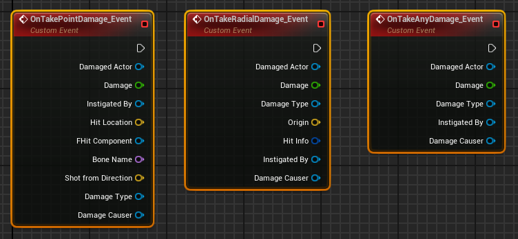
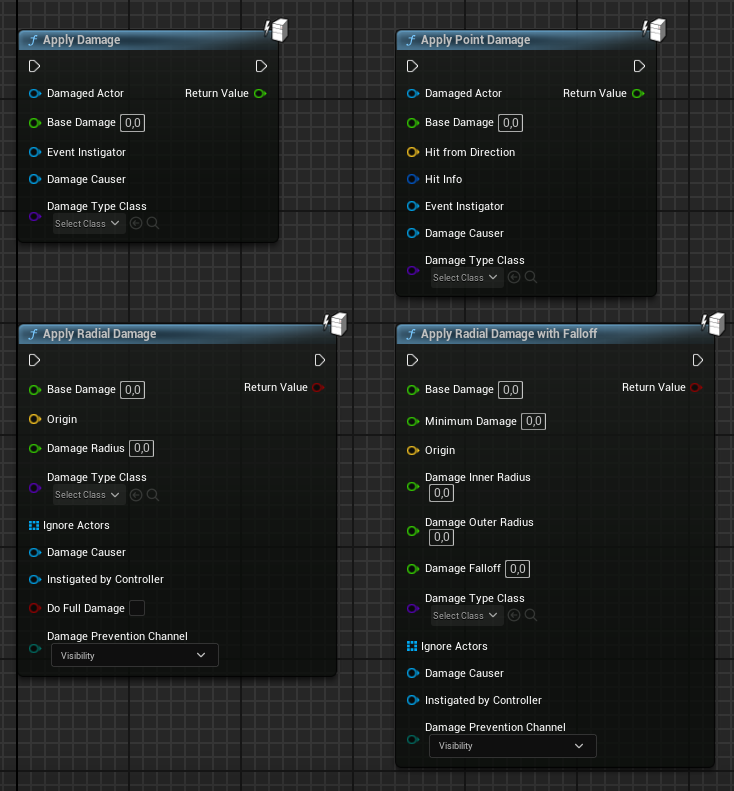
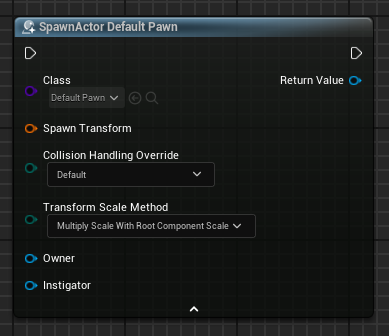
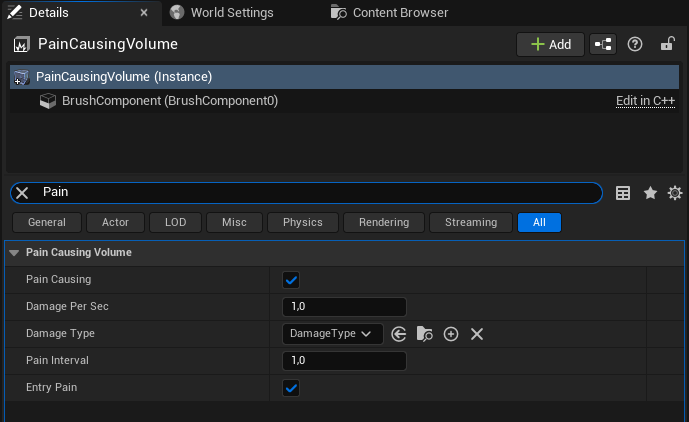
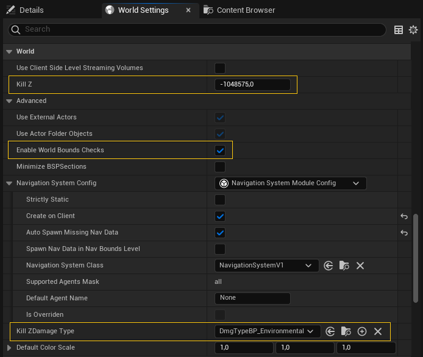

# Damage API

Las mecánicas de daño y salud son fundamentales en juegos donde la interacción y el conflicto son elementos clave como, por ejemplo: *shooters*, RPG y juegos de supervivencia.
Pero también es frecuente tener que implementar este tipo de mecánicas en juegos de otros géneros, aunque no sean de acción.

Unreal Engine ofrece una API de daño que facilita la implementación de estas mecánicas, al establecer una interfaz común para que todos los actores puedan recibir diferentes tipos de daño y procesarlo, tanto sin son objetos genéricos del juego, como personajes o estructuras[@UnrealBlueprintDamageAPI].

## Conceptos de la API de daño

Antes de comentar la API de daño de Unreal Engine, vamos a introducir una serie de conceptos comunes en muchos juegos:

* **Daño**.
  Cantidad de salud que se resta a un actor al causarle daño.

* **Daño base**.
  Cantidad de daño que se aplicaría a un actor si no se tuvieran en cuenta los modificadores.

* **Daño efectivo**.
  Cantidad de daño que se aplica a un actor, teniendo en cuenta los modificadores.
  Por tanto, es el *daño* que realmente se resta a la salud del actor dañado.

* **Modificadores de daño**.
  Valores y fórmulas que se aplican al *daño base* para obtener el *daño efectivo* que se va a restar de la salud del actor.
  Las modificaciones pueden venir determinadas por el tipo de daño, la velocidad del impacto, el estado del actor, la distancia al origen del daño, el tiempo que lleva aplicándose el daño, etc.

* **Tipo de daño**.
  Categoría del daño causado, como daño: ambiental, de combate, mágico, de caída, de envenenamiento, de colisión, etc. 
  El *tipo de daño* suele determinar los modificadores de daño que se aplican.

* **Causante del daño**.
  Actor que causa el daño.
  Por ejemplo, un proyectil o un objeto.

* **Instigador del daño**.
  Es el jugador o personaje que causa el daño.
  Por ejemplo, si un proyectil impacta en un personaje, dicho proyectil es la *causa el daño*, pero el *instigador* es el jugador o el personaje que lanzó el proyectil.
  Esto es útil en juegos multijugador, para que el responsable del daño reciba la puntuación correspondiente.

* **Daño por *raycast***.
  Daño que se aplica a los actores encontrados mediante un *raycast*.
  En Unreal Engine este tipo de daño se suele implementar como un *point damage*.

* **Daño por colisión**.
  Daño que se aplica a los actores que colisionan con otro actor.
  En Unreal Engine este tipo de daño también se suele implementar como un *point damage*.

* **Daño de área**.
  Daño que se aplica a los actores en un área determinada.
  En Unreal Engine este tipo de daño se suele implementar como un *radial damage*.

* **Daño instantáneo**.
  Daño que se aplica de forma instantánea.
  La Damage API de Unreal Engine prácticamente solo soporta este tipo de daño.

* **Daño periódico**.
  Daño que se aplica durante un periodo de tiempo determinado.
  La Damage API de Unreal Engine no soporta directamente este tipo de daño, aunque se puede implementar fácilmente configurando un temporizador y aplicando daño instantáneo en cada evento de activación.
  Además, el motor incluye el actor , que aplica daño periódico a los actores que se encuentran dentro de su volumen.

## Interfaz de daño

El API de daño no se declara en una interfaz específica de Unreal Engine, sino directamente en la clase **Actor**.
Vamos a ver sus métodos y propiedades, para entender mejor su funcionamiento.

### Recibir daño a actores

Los actores pueden recibir daño mediante el método , que recibe como argumentos:

```cpp
class AActor
{
public:
    // ...
    virtual float TakeDamage(float DamageAmount,
        FDamageEvent const& DamageEvent, AController* EventInstigator,
        AActor* DamageCauser);
    // ...
};
```

* `DamageAmount`.
  La cantidad de *daño base*.

* `DamageEvent`.
  El evento de daño --de tipo -- que describe el daño recibido.
  Con esta información se pueden aplicar modificadores de daño para calcular el *daño efectivo*.

* `EventInstigator`.
  El **Controller** que causó el daño.

* `DamageCauser`.
  El actor que causó el daño.

El Damage API define dos subclases de **FDamageEvent** para indicar dos tipos de daño diferentes y añadir propiedades adecuadas a cada uno:

* , para el daño puntual, por *raycast* o colisión.
  Incluye información sobre el lugar del impacto, la dirección del impacto y el componente del actor que recibió el impacto.

* , para indicar un dañó de área.
  Incluye información sobre el centro del área, el radio del área y como del daño decae con la distancia.

En el caso de recibir un evento de daño de tipo **FPointDamageEvent**, el método `TakeDamage()`:

1. Llama al método , pasándole los argumentos recibidos.
   Por defecto, este método retorna el *daño base* indicado en `DamageAmount`, para la idea es que se sobreescriba en las clases hijas de **Actor** para que calcule el *daño efectivo* en base a la información sobre el tipo de daño.

1. Llama al método , con información extraída del evento de daño recibido y con el *daño efectivo* calculado en el paso anterior.
   El objetivo es que el actor procese el daño recibido, actualizando su salud, aplicando efectos visuales, etc.

1. Lanza al evento , para que otros actores y componentes puedan suscribirse a este evento y reaccionar al daño recibido por este actor (ver la @fig-ontakedamage-events).

{#fig-ontakedamage-events}

En el caso de recibir un evento de daño de tipo **FRadialDamageEvent**, el método `TakeDamage()` sigue unos pasos similares pero llamando a los métodos  y  y lanzando el evento .

Finalmente, tanto si el evento de daño es de alguno de los tipos anteriores, como si es de la clase base **FDamageEvent**, el método `TakeDamage()` llama al método  y lanza el evento .

`TakeDamage()` retorna el *daño efectivo* aplicado, calculador por defecto por los métodos `InternalTakePointDamage()` o `InternalTakeRadialDamage()`.

### Propiedad *CanBeDamaged*

Todo actor tiene una propiedad **Can Be Damaged** que para indicar si puede recibir daño o no.

Esta propiedad se puede consultar mediante el método `CanBeDamaged()` y se puede modificar mediante `SetCanBeDamaged()`.
Sin embargo, es una propiedad para ser usada por las subclases del actor.

Es decir, el método `TakeDamage()` en **Actor** no tiene en cuenta el valor de **Can Be Damaged** y siempre aplica el daño recibido.
Pero subclases como **Pawn** o **Character** sobreescriben `TakeDamage()` para que solo aplique el daño recibido si **Can Be Damaged** está activa.

### Funciones de ayuda *ApplyDamage*

La API de daño también ofrece funciones de ayuda para aplicar daño a un actor, sin tener que llamar a `TakeDamage()` en el actor directamente.
Estas funciones están disponibles tanto en C++ como en Bluperint (ver la @fig-applydamage-methods):

{#fig-applydamage-methods}

Sin embargo, no debemos perder de vista que estas funciones no son más que una interfaz más sencilla para llamar a `TakeDamage()` en el actor indicado.
Es decir, no procesan el daño de ninguna manera, sino que crean el tipo de evento de daño **FDamageEvent** adecuado con la información proporcionada, para luego llamar al método `TakeDamage()` del actor o actores afectados.
Es nuestra responsabilidad implementar el procesamiento del daño en las subclases de **Actor**.

Como se puede observar, uno de los argumentos que reciben estas funciones *ApplyDamage* y que se guarda en el evento de daño, que recibirá `TakeDamage()`, es el tipo de daño, indicado mediante una subclase de **UDamageType**.
Esta clase se puede usar para definir diferentes tipos de daño, como fuego, hielo, eléctrico, francotirador, ambiental, etc.

#### *ApplyDamage*

La función  aplica daño al actor especificado, indicando el *daño base*, causante, instigador y el tipo de daño.

```cpp
float ApplyDamage(AActor* DamagedActor, float BaseDamage,
    AController* EventInstigator, AActor* DamageCauser,
    TSubclassOf<UDamageType> DamageTypeClass);
```

#### *ApplyPointDamage*

La función  aplica daño puntual al actor especificado.

Aparte de los argumentos comunes con `ApplyDamage()`, también se debe indicar información específica sobre el impacto, como la dirección del impacto y la estructura **HitResult**.

```cpp
float ApplyPointDamage(AActor* DamagedActor, float BaseDamage,
    FVector HitFromDirection, FHitResult const& HitInfo,
    AController* EventInstigator, AActor* DamageCauser,
    TSubclassOf<UDamageType> DamageTypeClass);
```

La estructura **HitResult** es la misma que se usa con las funciones de *raycast* y para detectar colisiones, por lo que pueden reutilizarse los resultados de estas funciones para aplicar daño.

#### *ApplyRadialDamage*

La función  aplica daño a todos los actores en un área esférica.

Aparte de los argumentos comunes con `ApplyDamage()`, como *daño base*, causante, instigador y el tipo de daño, también recibe otra información relevante en el caso de un daño de área, como el centro del área y el radio.

```cpp
float ApplyRadialDamage(const UObject * WorldContextObject,
    float BaseDamage, FVector Origin, float DamageRadius,
    TSubclassOf<UDamageType> DamageTypeClass,
    TArray<AActor*> const& IgnoreActors, AActor* DamageCauser,
    AController* InstigatedBy, bool bDoFullDamage,
    ECollisionChannel DamagePreventionChannel);
```

Esta función no necesita al actor al que se va a dañar, ya que se encarga de buscar a todos los actores dentro del área esférica especificada.
Sin embargo, necesita un `WorldContextObject` para poder acceder al objeto **World** donde hacer dicha búsqueda de actores.

Como `WorldContextObject` se puede pasar el propio objeto **World** o cualquier otro actor del nivel.

Por defecto, esta función crea un objeto **FRadialDamageEvent** donde se indica que el daño se escale de forma proporcional a la distancia al centro del área de daño.
Esto lo hace poniendo la propiedad **Damage Falloff** a 1.0 en el evento de daño.
Pero si `bDoFullDamage` es `true`, pondrá la propiedad **Damage Falloff** a 0.0, para aplicar todo el *daño base* a todos los actores en el área, independientemente de la distancia al centro del área.

Finalmente, el argumento `DamagePreventionChannel` se usa para indicar una canal de colisión[Ver @TorresD3DGameplay01] en el que la función buscará objetos que puedan bloquear el daño.
Es decir, no intentará aplicar daño a los actores que estén detrás de objetos que bloqueen los *raycast* en el canal indicado.

#### *ApplyRadialDamageWithFalloff*

La función  permite un uso más general que `ApplyRadialDamage()`, al permitir indicar todos los parámetros del evento de daño **FRadialDamageEvent** que va a crear.

```cpp
float ApplyRadialDamageWithFalloff(const UObject * WorldContextObject,
    float BaseDamage, float MinimumDamage, FVector Origin,
    float DamageInnerRadius, float DamageOuterRadius,
    float DamageFalloff, TSubclassOf<UDamageType> DamageTypeClass,
    TArray<AActor*> const& IgnoreActors, AActor* DamageCauser, 
    AController* InstigatedBy, bool bDoFullDamage,
    ECollisionChannel DamagePreventionChannel);
```

Esta función permite aplicar daño de área a varios actores, de tal forma que los que estén dentro del radio mínimo recibirían todo el *daño base*, mientras que los que estén dentro del radio máximo, recibirían un daño que decae con la distancia, pero que nunca será menor que el daño mínimo indicado.

Lo rápido que decae el daño con la distancia viene determinado por el argumento `DamageFalloff`, que se toma con un exponente que define la curva de decaimiento del daño.
Por ejemplo, esta es una manera común de calcular el daño decaído con la distancia en base a `DamageFalloff`:

```cpp
float CalculateEffectiveRadialDamage(float ActorDistanceFromOrigin,   // <1>
    ... )
{
    float DeltaRadius = DamageOuterRadius - DamageInnerRadius;
    float DeltaDamage = BaseDamage - MinimumDamage;
    float ScaledDistance =
        (ActorDistanceFromOrigin - DamageInnerRadius) / DeltaRadius;

    float DamageReduction =
        DeltaDamage * pow(ScaledDistance, DamageFalloff);
    float EffectiveDamage = BaseDamage - DamageReduction;

    return FMath::Clamp(Effective, MinimumDamage, BaseDamage);        // <2>
}
```
1. `ActorDistanceFromOrigin` es la distancia del actor al centro del área de daño.
2. Asegurar que el daño no excede los límites.

La función `ApplyRadialDamage()` es equivalente a `ApplyRadialDamageWithFalloff()`, con un radio mínimo de 0.0 y un `DamageFalloff` que vale 0.0 o 1.0, en función del valor de `bDoFullDamage`.

### Referencia al instigador en el actor

En el caso de los proyectiles, bombas y otras armas similares, el actor que causa el daño debe saber, desde el momento de su instanciación, qué jugador lo creó, para poder señalarlo como responsable del daño.
Por ese motivo, la clase **Actor** tiene una propiedad **Instigator**, que referencia al **Pawn** del jugador que lo creó.

Esta propiedad se puede consultar mediante el método `GetInstigator()` y se puede modificar mediante `SetInstigator()`.
También se puede consultar el **Controller** correspondiente mediante el método `GetInstigatorController()`.

:::{.callout-note}
Es importante recordar que aunque la clase **Actor** puede guardar una referencia al **Pawn** del jugador, la información que espera la Damage API como indicación del responsable del daño es el **Controller** del jugador.
:::

En el momento de instanciar un actor usando  se puede indicar directamente el **Pawn** del instigador para que lo guarde en la propiedad **Instigator** del nuevo actor.
En Blueprint esto se hace mediante un pin de entrada del nodo `SpawnActor()` (ver el pin **Instigator** en la @fig-spawnactor).
Mientras que en C++ se hace mediante la variable `Instigator` de la estructura  que se pasa el método `SpawnActor()`.

{#fig-spawnactor}

## Volumen *Pain-Causing*

Causar daño periódico es un área es muy común en muchos juegos, por ejemplo, cuando el jugador puede sufrir daño por caminar sobre un fuego, electricidad o respirar algún tipo de veneno.

Unreal Engine incluye el actor , que aplica daño periódico a los actores que se encuentran dentro de su volumen.

Para ello, el actor configura un temporizador para que se active periódicamente en el intervalo indicado en la propiedad **Pain Interval**.
En cada activación, se aplica como *daño base* el producto entre **Damage Per Sec** y el intervalo de activación **Pain Interval**.

{#fig-paincausingvolume}

Además, como se puede observar en la @fig-paincausingvolume, el actor **PainCausingVolume** tiene una propiedad **Damage Type**, que permite indicar el tipo de daño que se aplicará a los actores que se encuentran dentro de su volumen.

Como ocurre con otros volúmenes, la forma, tamaño y posición del volumen es completamente configurable.

## Volumen *Kill Z*

A veces interesante asegurar que un personaje va a morir o ser movido a otras zonas del nivel, si alcanza ciertas partes que no deberían ser inaccesibles.
El motivo más común es evitar que el jugador quede atascado y no pueda continuar jugando.

Unreal Engine ofrece un actor especial para esta tarea, llamado **KillZVolume**
Además, permite configurar en los niveles un umbral de altura, llamado *Kill Z*, que mata a los personajes que caigan por debajo de él.

El **KillZVolume** es un actor que se puede añadir al nivel desde el editor de Unreal Engine, pudiendo modificar fácilmente su forma, posición y tamaño.
Mientras que el *Kill Z* global se puede configurar en **World Settings**, estableciendo el valor de la propiedad **Kill Z**, como se puede observar en la @fig-world-killz.
Se puede desactivar desactivando la propiedad **Enable Wolrd Bounds Checks**.

{#fig-world-killz}

En ambos casos se aplica un daño de tipo **DmgTypeBP_Environment**, que es una subclase de **UDamageType** que se utiliza cuando el daño viene causado por el entorno, no por un enemigo.
Sin embargo, se puede configurar un tipo de daño diferente, indicando una subclase de **UDamageType** en la propiedad **Kill Z Damage Type** de **World Settings** (ver la @fig-world-killz).
Tanto los volúmenes **KillZVolume** como el *Kill Z* global utilizaran el tipo de daño que se configure en dicha propiedad.

En ambos casos, para aplicar el daño, en lugar de llamar a `TakeDamage()`, se llama al método  del actor que entra en el volumen o cae por debajo del *Kill Z*.
Por defecto, esta función destruye el actor, pero se puede sobreescribir en las subclases de **Actor** para cambiar este comportamiento.