# Gameplay Framework

Con los componentes básicos comentados hasta el momento se puede implementar un juego, pero no es lo más sencillo.
Por eso Unreal Engine incluye *gameplay framework*, prescribiendo ciertas decisiones sobre la arquitectura software y facilitando la implementación de los juegos.

## *GameMode* y *GameState*

**GameInstance** es un buen lugar para guardar datos globales del juego, pero no es el lugar adecuado para implementar lógica específica del nivel.
Para ello, Unreal Engine ofrece las clases **GameMode** y **GameState**, que son instanciados por el objeto **Word** al cargar un nivel y se destruyen al cargar otro.

### *GameMode* {#sec-gamemode}

 es un actor pensando para contener el código con las reglas específicas del nivel, como por ejemplo: el número de jugadores, las condiciones para ganar, las reglas para hacer aparecer o reaparecer a los jugadores, cuándo se puede pausar la partida y qué ocurre cuando se pide, la transición a otros niveles, etc.

:::{.callout-note}
El actor **GameMode** es el primer actor que recibe el evento `BeginPlay()` tras cargar el nivel.
:::

La clase **GameMode** por defecto del proyecto se indica en las propiedades del proyecto, en **Project Settings... / Project - Maps & Modes / Game Mode Override**, pero se puede cambiar en cada nivel, en la propiedad **World Settings / Game Mode Override**, como se muestra en la @fig-world-override-game-mode.

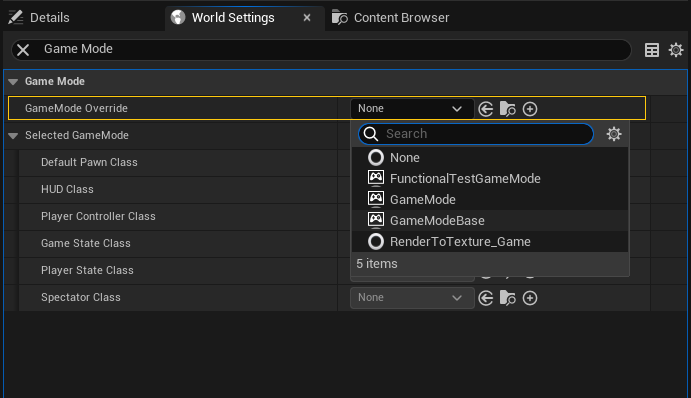{#fig-world-override-game-mode}

Por tanto, es posible y recomendable tener diferentes clases **GameMode** para cada nivel si hay diferentes modos de juego, en lugar de una única clase para todo el juego.
Probablemente, heredando de una clase base común para todos los niveles, que implemente la funcionalidad común a todos ellos.

Por ejemplo, si el juego tiene un modo historia y un modo multijugador, se puede tener una clase **GameMode** para cada uno de ellos, que herede de una clase base que implemente la funcionalidad común a ambos.
Igualmente, es común tener un nivel solo para el menú principal del juego, con su propia clase **GameMode**.

:::{.callout-tip}
La clase **GameMode** que se incluye en Unreal Engine implementa el comportamiento esperable de un juego multijugador competitivo.
Si se trabaja en otro tipo de juego, es mejor comenzar heredando de **GameModeBase**, que también es la clase base de **GameMode**.
:::

Igual que en el caso del **GameInstance**, para evitar que la clase **GameMode** se convierta en un *objeto todopoderoso*, se suele dividir la funcionalidad en diferentes clases.
Como **GameMode** es un actor, se pueden añadir **ActorComponent** para implementar diferentes aspectos del juego.
Si no estamos interesados en los eventos de ciclo de vida de los actores y componentes --como `BeginPlay()` o `TickComponent()`-- también se pueden usar clases **UObject**, referenciadas desde propiedades del **GameMode**.

Además, desde Unreal Engine 4.24, también se puede implementar *subsistemas* que comparten su tiempo de vida con un objeto **UWorld**, por lo que también son interesantes para implementar funcionalidades específicas de un nivel.

En la @fig-gamemode-inheritance se puede ver un ejemplo de jerarquía de herencia de **GameMode**.

```{mermaid}
%%| label: fig-gamemode-inheritance
%%| fig-cap: "Ejemplo de posible jerarquía de herencia de **GameMode**."
%%| file: figures/gamemode-inheritance.mm
%%| fig-width: 15cm
```

### *GameState*

 es un actor pensado para almacenar los datos que describen el estado de la partida, como: puntuaciones, lista de jugadores, objetivos cumplidos, etc.

Sea cual sea el motor de videojuegos, separar el código del juego del estado de la partida facilita la implementación de diferentes funcionalidades:

* Sincronización de los datos del juego en juegos multijugador online.
  En un juego multijugador online, la lógica con las reglas de la partida debe ejecutarse únicamente en el servidor para evitar las trampas.
  Los datos del juego también deben almacenarse en el servidor, pero al mismo tiempo es necesario mantener una copia sincronizada en cada cliente.

* Mecanismo de salvado de la partida.
  En general, separar la lógica de los datos facilita poder almacenar estos últimos para salvar y recuperar el estado del juego (ver la @sec-savegame).

Lo primero es exactamente para lo que Unreal Engine usa **GameState**.
El actor **GameMode** solo existe y se ejecuta en el servidor, mientras que **GameState** y **PlayerState** --del que hablaremos más adelante-- contienen datos que se replican automáticamente en los clientes.

:::{.callout-note}
Tanto **GameState** como **PlayerState** son actores porque, básicamente, es un requisito para que estos objetos sean replicados en los diferentes clientes en juegos multijugador online.
:::

No se recomienda guardar directamente en **GameState** datos específicos de cada jugador --como el nombre, el nivel de salud o la puntuación específica de cada jugador-- sino solo datos generales del estado del juego.
Como veremos más adelante, **GameState** gestiona una instancia de **PlayerState** para cada jugador, que es donde se deben almacenar los datos específicos de cada uno.
El **PlayerState** de cada jugador también es accesible a través de su controlador del personaje.

### Separación de responsabilidades entre *GameInstance* y *GameMode*

La separación entre **GameMode** y **GameInstance** permite tener diferentes clases **GameMode** con distintas reglas para cada nivel.
Incluso si en todos los niveles se usa la misma clase **GameMode**, es común emplear un nivel solo para el menú principal del juego, de forma que la lógica del menú puede estar en su propio **GameMode**, separado de la lógica de los niveles jugables.

En este sentido, los **GameMode** hacen de *game / level manager*.
Mientras que **GameInstance** sirve para preservar información entre partidas, como el número de victorias de cada equipo --por ejemplo, para enfrentamientos del tipo «el mejor de X partidas»-- los inventarios, las habilidades o la configuración del juego y de los personajes.

:::{.callout-note}
El *game manager* es un tipo especial de *manager* dedicado a llevar el flujo del juego: carga de escenas y transiciones, activación de modos de menús y pausa, etc.
Puede usarse para guardar referencias a otros componentes a los que se necesita acceder globalmente, evitando tener que buscar entre todas las entidades del juego cada vez que los necesitamos.
En juegos relativamente grandes, el *game manager* se usa para implementar aspectos globales del juego, mientras que para la lógica específica de un nivel, cada nivel suele tener su *level manager*.
:::

En juegos multijugador online hay un **GameInstance** independiente en el servidor y en cada cliente.
Como no se sincroniza la información entre ellos --puesto que el **GameInstance** no es un actor sino un **UObject**-- puede ser necesario copiar en el servidor parte de la información de **GameInstance** a **GameState** o **PlayerState** --según corresponda-- al cargar un nuevo nivel para que esté disponible en los clientes.

### *GameMode* como configurador de la partida

**GameMode** incluye de serie propiedades a través de las que podemos configurar diferentes características del nivel, como por ejemplo: el nombre por defecto de los jugadores o si el nivel es pausable (ver la @sec-pause).

Como se puede observar en la @fig-gamemode-properties, entre las propiedades que trae **GameMode** por defecto están otras clases de actores del *gameplay framework* que se van a instanciar para implementar diferentes aspectos del juego:

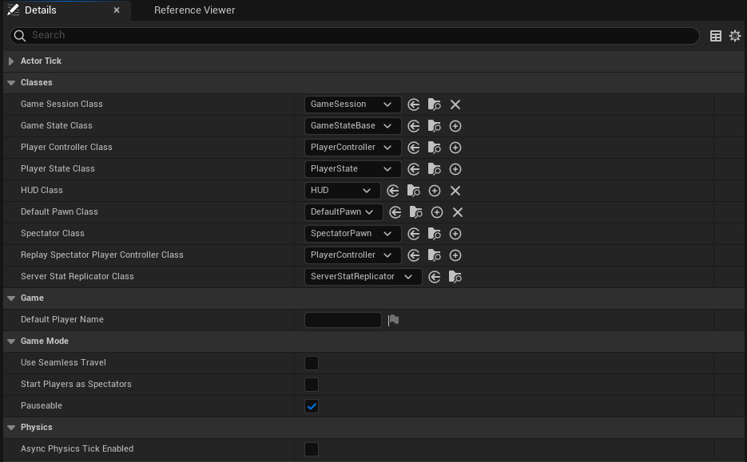{#fig-gamemode-properties}

* **Game State Class**, clase del actor que almacena el estado de la partida.
  Es instanciada por el **GameMode** al cargarse el nivel.

* **Default Pawn Class**, clase por defecto del actor del personaje del jugador.

* **Spectator Class**, clase por defecto del actor del personaje de un espectador.
  Los jugadores permanecen como espectadores al iniciarse la partida si la propiedad **Start Players As Spectators** de **Game Mode** está activada.

* **Player Controller Class**, clase actor del controlador del personaje del jugador.
  Es instanciada por el **GameMode** en el método `Login()`, al unirse un jugador a la partida.

* **Player State Class**, clase del actor que guardará los datos específicos de cada jugador.
  Es instanciada por el **PlayerController** durante su inicialización.

* **HUD Class**, para configurar la clase de la interfaz del juego.
  Esta propiedad no suele usarse actualmente, dado que las interfaces de usuario suele implementarse mediante *widgets* UMG (*Unreal Motion Graphics*).

Obviamente, nada impide que añadamos otras propiedades específicas de cada nivel.

## Controladores

En Unreal Engine Gameplay Framework, se llama **Controller** al actor responsable de controlar al actor del personaje.
Es decir, el personaje y su controlador son actores diferentes, mientras que en Unity es común que el controlador sea un componente del *GameObject* del personaje.

El *gameplay framework* incluye dos clases que heredan de :

* .
  Actor que controla el personaje según las órdenes del jugador.
  Es decir, que es el responsable del leer la entrada del jugador y cambia el estado del personaje en base a ella.

* .
  Actor que implementa el control de un personaje cuando proviene de una IA.
  Es decir, este controlado resulta útil para implementar *personajes no jugadores* (PNJ).

En la terminología de Unreal Engine, se dice que cuando un **Controller** comienza a controlar a otro actor, es que lo «posee».
Sin embargo, esto no significa que el **Controller** sea el propietario del actor, sino que es el responsable de dirigirlo temporalmente, de forma que durante el juego, un mismo controlador puede cambiar el personaje que controla.

:::{.callout-note}
Por ejemplo, en algunos RPG el jugador pueda controlar a varios personajes durante la partida, pudiendo cambiar entre ellos en cualquier momento.
Mientras que en otros juego el jugador suele controlar a un personaje humano, pero en determinados momentos puede subir el personaje a un vehículo y controlarlo para desplazarse con él.
:::

### Posesión de actores

Para que un actor que pueda ser poseído por un **Controller** debe heredar de la clase de actor , que ofrece una interfaz mínima común para ser controlado.

Para poseerlo se usa el método  del , indicando el **Pawn** que se quiere controlar.
Mientras que para desposeerlo se usa el método .

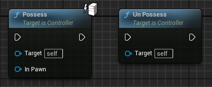

Si un **Controller** posee a un **Pawn** que ya estaba siendo controlado por otro **Controller**, este último deja de controlarlo y pasa a ser controlado por el nuevo **Controller**.
Igualmente, si un **Controller** ya posee a un **Pawn** y se le indica que posea a otro, deja de controlar al primero y pasa a controlar al segundo.

En todos los casos tanto el **Controller** como el **Pawn** son notificados.
El  recibe los eventos  o  y el  recibe los eventos Possessed() /  o .

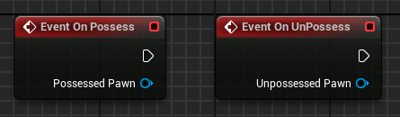

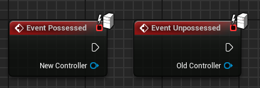

Estos eventos son útiles.
Por ejemplo, si un personaje está poseído por un **AIController** y el jugador lo posee, el **AIController** dejará de controlar al personaje.
Si más tarde el jugador posee aún personaje diferente, el **AIController** no volverá a controlar al primer personaje, automáticamente.
Por tanto, se puede usar los eventos indicados para hacer que el **AIController** vuelva a controlar al primer personaje cuando el jugador deje de controlarlo.

Además de usar los métodos `Possess()` y `UnPossess()`, los **Pawn** se puede configurar para que sean poseídos automáticamente por un **Controller** cuando son instanciados y comienza su ejecución en el nivel, como se puede ver en la @fig-pawn-auto-possess:

* Si un **Pawn** se configura con la propiedad **Auto Possess Player**, es poseído automática por el **PlayerController** del jugador indicado, al ser instanciado.

* Si un **Pawn** se configura con la propiedad **Auto Possess AI**, es poseído automática por el **AIController** indicado.

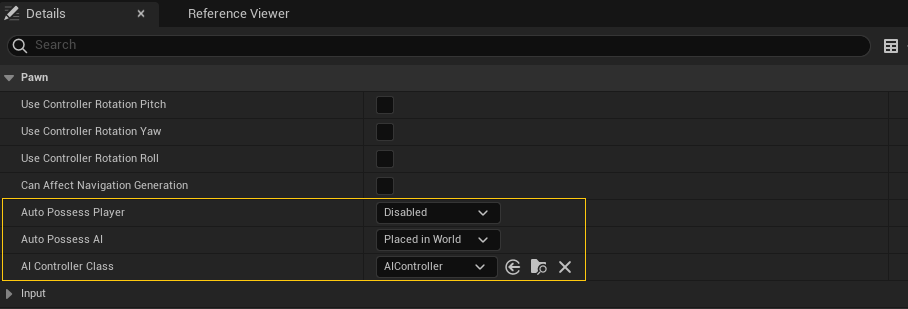{#fig-pawn-auto-possess}

### Control de actores

Una vez el **Controller** posee un **Pawn** puede controlarlo a través de sus métodos, pero debemos tener en cuenta que por defecto las opciones se limitan a mover y rotar el actor.

Para que el **Controller** pueda indicar acciones adicionales al **Pawn** --como atacar, salta, escalar o defenderse-- es necesario implementar una interfaz que exponga dichas acciones en el **Pawn** y que el **Controller** pueda llamar. 

Por ejemplo, en la @fig-pawn-control se ilustra un posible caso dónde nuestro **MyPlayerController** --que hereda de **PlayerController** para añadirle funcionalidades adicionales, como la lectura de las acciones del jugador-- posee al actor para el personaje del jugador **MyPlayerPawn**

```{mermaid}
%%| label: fig-pawn-control
%%| fig-cap: "Ejemplo de interfaz para el control del **Pawn** del jugador."
%%| file: figures/pawn-control.mm
%%| fig-width: 15cm
```

Este **Pawn** es teledirigido por el controlador.
Puede dirigir su movimiento usando el método  (ver la @fig-pawn-addmovementinput) de la clase **Pawn** o indicar otras acciones utilizando la implementación en **MyPlayerPawn** de la interfaz **MyPlayerPawnInterface** que contiene acciones del personaje especificas para este juego.

{#fig-pawn-addmovementinput}

#### Movimiento del actor

Un **Controller** puede mover un **Pawn** directamente llamando a métodos como `SetActorLocation()` o `AddActorWorldOffset()`, que tienen todos los actores.

Sin embargo, lo más habitual es que el **Controller** indique al **Pawn** que se mueva en una dirección, para lo que puede usar al método  de **Pawn**.

En la @fig-pawn-movement-input se puede observar como se lee la acción de entrada *Move*, para luego llamar a `AddMovementInput` con sus valores para actualizar el movimiento del **Pawn**.
En este ejemplo la lectura de la acción se hace desde el propio **Pawn**, no desde el **Controller**.

{#fig-pawn-movement-input}

La clase **Pawn** acumula las direcciones indicadas a través `AddMovementInput()` en una variable interna de tipo vector, llamada `ControlInputVector`.

Por defecto, la clase **Pawn** no hace nada con este vector, pero la idea es que en cada *tick* se lea el valor acumulado en `ControlInputVector`, usando el método `ConsumeMovementInputVector()`, y este valor se use para mover el personaje.
Al usar `ConsumeMovementInputVector()`, el valor de `ControlInputVector` se pone a $(0, 0, 0)$, preparado para el siguiente frame.

Lo ideal no es implementar la lógica de movimiento directamente en el método `Tick()` del **Pawn**, sino en un componente  que luego se añade al actor **Pawn**.
Es en el método `TickComponent()` de este componente de movimiento del actor, donde se llama a `ConsumeMovementInputVector()` y se usa el valor devuelto para mover el **Pawn**, de la forma que corresponda, como se ilustra en el diagrama de secuencia de la @fig-controller-pawn-movement-sequence.

```{mermaid}
%%| label: fig-controller-pawn-movement-sequence
%%| fig-cap: "Ejemplo de control de movimiento de un **Pawn**."
%%| file: figures/pawn-movement-sequence.mm
%%| fig-width: 15cm
```

Por ejemplo, todo actor  --que es una clase derivada de **Pawn**-- tiene por defecto un  que se hace cargo del movimiento del personaje.
Este componente deriva de  que, a su vez, deriva de **MovementComponent**.

Realmente, si un actor **Pawn** detecta que se le ha añadido un **PawnMovementComponent**, su método `AddMovementInput` --que es llamado por el **Controller**-- no acumula el vector de movimiento en `ControlInputVector` directamente, sino que se lo entrega al **PawnMovementComponent**, a través del método .

Entonces, el componente puede decidir qué hacer con el vector de movimiento.
Por defecto, se lo devuelve al **Pawn** sin cambios, para que lo acumule en `ControlInputVector`, pero siempre podemos sobrescribir la función `AddInputVector` para cambiar este comportamiento.

Luego, en cada *tick*, el **MovementComponent** consume el valor acumulado en `ControlInputVector` mediante `ConsumeMovementInputVector()` y desplaza al actor como corresponda.

En la @fig-controller-character-movement-sequence se puede ver un diagrama de secuencia para los actores de la clase **Character**.

```{mermaid}
%%| label: fig-controller-character-movement-sequence
%%| fig-cap: "Ejemplo de control de movimiento de un **Character**."
%%| file: figures/character-movement-sequence.mm
%%| fig-width: 15cm
```

Unreal Engine proporciona diferentes **MovementComponent** para implementar diferentes tipos de movimiento, como por ejemplo: , , ,  o  (ver la @sec-movement-components).

De estos, solo **FloatingPawnMovement** y **CharacterMovementComponent** heredan de **PawnMovementComponent**, por lo que interactúan con el actor **Pawn** de la forma comentada.
El resto sirve para mover cualquier actor de otras maneras.

Obviamente, siempre podemos crear nuestros propios **MovementComponent** para implementar tipo de movimiento que necesitemos, tanto para **Pawn** --preferentemente heredando de **PawnMovementComponent**-- como para cualquier otro tipo de actor.

#### Rotación de control

En `ControlInputVector` el **Pawn** se almacena la dirección en la que el **Controller** quiere que se mueva el personaje, pero a veces puede interesar tener otra dirección con la que indicar hacia donde debe mirar el personaje o la cámara del jugador.

Por ejemplo, en algunos juegos un personaje se puede mover en una dirección diferente a aquella en la que mira la cámara del jugador o en la que apunta.
Esto es especialmente interesante con los NPC, ya que a veces la IA necesita poder controlar hacia dónde tiene que mirar un personaje, sin moverlo del sitio.

Para ello, el **Controller** tiene una variable interna de tipo , llamada `ControlRotation`, que se puede leer y establecer mediante los métodos  y .

La clase  derivada de **Controller** añade los métodos ,  y  para acumular fácilmente ángulos de rotación en `ControlRotation`, en cualquiera de los 3 ángulos de Euler (ver la @fig-ue-euler-angles).

{#fig-ue-euler-angles}

Los valores indicados al invocar estas funciones son multiplicados por las propiedades **Input Pitch Scale**, **Input Yaw Scale** y **Input Roll Scale** del **PlayerController**, antes de ser acumulados.
Como en el caso del movimiento, los valores se acumulan en la variable interna `RotationInput`, para luego procesarla y actualizar `ControlRotation` convenientemente en el método `Tick()`.

Las funciones `AddPitchInput()`, `AddYawInput()` y `AddRollInput()` son ideales para usarlas con los eventos de la entrada del jugador.
Por ejemplo, que cuanto más acciona el jugador el *stick* a la derecha, más ángulo de *yaw* se acumule en la *rotación de control*.

Además, la clase **Pawn** también incluye tres funciones por conveniencia: ,  y , que realmente llaman a las anteriores en el **PlayerController**.

En la @fig-pawn-control-rotation-input se puede observar un ejemplo dónde se recibe la acción de entrada *Look* en el **Pawn** y se usan estas funciones para cambiar la *rotación de control* en el **Controller**.

{#fig-pawn-control-rotation-input}

Igualmente, la clase **Pawn** tiene la función , que sirve para leer directamente la *rotación de control* del **Controller** desde el **Pawn**.

Gracias a que **Controller** y **Pawn** tiene una interfaz bien definida para gestionar la *rotación de control*, tanto la clase **Pawm** como muchos componentes pensados para ser utilizados en un **Pawn** --como **CameraComponent** o **SpringArmComponent**-- vienen preparados para leer la *rotación de control* y usarla.

Por ejemplo, en la @fig-pawn-control-rotation se pueden ver las opciones de configuración de la *rotación de control* en la clase **Pawn**, que pemite sincronizar automáticamente la rotación del **Pawn** con la *rotación de control* en su controlador.
Mientras que en la @fig-camera-control-rotation se pueden observar una opción similar en el componente de cámara **CameraComponent**.

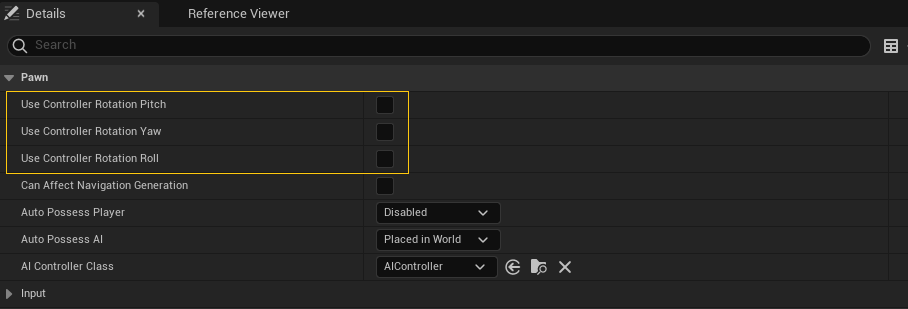{#fig-pawn-control-rotation}

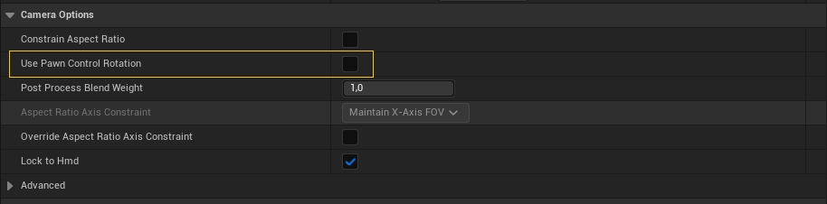{#fig-camera-control-rotation}

#### Punto de vista del jugador {#sec-controller-pov}

Relacionado con la *rotación de control*, la clase **Controller** también maneja los conceptos de punto de vista --o POV, del inglés *point of view*-- del jugador y de *view target*.

El *view target* se obtiene mediante el método  de **Controller** y devuelve el actor «al que mira el controlador».
Por lo general, se trata del **Pawn** poseído por el controlador, pero el **PlayerController** permite cambiarlo mediante el método  y lo usa para determinar el POV de la cámara del jugador (ver la @sec-playercameramanager).

El POV del jugador se obtiene mediante el método  de **Controller**, pero significa cosas diferentes en función del tipo de controlador.

En el **AIController** devuelve el punto de vista del **Pawn** desde la altura de sus «ojos».
Para ello llama a `GetActorEyesViewPoint()` en el **Pawn** y devuelve el resultado.

El método  de **Pawn** devuelve el POV en la posición del **Pawn** en el mundo, pero desplazado en el eje Z la cantidad indicada en la propiedad **Base Eye Height** del **Pawn**.
Para la dirección del POV, considera la *rotación de control* del **Controller** que lo posee, si está poseído, o la rotación del propio **Pawn**, si no lo está.

En el **PlayerController**,  devuelve el POV de la cámara calculado por el actor , en caso de que el **PlayerController** tenga una referencia a un actor de este tipo.
En otro caso, si el controlador tiene un configurado un actor *view target*, devuelve la rotación y localización de dicho actor.
Finalmente, si no tiene un *view target*, sigue las mismas reglas que el **AIController** para calcular el punto de vista del **Pawn** desde la supuesta altura de sus ojos.

## Gestión de la entrada del jugador (*PlayerController*)

Como hemos comentado, el  es el **Controller** responsable del leer la entrada del jugador y cambia el estado del personaje en base a ella.

En este apartado veremos los componentes del *gameplay framework* que se encargan de gestionar la entrada del jugador y cómo se relacionan con el **PlayerController**.

### Sistema de entrada *legacy* vs. *enhanced*

En Unreal Engine 4 se usaba un sistema donde la entrada de los controles de los dispositivos del jugador se mapeaba en acciones configurando las opciones en **Project Settings / Input** (ver la @fig-input-legacy-setup).
El código de *gameplay* de nuestro juego podía leer estas acciones, principalmente, a través de la clase **InputComponent**.

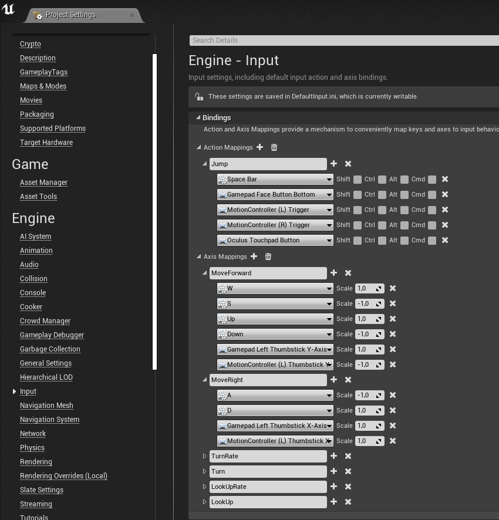{#fig-input-legacy-setup}

En Unreal Engine 5 este sistema pasó a considerase *legacy*, para ser sustituido por un nuevo sistema llamado **Enhanced Input**.

El **Enhanced Input** ofrece un montón de características nuevas.
Entre otras diferencias, en el nuevo sistema las acciones de entrada y el mapeo a de los controles a estas, se definen mediante *assets* de tipo **Input Action**, lo que facilita migrar acciones de un proyecto a otro.

Además, las **Input Action** soporta diferentes condiciones para notificar la acción de entrada al código de *gameplay*.
Por ejemplo, se puede condicionar la activación de la acción a que el control se mantenga accionado cierto tiempo o a que el jugador accione cierta combinación de controles en un periodo de tiempo determinado --lo que se llama, un *combo*--.
Esta funcionalidad permite ahorrar tiempo, ya que nos evita tener que implementar nosotros mismos el procesado de este tipo de entradas.

En cualquier caso, el código de *gameplay* puede recibir estas acciones de entrada a través de la clase **EnhancedInputComponent**.

El antiguo sistema sigue siendo el usado por defecto en los proyectos nuevos de Unreal Engine 5.0 aunque, en cualquier momento, se puede activar el nuevo en **Project Settings / Input**.
Pero desde Unreal Engine 5.1 la situación es a la inversa.
El **Enhanced Input** viene activado por defecto, pudiendo volver al antiguo en la configuración del proyecto, si es realmente necesario.

Para los temas de entrada e interacción que veremos a continuación, en general, no importa que sistema estemos usando.
Ambos permite definir acciones que se disparan cuando el jugador las acciona los controles configurados para ellas.
Lo único que tiene que hacer el código de *gameplay* es «atender» a dichos eventos.

A continuación vamos a referirnos a **PlayerInput** y a **InputComponent** por economía del lenguaje, pero debemos recordar que, si estamos usando el **Enhanced Input**, realmente estaríamos hablando de las clases **EnhancedPlayerInput** y **EnhancedInputComponent**.

### *PlayerInput*

La instancia de **GameViewportClient** captura los eventos de entrada del jugador, localiza el controlador del jugador **PlayerController** que debe recibirlos --a través del objeto **LocalPlayer** correspondiente-- y se los entrega.

:::{.callout-note}
En juegos multijugador local se pueden crear nuevos jugadores y asignarles un dispositivo de entrada usando el nodo **Create Local Player**, en Blueprint, o la función .
De esta forma, cuando llegan los eventos de entrada el motor sabe a qué jugador corresponde y puede localizar su **PlayerController**.
:::

El **PlayerController** entrega los eventos a su objeto **PlayerInput**, que tiene la responsabilidad de mapear los controles de los dispositivos del jugador en acciones de entrada.

Es posible suscribirse a los eventos de **PlayerInput** para recibir notificaciones cuando se acciona una acción de entrada, pero lo más habitual es hacerlo a través del **InputComponent**.

### *InputComponent*

El  es el componente que generalmente usan los actores para acceder a la entrada del jugador.
Es decir, lo podemos usar en el actor del **PlayerController** para controlar el personaje, pero también en el actor de una puerta o de un objeto recogible, para recibir la acción del jugador cuando quiera abrir la puerta o recoger el objeto en cuestión.

Con **InputComponent** podemos conectar el código de *gameplay* del actor a las acciones de entrada definidas en el juego.
Esto se puede hacer usando eventos, para que el **InputComponent** ejecute nuestro código cuando llegue cierta entrada del jugador, como se puede observar en la @fig-ue-input-action-event.

::: {#fig-ue-input-action layout-nrow=2}

{#fig-ue-input-action-event}

{#fig-ue-input-action-polling}

Modos de acceso a las acciones de entrada del jugador.
:::

Sin embargo, si vamos a hacer algún tipo de cálculo combinando los valores de varias acciones de entrada, puede resultar más cómodo leer dichos valores cuando nos haga falta, como se observa en la @fig-ue-input-action-polling[Más sobre la entrada del jugador en C++ en @TorresD3DUnrealCpp].

Aunque no veamos a **InputComponent** en el editor, todos los actores tienen una instancia de ese componente, porque cualquier actor en la escena puede acceder a la entrada del jugador.

Quien conecta el **PlayerInput** --que es quién tiene acceso a las acciones de la entrada-- con los **InputComponent** de los actores es el **PlayerController**.

### *PlayerController*

En la arquitectura de muchos juegos, es buena idea tener un objeto que represente al jugador y que controle y gestione todo aquello que le concierne a él y a su personaje.
Como hemos comentado anteriormente, en Unreal Engine, este objeto es el .

El **GameMode** crea un actor **PlayerController** para cada jugador --generalmente a través del método `Login()`-- y se destruye al cargar un nuevo nivel.

En juegos multijugador online, el **PlayerController** existe en el servidor y se replica en el cliente del jugador correspondiente, donde tiene acceso a la entrada de dicho jugador.

Por defecto, el **PlayerController** tienen varias responsabilidades:

* Gestionar la entrada y teledirigir al personaje de su jugador.
  El **PlayerController** tiene el objeto **PlayerInput** para leer la entrada y puede poseer a cualquier actor derivado de la clase `Pawn` para controlarlo.

* Gestionar la *rotación de control*, que se puede usar para controlar la dirección en la que mira el personaje o la cámara del jugador.

* Crear el HUD --la interfaz de usuario-- del jugador.
  Actualmente, la forma adecuada de hacerlo es creando *widgets* con UMG (*Unreal Motion Graphics*) y mostrarlos usando `AddToViewport()` en el evento `BeginPlay()` del **PlayerController**. 

* Crear el actor que controla la cámara del jugador, llamado **PlayerCameraManager**.
    
  Vincular el control de cámara y el HUD con el **PlayerController** es muy útil en los juegos multijugador, donde hay varías cámaras y varias interfaces de usuario.
  Así el resto de la lógica del juego puede localizar fácilmente el control de cámara y la interfaz de un jugador concreto con solo preguntarle al **PlayerController** correspondiente.

* Gestionar información específica del jugador.
  El **PlayerController** puede usar para gestionar otra información del jugador --aparte de su *rotación de control*-- especialmente si debe sobrevivir a la destrucción del actor personaje.
  Por ejemplo, la puntuación, las habilidades adquiridas o su inventario.

Respecto a esto último, debemos tener en cuenta que el **PlayerController** se destruye y se vuelve a crear al cargar un nuevo nivel.
La información que debe mantenerse durante toda la ejecución del juego puede alojarse en la instancia de **GameInstance** o en un subsistema.
En ese caso, es conveniente mantener una referencia a esta información en el **PlayerController**, para facilitar el acceder a ella, por ejemplo, desde el actor del personaje o desde la interfaz de usuario.

### La pila de *InputComponent* del *PlayerController*

Para gestionar la entrada del jugador, el **PlayerController** tiene un objeto **PlayerInput**, que mapea los controles y dispositivos de entrada en acciones, y una pila de **InputComponent** de los actores interesados en leer la entrada del jugador.
El **PlayerInput** emite los eventos de entrada y los entrega a los **InputComponent** en el orden determinado por la pila.
Como se esquematiza en @fig-input-component-stack, según va pasando por los **InputComponent**, cada uno de ellos puede elegir «consumir» el evento de entrada, haciendo que no alcance a componentes posteriores en la pila.

{#fig-input-component-stack}

El **PlayerController** es un actor, por lo que tiene un **InputComponent**.
Este **InputComponent** es, generalmente, el primero de la pila.
Después está el del personaje que el **PlayerController** posee.

Esto significa que la gestión de la entrada del jugador se puede implementar tanto en el **PlayerController** como en el actor del personaje.

Obviamente, es posible gestionar toda la entrada del jugador en el **Pawn** del personaje, aunque esto solo es aconsejable en los proyectos más simples.
Cuando varios jugadores juegan en un mismo equipo, los jugadores pueden cambiar de personaje controlado durante la partida o la gestión de la entrada es compleja, es mejor hacerlo en el **PlayerController**.

### Interacción con objetos

Veamos como usar la arquitectura descrita para implementar la interacción con objetos.

Un caso de uso típico en cualquier videojuego es hacer que cuando el jugador esté cerca de un objeto pueda cogerlo o accionarlo.
Es algo muy típico con armas, botiquines, puertas, interruptores, objetos que podemos agarrar para empujar, etc.

Todo empieza porque el objeto tenga un ***trigger** que permita saber cuándo estamos cerca de él.
Sin embargo, tanto el personaje como el objeto pueden ser informados del momento en el que eso ocurre, por lo que podríamos implementar el código de esta funcionalidad tanto en el actor del objeto como en el del personaje.

Si solo el personaje tuviera acceso a la entrada del jugador, probablemente la segunda sería la mejor o, quizás, la única opción.
Pero en la arquitectura descrita, los objetos pueden leer la entrada del jugador si se colocan los primeros en la pila de **InputComponent** del **PlayerController**, como se ilustra en la @fig-input-component-stack.

Después, cuando el jugador se aleja del objeto, lo único que hay que hacer es quitar el **InputComponent** del actor de la pila del **PlayerController**.

Para realizar estas operaciones se usan los métodos  y  de la clase **Actor**.
Ambos necesitan como argumento el **PlayerController** del jugador del que quieren leer o dejar de leer la entrada.

Esto permite implementar la lógica que gestiona la acción del jugador en el actor del objeto.

La ventaja de hacerlo así es que evitamos añadir esta responsabilidad en el código del personaje que, por lo general, ya tiene muchas otras cosas de las que encargarse.
De esta forma, es más fácil añadir nuevos tipos de objetos con los que puede interactuar el jugador.

## Datos del jugador y *PlayerState*

El **PlayerController** tiene una propiedad que referencia a un actor , que contiene la información específica de cada jugador que deba ser accesible al resto de jugadores en juegos multijugador online, como la saluda o la puntuación.

El **Pawn** poseído por el **PlayerController** de un jugador devuelve la instancia del **PlayerState** a través del método .

Para almacenar datos que el resto de jugadores no necesitan conocer --como el inventario o la cantidad de munición-- se pueden usar objetos y estructuras de datos referenciadas desde el propio **Pawn** del personaje o el **PlayerController**.
Aunque referenciar esta información desde el **Pawn** del personaje parece lo más intuitivo --ya que son características del personaje-- en juegos multijugador online es común usar el **PlayerController**, ya que este actor solo existe en el cliente del jugador.

Teniendo en cuenta lo comentado, veamos algunos supuestos prácticos:

* ¿Dónde guardar una propiedad como la salud del personaje?
  
  * **Si el juego es multijugador online**, la propiedad debe estar en **PlayerState**, para que el servidor pueda gestionar esta información al tiempo que está disponible para los clientes.

  * **Mientras que un juego de un solo jugador**, serían igual de válidos **PlayerState**, **PlayerController** y el propio **Pawn** del personaje.

    La ventaja de usar **Pawn** es que realmente es un tipo de dato que interesa que se reinicie cada vez que reaparece el personaje, lo que ocurre automáticamente si se guarda en el actor del personaje.

    Sin embargo, se puede optar por el **PlayerController** para centralizar toda la información del jugador en un mismo lugar, que además es fácilmente accesible tanto por el sistema de salvado como por el código de la interfaz de usuario.
    A cambio, hay que reiniciar la propiedad manualmente cada vez que revive el personaje.

* ¿Y un inventario? Por lo general el inventario es una entidad que no suele ser visible para el resto de jugadores, por lo que se puede guardar en el **PlayerController**.
  En cualquier caso, si el inventario debe persistir entre niveles, debería guardarse en el **GameInstance** --o en un subsistema-- y, probablemente, referenciarlo desde el **PlayerController** para facilitar el acceso al resto de componentes que lo necesiten.

  En juegos multijugador online, hay que tener en cuenta que el **GameInstance** no se replica entre clientes y servidor.
  Por tanto, el inventario debe ser gestionado en el **GameInstance** del servidor --para evitar cualquier tipo de trampa-- pero al cargar un nivel debe copiarse la información necesaria al **PlayerController** de cada jugador, para que así sea replicada automáticamente en el **PlayerController** del cliente correspondiente.
  De esta forma, cada jugador en su cliente tiene acceso a la información de su inventario, al mismo tiempo que el servidor se hace cargo de gestionar el inventario de todos los jugadores.

## *AIController*

// TODO: AI Tasks  (AAIController)

// PathFollowingComponent


## *Pawn* y *Character*

Como hemos visto,  es la clase base de todos los actores que pueden interactuar con el mundo y ser controlados por el jugador o por la IA, mediante un **Controller**.

El *gameplay framework* incluye las siguientes clases que heredan de **Pawn**:

* El **DefaultPawn** extiende **Pawn** añadiendo un *collider* esférico y un **StaticMesh**.
  Se puede mover libremente en 3D, sin ser afectado por la gravedad, y se puede usar para explorar el nivel durante el desarrollo, independientemente de los personajes que se vayan a usar en el juego.

* El **SpectatorPawn** extiende **DefaultPawn** para ofrecer la funcionalidad de espectador de la partida, útil en juegos multijugador online.

* El  extiende **Pawn** para implementar la clase base de vehículo con ruedas.

  Esta clase de actor incluye por defecto un componente  que implementa la simulación del movimiento del vehículo, usando el motor de físicas Chaos[@TorresD3DFisicas] de Unreal Engine.
  Este componente se puede sustituir fácilmente[Más sobre CDO en @TorresD3DUnrealCpp] por cualquier componente que herede de , cuando se quiere usar una simulación diferente.

* El  extiende **Pawn** para añadir todo lo que necesita un personaje tradicional humanoide, como el que se usa en muchos juegos de acción en primera o tercera persona: una cápsula de colisión, un **SkeletalMeshComponent** --es decir, una malla que puede ser animada mediante el sistema de animación de Unreal Engine-- y un **CharacterMovementComponent**, que implementa modos de movimiento típicos como: caminar, correr, saltar, nadar, incluso, volar.

Estas clases se heredan para añadir la funcionalidad específica que necesitemos en nuestro juego, según el tipo de personaje que queramos implementar.

La clase **Character** es la base más común para desarrollar los personajes humanoides complejos.
Mientras que la clase **Pawn** se usa como base para personajes o entidades controlables más básicas o cuando lo que se pretende implementar no encaja bien en ninguna de las clases anteriores.

## Componentes de movimiento {#sec-movement-components}

Obviamente, se puede heredar de **ActorComponent** para implementar un componente que se encargue del movimiento de un actor en cada *tick*.
Sin embargo, es recomendable heredar de  para hacer un componente de movimiento, ya ofrece cierta utilidad que puede ser útil al implementar un componente de movimiento:

* Facilita la restricción del movimiento a un plano o a un eje específico.

* Incluye métodos que son útiles para manejar los resultados de colisión y hacer los cálculos para mover el actor.

* Está configurado para hacer *tick* --y, por tanto, aplicar el movimiento-- antes de los cálculos de físicas y del *tick* del actor donde se añade.

* Ofrece una interfaz para configurar a qué componente del actor se aplica el movimiento (ver ).
  Por defecto, si no se indica ninguno, usa el componente raíz del actor, moviendo de esta manera a todo el actor.

Algunos de los componentes de movimiento más comunes son:

* .
  Componente de movimiento que permite mover un actor en cualquier dirección 3D, sin que sea afectado por la gravedad.
  Es el componente de movimiento que usa por defecto el **DefaultPawn**.

* .
  Componente de movimiento que permite mover un actor en línea recta, con opciones para que sea afectado por la gravedad, para perseguir un objetivo y para que rebote al colisionar con otros elementos del nivel.
  Es un componente ideal para implementar todo tipo de proyectiles.

* .
  Componente de movimiento que permite rotar un actor en torno a un eje de forma continua.

* .
  Componente de movimiento que permite mover un actor de forma suave entre varios puntos.

* .
  Componente de movimiento diseñado para mover un actor de la clase **Character**.
  Es un componente muy completo, con mucha funcionalidad, que permite mover un personaje de forma realista.
  Soporta diferentes modos de desplazamiento, como caminar, correr, saltar o nadar y soporta añadir otros modos de desplazamiento personalizados.

* .
  Componente de movimiento que permite mover a un actor de forma automática, en base a una ruta calculada por el sistema de navegación de Unreal Engine.
  Componentes como **CharacterMovementComponent**, **FloatingPawnMovement** o **ChaosVehicleMovementComponent** heredan de **NavMovementComponent** para poder mover actores u otros componentes de forma automática por el nivel.

* .
  Componente de movimiento que permite mover un vehículo con ruedas.
  Es usado por defector por los actores de la clase **WheeledVehiclePawn**.

## Control de cámara con *PlayerCameraManager* {#sec-playercameramanager}

Como hemos comentado anteriormente, cada **PlayerController** crea y gestiona su actor **PlayerCameraManager**, que mantiene la información del punto de vista (POV) de la cámara que necesita el motor para renderizar la escena.

El  se puede modificar derivando de dicha clase e indicando la nueva clase en las propiedades del **PlayerController**, como se puede observar en la @fig-playercontroller-camera-manager.

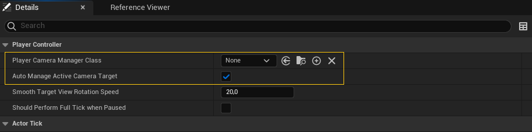{#fig-playercontroller-camera-manager}

En cada *tick* el **PlayerController** llama al método `UpdateCamera()` de su **PlayerCameraManager** para que actualice las propiedades con el POV deseado más reciente.
El motor accede a estas propiedades a través del **LocalPlayer**, que utiliza al **PlayerController** y al **PlayerCámeraManager** para recopilar la información.

### Actor *view target*

Sobreescribiendo `UpdateCamera()` en **PlayerCameraManager** se pueden establecer las propiedades del punto de vista de la cámara del jugador que usará el motor para el render.
Sin embargo, la implementación por defecto que ofrece Unreal Engine en el **PlayerCameraManager** es bastante flexible, permitiendo ajustar el POV sobreescribiendo varios métodos.

La implementación del **PlayerCameraManager** se basa en el concepto de *view target*, que es el actor que va a determinar el punto de vista del jugador.
Este actor se puede obtener y cambiar manualmente en el **PlayerController**, mediante los métodos ,  y  (ver la @fig-playercontroller-view-target), aunque realmente esta configuración se almacena en el **PlayerCameraManager**.

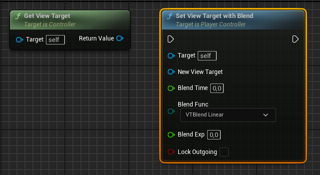{#fig-playercontroller-view-target}

Además, la asignación del *view target* puede ocurrir automáticamente, activando la opción **Auto Manage Active Camera Target** del **PlayerController** (ver la @fig-playercontroller-camera-manager).
En ese caso el **PlayerController**:

1. Busca un actor **CameraActor** con la opción **Auto Activate for Player** configurada con el jugador del **PlayerController** (ver la propiedad en la @fig-cameraactor-auto-activate).
   Si lo encuentra, asigna ese actor  como *view target*.

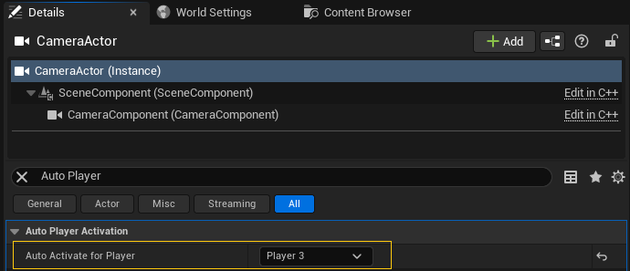{#fig-cameraactor-auto-activate}

2. En otro caso, utiliza el **Pawn** poseído en cada momento por el **PlayerController**.

3. Si el **PlayerController** no posee a ningún **Pawn**, se usa el propio actor **PlayerController** como *view target*.

Qué actor es el *view target* es importante porque durante la ejecución de `UpdateCamera()` se invoca el método  del *view target*.
Mediante este método el actor devuelve el POV deseado para el jugador.

:::{.callout-tip}
Este sistema no solo ofrece mucha flexibilidad para gestionar múltiples cámaras de *gameplay*.
También se puede explotar para desarrollar un sistema de cámaras de depuración, que permita cambiar el punto de vista y la configuración en tiempo real, para visualizar el nivel desde diferentes puntos de vista y encontrar y resolver problemas.
:::

El comportamiento por defecto de `CalcCamera()` en cualquier actor es buscar su primer componente **CameraComponent** y devolver su localización, rotación y otras propiedades como el punto de vista del jugador.

Es decir, en Unreal Engine, el componente **CameraComponent** es realmente una especie de objeto *marcador* que facilita configurar las propiedades de las cámaras directamente en la escena.
En realidad no tienen conexión directa con la cámara del sistema de render, ni son necesarios para ubicar y configurar adecuadamente las cámaras.

Si un el actor *view target* no tiene un **CameraComponent**, el método `CalcCamera()` retorna la ubicación y rotación del actor como POV del jugador.

### Transiciones entre *view targets*

La arquitecta comentada facilita cambiar entre diferentes modos de cámara, si el juego lo requiere.

Por ejemplo, en un juego de acción en tercera persona, el jugador puede controlar a un personaje que se mueve libremente por el nivel, utilizando una cámara que orbita libremente alrededor del personaje.
Pero cuando el jugador entra en un vehículo, el *view target* puede cambiar al vehículo, haciendo que se use una cámara externa que facilite la condución.
Igualmente, cuando el personaje se acerca a una zona de escalada, el *view target* se puede cambiar a un actor con una cámara que se mueve en un plano paralelo a la pared, a una distancia mayor, para que el jugador pueda ver mejor lo que está haciendo.
O en una arena de combate, el *view target* puede cambiar a un actor con una cámara externa que orbite en alto sobre la zona, facilitando al jugador tener una vista de la acción.

Al cambiar el *view target* en el **PlayerController** mediante el método `SetViewTarget()`, la transición entre ambos POV es instantánea.
Sin embargo, si se usa el método , se puede configurar un tipo de transición, haciendo que el **PlayerCameraManager** interpole las propiedades de la cámara entre el POV del *view target* anterior y el nuevo (ver la @fig-playercontroller-view-target).

Por ejemplo, en el caso de la escalada, se puede usar una transición de tipo *ease out*, para que la cámara se aleje del personaje de forma suave, y otra de tipo *ease in*, para que la cámara se acerque al personaje de forma suave cuando termina la escalada.

<!-- TODO: Referencia a los ease aquí o en un capítulo de animaciones -->

### Personalizar el comportamiento de la cámara

En la arquitectura descrita existen diferentes puntos donde se puede personalizar el comportamiento de la cámara.

#### *CalcCamera()* en el *view target*

Sobreescribir el método  en el actor --solo en C++-- es ideal para hacer cambios del control de cámara específicos de ese actor.
Por ejemplo, un **Pawn** puede tener varios **CameraComponent** para indicar diferentes posibles posiciones de la cámara, como: primera o tercera persona, cámara al hombro en el lado derecho o izquierdo, cámara con mira, etc.

En `CalcCamera()` se puede implementar la lógica para elegir el **CameraComponent** adecuado, según las preferencias del jugador o el estado del personaje.
`CalcCamera()` es, probablemente, el primer lugar donde mirar si queremos ajustar el comportamiento de la cámara.

Parece hacer cambios más globales, es necesario ir al **PlayerCameraManager** y sobreescribir alguno de sus métodos.

#### *BlueprintUpdateCamera()* y *UpdateViewTargetInternal()*

Se puede sobreescribir `BlueprintUpdateCamera()` en Blueprint para hacer cambios que afecten a todos los **view target**.

En **PlayerCameraManager**, durante el `UpdateCamera()`, se llama a `UpdateViewTargetInternal()` indicándole el *view target* en los argumentos.
Este es el método que llama al `CalcCamera()` de dicho *view target* y, posteriormente, pasa el POV devuelto por ese método a `BlueprintUpdateCamera()`, para que pueda modificarlo en un Blueprint.
Si `BlueprintUpdateCamera()` devuelve `true`, sus cambios tienen prioridad sobre los devuelto por `CalcCamera()`.

Para hacer este tipo de cambios globales, pero en C++, se puede sobreescribir `UpdateViewTargetInternal()`.
Tanto `UpdateViewTargetInternal()` como `BlueprintUpdateCamera()` son ideales para cambios que solo requieran sobreescribir el POV devuelto por el método `CalcCamera()` del *view target* indicado, sin afectar al resto de maneras de obtener el POV del jugador.

#### *UpdateViewTarget()*

El método `UpdateViewTargetInternal()` es llamado por `UpdateViewTarget()`.

En el método `UpdateViewTarget()` recibe el *view target* y para obtener el POV sigue los siguientes pasos:

1. Si el **view target** indicado es un actor **CameraActor**, obtiene el POV directamente del **CameraActor**.

2. En caso contrario, comprueba si se ha activado un estilo de cámara válido en la variable miembro `CameraStyle` --solo en C++-- del **PlayerCameraManager**.
   Si así fuera, calcula directamente el POV del jugador según el estilo indicado[^camera-style].

[^camera-style]: `UpdateViewTarget()` incluye implementaciones de ejemplo para unos pocos estilos: **Fixed**, **ThirdPerson**, **FirstPerson**, **FreeCam** y **FreeCam_Default**.
Obviamente, se puede sobreescribir el método para hacer implementaciones propias o añadir nuevos estilos, pero esta no es la forma más común de implementar el control de cámara, en la actualidad.

3. En otro caso, llama a `UpdateViewTargetInternal()` que, a su vez, llama al `CalcCamera()` del **view target**.
   Luego llama `BlueprintUpdateCamera()`, para que pueda modificar el POV devuelto por dicho actor.

4. Finamente, aplica los modificadores de cámara al POV obtenido en alguno de los pasos anteriores (ver la @sec-camera-modifiers) y retorna el POV resultante a `DoUpdateCamera()` del **PlayerCameraManager**.

Por tanto, se puede sobreescribir `UpdateViewTarget()` para hacer cambios que afecten a todas las formas de calcular el POV deseado o para crear nuevos estilos de cámara, si preferimos implementar el control de la cámara directamente de esta última manera.

#### *DoUpdateCamera()* y *UpdateCamera()*

Finalmente, `UpdateViewTarget()` es llamado por `DoUpdateCamera()` que, a su vez, es llamado por `UpdateCamera()` desde el *tick* del **PlayerController**.

`DoUpdateCamera` implementa el mecanismo de transición de *view target*, interpolando entre dos POV al indicar un nuevo *view target* mediante `SetViewTargetWithBlend()`.

Como hemos comentado, `DoUpdateCamera()` llama `UpdateViewTarget()` con indicándole el *view target* actual para obtener el POV deseado.
Si está en mitad de una transición entre dos *view target*, hace la llamada a `UpdateViewTarget()` dos veces, una para el *view target* previo y otra para el nuevo. 
Después interpola entre los POV devueltos por ambas llamadas, para obtener el POV definitivo en el frame actual.

Por tanto, se puede sobreescribir `DoUpdateCamera()` para hacer cambios en la manera en la que se interpola entre los POV al cambiar el *view target*.
O para modificar completamente el control del cámara.

Al finalizar, `DoUpdateCamera()` almacena el POV resultante en **PlayerCameraManager** para su uso durante el render.
También actualiza el fundido de cámara y de audio, si está activo --ver ,  y  de **PlayerCameraManager** en la @fig-playercameramanager-fade-- y aplica otros efectos.

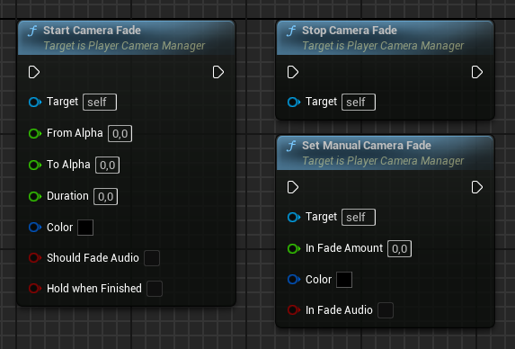{#fig-playercameramanager-fade}

En la @fig-update-camera se puede ver un esquema de la cadena de responsabilidad que se sigue para obtener el POV del jugador para el render.

{#fig-update-camera}

### Modificadores de cámara {#sec-camera-modifiers}

El **PlayerCameraManager** soporta modificadores de cámara que pueden añadir y eliminar mediante los métodos `AddNewCameraModifier()` y `RemoveCameraModifier()`, respectivamente (ver la @fig-playercameramanager-camera-modifiers) o en las propiedades de la clase en el editor.

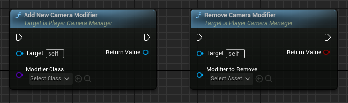{#fig-playercameramanager-camera-modifiers}

Estos modificadiones puede afectar a:

* La ubicación, rotación y otras propiedades de cámara del POV del jugador.

* La rotación de control del jugador.
  Por ejemplo, para establrcer límites.

* Modificar la configuración de los efectos de posprocesado.

Los modificadores se aplican al final del método `UpdateViewTarget()`, durante el cálculo del POV del jugador.

#### Activación y desactivación de modificadores

Una vez se han añadido un modificador, se puede activar y desactivar, según el estado del juego, a través de los métodos `EnableModifier()`, `DisableModifier()` y `ToggleModifier()`, de la clase , que se pueden ver en la @fig-cameramodifier-activation.

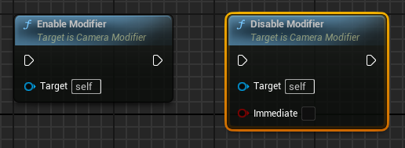{#fig-cameramodifier-activation}

Por ejemplo, se puede añadir un modificador `UCameraModifier_CameraShake` para sacudir la cámara cuando el jugador recibe daño, activándolo y desactivándolo durante un timpo cuando se da el caso.

Además, la activación y desactivación puede ser instantánea o gradual, según el valor de las propiedades `AlphaInTime`, `AlphaOutTime` de **CameraModifier** y el argumento `Immediate` de `DisableModifier()`.

#### Prioridad de los modificadores

Los modificadores se organizan en el **PlayerCameraManager** en una lista ordenada por su prioridad, que es una propiedad de la instancia de `CamaraModifier`. 
De forma que se pueden aplicar varios modificadores a la vez, en un orden determinado por su prioridad.

Aunque los efectos de los modificadores generalmente se combinan, es posible que un modificador de alta prioridad prevenga la ejecución de modificadores de menor prioridad.
Esto se puede indicar mediante el valor de retorno del método  de **CameraModifier**, que si `true` detendría la ejecución de los siguientes modificadores.

#### Modificadores de cámara predefinidos

Algunos de los modificadores de cámara predefinidos de Unreal Engine son:

* .
  Sacude la cámara para crear sensación de impacto o agitación, lo que es útil con explosiones o al recibir daño.

  El efecto se configura añadiendo al modificador uno o varios objetos de tipo .
  Cada uno contiene un *patrón de movimiento* que es el objeto que realmente contiene la lógica que dirige el movimiento de la cámara[@UnrealCameraShakes]. 

* .
  Aplica una secuencia de animación a la cámara.

#### Modificadores personalizados

La clase base de los modificadores es  y se puede heredar de ella para implementar modificadores de cámara personalizados.

Los métodos `BlueprintModifyCamera()` y  son los que se deben sobreescribir para implementar la lógica de los modificadores de las propiedades de la cámara, en Blueprint o C++, respectivamente.
Mientras que `BlueprintModifyPostProcess()` y  se pueden sobreescribir para modificar la configuración de los efectos de posprocesado.

En todo los casos, es responsabilidad del código en estas funciones interpretar y aplicar los valores de `Alpha`, si el efecto debe mezclarse de forma gradual al activarse o desactivarse.

En realidad, **PlayerCameraManager** llama al método  de cada modificador, pasándole la delta de tiempo y una estructura con la información del POV del jugador para que la modifique.
Este método actualiza el `Alpha`, llama a los métodos anteriores y, por defecto, retorna `false` para que se puedan ejecutar los siguientes modificadores de menor prioridad.

#### Relación con la *rotación de control*

La *rotación de control* del **PlayerController** se puede ver afectada por los modificadores de la cámara y el **PlayerCameraManager**.

En cada *tick* el **PlayerController** llama a su método `UpdateRotation()` para actualizar la *rotación de control* con la entrada del jugador acumulada hasta el momento en una variable interna.
Este método llama a `ProcessViewRotation()` del **PlayerCameraManager** que, a su vez, llama al mismo método en cada modificador de cámara, pasando por referencia tanto la rotación de control actual como la indicada por la entrada del jugador.

Gracias a esto, los modificadores de la cámara pueden modificar tanto *rotación de control* actual como la entrada del jugador acumulada, que se usará para actualizar la *rotación de control*.
Esto sirve, por ejemplo, para que un modificador de cámara activo pueda limitar la *rotación de control* a cierto intervalo.

En todo caso, para establecer limitaciones a la *rotación de control* del jugador de forma generalizada, se pueden usar las propiedades **View Pitch Min**, **View Pitch Max**, **View Yaw Min**, **View Yaw Max**, **View Roll Min** y **View Roll Max** que trae de serie **PlayerCameraManager**, como se puede ver en la @fig-playercameramanager-view-limits.

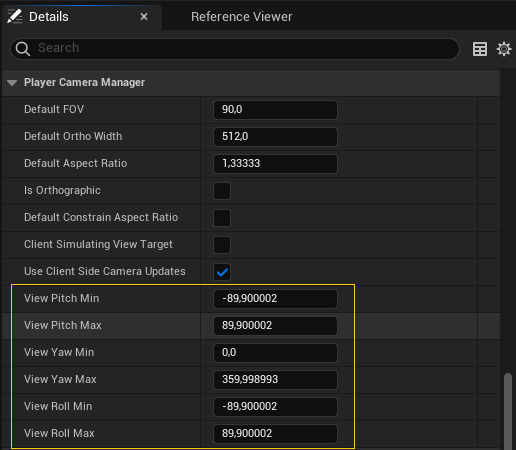{#fig-playercameramanager-view-limits}

## Gameplay Framework

En la @fig-ue-gameplay-framework se puede observar un esquema del *gameplay framework* de Unreal Engine que hemos comentado en apartados anteriores.

```{mermaid}
%%| label: fig-ue-gameplay-framework
%%| fig-cap: "Esquema del *gameplay framework* de Unreal Engine."
%%| file: figures/ue-gameplay-framework.mm
%%| fig-width: 15cm
```

Esta arquitectura se puede trasladar fácilmente a otros motores, con las modificaciones que mejor se adapten a nuestras necesidades y a las particularidades de cada motor.