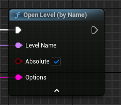
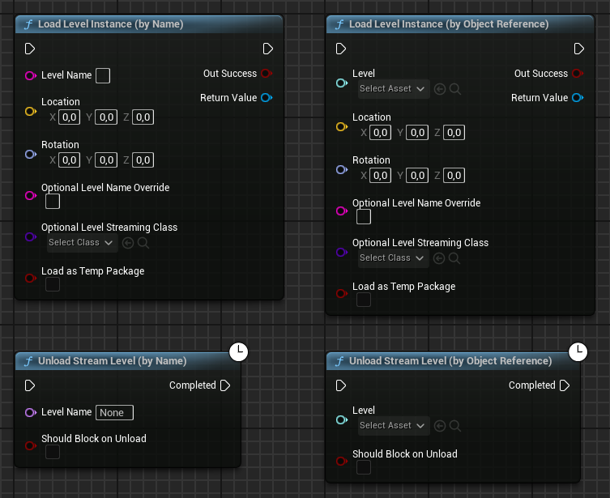
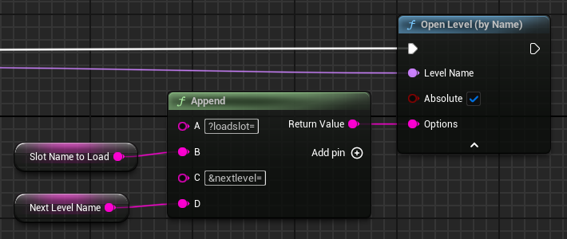

# Carga de niveles y transiciones

En Unreal Engine la carga de un nuevo nivel se realiza usando el método  indicado la ruta del nivel a cargar (ver en la @fig-openlevel).

{#fig-openlevel}

El problema es que durante la carga, el juego se queda congelado, cuando los jugadores esperan que se muestre una pantalla de carga.
Para implementar una pantalla de carga, existen principalmente dos opciones: streaming de niveles o carga asíncrona de niveles.

## Streaming de niveles

El streaming de niveles es una técnica que permite cargar y descargar partes de niveles de forma dinámica durante la ejecución del juego[Ver «Level streaming» en @TorresD3DLevelStreaming; y @UnrealLevelStreaming].
Concretamente, al comienzo de la partida se carga el nivel principal --llamando nivel persistente-- y a medida que el jugador avanza por el nivel, se van cargando los subniveles que se necesiten.

Esta técnica permite que cuando los niveles son muy grandes para ser cargados en su totalidad, se puedan dividir en subniveles que se cargan y descargan según sea necesario.
También se puede utilizar para facilitar la colaboración entre varios desarrolladores, ya que cada uno puede trabajar en un subnivel diferente[Ver «Colaborar con el VCS» en @TorresD3DProjectStructureTips].

Utilizar esta funcionalidad para implementar una pantalla de carga implica que en todo momento lo que hay cargado es un nivel persistente vacío y que los niveles del juego son realmente subniveles que se cargan y descargan según sea necesario.
Mientras esta carga ocurre, se puede instanciar y mostrar un *widget* en la interfaz de usuario con la pantalla de carga.

La carga de un subnivel se realiza llamando al método  y la descarga llamando al método  (ver la @fig-streaming-levels), cuyos argumentos **ShouldBlockOnLoad** y **ShouldBlockOnUnload**, respectivamente, en C++ permiten indicar que la carga o descarga se realice de forma asíncrona, sin bloquear todo el juego.
Ambas funciones notifican cuando la carga o descarga ha finalizado, para continuar con la transición hacia el nuevo nivel.

{#fig-streaming-levels}

Utilizando el método  se puede obtener una referencia a un subnivel, de forma que, entre otras, cosas se puede controlar su estado de visibilidad.

El principal problema de esta técnica es que obliga a utilizar el mismo **GameMode** para todos los niveles del juego, ya que el **GameMode** lo determina el nivel persistente.
Además, durante el desarrollo, probar un nivel concreto del juego es más complicado, ya que siempre se tiene que cargar el nivel persistente para luego cargar los subniveles necesarios para llegar al nivel que se quiere probar.

## Carga asíncrona de niveles {#sec-async-load-level}

Idealmente, lo que interesaría es tener una función `OpenLevel()` que fuera asíncrona.
De esta forma, se podría cargar el *widget* de la pantalla de carga y llamar a la función `OpenLevel()` para cargar el nivel que se quiere mostrar.
Cuando la carga del nivel finalice, ocultar la pantalla de carga y dejar que se muestre el nivel.

La ventaja de esta opción es que así, cada nivel tiene su propio **GameMode** y se pueden probar los niveles de forma independiente en el editor.
Además, nada impide que cada nivel use subniveles, tanto para dividir el nivel en partes más pequeñas como para facilitar la colaboración entre los desarrolladores.

Para conseguir un `OpenLevel()` asíncrono, se puede utilizar el método  en C++.
Este método permite cargar un paquete de forma asíncrona, de manera que se puede cargar el nivel que se quiere mostrar y cuando la carga finalice, llamar a `OpenLevel()` para mostrar el nivel de manera mucho más rápida:

```cpp
void UMyGameInstance::AsyncOpenLevel(FName LevelName)
{
    // Mostrar pantalla de carga...

    FLoadPackageAsyncDelegate LoadCompleteDelegate;
    LoadCompleteDelegate.BindUObject(this, &
        UMyGameInstance::OnAsyncLoadComplete);
    LoadPackageAsync(LevelName.ToString(), LoadCompleteDelegate);   // <1>
}

void UMyGameInstance::OnAsyncLoadComplete(const FName& PackageName,
    UPackage* LoadedPackage, EAsyncLoadingResult::Type Result)
{
    if (Result == EAsyncLoadingResult::Succeeded)
    {
        UGameplayStatics::OpenLevel(this, PackageName);             // <2>
    }
    else {
        UE_LOG(...);
    }

    // Ocultar pantalla de carga...
}
```
1. Carga del contenido del nivel de forma asíncrona.
2. Activación del nivel cargado.

Si la pantalla de carga no se puede implementar solo con *widgets* de la interfaz de usuario, se puede crear un nivel ligero de transición con `OpenLevel()`.
Luego este nivel hace la carga del nivel definitivo tal y como hemos descrito, mientras se muestra la escena de carga o, incluso, deja al usuario interactuar con ella.
Esta carga se puede lanzar desde el `BeginPlay()` del **GameMode** del nivel de transición.

Para que el **GameMode** sepa qué nivel tiene que cargar, el nombre de este se puede pasar como una opción en el argumento **Options** de `OpenLevel()`.
Este argumento sirve para pasar información adicional al **GameMode** del nivel cargado en la forma de una cadena de consulta URL, como se puede observar en la @fig-openlevel-options.

{#fig-openlevel-options}

Esta cadena de consulta se recibe en el método `InitMode()` del **GameMode** del nivel de transición.
La cadena se puede analizar con el método  o se puede leer un valor concreto desde cualquier actor del nivel llamando a `GetWorld()->URL.GetOption()`.
