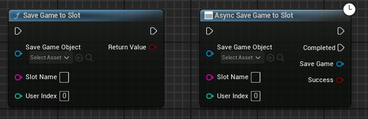
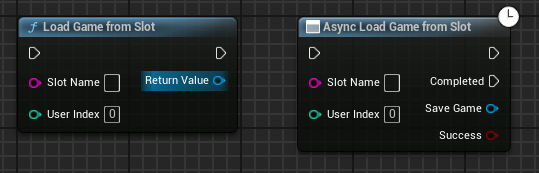
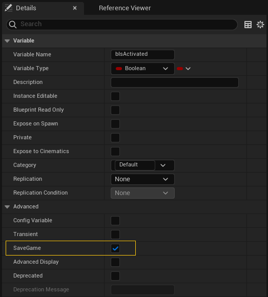

# Salvado de la partida {#sec-savegame}

El sistema de **UObject** de Unreal Engine permite disponer en C++ de características presentes en lenguajes de programación gestionados, como Java o C#.
Una de estas características es la serialización de objetos, que permite guardar y cargar objetos de forma sencilla.

Todos los objetos que heredan de **UObject** tienen un método `Serialize()` que se llama cuando se va a guardar o cargar el objeto.
Este método recibe un objeto de tipo **FArchive**, que representa el almacén de datos donde se va a guardar o cargar el objeto.

Sin embargo, Unreal Engine ofrece una solución más sencilla para guardar y cargar el estado de la partida, que es utilizando la clase **SaveGame**.

## Uso de *SaveGame*

La clase  es una clase que hereda de **UObject** y que puede ser utilizada para guardar y cargar el estado del juego[@UnrealSavingLoading].

La forma de utilizar esta clase es muy sencilla:

1. Crear una clase que herede de **SaveGame** y añadirle las propiedades adecuadas para almacenar los datos del estado del juego que se quieren preservar.
   Para este ejemplo, vamos a suponer que la clase se llama **MySaveGame**.

2. Llamar a  para crear un objeto de la clase **MySaveGame**.

3. Copiar en las propiedades del objeto **MySaveGame** los datos del estado del juego que se quieren preservar.

4. Llamar a  o  para guardar el objeto **MySaveGame** en un *slot* de partida guardada (ver la @fig-save-game-to-slot).
   El *slot* donde guardar la partida se indica mediante un *nombre de slot*, que se puede escoger libremente y que debe ser diferente para cada *slot*, y el *índice de usuario*, para identificar al usuario que está salvando la partida.

:::{.callout-tip}
Es recomendable utilizar `AsyncSaveGameToSlot()` en lugar de `SaveGameToSlot()` para guardar la partida, ya que la primera permite que el salvado ocurra en un hilo de ejecución diferente al principal, evitando que el juego se quede congelado mientras se guarda la partida.
Sin embargo, si se guarda desde un menú o pantalla de pausa, dónde el juego ya está congelado, se puede utilizar `SaveGameToSlot()` sin problemas.
:::

{#fig-save-game-to-slot}

Para realizar la carga de los datos de la partida, se tiene que realizar el mismo proceso, pero se llama a  --o a -- para cargar los datos en el objeto **MySaveGame** (ver la @fig-load-game-from-slot).

{#fig-load-game-from-slot}

Luego, se pueden copiar los datos de las propiedades del objeto **MySaveGame** a las propiedades de los otros objetos del juego, para restablecer el estado de la partida.

En cualquier momento se puede saber si hay una partida guardada en un *slot* concreto llamando a .

## Consejos para desarrollar un sistema de salvado

El uso descritor de la clase **SaveGame** es muy sencillo, pero los pasos indicados realmente no son suficientes para implementar un sistema de salvado de partida completo, excepto en proyectos muy simples.

<!-- TODO: Enlazar a contenido donde se desarrolle mejor estas ideas -->

Para implementar un sistema de salvado de partida más completo, es conveniente seguir algunas recomendaciones.

### Interfaz para actores salvables

Por lo general, al salvar la partida es necesario almacenar el estado de múltiples objetos en el nivel actual.
Por ejemplo, su posición y rotación o si han sido activados o usados de alguna manera.

Para eso, es conveniente definir una interfaz que permita a los actores del juego guardar y cargar aquellas propiedades que definen su estado, cuando se les indique desde el sistema de salvado.

Esta interfaz debe tener métodos para guardar y cargar el estado del actor en alguna estructura de datos, y cada actor salvable debe implementar esta interfaz para guardar y cargar correctamente su estado en o desde dicha estructura, respectivamente.
También puede ser conveniente que la interfaz tenga un método que se llame tras restablecer las propiedades del actor desde la partida guardada, de forma que el actor pueda realizar ajustes adicionales o cambios visuales con los nuevos valores de sus propiedades.
Por ejemplo, si el actor es una caja que puede ser abierta, es probable que tenga una propiedad que indique si ya ha sido abierta por el jugador, y que cuando se restablezca el estado del actor desde la partida guardada, el actor use esta propiedad para cambiar su aspecto visual y mostrar la caja abierta.

```cpp
class ISavableActorInterface
{
    // ...

public:
    virtual void OnActorLoaded();                                   // <1>

    virtual void SaveActorState(FActorSaveData& OutSavedData);
    virtual void LoadActorState(const FActorSaveData& SavedData);

    // ...
};
```
1. Evento para notificar al actor que su estado ha sido restablecido desde la partida guardada.

Además, el uso de una interfaz permite al sistema de salvado localizar fácilmente a los actores que se pueden guardar y cargar, ya que solo tiene que buscar los actores que implementan la interfaz.

Este tipo de búsquedas pueden llevar algo de tiempo, pero eso no suele ser un problema mientras no se haga en una función que se llame cada frame, como `Tick()` o `TickComponent()`.
En todo caso, si esto se convierte en un problema, se puede descargar la tarea en un hilo diferente o utilizar un sistema de registro de actores salvables.
En este último caso, cada actor que se quiera preservar su estado se añadiría al instanciarse en una lista en el sistema de salvado de partida, de forma que dicho sistema solo tiene que buscar en este registro las referencias a los actores que se pueden guardar o cargar.

### Serialización y uso del especificador de propiedad *SaveGame*

Como hemos comentado, el trabajo de la función `SaveActorState()` de la interfaz propuesta, es copiar el estado del actor en propiedades de la estructura de datos **FActorSaveData**, para que luego sea almacenada.
Algunos de estos datos pueden ser el nombre u otro tipo de identificación del actor, su posición y rotación en el mundo, etc.

No todas las propiedades de un actor deben ser guardadas, ya que algunas de ellas pueden ser temporales o no tener sentido en el contexto de una partida guardada.
Pero, aun así, en actores complejos, la cantidad de propiedades a guardar puede ser muy grande, complicando el desarrollo y la mantenibilidad de los métodos de guardado y carga.

Para facilitar el trabajo de guardar y cargar el estado de los actores, Unreal Engine ofrece el especificador de propiedad **SaveGame**, que se puede utilizar para indicar que una propiedad debe ser guardada y cargada cuando se serializa el actor.

Por ejemplo, un actor puede tener una propiedad como la siguiente marcada con **SaveGame** (se puede ver el especificador en el editor en la @fig-savegame-specifier):

```cpp
UCLASS()
class MYPROJECT_API AMyActor : public AActor, public ISavableActorInterface
{
    // ...

protected:
    UPROPERTY(EditAnywhere, BlueprintReadWrite, SaveGame)
    bool bIsActivated;

    // ...
};
```

{#fig-savegame-specifier}

La implementación de `SaveActorState()` del actor puede serializarlo en un archivo **FArchive** y guardar los datos codificados en este archivo en la estructura **FActorSaveData**.
En condiciones normales, en la copia serializada se incluirán todas las propiedades de **AMyActor**, pero si el archivo donde se serializa tiene activada su propiedad **ArIsSaveGame**, solo se incluirán las propiedades del actor marcadas con el especificador **SaveGame**, como la propiedad **bIsActivated** del ejemplo.

<!-- TODO: Enlazar a contenido donde se desarrolle mejor estas ideas -->

### Subsistema de salvado

Para facilitar el uso del sistema de salvado desde diferentes partes del código --como los menús o el actor **GameMode** de los niveles-- es conveniente crear un *subsistema* de Unreal Engine[@TorresD3DUnrealCpp] que se encargue de realizar las tareas de salvado y carga de la partida.
Otra opción es implementarlo en una clase base del **GameMode** (ver la @sec-gamemode), pero esto puede hacer el código algo más difícil de mantener y reutilizar.

El subsistema de salvado debe tener métodos para guardar y cargar la partida.

Algunas de las tareas que tendría que hacer para salvar una partida serían:

1. Crear el objeto **SaveGame** a partir de una clase con las propiedades adecuadas para almacenar el estado global del juego.
   Entre esta información probablemente se deba incluir el nivel actual, la posición del jugador, el inventario o las habilidades, etc.
   También puede ser buena idea incluir un número de versión, para poder detectar si la partida guardada es compatible con la versión actual del juego o, incluso, para realizar conversiones automáticas de partidas guardadas en versiones anteriores.

2. Buscar los actores salvables en el nivel actual y guardar su estado en el objeto **SaveGame**.
   Si se utiliza una interfaz --como la descrita anteriormente-- se pueden localizar los actores salvables usando  o recorriendo la lista de actores y comprobando si implementan dicha interfaz.

   En cada actor encontrado se puede llamar a la función `SaveActorState()` de la interfaz y la estructura de datos devuelta por esta función se debe añadir a una lista de actores salvables en el objeto **SaveGame**.
   Esta lista se puede implementar como una propiedad de tipo **TArray**, de tal forma que al salvar el objeto **SaveGame** se guarde también el contenido de la lista.
  
   Entre la información que deben salvar todos los actores debe haber alguna propiedad que los identifique, como su nombre --que se puede obtener mediante el método -- o algún otro tipo de identificador.
   Esto es necesario para poder localizar el actor, con el objeto de restablecer su estado, al cargar la partida guardada.

3. Guardar el objeto **SaveGame** en un *slot* llamando a .

Al cargar una partida guardada, el sistema probablemente debería realizar las siguientes tareas:

1. Leer el objeto **SaveGame** del *slot* llamando a .

2. Si una de las propiedades del objeto **SaveGame** es el nivel de la partida guardada, puede cargar dicho nivel llamando a .
En ese sentido, usar previamente `LoadPackageAsync()` permite precargar el nivel de forma asíncrona --para mostrar mientras una pantalla de carga, haciendo que luego la carga del nivel con `OpenLevel()` sea inmediata.

3. Restablecer los valores de las propiedades guardadas en el objeto **SaveGame** en el nivel cargado, puesto que la carga con `OpenLevel()` se realiza con los valores por defecto.

   Esto se puede hacer desde el **GameMode** del nivel cargado, en métodos como `BeginPlay()` o `InitGame()`, antes de que el resto de actores inicien su ejecución.

   Para que el **GameMode** sepa que tiene que cargar los datos de una partida salvada, se puede utilizar el argumento **Options** de `OpenLevel()`, que sirve para pasar información adicional al **GameMode** del nivel cargado en la forma de los parametros de una URL, como se puede observar en la @fig-openlevel-options.

4. Para restablecer las propiedades guardadas en el objeto **SaveGame** se deben buscar los actores salvables en el nivel, localizar los datos de su estado en la lista de actores salvables del objeto **SaveGame** y usar la función `LoadActorState()` de la interfaz con ellos.

{#fig-openlevel-options}
