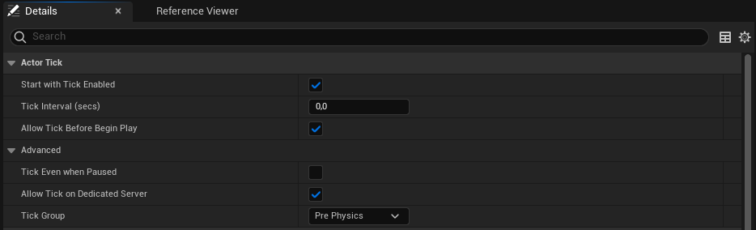

# Actualización, activación y pausa {#sec-ticks}

Por lo general, todo juego tiene al menos un ciclo de ejecución en el que en cada frame se lee la entrada del jugador y se notifica a los diferentes sistemas y entidades en el juego para que actualicen su estado.

A continuación veremos cómo se propagan estos eventos de actualización en Unreal Engine y como se pueden desactivar actores y componentes y poner el juego en pausa.

## Propagación de *ticks*

El motor Unreal Engine tiene un ciclo principal de ejecución desde el que va haciendo *tick* en cada frame a varios sistemas esenciales para que actualicen su estado, como el render, la física, y el código de *gameplay*.

Dentro de este ciclo principal, cada **UWorld** en Unreal Engine recibe un evento *tick* para que se actualice el estado del mundo del juego.
Como hemos comentado anteriormente, el objeto **UWorld** representa el mundo del juego, contiene todos los objetos que existen en él y, por lo general, solo existe uno al mismo tiempo.

En cada ciclo de *tick*, cada **UWorld** hace *tick* a sus actores y componentes, de tal forma que se actualiza el estado de todos los objetos del mundo del juego.
Para eso, por defecto, llama al método `Tick()` de cada actor o `TickComponent()` de cada componente que contiene.

### Funciones *tick*

Realmente, los actores y componentes reciben un *tick* en `Tick()` y `TickComponent()`, respectivamente, porque durante su instanciación crean un objeto *función de tick* y lo registran en el nivel para que reciba el *tick* desde **UWorld**.
Luego es la instancia de la *función de tick* la que entrega el evento *tick* a su actor o componente.

Estas *funciones de tick* son clases que heredan de  y se suelen instanciar como variables miembro del actor o componente donde se van a utilizar.
A través de las propiedades del objeto, se puede configurar la frecuencia, grupo, prerrequisitos y otras características de la *función de tick*.

Por ejemplo, todo actor tiene una *función de tick* de tipo **FPrimaryActorTick** en la variable `PrimaryActorTick` de **Actor**, que se encarga de llamar a `Tick()` en el objeto actor en cada *tick* recibido.
Igualmente, todo componente tiene una *función de tick* de tipo **FPrimaryComponentTick** en la variable `PrimaryComponentTick` de **ActorComponent**, que llama a `TickComponent()` en el componente en cada *tick*.

Ambas variables se suelen configurar durante la construcción del actor o componente y se registran en el nivel al iniciar su ejecución en el juego.
También se pueden configurar en el editor de Unreal Engine, en la sección **Actor Tick** o **Component Tick** de las propiedades del actor o componente (ver la @fig-actor-tick-properties).

{#fig-actor-tick-properties}

Este sistema permite que los actores y componentes puedan tener múltiples funciones de *tick* diferentes, cada una con sus propias características.

Estas funciones adicionales se definen instanciando una clase que herede de  y sobrescibiendo el método , puesto que es el que será llamado en cada *tick*:

```{.cpp}
struct FMyNewTick : public FTickFunction
{
    AActor* Target;                                             // <1>

    // ...
    virtual void ExecuteTick(...) override
    {
        // ...
        Target->MyNewActorTick(...);                            // <2>
        // ...
    }
    // ...
};
```
1. Añadimos un campo para indicar el actor al que se quiere entregar el *tick*.
2. En cada *tick* se llama al método `MyNewActorTick` del actor `Target`.

El registro suele hacerse sobreescribiendo los métodos  o , dependiendo de si se trata de un actor o un componente.
Por ejemplo, definir una nueva *función de tick* para un actor en C++ sería así:

```{.cpp}
UCLASS()
class MyActor : public AActor
{
    GENERATED_BODY()
    // ...
    FMyNewTick MyNewTick;                                       // <1>
    // ...
};

void AMyNewActor::AMyActor()
{
    // ...
    MyNewTick.Target = this;                                    // <2>
    MyNewTick.bCanEverTick = true;                              // <3>
    MyNewTick.bTickEvenWhenPaused = true;                       // <4>
    MyNewTick.TickGroup = TG_PrePhysics;                        // <5>
    // ...
}

void AMyNewActor::RegisterActorTickFunctions(bool bRegister)
{
    Super::RegisterActorTickFunctions(bRegister);

    if (bRegister)
    {
        MyNewTick.RegisterTickFunction(GetLevel());             // <6>
    }
    else
    {
        // ...
        MyNewTick.UnRegisterTickFunction();                     // <7>
        // ...
    }
}
```
1. Declarar la variable miembro `MyNewTick` de tipo **FMyNewTick** para almacenar la *función de tick*.
2. Indicar a la nueva *función de tick* qué el actor actual recibirá el *tick*.
3. Activar la *función de tick* desde el principio.
   Otra opción es configurarla como desactivada y activarla posteriormente, cuando sea necesario, usando el método  de `MyNewTick`.
4. Configurar la *función de tick* para que se ejecute incluso cuando el juego esté en pausa.
5. Asignar la *función de tick* al grupo `TG_PrePhysics`, para que se ejecute antes de que se actualice la física del mundo.
6. Registra la *función de tick* llamando a .
   Esto se hace cuando se ha invocado `RegisterActorTickFunctions()` con el argumento `true`, dado que eso indica se ha llamado a la función para que registre las *función de tick* del actor.
   La función recibe un objeto **ULevel**, que representa el nivel dónde se ejecuta el actor, asociado al **UWorld** actual.
   Este objeto se puede obtener utilizando el método `GetLevel()` del actor.
7. Desregistrar la *función de tick* porque se ha llamado a `RegisterActorTickFunctions()` con el argumento `false`.

### Grupos de *ticks*

Unreal Engine define varios *grupos de ticks*, como `TG_PrePhysics`, `TG_DuringPhysics`, `TG_PostPhysics` o `TG_PostUpdateWork`.
Cada uno de estos grupos representa un punto específico en el ciclo de ejecución del juego, que se suceden en el orden anterior indicado[@UnrealActorTicking].

Las *funciones de tick* comentadas se pueden asignar a un *grupo de tick* determinado mediante la propiedad **Tick Group** de la clase de la *función de tick*.

Esto determina en qué punto del ciclo de ejecución serán invocadas, porque durante la ejecución del *tick*, **UWorld** hace **tick** a las funciones en cada *grupo de ticks*, en el orden específico.
Es decir, primero actualiza todos los actores y componentes en el grupo `TG_PrePhysics`, luego procede al `TG_DuringPhysics`, y así sucesivamente.

Los *grupos de ticks* son particularmente útiles para manejar dependencias entre actores y componentes.
Por ejemplo, si un actor depende del resultado del *tick* de otro actor, podemos asegurarnos de que el segundo sea actualizado primero asignando su *función de tick* primaria a un grupo anterior.

### prerrequisitos

En ocasiones, no es suficiente con asignar un *grupo de tick* a una *función de tick* para asegurar que se ejecute en el momento adecuado, por lo que hace falta un mecanismo adicional que ofrezca más control.
Por ello, las *funciones de tick* también pueden tener *prerrequisitos*, que deben cumplirse para que se ejecute el *tick*.

Los *prerrequisitos* son otras *funciones de tick* que deben ejecutarse antes de que se ejecute la *función de tick* que los tiene como *prerrequisito*.
Por ejemplo, si una *función de tick* tiene como *prerrequisito* a otra que se ejecuta en el grupo `TG_PrePhysics`, **UWorld** ejecutará la primera después de que se ejecute la segunda.

Para establecer *prerrequisitos* la clase base  tiene los métodos  y .

Como la mayor parte de los actores y componentes solo tienen una *función de tick*, la clase base de los actores **AActor** y la de los componentes **ActorComponent** tienen métodos específicos para establecer *prerrequisitos* en su *función de tick* primaria: 

* 
* 
* 
* .

Así como los métodos para eliminarlos:

* 
* 
* 
* .

## Activación y desactivación de actores y componentes

Es muy común en cualquier proyecto tener que activar y desactivar entidades temporalmente, para que no sean visibles ni se actualicen en ciertos momentos del juego.

En Unreal Engine, los actores y componentes se pueden activar y desactivar en cualquier momento, pero los diferentes aspectos de su influencia en el mundo se controlan por separado.
Es decir, que debemos activar y desactivar su visibilidad, colisiones, actualización, etc. de forma independiente.

### Actualización

Las *funciones de tick* se puede activar y desactivar individualmente usando el método  de la clase **FTickFunction**.

También se pueden usar los métodos  y  para activar y desactivar la *función de tick* primaria de los actores y componentes, respectivamente.

### Visibilidad

En Unreal Engine, solo los componentes que heredan de **SceneComponent** pueden colocarse en la escena y, por tanto, ser visibles.
Estos componentes tienen un método `SetVisibility()` que permite activar y desactivar su visibilidad.

Por otro lado, los actores tienen un método  que permite activar y desactivar la visibilidad de todos los componentes del actor.

### Colisiones

Un componente o actor puede ser invisible, pero aun así tener colisiones activas, afectando a la física del mundo.

En Unreal Engine, los componentes que heredan de **PrimitiveComponent** son **SceneComponent** que tienen o general algún tipo de geometría, generalmente para renderizarla o para causar colisiones.
Estos componentes tienen un método `SetCollisionEnabled()` que permite activar y desactivar las colisiones del componente.
Mientras que los actores tienen un método  que permite activar y desactivar las colisiones de todos los componentes del actor.

## Pausa {#sec-pause}

La pausa es un estado del juego en el que se detiene el paso del tiempo, pero el jugador puede seguir interactuando con el juego.

Para que un nivel se pueda poner en pausa, el **GameMode** asociado debe tener la propiedad **Pauseable** activada.
Esto permite marcar los niveles que se utilizan para mostrar menús o pantallas de carga, como no pauseables.

Cuando se activa la pausa, **UWorld** deja de hacer *tick* a los actores y componentes, excepto a aquellos cuyas *funciones de tick* tienen la propiedad **Tick Even When Paused** activada.
Esto es lo que permite que jugador pueda seguir interactuando con partes del juego, mientras el resto de actores y componentes permanecen inactivos.

El cambio de estado se puede hacer a través de diferentes componentes:

* En el **GameMode**, mediante los métodos  y  para activar y desactivar la pausa, respectivamente.

  Al llamar a `SetPause()` se indica el **PlayerController** del jugador que solicita la pausa y la clase **GameMode** comprueba si tiene permiso para hacerlo llamando a .
  La implementación por defecto, solo comprueba si el nivel está configurado como `Pausable`, pero este mecanismo permite sobreescribir la función para implementar reglas más complejas.

  Además, el método `SetPause()` también permite indicar una función que usará internamente `ClearPause()` para comprobar si se dan las condiciones para reanudar el juego.
  Si varios jugadores pausan el juego, cada uno puede incluir su propia función.

  Finalmente, en el actor **WorldSettings** se puede acceder al **PlayerState** del jugador que pausó el juego a través del método `GetPauserPlayerState()`.

* En el **PlayerController**, mediante el método , que recibe un `bool` para indicar si se quiere pausar o reanudar el juego.
  Esta función llama a `SetPause()` del **GameMode** del nivel actual, pasando el **PlayerController** como argumento.

* Llamando a  de **UGameplayStatics**, que también recibe un `bool` para indicar si se quiere pausar o reanudar el juego.
  Se trata de una función de ayuda que intenta pausar el juego llamando a `SetPause()` del **GameMode** del nivel actual, pasando el **PlayerController** del primer jugador como argumento.