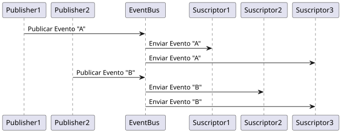
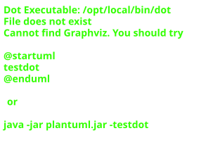
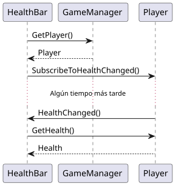
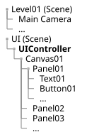

::: {.informalexample}
**Tiempo de lectura:** 1 hora y 29 minutos
:::

El desarrollo de un videojuego, como el de cualquier otro programa, puede convertirse en infierno si:

-   Primero no nos sentamos a diseñar una arquitectura de software adecuada, antes de lanzarnos a programar.

-   A la hora de resolver los problemas que surjan, no optamos por soluciones preestablecidas y conocidas en la comunidad de desarrolladores.

-   No dedicamos tiempo a hacer tests.

-   No seguimos buenas prácticas de diseño y de programación, como por ejemplo S.O.L.I.D., Clean Code[\[1\]](#Martin2012) o Clean Architecture[\[2\]](#Martin2017).

A continuación, haremos un resumen de algunas buenas prácticas y consejos que deberíamos tener presentes mientras diseñamos y desarrollamos el software de nuestros juegos.

# Arquitectura basada en componentes {#_arquitectura_basada_en_componentes}

Lo primero que debemos tener en cuenta es que muchos motores de videojuegos, entre los que se incluyen Unity y Unreal Engine, han adoptado por una arquitectura basada en componentes ---también llamada Entidad-Componente (EC)---. Eso significa que cuanto más adoptemos esa arquitectura en el desarrollo de nuestros juegos, más ergonómico nos parecerá el motor que utilicemos.

En Unity los objetos o entidades de una escena se llaman *GameObjects* y les podemos agregar componentes. Esa agregación de componentes que se comunican entre sí es lo que determina las funcionalidades de cada objeto. De hecho, un objeto sin componentes ---si tal cosa fuera posible, porque en Unity el componente **Transform** no se puede eliminar--- no tiene ninguna funcionalidad en absoluto.

Y lo mismo ocurre en Unreal Engine, solo que las entidades de la escena se llaman *actores* que, al igual que en Unity, reciben su funcionalidad por medio de los componentes que se le añadan. Quizás la principal diferencia entre un motor y el otro, en este aspecto, es que en Unreal Engine los componentes se pueden agregar en una jerarquía de componentes ---es decir, unos componentes pueden ser hijos de otros--- mientras que en Unity eso no es posible. En Unity, son los *GameObjects* los que se organizan en una jerarquía de objetos.

Pensar en términos de programación orientada a componentes no es sencillo para quienes aterrizamos desde la programación orientada a objetos tradicional, donde lo común es construir jerarquías inmensas de clases en un esfuerzo por asegurar la reutilización del código y evitar repetirnos. Pero, como veremos, este cambio de mentalidad no es un capricho de los diseñadores de motores de videojuegos.

## Componentes frente a herencia {#_componentes_frente_a_herencia}

Supongamos que estamos desarrollando una serie de NPC[^1] para nuestro juego. Como es habitual, tendrán un controlador de IA y un nivel de salud. Así que esas características comunes las implementamos en la clase `Entity` para no repetir código.

De `Entity` se heredan para crear cada uno de los tipos de personaje: guerreros con espada, hechiceros, arqueros y hechiceros con espada. Y, además, hay versiones con la IA normal y otras con una IA más agresiva. Un posible esquema UML de relación entre las clases se puede ver en la [figure\_title](#fig-herencia-uml), donde, por ejemplo, la flecha de SwordFightingEntity a Entity indica que la primera extiende ---es decir, hereda--- de la segunda.


Al ver la [figure\_title](#fig-herencia-uml) parece evidente que mientras más características queramos combinar más complejo es el esquema de relación. Si, por ejemplo, hubieran distintas formas de ser afectados por el daño, todas las clases tendrán una clase derivada con una versión con esa nueva forma de sufrir daño. Si hubiera otro tipo de IA, todas las clases tendrán una nueva versión con el nuevo tipo de IA.

Lo peor de todo es que en la [figure\_title](#fig-herencia-uml) se ve que no se puede evitar la repetición de código. Por ejemplo, `MagicAndSwordFightingEntity` hereda de `SwordFightingEntity`, así que la primera puede aprovechar el código de la segunda para el combate con espada, pero no hereda de `MagicFightingEntity`, así que el código para el combate con magia no se reutiliza. Hay que volver a escribirlo para esta clase donde se combinan ambos tipos de combate.

::: {.note}
En C++ y otros lenguajes de programación, una clase puede heredar de múltiples clases base, pero esto no suele ser una solución ya que conlleva otros problemas (véase el [problema del diamante](https://es.wikipedia.org/wiki/Problema_del_diamante)).
:::

La solución a este problema es utilizar componentes, cada uno de los cuales aportan alguna característica a la entidad.


En la [figure\_title](#fig-componentes-uml) se puede observar como ahora cada entidad recibe características según los componentes que se le agreguen. Cada componente se puede reutilizar en varias entidades al mismo tiempo y para añadir nuevas características ---como una IA diferente o una nueva forma de recibir daño--- solo necesitamos crear un nuevo componente y añadirlo a la entidad que queramos.

## Conclusión {#_conclusión}

En definitiva, la programación orientada a componentes es una herramienta muy potente en el desarrollo de videojuegos. Solo tenemos que adquirir el esquema mental adecuado para utilizarla correctamente. Pensar en los objetos ---*GameObjects*, actores o entidades--- que necesitamos, las características que debe tener cada uno y qué componentes necesitamos para dotar a los objetos de esas características.

Esto no significa que debamos rechazar completamente la herencia y de otras características típicas de la programación orientada a objetos, ya que son herramientas complementarias.

Es muy posible tengamos tipos de componente, es decir, componentes que dotan el objeto de cierta funcionalidad, solo que de forma diferente. Por ejemplo, componentes para implementar distintas formas de desplazamiento: nadando, andando, en un vehículo, etc. En ese caso es evidente que el uso de la herencia con respecto a una clase base nos facilita compartir fácilmente código común. Incluso, aunque no exista ese código común, se puede heredar de una interfaz, para que el resto del código dependa de la abstracción del componente y no de implementaciones concretas.

También es frecuente que detrás de los objetos y componentes del juego necesitemos todo un conjunto de sistemas que se desarrollan completamente desacoplados del motor, lo que nos permite implementarlos como mejor consideremos y reutilizarlos fácilmente. Por ejemplo, sistemas de inventario, de *crafting* o de habilidades, algoritmos para trazar rutas, trayectorias o incluso simular sistemas económicos complejos, librerías de serialización de objetos o de comunicación en red, entre muchas otras posibilidades.

# Los principios de diseño S.O.L.I.D. {#_los_principios_de_diseño_s_o_l_i_d}

Una solución muy común entre aquellos que se aproximan a motores como Unity o Unreal Engine es la que se representa en la [figure\_title](#fig-anti-solid).


En la [figure\_title](#fig-anti-solid) todos los NPC necesitan un solo componente `NPCFightingController` que lo sabe hacer todo. Implementa diferentes tipos de combate, de formas de recibir daño, de comportamientos de inteligencia artificial, etc. Se supone que la elección de unas opciones u otras para cada entidad se toma por medio de variables, seguramente configurables desde el editor.

Es fantástico aprender lo suficiente como para ser capaces de meter todo junto en una sola clase de, seguramente, 1000 líneas de código o más. Pero lo que no vemos es que cada vez va a ser más difícil añadir características nuevas y que seguramente seamos los únicos del equipo del proyecto que vamos a entender el código. Y eso si no lo dejamos aparcado mucho tiempo. En unas semanas, seguramente tampoco nosotros sepamos retomarlo.

Al diseñar nuestros componentes y nuestras clases ---dado que cada componente es una clase--- una regla básica a respetar es el *Principio de responsabilidad única*: La noción de que una clase solo debería tener una única responsabilidad.

Es evidente que el diseño de la [figure\_title](#fig-anti-solid) no cumple eso pero, al menos a priori, mientras que el de la [figure\_title](#fig-componentes-uml) sí lo hace.

## El resto de principios S.O.L.I.D. {#_el_resto_de_principios_s_o_l_i_d}

El *Principio de responsabilidad única* es el primero de una serie de principios de diseño de software llamados S.O.L.I.D, que deberíamos tener siempre muy presentes y que enumeramos a continuación:

1.  **Principio de responsabilidad única**. La noción de que una clase o componente solo debería tener una única responsabilidad.

2.  **Principio abierto/cerrado**. La noción de que las entidades de software deben estar abiertas para su extensión pero cerradas para su modificación. Esto se traduce en la recomendación de usar interfaces y clases abstractas de las que heredar para desarrollar implementaciones concretas.

3.  **Principio de sustitución de Liskov**. La noción de que los objetos de un programa deben poder ser reemplazables por instancias de clases derivadas sin alterar el correcto funcionamiento del programa.

4.  **Principio de segregación de la interfaz**. La noción de que tener muchas interfaces específicas, para cosas concretas, es mucho mejor que tener una única interfaz de propósito general que sirva para todo.

    Este principio nos sugiere que no siempre debemos tener una interfaz para cada tipo de componente, sino que es posible que distintas funcionalidades puedan abstraerse en diferentes interfaces. Luego podemos elegir si cada interfaz se implementa en un componente diferente o si, por el motivo que sea, es mejor que un componente implemente varias de estas interfaces.

5.  **Principio de inversión de la dependencia**. La noción de que se debe depender de abstracciones en lugar de depender de implementaciones. Lo que básicamente indica que a las clases se les deberían inyectar sus dependencias como interfaces.

::: {.note}
Aunque algunos desarrolladores, para respetar este principio, corren a utilizar *frameworks* de inyección de dependencias, lo cierto es que en muchos casos no suelen hacer falta.

Los motores basados en componentes ofrecen una API para que un componente pueda ganar acceso a otros componentes del mismo u otro objeto de la escena. Esto es, en sí mismo, un mecanismo para inyectar dependencias en los componentes.
:::

En realidad es complicado entender estos 5 principios sin ver ejemplos completos. Por eso merece la pena dedicarle un rato al siguiente vídeo, dónde en la primera mitad se explica la aplicación de los principios S.O.L.I.D. al desarrollo en Unity.

## Más allá de S.O.L.I.D. {#_más_allá_de_s_o_l_i_d}

Lo primero para asimilar estos principios es intentar aplicarlos en nuestros propios proyectos. Es decir, detenernos un momento antes de comenzar a programar, pensar en el problema que tenemos entre manos y cómo lo vamos a resolver y diseñar las clases y los componentes.

Es recomendable dedicar algo de tiempo a asimilar y poner en práctica las reglas y principios del *clean code*[\[1\]](#Martin2012). Lo podemos hacer leyendo el libro o alguno de los múltiples resúmenes disponibles en Internet, como [\[3\]](#Perez2020) y [\[4\]](#Altadill). Posteriormente, se puede seguir profundizando de la mano de Clean Architecture[\[2\]](#Martin2017), donde se siguen los principios S.O.L.I.D. para definir patrones arquitecturales con los que crear software flexible y mantenible.

Hay muchos otros patrones arquitecturales de moda, como: *Hexagonal Architecture*, *Domain-Driven Development* u *Onion Architecture*. Aunque, pocos son fácilmente aplicables al desarrollo de videojuegos, pueden ser útiles para desarrollar servicios de apoyo, como: registro y autenticación de usuarios, *matchmaking*, clasificación o tienda de accesorios, entre otros.

Un patrón que si puede ser interesante estudiar e intentar aplicar, porque está sonando bastante en la industria, es Entidad-Componente-Sistema ---o *Entity-Component-System* (ECS), en inglés---. ECS ofrece un gran desacople entre componentes ---de tal forma que varios equipos pueden trabajar en cualquier sistema de forma independiente--- y facilita el desarrollo orientado a datos, lo que bien aprovechado debe ofrecer mayor rendimiento. ECS es una de las ideas centrales de [Unity DOTS](https://unity.com/dots), la gran apuesta de Unity para modernizar completamente el motor y las herramientas de Unity.

# Managers, Controladores y Sistemas {#_managers_controladores_y_sistemas}

Si cada componente debe tener una única responsabilidad es complicado que pueda cumplir su cometido sin cooperar con otros componentes, excepto para funcionalidades muy sencillas.

Imaginemos por un momento que una funcionalidad de nuestro juego es disponer de un inventario con las siguientes características:

-   En cada nivel hay objetos que pueden ser recogidos, añadidos al inventario y utilizados, cuando llegue el momento.

-   Cada personaje tiene su inventario.

-   Algunos objetos del inventario de los personajes se pueden caer y pueden ser recogidos por otro personaje.


Esto se podría resolver añadiendo un componente a cada objeto que puede pertenecer al inventario y otro a cada personaje que tiene un inventario donde almacenar objetos. En la [figure\_title](#fig-inventory-system) al primero lo hemos llamado `InventoryItem` y al segundo `InventoryManager` Ambos tipos de componentes trabajan de forma coordinada para implementar un *sistema de inventario*.

## Sistemas {#_sistemas}

Un sistema es una combinación de componentes de software que trabajan juntos para implementar cierta mecánica o funcionalidad. Cada sistema debe ser capaz de operar independiente de otros sistemas y solo puede interactuar con ellos a través de interfaces definidas explícitamente. En un videojuego suele haber múltiples sistemas: inventario, locomoción, salvado, meteorología, conducción, *spawn*[^2], interfaz de usuario, etc.

::: {.tip}
En Unity es muy recomendable el uso de espacios de nombres para agrupar los componentes de los distintos sistemas. Los espacios de nombre proporcionan límites bien definidos entre sistemas, evidenciando, gracias al uso de las cláusulas `using` cuándo un sistema depende de otro. Eso ayuda a pensar si esas dependencias son necesarias o hace falta pensar mejor el diseño.

En C++ el uso de espacios de nombres también es una buena práctica, pero el **UnrealHeaderTool** de Unreal Engine no los soporta. Eso significa que en Unreal Engine se pueden usar espacios de nombres con el código C++ puro, pero no con el código heredado de `UObject` que interactúa con el motor y el editor. En su lugar se pueden agrupar diferentes sistemas en distintos módulos y *plugins*. Unreal Engine recomienda esta vía para modularizar el código que extiende el editor y las funcionalidades del motor, pero conviene sopesarlo bien para el código de *gameplay* porque obliga a lidiar con mayor frecuencia con las interfaces entre módulos.
:::

Por ejemplo, un sistema de inventario necesitará de un *manager* para gestionar la colección de elementos en el inventario de cada jugador. Cada elemento inventariable necesitará un componente que lo designe como inventariable, que permita acceder a su información en el inventario y que sepa incluirlo en un inventario. Mientras que cada personaje necesitará un componente para buscar y gestionar los elementos de su inventario. No hace falta que el código del sistema de inventario sepa como guardarlo al salvar la partida. Es el sistema de salvado el que debe usar la interfaz pública del *manager* de inventario para preservar su contenido.

## Manager {#_manager}

Los *managers* gestionan una colección de entidades. Por ejemplo, NPC, proyectiles, enemigos, cámaras, sistemas de partículas, etc. Para mejorar el rendimiento, pueden almacenar los objetos en un *pool* de objetos para reusarlos rápidamente.

Los *managers* también facilitan encontrar rápidamente todos los objetos de cierto tipo u objetos de uso común, evitando usar las funciones de búsqueda del motor ---como las funciones `FindXXXXXX()` en Unity--- que son más lentas. Por ejemplo, es buena idea tener un `CameraManager` que permita conocer las cámaras existentes y obtener rápidamente una referencia a la cámara activa. En Unity se puede usar `camera.main` para conocer la cámara activa, pero esta propiedad usa la función `FindGameObjectsWithTag()`, lo que es más lento que tener un *manager* con una referencia a la cámara.

De igual forma, en juegos multijugador, es buena idea tener en la escena un `PlayerManager` a quien preguntarle por todos los jugadores conocidos, en lugar de pedirle al motor que los busque de entre todos los objetos de la escena.

::: {.tip}
Se pueden usar *managers* para gestionar de forma centralizada componentes que son de uso común, aunque no sean entidades. Por ejemplo, en videojuegos es muy frecuente el uso de temporizadores, pero algunos motores ---como Unity--- no traen clases y funciones específicas para gestionarlos. Esto puede hacer que se implemente una y otra vez la misma funcionalidad en distintos *GameObjects*, usando *timestamps* y el método `Update()`. Por eso es buena idea implementar un *manager* de temporizadores, que se encargue de la creación y manipulación de los temporizadores que necesite la aplicación, evitando repetir una y otra vez el mismo código y separando mejor las responsabilidades.
:::

Los *managers* suelen relacionarse mucho con el patrón *singleton* (véase el [Singleton](#_singleton)) ya que ofrece una forma de asegurar que solo existe una instancia de una clase y que se puede obtener acceso a esta desde cualquier punto del código. Sin embargo, no todo los *managers* tienen que ser únicos y accesibles desde cualquier lugar. En la [figure\_title](#fig-inventory-system) se puede observar como cada personaje que puede llevar `InventoryItem` tiene su componente `InventoryManager`. En general, no parece interesante conocer y gestionar de forma centralizada todos los `InventoryItem` de la escena, sino que cada personaje lo gestione en un *manager* privado.

## Game Manager {#_game_manager}

El *game manager* es un tipo especial de manager dedicado a llevar el flujo del juego: carga de escenas y transiciones, modos de menús y pausa, etc. En los juegos pequeños puede ser responsable de centralizar otros aspectos del estado del juego, como: puntuaciones, vidas, aparición de enemigos y jugadores, etc. Pero en juegos grandes es mejor separar esas responsabilidades en otros componentes.

Puede usarse para guardar referencias a otros componentes a los que se necesita acceder globalmente ---como otros *managers*--- evitando tener que buscar entre todas las entidades del juego cada vez que los necesitamos. Como mencionamos anteriormente, las funciones tipo `FindXXXXXX()` que sirven para buscar entre todas las entidades del juegos, suelen ser bastante lentas.

## Controlador {#_controlador}

Un controlador es un componente que va en una entidad específica y sirve para orquestar varios componentes de la entidad o controlar la entidad por completo.

En la [figure\_title](#fig-inventory-system), `PlayerController`, `Weapon` y `AIController` son controladores. Y si tuviéramos proyectiles seguramente también tendrían que tener su controlador, encargado de disparar, mover, causar daño y destruir la entidad al final de su recorrido.

Un ejemplo típico de controlador es el `PlayerController`, cuya función es controlar todos los aspectos del personaje del jugador. En función de la complejidad del juego, el `PlayerController` puede implementar toda la funcionalidad o ---algo mucho mejor--- esta puede estar repartida en controladores más pequeños: `LocomotionController` ---encargado del a dónde queremos ir y cómo llegar--- `AnimationController` ---estados de animación y controlar los *blends*--- `StatsController` ---encargado de las estadísticas del personaje--- o el `InputController` ---responsable de leer la entrada de un jugador---. Incluso el `LocomotionController` puede repartir su funcionalidad en varios controladores, si existen varios modos de movimiento: a pie, nadar o escalada; activando un controlador u otro según el modo de cada momento. Todos estos controladores diferentes funcionan orquestados por el `PlayerController`.

## Componentes cuando es necesario {#_componentes_cuando_es_necesario}

Aunque desarrollemos pensando en una arquitectura basada en componentes, lo cierto es que no todo tiene que ser implementado como componentes del motor.

Fundamentalmente existen dos motivos para implementar una funcionalidad como un componente del motor ---en Unity, heredando de MonoBehaviour--- y no como una clase convencional:

1.  Que para implementar la funcionalidad necesitemos alguno de los eventos que el motor envía a los componentes, como eventos de colisión, *trigger* o de actualización del frame.

2.  Que sea conveniente que su configuración sea accesible a los diseñadores a través del editor.

Si no se da ninguno de los casos anteriores, deberíamos plantearnos implementar la funcionalidad en una clase convencional. Las clases convencionales son más sencillas y rápidas de testear, ya que no hace falta ejecutar el juego para probarlas. Basta con crear un test que aisle el componente y lo pruebe, usando algún *framework* de pruebas de software.

Volvamos, por un momento, al sistema de inventario de la [figure\_title](#fig-inventory-system). ¿Realmente los `InventoryManager` necesitan de alguna funcionalidad especial a la que solo tendrían acceso siendo componentes? Probablemente no. Seguramente no sean más que listas en las que añadir y eliminar unos cuantos `InventoryItem`.

El motivo para que hayamos decidido implementar los `InventoryManager` como componentes es porque queremos que los diseñadores puedan decidir qué entidades los tienen y configurarlos a su criterio. Pero eso se puede resolver separando la creación y configuración del `InventoryManager` del `InventoryManager` en si mismo.


En la [figure\_title](#fig-inventory-system-plus) los personajes tienen un componente `Inventory` que los dota de inventario. Pero ese componente no implementa el *manager* del inventario, sino que su función es crear el *manager* e inicializarlo con los elementos que el diseñador indique en la configuración del componente en el editor. El *manager* del inventario es `InventoryManager`, que es una clase convencional. Cada `Inventory` tiene un campo, `InventoryManager` con una referencia al objeto de su *manager* de inventario.

La ventaja es que así las clases `InventoryManager` e `InventoryItem` se pueden testear mediante test unitarios, sin tener que ejecutar el juego para hacerlo.

# Unreal Engine Gameplay Framework {#_unreal_engine_gameplay_framework}

Los motores de videojuegos ofrecen los servicios básicos que puede necesitar cualquier aplicación multimedia interactiva: *render*, iluminación, lectura de la entrada de usuario, creación de interfaz de usuario, físicas, efectos visuales, sistema de animación, gestión de recursos, carga de escenas, etc. Algunos ofrecen por encima un *framework* con componentes de uso frecuente en el desarrollo del *gameplay* de cualquier juego, en parte prescribiendo la forma de crear nuevos sistemas y la arquitectura del juego.

Unreal Engine trae un *gameplay framework* muy orientado al tipo de juegos que hace Epic Game ---videojuegos de acción competitivos en primera o tercera persona--- que incluye algunos de los componentes que hemos comentado hasta el momento[\[5\]](#UE-Game-Framework). A continuación veremos qué componentes son y cómo se relacionan con lo que conocemos. Esto nos puede ofrecer ideas que podemos trasladar a otros motores, como Unity, donde debemos implementar nuestro propio *gameplay framework* atendiendo al tipo de juegos que queramos hacer.

## GameInstance, GameMode y GameState {#_gameinstance_gamemode_y_gamestate}

En el *gameplay framework* de Unreal Engine el papel del *game manager* se divide entre estas tres clases:

-   **GameInstance**. Aloja código y datos que deban persistir entre la carga de niveles, porque tanto **GameMode** como **GameState** se destruyen y recrean al cargar un nuevo nivel.

-   **GameMode**. Contiene el código con las reglas específicas del nivel, como por ejemplo: el número de jugadores, las condiciones para ganar, las reglas para hacer aparecer o reaparecer a los jugadores, cuándo se puede pausar la partida y qué ocurre cuando se pide, la transición a otros niveles, etc.

-   **GameState**. Almacena los datos que describen el estado de la partida: puntuaciones, lista de jugadores, objetivos cumplidos, etc.

El motivo para separar varias responsabilidades del *game manager* entre **GameMode** y **GameState** es que facilita el guardado del estado del juego ---por ejemplo, al salvar la partida--- y la sincronización en juegos multijugador online:

-   Si estamos haciendo un juego multijugador online, la lógica con las reglas de la partida debe ejecutarse únicamente en el servidor para evitar las trampas. Los datos del juego confiables también deben almacenarse en el servidor, pero al mismo tiempo es necesario mantener una copia sincronizada en cada cliente.

    Eso es exactamente lo que hace Unreal Engine. **GameMode**, solo existe y se ejecuta en el servidor, mientras que **GameState** y **PlayerState** contienen datos que se replican en los clientes.

-   Incluso si el juego no es en red, lo más normal es tener algún mecanismo de salvado de la partida. En general, separar la lógica de los datos facilita poder almacenar estos últimos para salvar y recuperar el estado del juego.

::: {.tip}
La clase **GameMode** implementa el comportamiento esperable de un juego multijugador competitivo. Si se trabaja en otro tipo de juego, es mejor heredar de **GameModeBase**, que también es la clase base de **GameMode**.
:::

No se recomienda guardar directamente en **GameState** datos específicos de cada jugador ---como el nombre, el nivel de salud o la puntuación específica de cada jugador--- sino solo datos generales del estado del juego. **GameState** gestiona una instancia de **PlayerState** para cada jugador, que es donde se deben almacenar los datos específicos de cada uno. El **PlayerState** de cada jugador también es accesible a través del actor del personaje, como veremos más adelante.

Por otro lado, la separación entre **GameMode** y **GameInstance** permite tener diferentes clases **GameMode** con distintas reglas para cada nivel. Incluso si en todos los niveles se usa la misma clase **GameMode**, en Unreal Engine es común es emplear un nivel solo para el menú del juego, de forma que el código correspondiente puede estar en su propio **GameMode**, separado de la lógica de los niveles jugables.

En este sentido, los **GameMode** hacen de *level manager*. Mientras que **GameInstance** sirve para preservar información entre partidas, como el número de victorias de cada equipo ---por ejemplo, para enfrentamiento del tipo «el mejor de X partidas»--- los inventarios, las habilidades o la configuración de los personajes.

En juegos multijugador online hay un **GameInstance** independiente en el servidor y en cada cliente. Como no se sincroniza la información entre ellos, puede ser necesario copiar parte de la información de **GameInstance** a **GameState** o **PlayerState** ---según corresponda--- al cargar un nuevo nivel para que esté disponible en los clientes.

### GameMode como configurador del juego {#_gamemode_como_configurador_del_juego}

En **GameMode** podemos añadir propiedades para configurar diferentes características globales del nivel. Entre la propiedades que trae **GameMode** por defecto están las clases que se van instanciar para implementar diferentes aspectos del juego relacionados con el *gameplay framework*: **GameState**, **PlayerController**, **PlayerState**, **HUD** o **DefaultPawn**. Así, por ejemplo, se puede cambiar en el **GameMode** las propiedades:

-   **DefaultPawn**, para indicar nuestro propio actor del personaje del jugador.

-   **PlayerState**, para indicar la clase que guardará los datos específicos de cada jugador.

-   **HUD**, para configurar la clase con la interfaz del juego.

Al trasladar estas ideas a otros motores debemos considerar la forma de trabajar con ellos para trasladarlas. Por ejemplo, en Unity la propiedad equivalente a **DefaultPawn** puede guardar una referencia al *prefab* del personaje, que incluiría tanto los componentes que le dan su aspecto visual y animación, como el componente que hace de **PlayerController**. Con el **HUD** se puede hacer exactamente lo mismo ---referenciar un *prefab* que será instanciado por el *game manager*--- aunque existe otra opción muy común, dado que facilita la separación de ámbitos: construir el HUD en una escena aparte y que el *game manager* la cargue de forma aditiva cuando haga falta. En este caso la propiedad del *game manager* haría referencia al nombre o al índice de la escena que contiene el HUD. Además el *game manager* puede cachear una referencia al controlador de la interfaz de usuario ---nombrada `UIController`, por ejemplo--- para que otros componentes puedan localizarlo rápidamente, si les hace falta, sin usar métodos `FindXXXXXX()`.

## PlayerController y AIController {#_playercontroller_y_aicontroller}

En Unreal Engine se llama **Controller** al actor responsable de controlar un personaje. Es decir, el personaje y su controlador son actores diferentes, mientras que en Unity lo habitual es que el controlador sea un componente del *GameObject* del personaje.

En la terminología de Unreal Engine se dice que cuando un **Controller** comienza a controlar un personaje, es que lo «posee».

En el *gameplay framework* hay dos clases que heredan de **Controller**:

-   **PlayerController**. Controla el personaje según las órdenes del jugador. Es decir, lee la entrada del jugador y cambia el estado del personaje en base a ella.

-   **AIController**. Se usa cuando el control del personaje proviene de la IA.

Todo actor que puede ser poseído por un controlador debe heredar de **Pawn**, que ofrece una interfaz mínima común para ser controlarlo. Tanto **PlayerController** como **AIController** controlan el personaje usando dicha interfaz. Esto es interesante porque significa que los controladores son intercambiables. Cualquier personaje puede ser controlado fácilmente por la IA o por el jugador, en cualquier momento del juego. Obviamente, si añadimos características adicionales a nuestros personajes, tendremos que extender nuestros controladores para que las utilicen.

### PlayerController {#_playercontroller}

Un **PlayerController** es creado por **GameMode** para cada jugador ---generalmente a través del método `Login()`--- y se destruye al cargar un nuevo nivel. La información en el actor del personaje se pierde cuando dicho actor es destruido al morir, por lo que el **PlayerController** es un buen lugar para guardar la información del personaje o el jugador que deba conservarse cuando el personaje muere.

Para gestionar la entrada del usuario, los actores pueden crear durante el juego un **InputComponent**, usado para relacionar eventos de entrada con métodos del actor o de componentes del actor. Es en estos métodos donde implementamos las acciones que correspondan a cada evento, permitiendo que cualquier actor pueda responder a la entrada del jugador. Los **InputComponents** se registran en una pila de **InputComponents** gestionada por el **PlayerController**, que a su vez indica a **PlayerInput** que lea los eventos de entrada y los procese. Para ello, **PlayerInput** lee los eventos de entrada y los entrega a los **InputComponents** en el orden determinado por la pila. Los **InputComponents** puede «consumir» el evento de entrada, haciendo que sea ignorado por componentes posteriores en la pila.

El **PlayerController** también gestiona lo que denomina la rotación del control. La idea es separar la rotación del personaje en la escena ---que es una propiedad del actor del personaje--- y la orientación de la cámara, de la rotación del control del jugador. Esto sirve, por ejemplo, para poder apuntar en una dirección, mientras el personaje está orientado en otra para desplazarse.

Otras de las responsabilidades del **PlayerController** es crear el actor que gestiona la cámara ---llamado **PlayerCameraManager**--- y el HUD. Las clases de ambos actores se pueden configurar en las propiedades del **PlayerController**.

::: {.note}
La clase HUD del *gameplay framework*, a la que se hace referencia en las propiedades del **GameMode** y en el **PlayerController**, realmente corresponde con un concepto antiguo. Sigue existiendo porque es un actor que da acceso a un lienzo [**UCanvas**](https://docs.unrealengine.com/en-US/API/Runtime/Engine/Engine/UCanvas/index.html) con el que se puede dibujar directamente en la pantalla. Hay quien lo usa para dibujar su propia interfaz de usuario o para mostrar información de depuración con métodos como `DrawText()`.

En la actualidad, es mucho mejor crear *widgets* con UMG y mostrarlos usando `AddToViewport()` en el método `BeginPlay()` del **PlayerController**. El código de estas interfaces de usuario ---en C++ o *Widget Blueprint*--- debería recoger los datos de las otras clases del juego y mostrarlos, en lugar de hacer que sean dichas clases las que manden la información a los *widgets* (véase [Modelo-Vista-Presentación](#_modelo_vista_presentación))
:::

Conectar cámara y HUD con el **PlayerController** es muy útil en los juegos multijugador dónde se juega con la pantalla partida, ya que así cada jugador tiene su cámara y su HUD. El equivalente en Unity sería, por ejemplo, que el componente **PlayerController** coordinará a otros dos componentes del mismo *GameObject* del personaje del jugador: `CameraController` e `UIController`. Estos pueden ser configurados con el *prefab* de la cámara y de la interfaz de usuario, respectivamente, y se harían responsables de instanciarlos, configurarlos ---porque, por ejemplo, el *canvas* de la interfaz debe saber en qué cámara le corresponde mostrarse--- y gestionarlos durante el juego.

## Pawn y Character {#_pawn_y_character}

**Pawn** es la clase base de todos los actores que pueden interactuar con el mundo y ser controlados por el jugador o por la IA, mediante un **Controller**. Se puede usar para implementar personajes muy básicos, no necesariamente humanoides.

El *gameplay framework* incluye los siguientes **Pawn**:

-   El **DefaultPawn** extiende **Pawn** añadiendo un *collider* esférico y un **StaticMesh**. Se puede mover libremente en 3D, sin ser afectado por la gravedad.

-   El **SpectatorPawn** extiende **DefaultPawn** para ofrecer la funcionalidad de espectador de la partida.

**Character** también extiende **Pawn**, pero para añadirle todo lo que necesita un personaje tradicional: una cápsula de colisión, un **SkeletalMeshComponent** ---es decir, una malla que puede ser animada mediante el sistema de animación de Unreal Engine--- y un **CharacterMovementComponent**, que implementa modos de movimiento típicos como: caminar, correr, saltar, volar y nadar.

::: {.tip}
El código del **CharacterMovementComponent** puede ser muy ilustrativo sobre cómo hacer nuestro propio controlador de movimiento ---que podemos llamar `LocomotionController` o `MovementController`--- de un personaje en cualquier otro motor. En Unity el **CharacterController** es bastante simple, por lo que muchas veces acaba teniendo que ser sustituido por una implementación propia o comprada en la *Asset Store*.
:::

Las clases **Pawn** y **Character** exponen la interfaz necesaria para que un **Controller** los controle para, por ejemplo, desplazarlos por la escena. Los **Controller** que «poseen» un **Pawn** o **Character** reciben muchos de los eventos que llegan a dicho **Pawn**, lo que les permite redefinir el comportamiento del actor mientras está poseído.

**Pawn** también ofrece la API **Damage**, que se usa para causar distintos tipos de daño ---puntual, radial u otro que definamos--- en el personaje, registrando quién es el causante. Además, Unreal Engine ofrece el componente **ProjectileMovementComponent**, diseñado para dotar a cualquier actor del tipo de movimiento característico de un proyectil, y el componente **RotatingMovementComponent**, para implementar rotaciones contínuas a velocidad constante.

NOTE:

En la arquitectura descrita puede surgir la duda de si colocar el código que procesa los eventos de entrada del usuario para manejar el personaje en el **PlayerController** o en el **Pawn** del personaje del jugador. La ventaja del utilizar el **PlayerController** es que facilita desacoplar la entrada de las acciones y habilidades de cada personaje. Los **Pawn** pueden exponer una interfaz común con acciones posibles, que en cada uno se pueden implementar de forma diferente y que pueden ser controladas indistintamente por el jugador, mediante un **PlayerController**, o por la IA, mediante un **AIController**. El **PlayerController** ---que en juegos en red solo existe en el cliente del jugador--- solo tiene la responsabilidad de procesar los eventos de entrada para llamar a la acción adecuada del personaje poseído. En cualquier caso, si un personaje necesita algún tipo de comportamiento especial, siempre es posible procesarla directamente en el **Pawn** de dicho personaje.

## PlayerState y otros datos del jugador {#_playerstate_y_otros_datos_del_jugador}

En general, el lugar recomendado para almacenar datos específicos del jugador es el actor / entidad / objeto del personaje del jugador. Sin embargo, como comentamos al hablar de la pareja **GameMode** / **GameState**, puede facilitar las cosas en los juegos en red o para implementar el guardado de la partida, que algunos datos están encapsulados en un objeto independdiente.


En el caso particular de Unreal Engine, cada **PlayerController** tiene un **PlayerState**. El **Pawn** poseído por el **PlayerController** de un jugador devuelve la instancia del **PlayerState** a través del método `GetPlayerState()`.

Cada **PlayerState** es un actor, básicamente porque así debe ser para que sea replicado en los diferentes clientes en juegos multijugador online. Esto quiere decir que es útil para guardar información del jugador que queremos que sea accesible al resto de jugadores de la partida ---como la salud o la puntuación---.

Para almacenar datos que el resto de jugadores no necesitan conocer ---como el inventario o la cantidad de munición--- se puede usar una estructura de datos referenciada desde el propio **Pawn** del personaje o el **PlayerController**. Aunque referenciar esta información desde el **Pawn** del personaje parece lo más intuitivo ---ya que son posesiones o características del personaje--- en juegos multijugador online es común usar el **PlayerController**, ya que este objeto solo existe en el cliente del jugador.

Teniendo en cuenta lo comentado:

-   ¿Dónde deberíamos guardar la salud del personaje? Si el juego es multijugador online, en **PlayerState**, para que el servidor pueda gestionar esta información al tiempo que está disponible para los clientes. Mientras que un juego de un solo jugador, serían igual de válidos **PlayerState**, **PlayerController** y el propio **Pawn**. La ventaja de usar este último es que realmente es un tipo de dato que interesa que se reinicie cada vez que reaparece el personaje, lo que ocurre automáticamente si se guarda en el **Pawn**.

-   ¿Y un inventario? Nuevamente, en un juego multijugador online se utilizaría **PlayerState**. Sin embargo, haría falta mantener una copia en el **GameInstance** del servidor para preservar el inventario entre niveles, en caso necesario. En un juego de un solo jugador se podría usar el **PlayerController**, para que el inventario no se perdiera al morir el personaje. Aun así, haría falta cargarlo y guardarlo en **GameInstance** cada vez que se carga y descarga un nivel, para no perderlo al pasar de uno a otro.

## Level Blueprint {#_level_blueprint}

Aunque no está relacionado con el *gameplay framework*, merece la pena señalar que cada nivel en Unreal Engine tiene un **Level Blueprint** donde escribir código global del nivel. Generalmente, se utiliza para el código de *gameplay* que facilita la coordinación de los actores en el nivel.

En otros motores esto se asemeja a tener un *level manager*. Por ejemplo, en Unity es bastante común tener en cada escena un *GameObject* con un componente **LevelManager** con el código y propiedades globales del nivel.

## Gameplay Framework {#_gameplay_framework}

En la [figure\_title](#fig-ue-gameplay-framework) se puede observar un esquema del *gameplay framework* de Unreal Engine que hemos comentado en apartados anteriores.


Esta arquitectura se puede trasladar fácilmente a otros motores, con las modificaciones que mejor se adapten a nuestras necesidades, si tenemos la necesidad de crear nuestro propio *framework*. Por ejemplo, para juegos de un solo jugador seguramente nos resulte más sencillo gestionar el controlador de la interfaz de usuario y el *manager* de la cámara desde el *game manager* que desde **PlayerController**.

# Patrones de diseño {#_patrones_de_diseño}

Una vez tenemos clara la arquitectura, con los componentes y sistemas que necesitamos, llega la hora de implementarlos. Durante ese proceso seguramente surgirán una serie de problemas a los que tendremos que buscar solución. Por suerte, es probable que no necesitemos inventar nada nuevo, porque hay quienes ha recopilado los problemas que aparecen una y otra vez durante el desarrollo de diferentes proyectos de software en la forma de *patrones de diseño de software*.

Hay muchos patrones, así que nosotros nos centraremos fundamentalmente en aquellos que nos puedan ser más útiles en el desarrollo de videojuegos.

## Singleton {#_singleton}

Al hablar de los *managers* hemos visto que en muchos casos solo nos hace falta una instancia de algunos de ellos. Es decir, puede que `InventoryManager` necesitemos uno por jugador, pero `GameManager`, `ParticleManager`, `AudioManager` o `CameraManager` seguramente sólo necesitaremos uno en cada nivel o, incluso, uno durante todo el juego.

Eso es precisamente lo que nos asegura el patrón *singleton*[\[6\]](#Wikipedia-Singleton), que de una clase solo existirá un único objeto accesible a todo el resto del código.

En [\[6\]](#Wikipedia-Singleton) hay algunos ejemplos de implementaciones del patrón *singleton* en diferentes lenguajes. Entre ellos C++ y C\#. Sin embargo, los motores de videojuegos pueden hacer algunas recomendaciones respecto a su uso.

### Singleton en Unreal Engine {#_singleton_en_unreal_engine}

En Unreal Engine se recomienda ignorar los *singleton*. En su lugar, es preferible extender alguna de las múltiples clases de actores dedicados a estados y lógica global del juego:

-   **GameMode**, donde se establecen las reglas del juego. Por ejemplo, el código que comprueba cuándo se ha ganado o cuándo se ha perdido, si se puede poner en pausa la partida y qué hacer cuándo el jugador lo solicita, o dónde deben hacer aparecer personajes y enemigos. Este actor se crea y se destruye con el nivel.

-   **GameState**, donde se almacena la información global del estado del juego. Se puede ignorar este actor y usar **GameMode** o **GameInstance** para guardar esta información, si el juego no es multijugador online, ya que el principal motivo para utilizarlo es compartir datos entre el servidor y todos los clientes. También se crea y se destruye con el nivel.

-   **GameInstance**, que se usa para el resto del estado y lógica global del juego que no encaje en las clases anteriores. Es ideal para alojar código y datos que deba conservarse entre niveles ---como el inventario del jugador--- porque el **GameInstance** se crea al abrir la aplicación y no se destruye hasta cerrarla.

La forma adecuada de usar **GameInstance** es heredar de `UGameInstance` ---para incorporar el código de C++--- y luego heredar de esta clase en *blueprint* para facilitar la configuración de propiedades. Obviamente, hay que tener mucho cuidado estructurando el código porque **GameInstance** solo hay una en el juego durante toda la vida de la aplicación, para toda la lógica y los datos que queremos poner ahí.

### Singleton en Unity {#_singleton_en_unity}

En Unity el problema es que la clase `MonoBehaviour` de la que deben heredar todos los componentes no nos permite impedir que se creen múltiples instancias de la clase. El mecanismo usado en [\[6\]](#Wikipedia-Singleton) para C\# ---que consiste en hacer el constructor privado--- no funciona con clases derivadas de `MonoBehaviour`. De hecho, `MonoBehaviour` hace privado el constructor para sus propios fines.

Así que hay que optar por otras soluciones. Una de las más completas sería la siguiente clase `Singleton`, de la que podríamos derivar nuestros *managers singleton*:

``` {.csharp}
public class Singleton : MonoBehaviour
{
    private static Singleton _instance; 

    public static Singleton Instance 
    {
        get
        {
            if (_instance == null)
            {
                _instance = FindObjectOfType<Singleton>(); 
                if (_instance == null)
                {
                    var gameObject = new GameObject();
                    _instance = gameObject.AddComponent<Singleton>(); 
                }
            }

            return _instance;
        }
    }

    private void Awake()
    {
        DontDestroyOnLoad(this); 
    }
}
```

-   `_instance` se define como `static` para que sea un campo compartido por todas las instancias de las clase `Singleton`. La idea es que aquí se guarde una referencia a la primera de estas instancias, que es la única que al final debe existir.

-   Como `_instance` es privado, otras partes del código accederán a la instancia del *singleton* usando esta propiedad de la siguiente manera: `Singleton.Instance`.

-   Al acceder se comprueba si ya existe una instancia. Si no es así, se busca el primer `GameObject` con el componente `Singleton` y se guarda su referencia en `_instance`.

-   Si no se encontrase ningún objeto con el componente `Singleton`, se crea uno, se añade el componente `Singleton` y esta es la instancia que se guarda en `_instance` y que se devuelve desde la propiedad.

-   Se le indica a Unity que no destruya el objeto cuando cargue una nueva escena que sustituya a esta. Esto solo es necesario cuando nos interese ese comportamiento, por ejemplo, para tener un mismo *game manager* durante toda la ejecución del juego.

El código anterior es una guía de cómo hacer que una clase cualquiera sea un *singleton*. Si estamos creando un **AudioManager**, el componente seguramente se llamará `AudioManager` ---no `Singleton`--- y eso tendremos que tenerlo en cuenta al adaptar el código.

Para evitar escribir una y otra vez este mismo código en todos y cada unos de nuestros *singleton*, podemos crear una clase genérica:

``` {.csharp}
public class Singleton<T> : MonoBehaviour
{
    private static T _instance;

    public static T Instance
    {
        get
        {
            if (_instance == null)
            {
                _instance = FindObjectOfType<T>();
                if (_instance == null)
                {
                    var gameObject = new GameObject();
                    _instance = gameObject.AddComponent<T>();
                }
            }

            return _instance;
        }
    }

    private void Awake()
    {
        DontDestroyOnLoad(this);
    }
}
```

Y heredar de ella cada vez que necesitemos un *singleton*. Por ejemplo:

``` {.csharp}
public class AudioManager : Singleton<AudioManager>
{
    // ...
}
```

Lo cierto es que este ejemplo anterior es algo complejo porque hace algunas cosas por nosotros. Una de las que menos me convence es crear el objeto si no existe y añadir el componente, porque generalmente preferimos añadirlo nosotros manualmente a la escena para configurar algún campo desde el editor. Otra cuestión es que al implementarlo así, se deja en manos de cualquier parte del código llamar a la propiedad `Instance`, con lo que se crea automáticamente un objeto que a lo mejor no está en la escena porque no debería hacer falta, siendo mejor detectar el error.

Así que puede que en ocasiones nos interese utilizar una versión más simple:

``` {.csharp}
public class Singleton : MonoBehaviour
{
    public static Singleton Instance { get; private set }

    private void Awake()
    {
        if (Instance != null)
        {
            Destroy(gameObject);
            return;
        }

        Instance = this;
        DontDestroyOnLoad(this);
    }
}
```

Ahora es responsabilidad nuestra crear un objeto vacío en la escena, añadir el componente y, donde lo necesitemos, obtenerlo con Singleton.Instance. Lo que sí nos asegura el código anterior es que nunca habrán dos *GameObject* con el mismo componente, incluso si cargamos en algún momento otra escena que tenga el mismo componente.

### Criterios de uso {#_criterios_de_uso}

Algunos desarrolladores consideran el *singleton* como un anti-patrón, pues se utiliza frecuentemente en situaciones donde no es necesario, con el inconveniente de introducir un objeto con estado global en la aplicación, por lo que tienden a evitarlos.

Antes de usarlo es importante asegurarse de que no existe otra opción, por ejemplo, comprobando primero la siguiente lista de criterios:

1.  Que sea absolutamente necesario que solo haya una instancia de la clase.

2.  Que deba ser accesible a todo el resto del código.

3.  Que el objetivo de usarlo sea controlar el acceso concurrente a un recurso.

Los *managers* que se utilizan para gestionar colecciones de entidades ---generalmente empleando un *pool* de objetos--- suelen encajar en los 3 criterios anteriores.

### Instanciar antes de la primera escena {#_instanciar_antes_de_la_primera_escena}

Los *singleton* se añaden en *GameObjects* en las escenas donde se vayan a usar. Aquellos que deban perdurar durante toda la ejecución del juego ---como puede ser el *game manager*--- se deben incluir en la primera escena. Gracias al uso de la sentencia `DontDestroyOnLoad(this)` se evita su destrucción al cargar otras escenas durante el flujo del juego.

Sin embargo, puede que en algún caso interese instanciar un *singleton* ---o ejecutar cualquier otro código--- antes de cargar la primera escena y que se activen los primeros *GameObjects*. En ese caso se deben etiquetar los métodos estáticos con el código que se quiere ejecutar con el atributo `RuntimeInitializeOnLoadMethod`:

**Ejemplo de método que instancia el *game manager* antes de cargar la primera escena..**

``` {.csharp}
public class Bootstrapper
{
    [RuntimeInitializeOnLoadMethod(RuntimeInitializeLoadType.BeforeSceneLoad)]
    private static void Initialize()
    {
        InstanceGameManger();
    }
}
```

Si se va a instanciar algún *GameObjects* se puede hacer directamente mediante código de C\#, por ejemplo, o cargando un *prefab* preconfigurado guardando en la carpeta `Resources` del proyecto.

**Ejemplo de cargar un *prefab* antes de cargar la primera escena..**

``` {.csharp}
public class Bootstrapper
{
    [RuntimeInitializeOnLoadMethod(RuntimeInitializeLoadType.BeforeSceneLoad)]
    private static void Initialize()
    {
        InstanceGameManger();
    }

    private void InstanceGameManger()
    {
        var gameObject = GameObject.Instantiate(Resources.Load("Init"));
        gameObject.name = "[GameManager]";
    }
}
```

El parámetro `RuntimeInitializeLoadType.BeforeSceneLoad` de `RuntimeInitializeOnLoadMethod()` indica el momento de la carga en el que debe ejecutarse el método[\[7\]](#Unity-RuntimeInitializeLoadType).

Al ejecutar el juego en el editor, Unity resetea el estado de los *scripts*. En proyectos grandes eso puede llegar a consumir bastante tiempo, haciendo que según va creciendo el proyecto cada vez sea más difícil iterar rápidamente entre programar y probar, durante el desarrollo del proyecto.

El *Domain Reloading* ---que es cómo se llama este mecanismo--- se puede desactivar. Pero entonces es necesario modificar el proyecto para que los campos y eventos *static* se reseteen adecuadamente al ejecutar el juego. El cómo hacerlo está perfectamente explicado en la documentación de Unity[\[8\]](#Unity-Domain-Reloading).

## State {#_state}

El patrón *state* se utiliza cuando se busca que el comportamiento de un objeto cambie dependiendo de un estado interno[\[9\]](#Wikipedia-State). Las máquinas de estados finitos ---o FSM, del inglés *Finite-State Machine*--- que en videojuegos son de gran utilidad, pueden implementarse con este patrón[\[10\]](#Wikipedia-FSM).


Las máquinas de estados finitos son muy utilizadas para implementar la inteligencia artificial de los NPC, pero también tienen muchos otros uso en un videojuego:

-   En el *game manager* para gestionar el modo en el que se encuentra el juego en cada momento: intro, menú principal, jugando, pausa, etc. En la [figure\_title](#fig-game-state-machine) se puede observar un esquema típico de lo que podrían ser los estados de cualquier juego.

-   En los sistemas de animación que incorporan los motores de videojuegos ---como Mecanim en Unity o los Animation Blueprint en Unreal--- para seleccionar la animación que debe reproducirse en cada momento según el estado del personaje

-   En los controladores de los personajes, para gestionar el estado del personaje: modo de desplazamiento, estados durante el combate, estado de alerta, *combos*, etc.

El uso de eventos (véase [Observer](#_observer)) junto con el patrón *state* en el controlador del personaje facilita desacoplar la lógica que gestiona el comportamiento del personaje de otros sistemas, permitiendo añadir nuevas funcionalidades fácilmente.


En la [figure\_title](#fig-character-state-machine) se puede observar un ejemplo de esta arquitectura. El comportamiento de cada personaje viene de terminado por su estado. Obviamente, los NPC no necesitan un `InputComponent`, pero en el personaje de un jugador el cambio de estado en parte está determinado por la llegada de los eventos de entrada del jugador a los que el `CharacterController` está suscrito en el `InputComponent`.

El resto de componentes ---como el que gestiona el HUD, los sonidos o las animaciones del personaje--- se suscriben a los eventos del `CharacterController` para conocer el estado del personaje. El `CharacterController` emite eventos cuando el estado activo cambia, sin necesidad de conocer qué componentes están suscritos. Cada uno de los componentes invoca las acciones que corresponden ---por ejemplo, el `AnimationController` selecciona la siguiente animación--- cuando el estado del personaje cambia.

### Implementación en C\# {#_implementación_en_c}

El siguiente código ejemplifica una implementación bastante sencilla de máquina de estados:

**Ejemplo de implementación de máquina de estados..**

``` {.csharp}
public interface IState 
{
    void OnEnter();
    void OnExit();
    IState Tick();
}

public class StateTransition 
{
    public readonly IState From;
    public readonly IState To;
    public readonly Func<bool> Condition;

    public StateTransition(IState from, IState to, Func<bool> condition)
    {
        From = from;
        To = to;
        Condition = condition;
    }
}

public class StateMachine 
{
    public IState CurrentState { get; private set; } 

    private List<StateTransition> _stateTransitions = new List<StateTransition>();
    private List<StateTransition> _anyStateTransitions = new List<StateTransition>();

    public void AddAnyTransition(IState state, Func<bool> condition)
    {
        var stateTransition = new StateTransition(null, state, condition);
        _anyStateTransitions.Add(stateTransition);
    }

    public void AddTransition(IState from, IState to, Func<bool> condition)
    {
        var stateTransition = new StateTransition(from, to, condition);
        _stateTransitions.Add(stateTransition);
    }

    public void SetState(IState state)
    {
        if (CurrentState == state)
            return;

        CurrentState?.OnExit();
        CurrentState = state;
        CurrentState?.OnEnter();
    }

    public void Tick() 
    {
        if (CurrentState == null) return;

        var transition = CheckForTransition();
        if (transition != null)
        {
            SetState(transition.To);
            return;
        }

        var nextState = CurrentState.Tick();
        if (nextState != null)
        {
            SetState(nextState);
        }
    }

    private StateTransition CheckForTransition()
    {
        foreach (var transition in _stateTransitions)
        {
            if (transition.From == CurrentState && transition.Condition())
                return transition;
        }

        foreach (var transition in _anyStateTransitions)
        {
            if (transition.Condition())
                return transition;
        }

        return null;
    }
}
```

-   Interfaz para las clases que implementan los estados. El método `OnEnter()` se ejecuta al entrar en el estado y `OnExit()` al salir y cambiar a otro estado. `Tick()` se ejecuta cada *frame* y puede provocar una transición devolviendo el próximo estado.

-   Clase que describe una transición. Sus campos guardan el estado origen y destino de la transición y una función que será evaluada en cada *frame* y debe devolver `true` si se dan las condiciones para cambiar de estado.

-   Clase de la máquina de estados.

-   Estado actual de la máquina de estados.

-   El componente que utiliza `StateMachine` debe llamar a `Tick()` en cada *frame* para:

    1.  Comprobar las transiciones y cambiar de estado si la condición de alguna se cumple

    2.  Llamar al método `Tick()` del estado actual.

Es fácil encontrar en Internet implementaciones de máquinas de estados, algunas mucho más completas, con características adicionales.

### Máquina de estados dirigida por eventos {#_máquina_de_estados_dirigida_por_eventos}

En la máquina de estados del ejemplo anterior ocurre una transición si se cumplen ciertas condiciones que se comprueban periódicamente. Por ejemplo, en la máquina de estados de un NPC, si en un *frame* se detecta un jugador cerca, se puede hacer que cambie al estado donde se le comienza a perseguir. Mientras que en la máquina de estados de locomoción, si la velocidad del personaje supera cierto umbral, se puede hacer que pase del estado `Walking` a `Running`.

Sin embargo, a veces es más cómodo tener una implementación que permita que las transiciones también se disparen mediante eventos. Por ejemplo, si el motor que estamos utilizando gestiona la entrada del jugador mediante eventos, interesa que estos eventos se puedan usar para disparar directamente transiciones entre estados. Es decir, si tenemos una máquina de estados para las acciones del personaje, que esta pueda pasar del estado `Idle` al estado `Firing` cuando llega el evento generado en el momento en que el jugador pulsa el botón de disparo.

También es interesante utilizar este tipo de máquinas de estados para trabajar con interfaces de usuario, ya que suelen desarrollarse usando el paradigma de la programación orientada a eventos. Es decir, que acciones como pulsar un botón, seleccionar una opción de menú o arrastrar y soltar, lo que hacen es generar eventos que tenemos que procesar. Por lo que resulta muy cómodo poder usarlos directamente para disparar transiciones en nuestras máquinas de estados.

Las máquinas de estados donde las transiciones se disparan por eventos o mensajes se denominan **máquinas de estados dirigidas por eventos**.

### Máquina de estados jerárquica {#_máquina_de_estados_jerárquica}

Para problemas realmente complejos probablemente necesitemos una **máquina de estados jerárquica**.

Existen dos formas de máquina de estados jerárquicas que, lamentablemente, a veces se confunden porque es común usar para ambas la misma denominación.

Cuando tenemos estados que tienen un comportamiento común, se puede usar el mecanismo de herencia de la programación orientada a objetos para implementarlo en una clase base y extenderlo o sobrescribirlo parcialmente en las clases de los estados derivados.

La otra alternativa es tener una máquina de estados donde cada estado puede tener a su vez su propia máquina de estados. Los primeros se llaman **superestados** mientras los segundos son los **subestados**. Como los subestados, a su vez, pueden tener sus propias máquinas de estados, a veces se las llama **máquinas de estado anidadas**. Otra denominación común es **máquinas de estado basadas en pila**, ya que muchas veces se implementan usando una pila para recordar los subestados / superestados en el momento actual en cada nivel.


Las **máquinas de estado anidadas** son útiles para casos como cuando tenemos una máquina para controlar las diferentes acciones posibles de nuestro personaje, algunas de esas acciones son ataques y esos ataques admiten ciertos *combos*. En este ejemplo la máquina de estados de acciones estaría en el primer nivel, con un superestado para cada acción y las transiciones posibles entre ellos. Algunos de esos superestados ---como los ataques con combo--- tendrán su propia máquina de estados con subestados para cada una de las etapas de dichas acciones y sus transiciones.

### Estados paralelos {#_estados_paralelos}

Aunque las máquinas de estados jerárquicas son una herramienta muy potente, en casos realmente complejos puede incrementarse increíblemente el número de estados, complicando su mantenimiento.

Por ejemplo, si implementamos la inteligencia artificial de nuestros NPC mediante una máquina de estados, tendremos estados para: no hacer nada, buscar al jugador, perseguirlo, atacar, entre otros. Cada uno de estos estados puede tener su máquina de estados para gestionar diferentes formas de desplazamiento: parado, caminando, agachado, sigilo, corriendo, saltando, etc. Al mismo tiempo, en cada uno se pueden ejecutar diferentes acciones: no hacer nada, atacar a distancia, ataque cuerpo a cuerpo, cubrirse, defenderse, buscar; cada una de las cuales puede necesitar varias etapas o estados para completarse.

Entonces es cuando puede ser buena idea dividir comportamientos tan complejos en diferentes subsistemas, como si nuestro personaje tuviera cerebros distintos especializados en tipos de tareas concretas. En cada uno de estos cerebros podemos usar una máquina de estados independiente ---o cualquier otra técnica--- para definir su comportamiento.

En el ejemplo anterior, por ejemplo, la inteligencia artificial puede determinar la siguiente acción del personaje mediante una máquina de estados ---o un *behavior tree* o cualquier otra técnica de IA similar--- pero para las transiciones entre estados de desplazamiento del personaje y acciones, se pueden utilizar máquinas de estados independientes. Incluso se pueden utilizar máquinas de estado independientes para gestionar los subestados de acciones especialmente complejas. El objetivo es que cada cerebro sea más sencillo de diseñar y entender.


Obviamente, para que el comportamiento sea realista, las distintas máquinas de estado no pueden funcionar de forma completamente independiente. Es necesario que se sincronicen en las transiciones, para lo que hace falta una región con variables compartidas donde las máquinas de estados puedan informar de sus acciones y consultar los estados de otras máquinas para determinar qué transiciones son posibles en cada momento. Así, por ejemplo, se puede establecer qué acciones del personaje y formas de desplazamiento son compatibles con los distintos estados de la IA, permite limitar qué acciones están disponibles en cada forma de desplazamiento del personaje o cuáles de estas formas se pueden iniciar en mitad de cada acción, entre muchos otros usos posibles.

El resultado se puede ver como una gran máquina de estado donde varios subestados pueden estar activos al mismo tiempo. Otros nombres son **autómata paralelo** o **máquina de estados concurrentes**.

### Corrutinas {#_corrutinas}

Las corrutinas ---de las que hablaremos en el [Corrutinas](#_corrutinas)--- también son una forma implícita de implementar máquinas de estados. Si nuestro entorno de desarrollo soporta corrutinas, elegir entre usar estas o una implementación explícita de máquina de estados como la anterior, depende del caso. Las corrutinas no son gratis, pero hasta que se detecta un problema de rendimiento, lo mejor es escoger la solución que sea más legible y más fácil de mantener para cada problema.

## Factory {#_factory}

El patrón *factory* se utiliza para construir objetos. Pero ¿por qué utilizar un patrón para construir objetos si todos las clases tienen un constructor?

1.  Porque hay objetos que pueden ser complejos de construir. Una clase se supone que ya ha sido creada para que asuma cierta responsabilidad, por lo que por el principio de responsabilidad única puede ser interesante colocar en otro sitio la responsabilidad de construir adecuadamente sus instancias.

2.  Para que la dependencia entre clases sea débil. Un objeto puede tener dependencias de otros objetos. Cuando estos otros objetos se instancian en el constructor de la clase del primero se crea un acoplamiento que dificulta poder reutilizar y extender el código. Por ejemplo, si la clase NPC instancia desde su constructor la clase que implementa la IA, más adelante puede ser complicado reutilizar la clase del NPC para crear entidades que utilicen otra IA.

En la [figure\_title](#fig-npc-factory) se puede observar cómo el patrón *factory* consiste en utilizar una clase o función *factory* para construir los NPC y los componentes de los que depende.


En la [figure\_title](#fig-npc-factory) el `NPCFactory` tiene un método `CreateSimpleNPC()` que crea NPC con una IA simple llamada `SimpleAIBrain`. Si se quisiera crear un NPC con otro tipo de IA, sólo haría falta añadir otro método a `NPCFactory` que creara un NPC con componentes diferentes.

Las clases *factory* son como cualquier tipo de clase. Es decir, pueden crearse heredando de una clase base, si queremos que tengan una interfaz común. Por ejemplo, en un proyecto complejo con cientos de tipos de objetos podemos tener una clase *factory* para cada uno, que herede de una clase común. Esto facilita crear un catálogo de *factories*, al que podemos pedirle en cualquier momento la *factory* adecuada para el siguiente objeto que queramos crear.


A esta variante del patrón *factory* se la denomina *abstract factory*[\[12\]](#Wikipedia-Abstract-Factory).

## Strategy {#_strategy}

El patrón *strategy* ofrece una forma de seleccionar dinámicamente algoritmos y asignarlos a un objeto en tiempo de ejecución, para que resuelva cierta tarea o tenga cierto comportamiento.

Un ejemplo sería si tuviéramos proyectiles guiados que pueden dirigirse a su destino por tres mecanismos: calor, sonar o ubicación exacta. Si todos los proyectiles se simulan de la misma manera y lo único que cambia es su sistema de guiado, no parece sensato implementar tres clases diferentes solo por esa pequeña diferencia. En su lugar podemos tener una clase `Projectile` y tres estrategias: `SeekWithHeat`, `SeekWithSonar` y `SeekToFixedLocation`


Este patrón encaja muy bien con el sistema de componentes de los motores de videojuegos. Es decir, `Projectile` podría ser un componente controlador y cada estrategia una clase convencional referenciada en el componente. Pero también sería posible que cada estrategia fuera un componente de la entidad, de tal forma que `Projectile` buscaría el primer componente `ISeekBehaviour` y lo usaría como estrategia.

Teniendo esto en cuenta, el patrón *strategy* también puede ser interesante en la implementación de cómo se desplaza un personaje. Supongamos que el personaje del jugador tiene un `PlayerController` que orquesta los distintos controladores presentes: `LocomotionController`, `AnimationController`, etc. El `LocomotionController` es el responsable de cómo se desplaza el personaje, que puede hacerlo de diferentes maneras: caminar, esquiar, escalar, nadar, etc. Estos modos se pueden implementar directamente en el código del `LocomotionController`, usando *ifs* para determinar cuándo se ejecuta el código de unos u otros. Sin embargo, es mucho mejor utilizar el patrón *strategy* para implementarlos en sus propias clases y activarlos en el `LocomotionController` según lo adecuado para cada momento.

Igual que comentamos antes, cada uno de estos modos podría ser una clase convencional ---referenciada en el `LocomotionController`--- u otro componente en la entidad del personaje. En este último caso, `LocomotionController` se asegurara de que sólo uno de ellos esta activo en cada momento, imponiendo su modo de desplazamiento al movimiento del personaje.

## Decorator {#_decorator}

El patrón *strategy* permite cambiar la implementación de un componente dinámicamente, pero ¿qué ocurre si no queremos cambiar completamente la implementación sino solo mejorarla temporalmente? Por ejemplo, los personajes pueden llevar distintos atuendos, entre ellos una ropa de camuflaje que hace que sea más difícil de ver. O las armas pueden llevar silenciador ---con lo que no hacen ruido--- o miras ---con lo que aumenta la precisión---.

En cualquiera de estos casos no parece que lo adecuado sea hacer una implementación nueva para cada una de las variantes, sino extender la que ya existen sin modificarla. Eso es exactamente lo que permite el patrón *decorator*[\[14\]](#Wikipedia-Decorator).

En la [figure\_title](#fig-decorator-pattern) se puede observar un ejemplo de cómo podría usarse el patrón *decorator* para modificar las características de una pistola básica, según los accesorios que le incorporemos: un estabilizador o un silenciador.


Toda pistola tiene unos valores de precisión y ruido ---tal y como indica la interfaz `IGun`--- que pueden ser diferentes para cada tipo de arma. Los decoradores heredan de `GunDecorator`, que a su vez hereda de `IGun`, por lo que cada decorador presenta la misma interfaz que cualquier otra pistola.

Lo que hacen los decoradores es envolver el objeto de la pistola a la que afectan para obtener una nueva pistola con propiedades modificadas. Como cada pistola modificada también hereda de `IGun`, se pueden incorporar varios decoradores a una misma pistola, acumulando el efecto de todos ellos.

## Visitor {#_visitor}

El patrón *visitor* se usa cuando queremos realizar una acción en un objeto pero no queremos implementar la lógica en el propio objeto porque semánticamente no sería lo correcto, tal vez porque implicaría que el objeto tendría que asumir más responsabilidad de la que consideramos que le corresponde. Así que preferimos tener un objeto externo que «viste» el objeto y realice la acción correspondiente[\[15\]](#Wikipedia-Visitor).

Por ejemplo, supongamos que cada personaje dañable implementa un componente `Damageable` que aplica el daño adecuado en el nivel de salud al llamar a su método `TakeDamage()`. Ahora bien, pueden haber diferente tipos de ataque y distintos personajes con diferentes características a los que se aplica distinto nivel de daño. Incluso puede que el daño no se limite al nivel de salud, sino que también pueda afectar a la resistencia, nivel de defensa o de energía. Que el componente `Damageable` no solo tenga que aplicar el daño sino calcularlo para cada posible combinación, puede hacer que el componente se vuelva realmente complejo y difícil de mantener.

La solución con el patrón *visitor* es que cada ataque sea un visitante que aplique el daño que corresponda sobre el objeto visitado. Así la responsabilidad de calcular y aplicar el daño se reparte entre las clases de los distintos tipos de ataque.


En la [figure\_title](#fig-visitor-pattern) se puede ver un ejemplo donde cada arma implementa la interfaz `IVisitor` y los personajes dañables la interfaz `IDamageable`. Cada arma tiene un método `ApplyDamage()` para cada tipo de personaje, de tal forma que en cada uno se implementa cómo ese tipo de arma daña a ese tipo de personaje en particular.

## Pool de objetos {#_pool_de_objetos}

El *pool* de objetos es probablemente uno de los patrones que más suenan en el desarrollo de videojuegos. Consiste en un contenedor de objetos pre-reservados en la memoria, que pueden ser extraídos cuando haga falta y vueltos a añadir en la colección cuando se ha terminado con ellos. El objetivo es reutilizar los objetos, evitando el coste de instanciar y destruir objetos repetidamente, limitando las posibilidades de sufrir retrasos que afecten a la experiencia.


En la [figure\_title](#fig-object-pool-pattern) vemos un posible caso de uso. La entidad `Weapon` tiene un componente `ProjectileLauncher` especializado en disparar proyectiles. Pero como al mismo tiempo pueden haber múltiples entidades con `ProjectileLauncher`, cada una no gestiona sus proyectiles, sino que delega en el *singleton* `ProjectileManager` que, a su vez, utiliza un *pool* de objetos para reutilizar rápidamente los objetos utilizados por todos los `ProjectileLauncher` del juego.

::: {.note}
Los *pool* de objetos son siempre útiles, aunque son especialmente interesantes en dispositivos móviles, que están más limitados en recursos que muchos PC y consolas.
:::

Los tipos de objetos susceptibles de ser gestionados en un *pool* son aquellos de los que esperamos tener que disponer cierta cantidad rápidamente durante la ejecución del juego. Por ejemplo: sistemas de partículas, proyectiles o enemigos. Es el *manager* de cada uno de estos tipos de objetos el que debe utilizar un *pool* como contenedor para gestionar internamente de forma eficiente su colección.

En Internet existen cientos de versiones de *pool* de objetos. Una implementación para Unity muy sencilla, con la que entender fácilmente la idea, es la de [\[17\]](#Contreras2019).

::: {.tip}
Hay varios aspectos en los que tal vez se podría mejorar [\[17\]](#Contreras2019). Uno es que el *pool* almacena directamente *GameObjects*, cuando quizás sería más interesante que guardará el objeto por el componente que gestiona el *manager* ---como `Projectile`, en el ejemplo anterior---. En ese caso, sería ideal que la clase fuera genérica para facilitar la reutilización de la implementación.

El otro aspecto es que seguramente sería mejor utilizar como contenedor `Stack` en lugar de `Queue`, ya que ofrece mejor [localidad de referencia](https://es.wikipedia.org/wiki/Cercan%C3%ADa_de_referencias). Es decir, previsible se aprovechan mejor las memorias caché al reutilizar primero los objetos usados más recientemente.
:::

### UnityEngine.Pool {#_unityengine_pool}

En Unity el objetivo de utilizar *pools* de objetos es limitar el trabajo que tiene que hacer el recolector de basura. Es muy sencillo ver si está siendo eficaz mirando en el *profiler* de Unity que el valor de los *GC.Alloc* sea bajo.

Desde la versión 2021, Unity trae sus propias implementaciones de *pool* de objetos ---que el motor también utiliza internamente---. En concreto, en el espacio de nombres `UnityEngine.Pool` se definen:

-   `ObjectPool<T>`, que gestiona objetos de tipo `T` en un contenedor `` Stack` ``.

-   `LinledObjectPool<T>`, que gestiona objetos de tipo `T` en un contenedor basado en una lista enlazada. Así solo consume memoria por la cantidad de objetos realmente almacenados, pero a cambio, necesita más memoria por objeto almacenado que en un `ObjectPool<T>` y también necesita algo más de CPU para la gestión de los objetos.

-   `ListPool<T>`, `DictionaryPool<T0,T1>`, `HashSetPool<T>` y `CollectionPool<T0,T1>`, que son *pools* de contenedores. Es decir, que los objetos guardados y recuperados de estos *pools* son en sí mismos contenedores, con los tipos indicados. Además, estas clases son estáticas, por lo que estos *pools* son globales ---accesibles desde cualquier lugar del código--- sin tener que definir la variable del objeto *pool*.

-   `GenericPool<T0>` y `UnsafeGenericPool<T0>`, que son *pool* estáticos, para guardar cualquier tipo de objeto sin tener que declarar los objetos *pool*.

Con los *pool* estáticos hay que tener mucho cuidado, si se pretende desactivar el [sidebar\_title](#domain_reloading) para iniciar el juego en el editor en menos tiempo, con el objeto de iterar más rápido durante el desarrollo. En ese caso, si el código no limpia manualmente estos *pool* manualmente durante el inicio, los elementos persistirán entre ejecuciones en el editor.

### Unreal Engine Class Default Object {#_unreal_engine_class_default_object}

Uno de los motivos del rendimiento de Unreal Engine es el amplio uso de *pools* de objetos. Por lo que, antes de hacer uso de una implementación propia, es conveniente comprobar primero que realmente tenemos un problema de rendimiento causado por la creación y destrucción de objetos.

En Unreal Engine toda clase UClass tiene una copia maestra de objeto de dicha clase específica, inicializado con los valores por defecto para las propiedades de la clase. A esta copia se la denomina *Class Default Object* o CDO.

Cuando se crea un UObject, Unreal Engine obtiene la memoria necesaria e inicializa el objeto copiando directamente el CDO en ella, evitando así ejecutar el código del constructor de la clase cada vez que se necesita una nueva instancia. Los CDO son creados cuando el motor se inicia, que es cuando se crean los objetos UClass que representan a cada clase. En ese momento crea una instancia llamando al constructor de cada clase y se guarda dicha copia como CDO. Esta es la razón por la que no se deben acceder a otros objetos o ejecutar código de *gameplay* en los constructores, dado que estos son ejecutados en una etapa muy temprana de la inicialización del motor, cuando la mayor parte de los objetos no existen.

El código que generalmente pondríamos en un constructor, pero que depende de otros objetos debe llamarse desde eventos como `BeginPlay()`, que se invocan en etapas posteriores de la ejecución.

## Observer {#_observer}

El principal objetivo del patrón *observer* es permitir a unos objetos observar cambios en el estado interno de otros objetos[\[18\]](#Wikipedia-Observer), sin que los segundos tengan que saber nada de los primeros.

Suele implementarse usando un mecanismo por el cual los objetos pueden definir señales o eventos a emitir cuando algo cambia. Otros objetos del programa pueden suscribirse en cualquier momento a cualquiera de esos eventos, indicando el método que debe ser llamado cuando el evento es emitido.

Por ejemplo, el jugador puede tener una propiedad con su nivel de salud y un evento para notificar cuando ese valor ha cambiado. A ese evento puede suscribirse la barra de salud. Así, cuando el nivel de salud cambia, la barra de salud es notificada. Esta solo tendrá que leer la propiedad del jugador con el nivel de salud y actualizar el estado de la barra de acuerdo a dicho valor. En contraposición, si es la barra de salud la que pregunta periódicamente por la salud del jugador, se dice que hace *polling*.

Cuando los eventos ocurren esporádicamente ---como cambios de salud o la muerte de un personaje--- el patrón *observer* es bastante cómodo y eficaz. Sin embargo, para eventos que ocurren con mucha frecuencia ---por ejemplo, casi cada *frame*--- el *polling* suele ser más eficaz; especialmente porque el componente que necesita la información puede controlar la frecuencia con la que la pide según sus necesidades.

### Eventos en Unity {#_eventos_en_unity}

C\# en Unity soporta los conceptos de delegado y evento, que son muy útiles para implementar este patrón.

Un delegado es una referencia a un método[\[19\]](#Microsoft-Delegates). Se puede pasar como argumento a un método y guardarlo en los campos de una clase. Luego el código de la clase puede invocar el método en el delegado para obtener información externa a demanda o para notificar un suceso ---por ejemplo, haber completado una tarea o un error---.

**Ejemplo de declaración y uso de un delegado..**

``` {.csharp}
public class DelegateUseSample
{
    // ...

    public delegate int PerformCalculation(int x, int y); 

    // ...

    public void Compute(int x, int y, PerformCalculation callback) 
    {
        // ...

        PerformCalculation performCalculation = callback; 

        // ...

        int result = performCalculation(x, y); 
    }
}

// ...

public int Add(int x, int y)
{
    return x + y;
}

// ...

var sample = new DelegateUseSample();
sample.Compute(10, 20, Add); 
```

-   Declaración del delegado `PerformCalculation`. `PerformCalculation` ahora es un tipo que se puede usar para declarar variables y campos en los que se puede guardar una referencia a un método que tenga exactamente los mismos argumentos de entrada y de salida.

-   Los métodos pueden recibir la referencia y guardarla en una variable local o en un campo de la clase. En el ejemplo se guarda el delegado en el argumento `callback` en la variable local `performCalculation`.

-   Cuando es necesario, se llama al método referenciado.

C\# y Unity también soportan eventos. Cada evento es un objeto que contiene una lista de delegados con referencias a métodos de otros objetos que se han suscrito a dicho evento[\[20\]](#Microsoft-Events). Un objeto se puede suscribir y desuscribir en cualquier momento de un evento. Cuando el objeto que tiene el evento quiere notificar un suceso, lo que hace es emitir el evento. Puesto que los eventos pueden invocar a múltiples suscriptores, no se permite que tengan un valor de retorno.

**Ejemplo de declaración de un evento en C\#..**

``` {.csharp}
public class EventUseSample
{
    // ...

    public delegate void OnCompleteDelegate(int result); 

    public event OnCompleteDelegate OnComplete; 

    // ...
}
```

-   Primero se declara el delegado `OnCompleteDelegate` que admite el evento. Como hemos comentado, el delegado no puede tener valor de retorno.

-   Después se declara el evento `OnComplete` usando el delegado `OnCompleteDelegate`.

En Unity se soportan dos mecanismos: eventos de C\# y **UnityEvent**. Por lo general los desarrolladores prefieren los primeros, ya que son nativos de C\#, son algo más rápidos y consumen menos memoria cuando solo hay un suscriptor. Sin embargo, **UnityEvent** tiene algunas ventajas importantes[\[21\]](#Dunstan2016):

-   Los objetos **UnityEvent** se pueden serializar, por lo que se pueden configurar desde el editor. Por eso son ideales cuando queremos que los diseñadores puedan configurarlos.

-   Los eventos de C\# reservan y liberal memoria al añadir y eliminar suscriptores al evento, reservando más cuantos más suscriptores hay. Esto quiere decir que no es buena idea usarlo con listas grandes de suscriptores, especialmente si previsiblemente se van a suscribir y desuscribir frecuentemente en cada *frame*.

-   Si se usan eventos de C\#, es importante recordar que los objetos deben desuscribirse al destruirse, en el método `OnDestroy()`. De lo contrario, el evento mantendrá una referencia al objeto suscripto, por lo que la memoria no será liberada por el recolector de basura de Unity.

### Eventos en Unreal Engine {#_eventos_en_unreal_engine}

El concepto de puntero a función de C y C++ es más primitivo pero similar al de delegado en C\#. Aun así, Unreal Engine ha desarrollado soluciones prácticamente equivalentes a las que hemos comentado para C\#.

-   **Delegado** simple[\[22\]](#UE-Delegates). Son tipos de objetos que pueden guardar una referencia a una función, método o función lambda. Se pueden usar en clases y *structs* que no sean `UCLASS`, se pueden copiar, pasar por valor como argumento de funciones y, si guardan una referencia a un método de un `UObject`, lo hace como una referencia débil al objeto. Es decir, que el delegado sabe si el objeto ha sido destruido antes de usar la referencia, pero esta no cuenta para evitar su reciclado por parte del recolector de basura.

-   **Delegado *multi-cast***[\[23\]](#UE-Multicast-Delegates). Tiene las mismas características que los **delegados simples**, pero puede guardar múltiples referencias a distintas funciones y métodos al mismo tiempo, lo que permite usarlos para notificar un evento a múltiples objetos. Como ocurre con los eventos de C\#, no pueden tener valor de retorno.

-   **Evento**[\[24\]](#UE-Events). Tiene las mismas características que los **delegados *multi-cast***, pero solo la clase que declara el evento puede emitirlo. Es decir, que una clase puede exponer el evento con seguridad en su interfaz pública, sabiendo que cualquier otro objeto puede suscribirse, pero solo ella podrá emitirlo.

-   **Delegado dinámico**[\[25\]](#UE-Dynamic-Delegates). Internamente guarda la referencia a los métodos registrados sin usar punteros, sino mediante el identificador del objeto y el nombre de la función. Eso significa que cuando se invoca el delegado, tiene que consultar al sistema de reflexión de Unreal Engine la dirección en la memoria de los métodos registrados para llamarlos. Por lo tanto, son más lentos que otros tipos de delegado y necesita que los métodos registrados hayan sido marcados como `UFUNCTION()`, pero tienen la ventaja que pueden ser serializados para ser almacenados y configurados en el editor. También permiten indicar el método que queremos suscribir simplemente usando una cadena con su nombre.

    Los delegados dinámicos existen tanto en versión simple como *multi-cast*

En *blueprints* se utilizan eventos y **Event Dispatcher**[\[26\]](#UE-Event-Dispatchers). Los métodos marcados en C++ como `BlueprintNativeEvent` o `BlueprintImplementableEvent` se exponen en *blueprint* como eventos. Mientras que los **delegados dinámicos *multi-cast*** se exponen como **Event Dispatchers**.

## Event Bus {#_event_bus}

Un bus de eventos o *event bus* es un objeto que hace de concentrador central de todos los eventos del juego. Las clases se registran en el bus de eventos para ser informadas de los eventos que le interesan. Cuando una clase emite un evento, lo hace inyectándolo en el *bus de eventos*, que lo retransmite a las clases que hayan registrado su interés en ese evento en concreto.



El motivo para usar este patrón es desacoplar todo lo posible las clases. Unas emiten eventos y otras consumen esos eventos, pero no tienen que conocerse las unas a las otras, porque los objetos se suscriben a los eventos sin conocer quién los emite. Mientras que en el patrón *observer* un objeto si tienen que tener referencias a los objetos cuyos eventos quieren recibir.

Obviamente el mayor desacople entre componentes también puede presentar algunos inconvenientes:

-   Peor rendimiento y probablemente mayor consumo de memoria. En general no es buena idea usar el *event bus* para notificar sucesos a los que se debe responder inmediatamente, desde métodos ejecutados cada *frame*, como: `Update()`, `Tick()` o `TickComponent()`.

-   Hace complicado tener una idea de la interrelación entre componentes y de quién atiende qué eventos.

-   Es más complejo que otras soluciones. Por ejemplo, con el patrón *observer* el código es más pequeño y simple y usa menos abstracciones.

## Humble Object {#_humble_object}

Hemos comentado anteriormente que los componentes son complejos de testear porque implica correr los test con el motor de videojuegos ejecutándose, lo que es bastante lento. La idea detrás del patrón *humble object* es poner la lógica de nuestros componentes en una clase normal, que podamos testear rápidamente sin el el motor, usando un *framework* de testeo convencional. Para usar esa clase en el juego, solo hace falta crear una envoltura alrededor de la clase que permita usarla como un componente; siendo esa envoltura lo que denominamos *humble object*.

El objetivo es reducir la cantidad de código allí donde la lógica del juego entra en contacto con la interfaz del motor de videojuegos, porque generalmente ese código es más difícil de testear.


Por ejemplo, en Unity seguramente la lógica del controlador de un proyectil necesite el evento `Update()` de `MonoBehaviour`. Sin embargo, si implementamos esa lógica en una clase derivada de `MonoBehaviour` sería muy difícil de testear.

En su lugar, la lógica del controlador se puede implementar en una clase C\# normal, con un método `Tick()` que se supone que debe ser llamado por \"alguien\" en cada fotograma. Esta clase es sencilla de testear fuera del motor de videojuegos, porque no tendría ninguna dependencia de este último. Después se crearía el componente ---el *humble object*--- heredando de MonoBehaviour, cuya única función es envolver el controlador para que pueda ser usado por el motor. Así, cuando el motor llame al método `Update()` del *humble object*, este llamaría al método `Tick()` del controlador.

## Flyweight {#_flyweight}

La idea del patrón *flyweight* es que si el juego tiene muchos objetos similares, entonces es muy probable que podamos reducir el consumo de memoria ---si nos hace falta--- haciendo que los objetos compartan datos comunes..

Por ejemplo, en un nivel construido con vóxeles o cubos pueden usarse diferentes tipos de cubos ---agua, tierra, hierba, roca o madera--- con diferentes propiedades para cada tipo, como: color, material, dureza o si es navegable. La aproximación tradicional implica que cada vóxel guarde los valores de sus propiedades, pero eso puede consumir una importante cantidad de memoria si el nivel es relativamente grande. La alternativa es tener un objeto *flyweight* para cada tipo de vóxel ---con las propiedades correspondientes prefijadas--- y que cada cubo simplemente guarde una referencia al objeto *flyweight* de su tipo. Obviamente, cada objeto vóxel seguirá teniendo que guardar datos únicos, como la posición en el espacio.



# Comunicación entre objetos {#_comunicación_entre_objetos}

Atendiendo a los patrones y buenas prácticas descritas, vamos a comentar brevemente las formas más comunes en las que estructurar la comunicación de los objetos de la aplicación, con el objeto de pedir servicios o informar de cambios de estado.

## Directamente {#_directamente}

La comunicación directa es el caso más común. Se usa cuando un objeto llama directamente a los métodos de otro.

Para que la comunicación directa sea posible es necesario que el objeto tenga una referencia al objeto con el que se quiere comunicar. Estas referencias pueden ser obtenidas de diferentes maneras. Por ejemplo, a través de los argumentos del constructor de la clase o de un método de inicialización, ya sea de forma manual ---indicadas explícitamente desde el objeto que crea la instancia--- o de forma automática ---usando un inyector de dependencias---.

::: {.note}
En los motores que no permiten modificar los argumentos de los los constructores, para adaptarlos a nuestras necesidades, puede ser necesario incorporar un método de inicialización `Initialize()` a través del que pasar los parámetros y dependencias del nuevo objeto.

Es importante tener cuidado con esta situación ya que permite que un objeto sea creado y utilizado sin asegurar antes que ha sido inicializado correctamente ---porque olvidamos llamar a `Initialize()`---. Esto obliga a introducir comprobaciones adicionales en los métodos de la clase para prevenir errores por utilizarlos en objetos no inicializados adecuadamente.
:::

Otra forma de que los objetos obtengan referencias a sus dependencias es por medio de *setters*, con los que objetos externos pueden alterar los campos privados que guardan dichas referencias. Sin embargo, esto también permite que un objeto sea usado antes de ser inicializado correctamente.

Finalmente, los objetos pueden usar métodos estilo `FindXXXXXX()` o `GetComponentXXXXXXX()`, proporcionados por algunos motores, para obtener las referencias que necesitan. Dependiendo de la implementación, algunos de estos métodos pueden tener cierto coste. Por lo que, si es así, lo recomendable es usarlos solo durante la inicialización o activación del objeto, guardando las referencias obtenidas para usarlas de forma eficiente durante la actualización del juego en cada *frame*.

En todo caso, es aconsejable usar interfaces en lo posible al establecer dependencias entre clases. Así las clases dependen de abstracciones y no de implementaciones lo que, entre otras cosas, facilita el testeo. Por ejemplo, si una clase depende de tener una referencia a un personaje solo para hacerle daño, no es recomendable que reciba la entidad del personaje o un tipo de componente concreto, sino la interfaz `IDamageable` que implementan todos los componentes que pueden aplicar daño a su personaje, ya que eso es todo lo que necesitan los objetos de la clase para hacer su trabajo.

## Singleton {#_singleton_2}

Cuando la comunicación es directa pero el objeto invocado se va a utilizar frecuentemente desde múltiples componentes de la aplicación, es posible que nos interese que dicho objeto sea un *singleton*. Así la referencia a la instancia es muy sencilla de obtener, con solo conocer la clase.

Sin embargo, es importante recordar que los problemas de los *singleton* son similares a los de las variables globales, por lo que no debemos olvidar los criterios indicados en el [Singleton](#_singleton) antes de lanzarnos a usarlos a discreción.

## Eventos {#_eventos}

A veces conviene usar un mecanismo basado en eventos para comunicar los objetos, como es el caso de los patrones *observer* y *event bus*. El uso de eventos es especialmente interesante cuándo un objeto no sabe quién debe ser informado de algo.

El patrón *event bus* tiene la ventaja adicional, respecto al patrón *observer*, de que quién recibe los eventos tampoco necesita conocer a quien los emite para suscribirse. Como contrapartida es un patrón mucho más complejo de implementar que el patrón *observer*, es más complicado hacerse una idea de la interrelación entre componentes y de asegurar que un evento está alcanzando a todos los componentes a donde deben llegar.

::: {.tip}
En Unity existe la posibilidad de usar eventos estáticos de C\#. Los eventos estáticos existen antes de que se instancie un objeto de la clase por primera vez, por lo que es posible suscribirse a ellos sin esperar a que exista una instancia. Solo es necesario conocer la clase. Además, pueden ser invocados por cualquiera de las instancias de dicha clase.

Son interesantes porque permiten usar el patrón *observer* incluso cuando un objeto no puede tener una referencia al objeto que los va a emitir para suscribirse.
:::

# Corrutinas {#_corrutinas_2}

La corrutina es un bloque de código similar a una función, con la diferencia de que puede suspenderse y reanudarse su ejecución varias veces antes de terminar. Se trata de un patrón de concurrencia que resuelve el problema de realizar tareas de larga duración sin bloquear la ejecución de la aplicación[\[27\]](#Wikipedia-Corrutina).

Para ver cómo eso nos ayuda, reflexionemos por un momento en cómo se utiliza el método `Update()` de `MonoBehaviour` en Unity, ya que es uno de los motores que soporta corrutinas. El método `Update()` se llama una vez para cada fotograma y en él no podemos hacer tareas de larga duración, porque si no salimos de `Update()` rápidamente el juego parecerá menos responsivo o incluso se quedará bloqueado.

Eso significa Si tuviéramos la idea de detectar un *combo* como:

*«El ataque se iniciará si se pulsa Z y antes de 800 ms X. Si se inicia el \_combo*, no podrá haber otro antes de 5 s»\_

No podríamos implementarlo de forma sencilla en `Update()` porque si detectamos la pulsación de A no podemos esperar 800 ms comprobando si se pulsa X sin salir de `Update()`, pues durante ese tiempo el juego estaría completamente bloqueado.

La solución más común a este problema anterior es entrar en `Update()`, recordar en qué fase del *combo* estamos, comprobar si se dan las condiciones para pasar a la siguiente fase y volver a salir. Esto encaja perfectamente con el tipo de problemas que resuelven las máquinas de estados. Sin embargo, con las corrutinas podemos programar esta tarea casi como en un único método convencional, sin utilizar máquinas de estados:

``` {.csharp}
public IEnumerator ComboPressed(Action onComboDetected) 
{
    while(true) 
    {
        if (! Input.GetKeyDown(KeyCode.Z))
            return;

        float remainingTime = 0.8f; 
        while (remainingTime > 0f)
        {
            if (Input.GetKeyDown(KeyCode.X))
                onComboDetected(); 
                yield return new WaitForSeconds(5); 
            else 
                yield return null;
                remainingTime -= Time.deltaTime;
        }
    }
}
```

-   Esta es la corrutina. Es como una función convencional con sus argumentos. En este caso el único argumento es la función que llamaremos si detectamos un *combo*, para que haga lo que corresponda.

-   La corrutina iterará en un bucle infinito para solo tener que iniciarla una vez en el componente, llamando a `StartCorrutine(ComboPressed(OnComboDetected))`.

-   Se ha detectado la pulsación de Z, así que inicializamos el tiempo que le queda al jugador para pulsar X en `remainingTime`.

-   Si se detecta la pulsación de X, se llama a la función indicada en el argumento.

-   Después la corrutina espera 5 segundos antes de continuar con su ejecución, iterando en el bucle y volviendo a esperar la pulsación de Z.

    Esto es «lo diferente» respecto a una función convencional. El uso de `yield return` permite suspender la corrutina, para que su ejecución no continúe temporalmente.

-   Si no se detecta la pulsación de X, se suspende la corrutina temporalmente durante un fotograma y al volver se restará el tiempo transcurrido hasta el momento a `remainingTime`. Cuando `remainingTime` sea 0, el bucle se rompe y se vuelve a esperar la pulsación de Z.

::: {.note}
No se debe confundir las corrutinas con los hilos o con alguna otra técnica de paralelismo. Las corrutinas parecen ejecutarse en paralelo, pero realmente se ejecutan secuencialmente en el hilo principal del proceso. Así que no sirven para hacer tareas costosas en CPU repartiéndolas entre los núcleos del procesador.

Si se quiere hacer paralelismo en Unity, lo mejor es recurrir a su Jobs System[\[28\]](#Unity-Job-System). Por su parte, Unreal Engine ofrece una solución similar a través de la clase `FQueuedThreadPool`[\[29\]](#UE-FQueuedThreadPool). Ambas opciones implementan un patrón de concurrencia llamado *thread pool*.
:::

## Consideraciones sobre su uso {#_consideraciones_sobre_su_uso}

El ejemplo anterior es un caso muy simple, donde el uso de corrutinas brilla por su sencillez respecto a utilizar máquinas de estado. Pero ¿qué ocurre si tuviéramos decenas de *combos* con combinaciones más complejas y con parámetros ajustables por los diseñadores? En ese caso, seguramente, una máquina de estado nos ofrecerían una solución más general y fácil de mantener.

Lo mismo ocurre en problemas similares donde se pueden emplear como sustitutas de las máquina de estados, como por ejemplo al implementar una IA. Por lo general son una buena opción en casos simples.

Las corrutinas también pueden ser muy útiles para controlar algunos efectos, como animaciones sencillas, vibraciones y pequeños desplazamientos ---al estilo de lo que permiten paquetes como [DOTween](http://dotween.demigiant.com/)---. Sin embargo, no debemos olvidar que no son gratis, aunque usándolas de forma moderada eso no debe ser un problema[\[30\]](#Dunstan2015).

::: {.tip}
Crear objetos como `WaitForSeconds` para devolverlos con `yield return` da trabajo al *recolector de basura* de Unity, por lo que es buena idea crearlos una vez y guardarlos para reutilizarlos cuando haga falta.
:::

Donde son más útiles las corrutinas es en operaciones asíncronas de larga duración, como: peticiones HTTP, lectura de archivos, carga de recursos o consultas a bases de datos.

## Corrutinas de Unity frente a async/await {#_corrutinas_de_unity_frente_a_asyncawait}

Desde C\# 5.0 / .NET 4.5, C\# tiene soporte nativo de corrutinas a través de las palabras clave async/await, pudiéndose utilizar en Unity desde Unity 2017. Entonces ¿es mejor utilizar async/await que las corrutinas de Unity?

La recomendación es usar async/await para tareas relacionadas con la E/S, como peticiones HTTP, acceso a bases de datos y a archivos o para esperar la entrada del usuario cuadros de diálogo y otros elementos de interfaz de usuario. Mientras que las corrutinas nativas de Unity son mejores para tareas que queremos lanzar en segundo plano y olvidarnos de ellas.

# Arquitectura de la interfaz de usuario {#_arquitectura_de_la_interfaz_de_usuario}

En el [Observer](#_observer) comentamos el patrón *observer* usando un ejemplo, que nos ayuda a resolver correctamente una duda común entre muchos desarrolladores noveles: ¿cosas como el nivel de salud o las vidas del jugador las debe tener el jugador o la propia barra de salud? La respuesta es que los componentes de la interfaz de usuario no deben contener elementos del estado o de la lógica del juego, sino ser completamente independientes.

Usando el patrón *observer*, la lógica del juego puede notificar los cambios en el estado del juego mediante eventos y la interfaz de usuario puede estar suscrita a dichos eventos. Sin embargo, incluso así existe cierto nivel de acoplamiento. Por ejemplo, porque la barra de salud debe tener una referencia al objeto jugador para suscribirse al evento y, llegado el momento, leer el nivel de salud.



El acople es aún mayor cuando la lógica del juego tiene que reaccionar a acciones en la interfaz de usuario ---por ejemplo, en un sistema de diálogos--- porque esto obliga a que los componentes de la lógica del juego conozca botones y menús para suscribirse a los eventos que puedan emitir.

Aunque pueda parecer que nada de esto no es un problema, lo cierto es que es muy difícil de mantener en juego grandes, con interfaces complejas. Por eso es conveniente tomar algunas ideas de patrones arquitecturales usados comúnmente para desarrollar interfaces de usuario, como: Modelo-Vista-Presentación (MVP)[\[31\]](#Wikipedia-MVP) o Modelo-Vista-ViewModel (MVVM)[\[32\]](#Wikipedia-MVVM) y adaptarlas, para desacoplar mejor la interfaz de usuario de la lógica del juego.

## Modelo-Vista-Presentación {#_modelo_vista_presentación}

En el patrón MVP[\[31\]](#Wikipedia-MVP):

-   El *modelo* es la interfaz que define los datos que se mostrarán o sobre los que actuará la interfaz de usuario. En nuestro caso el modelo es el código de *gameplay* del juego, ya que contienen los datos que se quieren mostrar y la lógica sobre la que se quieren actuar.

-   El *presentador* hace de intermediario entre el modelo y la vista, de tal forma que el modelo y la vista solo se comunican con el presentador. Este recupera datos del modelo y los prepara para mostrarlos en la vista.

-   La *vista* es la interfaz de usuario en sí Está formada por los controles y elementos visuales pasivos que muestran los datos del modelo y reciben las órdenes del usuario.


La vista puede contener la lógica necesaria para que los controles funcionen y para gestionar la navegación por la interfaz. Los controles que ofrecen los motores suelen ser muy básicos, en comparación con los de cualquier *toolkit* gráfico. Así que a veces hace falta desarrollar controles más avanzados a partir de los controles básicos que proporcionan, como: cuadros de diálogo, barras de desplazamiento y paneles con *scroll*, barras de menú y menús desplegables, sistemas de navegación mediante pestañas o pila de paneles, entre otros.

Todo ese código de la interfaz debe estar en la vista. Así como aquel destinado a enriquecerla con animaciones y otros efectos. Sin embargo, la interacción con el modelo y la preparación de los datos es manejada en exclusiva por el presentador. Es el presentador el que se subscribe a los eventos del juego para actualizar la interfaz, al tiempo que está subscrito a los eventos de la interfaz para actuar sobre el *gameplay*.

## Vista pasiva frente a controlador supervisor {#_vista_pasiva_frente_a_controlador_supervisor}

En realidad la arquitectura MVP descrita y mostrada en la [figure\_title](#fig-mvp-en-videojuegos) corresponde a una variante denominada *vista pasiva*. Es interesante desde el punto de vista de facilitar la testabilidad, en tanto en cuanto para testear la mayor parte de la lógica de la interfaz de usuario basta con testear el presentador. Pero algo compleja porque incluso los cambios más simples en la interfaz implican introducir en el presentador el código que la actualiza.


En la otra variante ---denominada *controlador supervisor*--- la vista puede actualizarse directamente en los casos más simples a partir del modelo a través de un mecanismo de *data binding* (véase el *[Data binding](#_data_binding)), sin intervención del presentador. El presentador sigue siendo responsable de actualizar el modelo ---en nuestro caso, actuar sobre el juego--- y manipular la vista en los casos más complejos, que no puede resolverse por medio del \_data binding*.

El *controlador supervisor* normalmente necesita menos código que la *vista pasiva*, ya que los cambios más simples en la interfaz muchas veces se pueden resolver usando el mecanismo de *data binding*, sin tener que incluir código en el presentador.

## Sobre el número de presentadores {#_sobre_el_número_de_presentadores}

Un error común al comenzar a trabajar con el patrón MVP es considerar que solo se necesita un presentador para la interfaz de usuario. Sin embargo, lo lógico es que un juego tenga diferentes vistas, como: menú principal, HUD, sistema de inventario o sistema de diálogos; teniendo cada una su propio presentador. Incluso algunos de estos elementos pueden ser lo bastante complejos como para que sea mejor descomponerlos en vistas diferentes, cada una con su presentador. Por ejemplo, si tenemos un menú principal con submenús para configurar el juego o para iniciar una nueva partida.


## Implementación de presentadores {#_implementación_de_presentadores}

En Unity el presentador puede ser un *GameObject* con un componente ---que, por ejemplo, podemos llamar `UIController`--- que haga de intermediario entre los componentes del *gameplay* y los controles de la interfaz de usuario. El **Canvas** y el resto de *GameObjects* de la interfaz de usuario pueden ser hijos de ese `UIController`, lo que facilita empaquetar cada uno con su vista en su propio *prefab*.



::: {.tip}
En Unity se suele recomendar que la interfaz de usuario se cargue en el juego desde su propia escena de forma aditiva, para poder trabajar en ella de forma independiente.
:::

En Unreal Engine se pueden desarrollar interfaces de usuario usando Slate en C++ o visualmente con el editor UMG. Una buena forma de combinar lo mejor de ambas opciones es crear un contenedor de controles personalizado heredando de `UUserWidget` en C++. Esa nueva clase hará de presentador, así que se implementa en ella la lógica relacionada con el acceso y transformación de los datos. Después se hereda de ella en *blueprint* para crear una nueva clase donde se pueden añadir fácilmente los controles desde el editor UMG y programar en *blueprint* la lógica visual de la interfaz.

## Data binding {#_data_binding}

El *data binding* es un patrón de diseño de software que simplifica el diseño de interfaces gráficas. Permite vincular elementos de la interfaz con una fuente datos, de tal forma que ambos se mantienen sincronizados automáticamente.

Por ejemplo, en un proyecto donde tengamos decenas o cientos de objetos o de personajes, con diferentes características que el usuario puede examinar en la interfaz e incluso modificar, es de gran utilidad tener un mecanismo que conecte de forma sencilla estos objetos con la interfaz, de manera que esta se actualice automáticamente. En definitiva, algo así:

``` {.csharp}
CharacterStatsPanel.Bind(CharacterStats);
```

Por lo general, los *frameworks* de *data binding* usan el patrón *observer* como mecanismo subyacente. La ventaja es que todo el proceso de suscripción y de actualización de los controles a partir de los datos, queda oculto detrás del `Bind()`.


En la [figure\_title](#fig-data-binding) se puede ver lo que podría ser el diagrama de clases de un sistema de *data binding*. Todo ocurre en `CharacterPanel::Bind()` que se encarga de suscribir el objeto `CharacterPanel` a los eventos del objeto `CharacterStat` indicado, de forma que cuando lleguen estos eventos, se ejecute código que actualice el panel.

Si se utiliza con el patrón de arquitectura MVP, el presentador puede ser el intermediario que localice a las entidades de los personajes y pida el *binding*, para mantener el desacople entre interfaz de usuario y lógica del juego. Una vez hecho, la comunicación entre la vista y las características del personaje sería directa.

# Scriptable objects en Unity {#_scriptable_objects_en_unity}

Uno de los motivos para usar el patrón *singleton* es porque facilita pasar datos de una escena a la siguiente. Por eso en las dos implementaciones de *singleton* que vimos en el [Singleton](#_singleton) se llama a `DontDestroyOnLoad()`, evitando la destrucción del objeto al cargar una nueva escena.

Como el abuso del patrón *singleton* es un problema, muchos desarrolladores se han esforzado en buscar alternativas que faciliten organizar la arquitectura del programa, al tiempo que se limita en lo posible su uso.

Para resolver el problema de pasar información entre escenas, sin tener que lidiar con objetos que perviva entre ellas, haciendo que estas sean lo más independientes posibles; una de las alternativas que ha despertado más interés entre los desarrolladores de Unity son los *scriptable objects*.

## Qué son {#_qué_son}

Los *scriptable objects* son contenedores de datos que podemos personalizar como más nos convengan. Son objetos de C\# cuyos campos se almacenan como recursos en el editor, para después poder recuperar los objetos durante la ejecución. Por lo tanto, sirven para cosas como: guardar configuración o crear una base de datos de habilidades o de objetos para el inventario.

Para que nos hagamos una idea de su flexibilidad, el sistema de animación de Unity se sustenta en los *scriptable objects*.

## Cómo usarlos {#_cómo_usarlos}

Veamos un ejemplo extraído de [\[33\]](#Unity-Architect-With-SO), un artículo muy recomendable sobre cómo los *scriptable objects* pueden ayudar a mejorar la arquitectura de nuestros juegos:

``` {.csharp}
[CreateAssetMenu] 
public class FloatVariable : ScriptableObject
{
    public float Value; 
}
```

-   Este *scriptable object* solo tiene un campo público, pero podría tener más campos públicos, privados e incluso código, como cualquier clase de C\#.

-   Con el atributo `CreateAssetMenu` estamos añadiendo una opción al menú *asset* que permita a cualquier miembro del equipo ---incluso a los que no tiene conocimientos de programación--- crear fácilmente recursos de tipo `FloatVariable`.

Ahora supongamos que vamos a usar uno de esos recursos para guardar el valor de salud del personaje. Primero crearíamos el recurso, lo meteríamos en una carpeta, tal vez le daríamos el nombre `Health`, y luego le asignaríamos un valor. Después, cualquier componente que quisiera usar el valor de `Health` necesitaría tener un campo de tipo `FloatVariable`, así:

``` {.csharp}
[CreateAssetMenu]
public class MyComponent : ScriptableObject
{
    public FloatVariable health;

    // ...
}
```

Y así, desde el editor de Unity se podría asignar al campo *health* del componente **MyComponent** el recurso `Health`, o cualquier otro *scriptable object* de tipo `FloatVariable`.

Como los *scriptable objects* pueden incluir código, es fácil añadir otras funcionalidades. Por ejemplo, que `FloatVariable` emita un evento cuando `Value` cambie, permitiendo a todos los componentes de la escena interesados suscribirse para «escuchar» estos cambios.

## Ventajas {#_ventajas}

Los *scriptable objects* pueden hacernos la vida más fácil a la hora de organizar la arquitectura del juego. Como hemos visto, se pueden usar para guardar variables ---como la salud del jugador o el estado del juego--- que van a ser utilizados en múltiples componentes de la escena. Pero también sirven para implementar bases de datos, listas de elementos o crear *enums* que los diseñadores puedan editar sin tener conocimientos de programación.

En [\[33\]](#Unity-Architect-With-SO) también se sugiere usarlos para crear un bus de eventos del juego o incluso para implementar *managers* y sistemas completos, evitando el uso del patrón *singleton*.

Lo interesante es que de esta forma no hay que pelearse con tener objetos que pervivan a la carga de una escena. Todas las escenas son independientes. Cuando termina una se carga la siguiente, sin más. Las escenas toman la información de los *scriptable objects* y estos mantienen los valores modificados durante la ejecución del juego, siempre que en las escenas haya al menos un componente con una referencia al *scriptable object*.

El «inconveniente» es que los componentes, en lugar de acceder a un *singleton* directamente desde el código, deben tener un campo serializable con una referencia a cada *manager* al que necesitan acceder implementado como *scriptable object*. Por ejemplo, todos los componentes que necesiten acceder al `AudioManager` tendrán que tener un campo `AudioManager` accesible desde el editor, para desde él indicar el recurso *scritable object* con el `AudioManager` que se quiere que use.

Aunque esto puede parecer tedioso, lo cierto es que el uso de *prefabs* con valores preconfigurados por defecto, ayuda a que este trabajo no tenga que repetirse muchas veces. Otra solución es emplear el método `OnValidate()` de los componentes para asignar automáticamente valores por defecto a este tipo de campos.

## Más información y ejemplos {#_más_información_y_ejemplos}

Todo el interés sobre el uso de *scriptable objects* para mejorar la arquitectura de los juegos surgió a raíz de una conferencia en Unite 2016:

A la que le siguió otra sobre el mismo tema el año siguiente, en Unite 2017. Ambas son bastante ilustrativas y muestran varios ejemplos de cómo utilizar los *scriptable objects*.

# Referencias {#_referencias}

# 

\[1\] Martin, R.C. (2012). [*Código limpio : manual de estilo para el desarrollo ágil de software*](https://puntoq.ull.es/permalink/f/6auhvr/ullabsysULL00512351c-X). Anaya Multimedia.

\[2\] Martin, R.C. (2017). [*Clean Architecture: A Craftsman's Guide to Software Structure and Design*](https://puntoq.ull.es/permalink/f/1rcchus/TN_safari_s1_9780134494272). Prentice Hall

\[3\] Perez, J. (2020, 9 de marzo). Libro resumido: Clean Code. *Juanma Perez Blog*. <https://juanmaperezblog.wordpress.com/2020/03/09/libro-resumido-clean-code/>

\[4\] Altadill, P. *Curso de Clean Code*. OpenWebinars. <https://openwebinars.net/cursos/clean-code/>

\[5\] Epic Games, Inc. Gameplay Framework. *Unreal Engine 4 Documentation*. <https://docs.unrealengine.com/en-US/InteractiveExperiences/Framework/index.html>

\[6\] Singleton. En *Wikipedia*. <https://es.wikipedia.org/wiki/Singleton>

\[7\] Unity Technologies. RuntimeInitializeLoadType. *Unity Manual*. <https://docs.unity3d.com/ScriptReference/RuntimeInitializeLoadType.html>

\[8\] Unity Technologies. Domain Reloading. *Unity Manual*. <https://docs.unity3d.com/Manual/DomainReloading.html>

\[9\] State (patrón de diseño). En *Wikipedia*. [https://es.wikipedia.org/wiki/State\_(patrón de diseño)](https://es.wikipedia.org/wiki/State_(patrón de diseño))

\[10\] Autómata finito. En *Wikipedia*. <https://es.wikipedia.org/wiki/Aut%C3%B3mata_finito>

\[11\] Factory Method (patrón de diseño). En *Wikipedia*. [https://es.wikipedia.org/wiki/Factory\_Method\_(patrón de diseño)](https://es.wikipedia.org/wiki/Factory_Method_(patrón de diseño))

\[12\] Abstract Factory. En *Wikipedia*. <https://es.wikipedia.org/wiki/Abstract_Factory>

\[13\] Strategy (patrón de diseño). En *Wikipedia*. [https://es.wikipedia.org/wiki/Strategy\_(patrón de diseño)](https://es.wikipedia.org/wiki/Strategy_(patrón de diseño))

\[14\] Decorator (patrón de diseño). En *Wikipedia*. [https://es.wikipedia.org/wiki/Decorator\_(patrón de diseño)](https://es.wikipedia.org/wiki/Decorator_(patrón de diseño))

\[15\] Visitor (patrón de diseño). En *Wikipedia*. [https://es.wikipedia.org/wiki/Visitor\_(patrón de diseño)](https://es.wikipedia.org/wiki/Visitor_(patrón de diseño))

\[16\] Object pool (patrón de diseño). En *Wikipedia*. [https://es.wikipedia.org/wiki/Object\_pool\_(patrón de diseño)](https://es.wikipedia.org/wiki/Object_pool_(patrón de diseño))

\[17\] Conteras, V. (2019, 19 de septiembre). Patrón de diseño Object Pooling en Unity. *DEV*. <https://dev.to/developervix/patron-de-diseno-object-pooling-en-unity-ecf>

\[18\] Observer (patrón de diseño). En *Wikipedia*. [https://es.wikipedia.org/wiki/Observer\_(patrón de diseño)](https://es.wikipedia.org/wiki/Observer_(patrón de diseño))

\[19\] Microsoft Corporation. Utilizar delegados (Guía de programación de C\#). *Guía de C\#*. <https://docs.microsoft.com/es-es/dotnet/csharp/programming-guide/delegates/using-delegates>

\[20\] Microsoft Corporation. Procedimiento Suscribir y cancelar la suscripción a eventos (Guía de programación de C\#). *Guía de C\#*. <https://docs.microsoft.com/es-es/dotnet/csharp/programming-guide/events/how-to-subscribe-to-and-unsubscribe-from-events>

\[21\] Dunstan, J. (2016, 25 de enero). Event Performance: C\# vs. UnityEvent. *JacksonDunstan.com*. <https://www.jacksondunstan.com/articles/3335>

\[22\] Epic Games, Inc. Delegates. *Unreal Engine 4 Documentation*. <https://docs.unrealengine.com/en-US/ProgrammingAndScripting/ProgrammingWithCPP/UnrealArchitecture/Delegates/index.html>

\[23\] Epic Games, Inc. Multi-cast Delegates. *Unreal Engine 4 Documentation*. <https://docs.unrealengine.com/en-US/ProgrammingAndScripting/ProgrammingWithCPP/UnrealArchitecture/Delegates/index.html>

\[24\] Epic Games, Inc. Events. *Unreal Engine 4 Documentation*. <https://docs.unrealengine.com/en-US/ProgrammingAndScripting/ProgrammingWithCPP/UnrealArchitecture/Delegates/Events/index.html>

\[25\] Epic Games, Inc. Events. *Unreal Engine 4 Documentation*. <https://docs.unrealengine.com/en-US/ProgrammingAndScripting/ProgrammingWithCPP/UnrealArchitecture/Delegates/Events/index.html>

\[26\] Epic Games, Inc. Dynamic Delegates. *Unreal Engine 4 Documentation*. <https://docs.unrealengine.com/en-US/ProgrammingAndScripting/ProgrammingWithCPP/UnrealArchitecture/Delegates/Dynamic/index.html>

\[27\] Corrutina. En *Wikipedia*. <https://es.wikipedia.org/wiki/Corrutina>

\[28\] Unity Technologies. Jobs System. *Unity Manual*. <https://docs.unity3d.com/Manual/JobSystem.html>

\[29\] Epic Games, Inc. FQueuedThreadPool. *Unreal Engine 4 Documentation*. <https://docs.unrealengine.com/en-US/API/Runtime/Core/Misc/FQueuedThreadPool/index.html>

\[30\] Dunstan, J. (2015, 2 de marzo). Unity Coroutine Performance. *JacksonDunstan.com*. <https://www.jacksondunstan.com/articles/2981>

\[31\] MVP. En *Wikipedia*. <https://es.wikipedia.org/wiki/Modelo%E2%80%93vista%E2%80%93presentador>

\[32\] MVVM. En *Wikipedia*. <https://en.wikipedia.org/wiki/Model%E2%80%93view%E2%80%93viewmodel>

\[33\] Unity Technologies. (2020, enero). *Three ways to architect your game with ScriptableObjects*. Unity. <https://unity.com/how-to/architect-game-code-scriptable-objects>

[^1]: NPC son las siglas de *Non-player character* o personaje no jugador.

[^2]: El *spawn system* determina donde aparecen el jugador y los NPC durante el juego.
